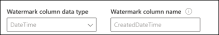

# Connecteurs Azure SQL et Microsoft SQL Server

Avec un connecteur Microsoft SQL Server ou Azure SQL, votre organisation peut découvrir et indexer des données à partir d’une base de données SQL Server locale ou d’une base de données hébergée dans votre instance Azure SQL dans le Cloud. Le connecteur indexe le contenu spécifié dans Microsoft Search. Pour conserver l’index à jour avec les données source, il prend en charge les analyses incrémentielles et complètes périodiques. Avec ces connecteurs SQL, vous pouvez également limiter l’accès aux résultats de recherche pour certains utilisateurs.

Cet article est destiné aux administrateurs 365 de Microsoft ou toute personne qui configure, exécute et surveille un connecteur Microsoft SQL Server. Elle explique comment configurer les fonctionnalités de connecteur et de connecteur, ainsi que les restrictions et les techniques de résolution des problèmes.

## Installer une passerelle de données (requise pour le connecteur Microsoft SQL Server local uniquement)
Pour accéder à vos données tierces, vous devez installer et configurer une passerelle Microsoft Power BI. Pour en savoir plus, consultez la rubrique [Install an on-](https://docs.microsoft.com/data-integration/gateway/service-gateway-install) premises Gateway.  

## Se connecter à une source de données
Pour connecter votre Connecteur Microsoft SQL Server à une source de données, vous devez configurer le serveur de base de données que vous souhaitez analyser et la passerelle locale. Vous pouvez ensuite vous connecter à la base de données à l’aide de la méthode d’authentification requise.

Pour le connecteur Azure SQL, il vous suffit de spécifier le nom du serveur ou l’adresse IP à laquelle vous souhaitez vous connecter. Azure SQL Connector prend uniquement en charge l’authentification Azure Active Directory Open ID Connect (OIDC) pour se connecter à la base de données.

> [!NOTE]
> Votre base de données doit exécuter la version 2008 ou une version ultérieure de SQL Server pour que le connecteur Microsoft SQL Server puisse se connecter.

Pour effectuer une recherche dans le contenu de votre base de données, vous devez spécifier des requêtes SQL lorsque vous configurez le connecteur. Ces requêtes SQL doivent nommer toutes les colonnes de base de données que vous souhaitez indexer (c.-à-d. les propriétés source), y compris toutes les jointures SQL qui doivent être effectuées pour obtenir toutes les colonnes. Pour restreindre l’accès aux résultats de la recherche, vous devez spécifier des listes de contrôle d’accès (ACL) dans les requêtes SQL lorsque vous configurez le connecteur.

## Analyse complète (obligatoire)
Dans cette étape, vous configurez la requête SQL qui exécute une analyse complète de la base de données. L’analyse complète sélectionne toutes les colonnes ou les propriétés que vous souhaitez rendre utilisables ou **pouvant**faire l’objet **retrievable**d’une **requête**. Vous pouvez également spécifier des colonnes ACL pour limiter l’accès aux résultats de la recherche à des utilisateurs ou à des groupes spécifiques.

> [!Tip]
> Pour obtenir toutes les colonnes dont vous avez besoin, vous pouvez joindre plusieurs tables.

### Sélectionner des colonnes de données (obligatoires) et des colonnes ACL (facultatif)
L’exemple illustre la sélection de cinq colonnes de données qui contiennent les données pour la recherche : OrderId, OrderTitle, OrderDesc, CreatedDateTime et IsDeleted. Pour définir des autorisations d’affichage pour chaque ligne de données, vous pouvez éventuellement sélectionner les colonnes suivantes : AllowedUsers, AllowedGroups, DeniedUsers et DeniedGroups. Toutes ces colonnes de données peuvent être rendues pouvant faire l’objet d’une **requête**, d’une **recherche**ou d’une **extraction**.

Sélectionnez des colonnes de données comme indiqué dans cet exemple de requête :`SELECT OrderId, OrderTitle, OrderDesc, AllowedUsers, AllowedGroups, DeniedUsers, DeniedGroups, CreatedDateTime, IsDeleted`
 
Pour gérer l’accès aux résultats de la recherche, vous pouvez spécifier une ou plusieurs colonnes ACL dans la requête. Le connecteur SQL vous permet de contrôler l’accès par niveau d’enregistrement. Vous pouvez choisir d’utiliser le même contrôle d’accès pour tous les enregistrements d’une table. Si les informations de la liste de contrôle d’accès sont stockées dans une table distincte, il se peut que vous deviez effectuer une jointure avec ces tables dans votre requête.

L’utilisation de chacune des colonnes ACL dans la requête ci-dessus est décrite ci-dessous. La liste suivante décrit les 4 **mécanismes de contrôle d’accès**. 
* **AllowedUsers**: spécifie la liste des ID utilisateur qui seront en mesure d’accéder aux résultats de la recherche. Dans l’exemple suivant, la liste des utilisateurs : john@contoso.com, keith@contoso.com et lisa@contoso.com n’a accès qu’à un enregistrement avec OrderId = 12. 
* **AllowedGroups**: spécifie le groupe d’utilisateurs qui seront en mesure d’accéder aux résultats de la recherche. Dans l’exemple suivant, le groupe sales-team@contoso.com n’a accès qu’à record with OrderId = 12.
* **DeniedUsers**: spécifie la liste des utilisateurs qui n’ont **pas** accès aux résultats de la recherche. Dans l’exemple suivant, les utilisateurs john@contoso.com et keith@contoso.com n’ont pas accès à record avec OrderId = 13, tandis que tous les autres ont accès à cet enregistrement. 
* **DeniedGroups**: spécifie le groupe d’utilisateurs qui n’ont **pas** accès aux résultats de la recherche. Dans l’exemple suivant, les groupes engg-team@contoso.com et pm-team@contoso.com n’ont pas accès à record avec OrderId = 15, tandis que les autres utilisateurs ont accès à cet enregistrement.  

### Filigrane (obligatoire)
Pour éviter de surcharger la base de données, le connecteur regroupe et reprend les requêtes d’analyse complète avec une colonne de filigrane complète. En utilisant la valeur de la colonne filigrane, chaque lot suivant est extrait et l’interrogation reprend à partir du dernier point de contrôle. Fondamentalement, il s’agit d’un mécanisme de contrôle de l’actualisation des données pour les analyses complètes.

Créez des extraits de code de requête pour les filigranes, comme indiqué dans les exemples suivants :
* `WHERE (CreatedDateTime > @watermark)`. Citez le nom de la colonne filigrane par le mot clé réservé `@watermark` . Si l’ordre de tri de la colonne de filigrane est croissant, utilisez `>` ; sinon, utilisez `<` .
* `ORDER BY CreatedDateTime ASC`. Trier sur la colonne filigrane dans l’ordre croissant ou décroissant.

Dans la configuration illustrée dans l’image suivante, `CreatedDateTime` est la colonne de filigrane sélectionnée. Pour extraire le premier lot de lignes, spécifiez le type de données de la colonne de filigrane. Dans ce cas, le type de données est `DateTime` .

La première requête extrait les **N** premières lignes à l’aide de : « CreatedDateTime > janvier 1, 1753 00:00:00 » (valeur minimale de type de données DateTime). Une fois le premier lot extrait, la valeur la plus élevée `CreatedDateTime` renvoyée dans le lot est enregistrée en tant que point de contrôle si les lignes sont triées par ordre croissant. Par exemple, le 1er mars 2019 03:00:00. Le prochain lot de **N** lignes est extrait en utilisant « CreatedDateTime > mars 1, 2019 03:00:00 » dans la requête.

### Ignorer les lignes supprimées (récupérables) (facultatif)
Pour exclure les lignes supprimées (récupérables) de votre base de données de l’indexation, spécifiez le nom et la valeur de la colonne de suppression récupérable qui indique que la ligne est supprimée.

### Analyse complète : gérer les autorisations de recherche
Cliquez sur **gérer les autorisations** pour sélectionner les différentes colonnes de contrôle d’accès (ACL) qui spécifient le mécanisme de contrôle d’accès. Sélectionnez le nom de colonne que vous avez spécifié dans la requête SQL d’analyse complète. 

Chacune des colonnes de liste de contrôle d’accès est censée être une colonne à valeurs multiples. Ces valeurs d’ID multiples peuvent être séparées par des séparateurs tels que des points-virgules (;), virgule (,), etc. Vous devez spécifier ce séparateur dans le champ **séparateur de valeur** .
 
Les types d’ID suivants sont pris en charge pour l’utilisation en tant que listes de Contrã’le d’accès : 
* **Nom d’utilisateur principal (UPN)**: un nom d’utilisateur principal (UPN) est le nom d’un utilisateur système dans un format d’adresse de messagerie. Un UPN (par exemple : john.doe@domain.com) est constitué du nom d’utilisateur (nom de connexion), du séparateur (symbole @) et du nom de domaine (suffixe UPN). 
* **ID d’Azure Active Directory (AAD)**: dans AAD, chaque utilisateur ou groupe a un ID d’objet qui ressemble à « e0d3ad3d-0000-1111-2222-3c5f5c52ab9b ». 
* **ID de sécurité Active Directory (AD)**: dans une configuration AD locale, chaque utilisateur et groupe a un identificateur de sécurité unique, non modifiable, qui ressemble à-1-5-21-3878594291-2115959936-132693609-65242.

## Analyse incrémentielle (facultative)
Dans cette étape facultative, fournissez une requête SQL pour exécuter une analyse incrémentielle de la base de données. Avec cette requête, le connecteur SQL détermine les modifications apportées aux données depuis la dernière analyse incrémentielle. Comme dans l’analyse complète, sélectionnez toutes les colonnes que vous souhaitez rendre utilisables dans une **requête**, pouvant faire l’objet d’une **recherche**ou pouvoir être **récupérées**. Spécifiez le même ensemble de colonnes de liste de contrôle d’accès que vous avez spécifié dans la requête d’analyse complète.

Les composants de l’image suivante ressemblent aux composants d’analyse complets avec une exception. Dans ce cas, « ModifiedDateTime » est la colonne de filigrane sélectionnée. Examinez les étapes de l' [analyse complète](#full-crawl-required) pour apprendre à écrire votre requête d’analyse incrémentielle et voir l’image suivante par exemple.

## Gérer les autorisations de recherche 
Vous pouvez choisir d’utiliser les [listes de contrã’le d’accès spécifiées dans l’écran d’analyse complète](#full-crawl-manage-search-permissions) ou de les remplacer pour rendre votre contenu visible par tous les utilisateurs.

## Limites
Les connecteurs SQL présentent ces limitations dans la version d’évaluation :
* Connecteur Microsoft SQL Server : la base de données locale doit exécuter SQL Server version 2008 ou une version ultérieure.
* Les ACL sont uniquement prises en charge à l’aide d’un nom d’utilisateur principal (UPN), d’Azure Active Directory (Azure AD) ou de la sécurité Active Directory. 
* L’indexation de contenu riche dans les colonnes de base de données n’est pas prise en charge. Des exemples de ce type de contenu sont les analyses HTML, JSON, XML, BLOB et de document qui existent sous forme de liens dans les colonnes de base de données.
