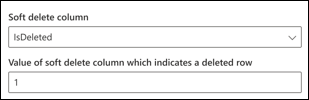

<!---Previous ms.author:vivg --->

# Connecteur Oracle SQL GraphOracle SQL Graph connector

Le connecteur Oracle SQL Graph permet à votre organisation de découvrir et d’indexer des données à partir d’une base de données Oracle sur site.The Oracle SQL Graph connector allows your organization to discover and index data from an on-premises Oracle database. Le connecteur indexe le contenu spécifié dans Microsoft Search (recherche Microsoft).The connector indexes specified content into Microsoft Search. Pour maintenir l’index à jour avec les données sources, il prend en charge des analyses complètes et incrémentielles périodiques.To keep the index up to date with source data, it supports periodic full and incremental crawls. Avec le connecteur SQL Oracle, vous pouvez également restreindre l’accès aux résultats de recherche pour certains utilisateurs.With the Oracle SQL connector, you can also restrict access to search results for certain users.

> [!NOTE]
> Lisez [**l’article Installation de votre connecteur Graph**](configure-connector.md) pour comprendre le processus d’installation général des connecteurs Graph.Read the [**Setup for your Graph connector**](configure-connector.md) article to understand the general Graph connectors setup process.

Cet article est réservé à toute personne qui configure, exécute et surveille un connecteur Oracle SQL Graph.This article is for anyone who configures, runs, and monitors an Oracle SQL Graph connector. Il complète le processus de configuration général et affiche des instructions qui s’appliquent uniquement au connecteur Oracle SQL Graph.It supplements the general setup process, and shows instructions that apply only for the Oracle SQL Graph connector. Cet article inclut également des informations [sur la résolution des problèmes](#troubleshooting) et les [limitations.](#limitations)This article also includes information about [Troubleshooting](#troubleshooting) and [Limitations](#limitations).

## Avant de commencerBefore you get started

### Installer l’agent de connecteur GraphInstall the Graph connector agent

Pour accéder à vos données tierces sur site, vous devez installer et configurer l’agent de connecteur Graph.In order to access your on-premises third-party data, you must install and configure the Graph connector agent. Pour plus [d’informations, voir Installer l’agent de](on-prem-agent.md) connecteur Graph.See [Install the Graph connector agent](on-prem-agent.md) to learn more.  

## Étape 1 : Ajouter un connecteur Graph dans le Centre d’administration Microsoft 365Step 1: Add a Graph connector in the Microsoft 365 admin center

Suivez les [instructions d’installation générales.](https://docs.microsoft.com/microsoftsearch/configure-connector)Follow the general [setup instructions](https://docs.microsoft.com/microsoftsearch/configure-connector).
<!---If the above phrase does not apply, delete it and insert specific details for your data source that are different from general setup instructions.-->

## Étape 2 : Nommer la connexionStep 2: Name the connection

Suivez les [instructions d’installation générales.](https://docs.microsoft.com/microsoftsearch/configure-connector)Follow the general [setup instructions](https://docs.microsoft.com/microsoftsearch/configure-connector).
<!---If the above phrase does not apply, delete it and insert specific details for your data source that are different from general setup instructions.-->

## Étape 3 : Configurer les paramètres de connexionStep 3: Configure the connection settings

Pour connecter votre connecteur SQL Oracle à une source de données, vous devez configurer le serveur de base de données que vous souhaitez analyser et l’agent de connecteur Graph local.To connect your Oracle SQL connector to a data source, you must configure the database server you want crawled and the on-premises Graph connector agent. Vous pouvez ensuite vous connecter à la base de données avec la méthode d’authentification requise.You can then connect to the database with the required authentication method.

Pour le connecteur SQL Oracle, vous devez spécifier le nom d’hôte, le nom de port et de service (base de données) avec la méthode d’authentification préférée, le nom d’utilisateur et le mot de passe.For Oracle SQL connector, you need to specify the Hostname, Port and Service (database) name along with the preferred authentication method, username, and password.

> [!NOTE]
> Votre base de données doit exécuter la base de données Oracle version 11g ou ultérieure pour que le connecteur puisse se connecter.Your database must run Oracle database version 11g or later for the connector to be able to connect. Le connecteur prend en charge la base de données Oracle hébergée sur les plateformes d’ordinateurs VM Windows, Linux et Azure.The connector supports Oracle database hosted on Windows, Linux and Azure VM platforms.

Pour rechercher le contenu de votre base de données, vous devez spécifier SQL requêtes lorsque vous configurez le connecteur.To search your database content, you must specify SQL queries when you configure the connector. Ces requêtes SQL doivent nommer toutes les colonnes de base de données que vous souhaitez indexer (c’est-à-dire, les propriétés source), y compris les jointeurs de SQL qui doivent être effectuées pour obtenir toutes les colonnes.These SQL queries need to name all the database columns that you want to index (that is, source properties), including any SQL joins that need to be performed to get all the columns. Pour restreindre l’accès aux résultats de la recherche, vous devez spécifier des listes de contrôle d’accès dans SQL requêtes lorsque vous configurez le connecteur.To restrict access to search results, you must specify Access Control Lists (ACLs) within SQL queries when you configure the connector.

## Étape 3a : analyse complète (obligatoire)Step 3a: Full crawl (Required)

Dans cette étape, vous configurez la requête SQL qui exécute une analyse complète de la base de données.In this step, you configure the SQL query that runs a full crawl of the database. L’analyse complète sélectionne toutes les colonnes ou propriétés dans laquelle vous souhaitez sélectionner les options **Requête,** Rechercher **ou** **Récupérer.**The full crawl selects all the columns or properties where you want to select the options **Query**, **Search**, or **Retrieve**. Vous pouvez également spécifier des colonnes ACL pour restreindre l’accès des résultats de recherche à des utilisateurs ou des groupes spécifiques.You can also specify ACL columns to restrict access of search results to specific users or groups.

> [!Tip]
> Pour obtenir toutes les colonnes dont vous avez besoin, vous pouvez joindre plusieurs tables.To get all the columns that you need, you can join multiple tables.

### Sélectionner des colonnes de données (obligatoire) et des colonnes ACL (facultatif)Select data columns (Required) and ACL columns (Optional)

L’exemple illustre la sélection de cinq colonnes de données qui détiennent les données de la recherche : OrderId, OrderTitle, OrderDesc, CreatedDateTime et IsDeleted.The example demonstrates selection of five data columns that hold the data for the search: OrderId, OrderTitle, OrderDesc, CreatedDateTime, and IsDeleted. Pour définir des autorisations d’affichage pour chaque ligne de données, vous pouvez éventuellement sélectionner ces colonnes de la ACL : AllowedUsers, AllowedGroups, DeniedUsers et DeniedGroups.To set view permissions for each row of data, you can optionally select these ACL columns: AllowedUsers, AllowedGroups, DeniedUsers, and DeniedGroups. Pour toutes ces colonnes de données, vous pouvez sélectionner les options **de requête,** de **recherche** ou de **récupération.**For all these data columns you can select the options to **Query**, **Search**, or **Retrieve**.

Sélectionnez des colonnes de données comme illustré dans cet exemple de requête : `SELECT OrderId, OrderTitle, OrderDesc, AllowedUsers, AllowedGroups, DeniedUsers, DeniedGroups, CreatedDateTime, IsDeleted`Select data columns as shown in this example query: `SELECT OrderId, OrderTitle, OrderDesc, AllowedUsers, AllowedGroups, DeniedUsers, DeniedGroups, CreatedDateTime, IsDeleted`

Pour gérer l’accès aux résultats de la recherche, vous pouvez spécifier une ou plusieurs colonnes ACL dans la requête.To manage access to the search results, you can specify one or more ACL columns in the query. Le connecteur SQL vous permet de contrôler l’accès à chaque niveau d’enregistrement.The SQL connector allows you to control access at per record level. Vous pouvez choisir d’avoir le même contrôle d’accès pour tous les enregistrements d’une table.You can choose to have the same access control for all records in a table. Si les informations de la ACL sont stockées dans une table distincte, vous de devez peut-être joindre ces tables dans votre requête.If the ACL information is stored in a separate table, you might have to do a join with those tables in your query.

L’utilisation de chacune des colonnes ACL dans la requête ci-dessus est décrite ci-dessous.The use of each of the ACL columns in the above query is described below. La liste suivante explique les quatre mécanismes **de contrôle d’accès.**The following list explains the four **access control mechanisms**.

* **AllowedUsers**: cette option spécifie la liste des ID d’utilisateur qui pourront accéder aux résultats de la recherche.**AllowedUsers**: This option specifies the list of user IDs who will be able to access the search results. Dans l’exemple suivant, la liste des utilisateurs : john@contoso.com, keith@contoso.com et lisa@contoso.com n’ont accès qu’à un enregistrement avec OrderId = 12.In the following example, list of users: john@contoso.com, keith@contoso.com, and lisa@contoso.com would only have access to a record with OrderId = 12.
* **AllowedGroups**: cette option spécifie le groupe d’utilisateurs qui pourront accéder aux résultats de la recherche.**AllowedGroups**: This option specifies the group of users who will be able to access the search results. Dans l’exemple suivant, les sales-team@contoso.com n’ont accès qu’à l’enregistrement avec OrderId = 12.In the following example, group sales-team@contoso.com would only have access to record with OrderId = 12.
* **DeniedUsers**: cette option spécifie la liste des utilisateurs qui **n’ont** pas accès aux résultats de la recherche.**DeniedUsers**: This option specifies the list of users who do **not** have access to the search results. Dans l’exemple suivant, les utilisateurs john@contoso.com et keith@contoso.com n’ont pas accès à l’enregistrement avec OrderId = 13, alors que tous les autres utilisateurs ont accès à cet enregistrement.In the following example, users john@contoso.com and keith@contoso.com do not have access to record with OrderId = 13, whereas everyone else has access to this record.
* **DeniedGroups :** cette option spécifie le groupe d’utilisateurs qui **n’ont** pas accès aux résultats de la recherche.**DeniedGroups**: This option specifies the group of users who do **not** have access to the search results. Dans l’exemple suivant, les groupes engg-team@contoso.com et pm-team@contoso.com n’ont pas accès à l’enregistrement avec OrderId = 15, alors que tous les autres ont accès à cet enregistrement.In the following example, groups engg-team@contoso.com and pm-team@contoso.com do not have access to record with OrderId = 15, whereas everyone else has access to this record.  

### Types de données pris en chargeSupported data types

Le tableau ci-dessous récapitule les types de données pris en charge par le connecteur SQL Oracle.The below table summarizes the data types that are supported by the Oracle SQL connector. Le tableau récapitule également le type de données d’indexation pour le type SQL données pris en charge.The table also summarizes the indexing data type for the supported SQL data type. Pour en savoir plus sur les types de données pris en charge par les connecteurs Microsoft Graph pour l’indexation, consultez la documentation sur les [types de ressources de propriété.](https://docs.microsoft.com/graph/api/resources/property?view=graph-rest-beta#properties&preserve-view=true)To learn more about Microsoft Graph connectors supported data types for indexing, refer documentation on [property resource types](https://docs.microsoft.com/graph/api/resources/property?view=graph-rest-beta#properties&preserve-view=true).

| CatégorieCategory | Type de données sourceSource data type | Type de données d’indexationIndexing data type |
| ------------ | ------------ | ------------ |
| Type de données NumberNumber datatype | NUMBER(p,0)NUMBER(p,0) | int64 (pour p <= 18)int64 (for p <= 18)   double (pour p > 18)double (for p > 18) |
| Type de données de nombre à point flottantFloating-point number datatype | NUMBER(p,s)NUMBER(p,s)   FLOAT(p)FLOAT(p) | doubledouble |
| Type de données DateDate datatype | DATEDATE   TIMESTAMPTIMESTAMP   TIMESTAMP(n)TIMESTAMP(n) | DateHeuredatetime |
| Type de données characterCharacter datatype | CHAR(n)CHAR(n)   VARCHARVARCHAR   VARCHAR2VARCHAR2   LONGLONG   ÎTBCLOB   NCLOBNCLOB | stringstring |
| Type de données de caractère UnicodeUnicode character datatype | NCHARNCHAR   NVARCHARNVARCHAR | stringstring |
| Type de données RowIDRowID datatype | ROWIDROWID   UROWIDUROWID | stringstring |

Pour tout autre type de données actuellement non directement pris en charge, la colonne doit être explicitement castée vers un type de données pris en charge.For any other data type currently not directly supported, the column needs to be explicitly cast to a supported data type.

### Filigrane (obligatoire)Watermark (Required)

Pour éviter la surcharge de la base de données, le connecteur par lots et reprend les requêtes d’analyse complète avec une colonne filigrane d’analyse complète.To prevent overloading the database, the connector batches and resumes full-crawl queries with a full-crawl watermark column. À l’aide de la valeur de la colonne filigrane, chaque lot suivant est récupéré et l’interrogation reprend à partir du dernier point de contrôle.By using the value of the watermark column, each subsequent batch is fetched, and querying is resumed from the last checkpoint. Il s’agit essentiellement d’un mécanisme permettant de contrôler l’actualisation des données pour les analyse complètes.Essentially this is a mechanism to control data refresh for full crawls.

Créez des extraits de requête pour les filigranes, comme illustré dans les exemples suivants :Create query snippets for watermarks as shown in these examples:

* `WHERE (CreatedDateTime > @watermark)`.`WHERE (CreatedDateTime > @watermark)`. Nommez le nom de colonne de filigrane avec le mot clé `@watermark` réservé.Cite the watermark column name with the reserved keyword `@watermark`. Vous ne pouvez trier la colonne filigrane que par ordre croissant.You can only sort the watermark column in ascending order.
* `ORDER BY CreatedDateTime ASC`.`ORDER BY CreatedDateTime ASC`. Trier la colonne filigrane dans l’ordre croissant.Sort on the watermark column in ascending order.

Dans la configuration présentée dans l’image suivante, se trouve `CreatedDateTime` la colonne filigrane sélectionnée.In the configuration shown in the following image, `CreatedDateTime` is the selected watermark column. Pour extraire le premier lot de lignes, spécifiez le type de données de la colonne filigrane.To fetch the first batch of rows, specify the data type of the watermark column. Dans ce cas, le type de données est `DateTime` .In this case, the data type is `DateTime`.

La première requête récupère le premier **N** nombre de lignes à l’aide de : « CreatedDateTime > 1er janvier 1753 00:00:00 » (valeur min du type de données DateTime).The first query fetches the first **N** number of rows by using: "CreatedDateTime > January 1, 1753 00:00:00" (min value of DateTime data type). Une fois le premier lot récupéré, la valeur la plus élevée renvoyée dans le lot est enregistrée en tant que point de contrôle si les lignes sont triées par `CreatedDateTime` ordre croissant.After the first batch is fetched, the highest value of `CreatedDateTime` returned in the batch is saved as the checkpoint if the rows are sorted in ascending order. Par exemple, 1er mars 2019 03:00:00.An example is March 1, 2019 03:00:00. Ensuite, le lot suivant de **lignes N** est récupéré à l’aide de « CreatedDateTime > Mars 1, 2019 03:00:00 » dans la requête.Then the next batch of **N** rows is fetched by using "CreatedDateTime > March 1, 2019 03:00:00" in the query.

### Ignorer les lignes supprimées (facultatif)Skipping soft-deleted rows (Optional)

Pour exclure l’indexation des lignes supprimées (ou non) dans votre base de données, spécifiez le nom et la valeur de la colonne de suppression (suppression totale) qui indiquent que la ligne est supprimée.To exclude soft-deleted rows in your database from being indexed, specify the soft-delete column name and value that indicates the row is deleted.

### Analyse complète : gérer les autorisations de rechercheFull crawl: Manage search permissions

Sélectionnez **Gérer les autorisations** pour choisir les différentes colonnes de contrôle d’accès qui spécifient le mécanisme de contrôle d’accès.Select **Manage permissions** to choose the various access control (ACL) columns that specify the access control mechanism. Sélectionnez le nom de colonne que vous avez spécifié dans l’analyse complète SQL requête.Select the column name you specified in the full crawl SQL query.

Chacune des colonnes de la ACL est attendue comme une colonne à valeurs multiples.Each of the ACL columns is expected to be a multi-valued column. Ces valeurs d’ID multiples peuvent être séparées par des séparateurs tels que des points-virgules (;), virgule (,), etc.These multiple ID values can be separated by separators such as semicolon (;), comma (,), and so on. Vous devez spécifier ce séparateur dans le champ **séparateur de** valeurs.You need to specify this separator in the **value separator** field.

Les types d’ID suivants sont pris en charge pour l’utilisation en tant que listes de contrôle d’appel :The following ID types are supported for using as ACLs:

* **Nom d’utilisateur principal (UPN)**: un nom d’utilisateur principal (UPN) est le nom d’un utilisateur système au format d’adresse de messagerie.**User Principal Name (UPN)**: A User Principal Name (UPN) is the name of a system user in an email address format. Un UPN (par exemple : john.doe@domain.com) se compose du nom d’utilisateur (nom d’connexion), du séparateur (symbole @) et du nom de domaine (suffixe UPN).A UPN (for example: john.doe@domain.com) consists of the username (logon name), separator (the @ symbol), and domain name (UPN suffix).
* **ID Azure Active Directory (AAD)**: dans Azure AD, chaque utilisateur ou groupe possède un ID d’objet qui ressemble à « e0d3ad3d-0000-1111-2222-3c5f5c52ab9b »**Azure Active Directory (AAD) ID**: In Azure AD, every user or group has an object ID that looks something like 'e0d3ad3d-0000-1111-2222-3c5f5c52ab9b'
* ID de sécurité **Active Directory (AD)**: dans une configuration AD sur site, chaque utilisateur et groupe ont un identificateur de sécurité unique immuable qui ressemble à « S-1-5-21-3878594291-2115959936-132693609-65242 ».**Active Directory (AD) Security ID**: In an on-premises AD setup, every user and group have an immutable, unique security identifier that looks something like 'S-1-5-21-3878594291-2115959936-132693609-65242.'

## Étape 3b : analyse incrémentielle (facultatif)Step 3b: Incremental crawl (Optional)

Dans cette étape facultative, fournissez une requête SQL pour exécuter une analyse incrémentielle de la base de données.In this optional step, provide a SQL query to run an incremental crawl of the database. Avec cette requête, le connecteur SQL détermine les modifications apportées aux données depuis la dernière analyse incrémentielle.With this query, the SQL connector determines any changes to the data since the last incremental crawl. Comme dans l’analyse complète, sélectionnez entre les options **Requête,** **Rechercher** ou **Récupérer.**As in the full crawl, select between the options **Query**, **Search**, or **Retrieve**. Spécifiez le même ensemble de colonnes de liste de contrôle d’accès que vous avez spécifié dans la requête d’analyse complète.Specify the same set of ACL columns that you specified in the full crawl query.

Les composants de l’image suivante ressemblent aux composants d’analyse complets à une exception près.The components in the following image resemble the full crawl components with one exception. Dans ce cas, « ModifiedDateTime » est la colonne filigrane sélectionnée.In this case, "ModifiedDateTime" is the selected watermark column. Consultez [les étapes d’analyse](#step-3a-full-crawl-required) complètes pour apprendre à écrire votre requête d’analyse incrémentielle et voir l’image suivante en tant qu’exemple.Review the [full crawl steps](#step-3a-full-crawl-required) to learn how to write your incremental crawl query and see the following image as an example.

## Étape 4 : Attribuer des étiquettes de propriétéStep 4: Assign property labels

Suivez les [instructions d’installation générales.](https://docs.microsoft.com/microsoftsearch/configure-connector)Follow the general [setup instructions](https://docs.microsoft.com/microsoftsearch/configure-connector).
<!---If the above phrase does not apply, delete it and insert specific details for your data source that are different from general setup instructions.-->

## Étape 5 : Gérer le schémaStep 5: Manage schema

Suivez les [instructions d’installation générales.](https://docs.microsoft.com/microsoftsearch/configure-connector)Follow the general [setup instructions](https://docs.microsoft.com/microsoftsearch/configure-connector).
<!---If the above phrase does not apply, delete it and insert specific details for your data source that are different from general setup instructions.-->

## Étape 6 : Gérer les autorisations de rechercheStep 6: Manage search permissions

Vous pouvez choisir d’utiliser les [listes](#full-crawl-manage-search-permissions) de contrôle d’accès spécifiées dans l’écran d’analyse complet ou les remplacer pour rendre votre contenu visible par tout le monde.You can choose to use the [ACLs specified in the full crawl screen](#full-crawl-manage-search-permissions) or you can override them to make your content visible to everyone.

## Étape 7 : Choisir les paramètres d’actualisationStep 7: Choose refresh settings

Le connecteur SQL Oracle prend en charge les planifications d’actualisation pour les analyses complètes et incrémentielles.The Oracle SQL connector supports refresh schedules for both full and incremental crawls. Nous vous recommandons de définir les deux.We recommend that you set both.

Une planification d’analyse complète trouve les lignes supprimées qui ont été précédemment synchronisées avec l’index de recherche Microsoft et toutes les lignes qui ont été déplacées hors du filtre de synchronisation.A full crawl schedule finds deleted rows that were previously synced to the Microsoft Search index and any rows that moved out of the sync filter. Lorsque vous vous connectez à la base de données pour la première fois, une analyse complète s’exécute pour synchroniser toutes les lignes récupérées à partir de la requête d’analyse complète.When you first connect to the database, a full crawl runs to sync all the rows retrieved from the full crawl query. Pour synchroniser de nouvelles lignes et effectuer des mises à jour, vous devez planifier des analyses incrémentielles.To sync new rows and make updates, you need to schedule incremental crawls.

## Étape 8 : Examiner la connexionStep 8: Review connection

Suivez les [instructions d’installation générales.](https://docs.microsoft.com/microsoftsearch/configure-connector)Follow the general [setup instructions](https://docs.microsoft.com/microsoftsearch/configure-connector).
<!---If the above phrase does not apply, delete it and insert specific details for your data source that are different from general setup instructions.-->

## Étapes suivantes : personnaliser la page des résultats de la rechercheNext steps: Customize the search results page

Créez vos propres secteurs verticaux et types de résultats, afin que les utilisateurs finaux peuvent afficher les résultats de recherche à partir de nouvelles connexions.Create your own verticals and result types, so end users can view search results from new connections. Sans cette étape, les données de votre connexion ne s’affichent pas sur la page des résultats de la recherche.Without this step, data from your connection won't show up on the search results page.

Pour en savoir plus sur la création de vos secteurs verticaux et MRT, voir Personnalisation de la page de résultats [de recherche.](customize-search-page.md)To learn more about how to create your verticals and MRTs, see [Search results page customization](customize-search-page.md).

## Résolution des problèmesTroubleshooting

Sous-dessous se trouve une liste des erreurs courantes observées lors de la configuration du connecteur et leurs raisons possibles.Underneath is a list of common errors observed while configuring the connector and their possible reasons.

| Étape de configurationConfiguration step | Message d’erreurError message | Raisons possiblesPossible reason(s) |
| ------------ | ------------ | ------------ |
| Paramètres de base de donnéesDatabase settings | Erreur du serveur de base de données : la demande de connexion a été hors délaiError from database server: Connection request timed out | Hostname non valideInvalid Hostname   Hôte non accessibleHost not reachable |
| Paramètres de base de donnéesDatabase settings | Erreur du serveur de base de données : ORA-12541 : TNS : pas d’écouteError from database server: ORA-12541: TNS: No listener | Port non valideInvalid Port |
| Paramètres de base de donnéesDatabase settings | Erreur du serveur de base de données : ORA-12514 : TNS : l’écoute ne connaît pas actuellement le service demandé dans le descripteur de connecteurError from database server: ORA-12514: TNS: listener does not currently know of service requested in connector descriptor | Nom de service (base de données) non valideInvalid service (database) name |
| Paramètres de base de donnéesDatabase settings | Erreur du serveur de base de données : échec de connexion pour l’utilisateur ' `user` '.Error from database server: Login failed for user '`user`'. | Nom d’utilisateur ou mot de passe non valideInvalid username or password |

## LimitesLimitations

Le connecteur SQL Oracle présente les limitations ci-après dans la version préliminaire :The Oracle SQL connector has these limitations in the preview release:

* La base de données sur site doit exécuter la base de données Oracle version 11g ou ultérieure.The on-premises database must run Oracle Database version 11g or later.
* Les ACA sont uniquement pris en charge à l’aide d’un nom d’utilisateur principal (UPN), d’Azure Active Directory (Azure AD) ou d’Active Directory Security.ACLs are only supported by using a User Principal Name (UPN), Azure Active Directory (Azure AD), or Active Directory Security.
* L’indexation de contenu enrichi dans les colonnes de base de données n’est pas prise en charge.Indexing rich content inside database columns is not supported. Les exemples de contenu de ce type sont html, JSON, XML, blobs et les parsings de document qui existent en tant que liens à l’intérieur des colonnes de base de données.Examples of such content are HTML, JSON, XML, blobs, and document parsings that exist as links inside the database columns.
