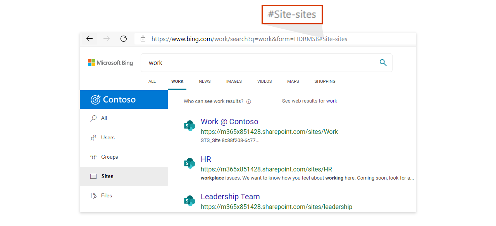
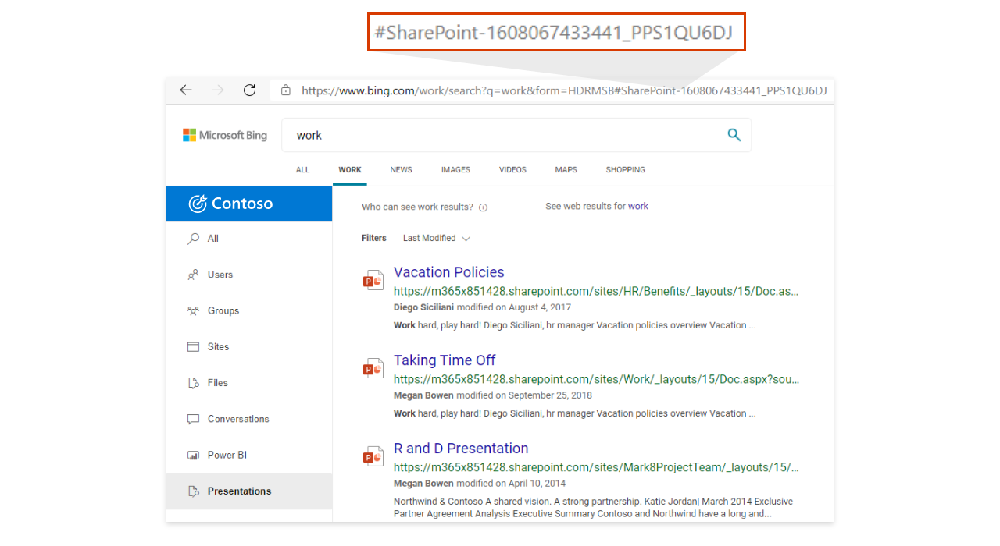

# <a name="add-a-search-box-to-your-intranet-site"></a><span data-ttu-id="c7f65-103">Ajout d’une zone de recherche à votre site intranet</span><span class="sxs-lookup"><span data-stu-id="c7f65-103">Add a search box to your intranet site</span></span>

<span data-ttu-id="c7f65-104">Pour fournir à vos utilisateurs un accès facile aux résultats de votre organisation, ajoutez une zone de recherche Microsoft Bing à n’importe quel site ou page intranet.</span><span class="sxs-lookup"><span data-stu-id="c7f65-104">To provide your users with easy access to results from your organization, add a Microsoft Search in Bing search box to any intranet site or page.</span></span> <span data-ttu-id="c7f65-105">Voici quelques-uns des avantages :</span><span class="sxs-lookup"><span data-stu-id="c7f65-105">These are some of the benefits:</span></span>

- <span data-ttu-id="c7f65-106">Une zone de recherche sur votre portail SharePoint ou intranet fournit un point d’entrée familier et fiable pour commencer la recherche</span><span class="sxs-lookup"><span data-stu-id="c7f65-106">A search box on your SharePoint or intranet portal provides a familiar, trusted entry point to start searching</span></span>
- <span data-ttu-id="c7f65-107">Prend en charge tous les principaux navigateurs web, y compris Google Chrome et Microsoft Edge</span><span class="sxs-lookup"><span data-stu-id="c7f65-107">Supports all major web browsers, including Google Chrome and Microsoft Edge</span></span>
- <span data-ttu-id="c7f65-108">Seules les suggestions de recherche de votre organisation apparaissent, les suggestions web ne sont jamais incluses</span><span class="sxs-lookup"><span data-stu-id="c7f65-108">Only search suggestions from your organization appear, web suggestions are never included</span></span>
- <span data-ttu-id="c7f65-109">Permet aux utilisateurs d’effectuer une recherche Microsoft Bing page de résultats de travail, qui exclut les publicités et les résultats web</span><span class="sxs-lookup"><span data-stu-id="c7f65-109">Takes users to a Microsoft Search in Bing work results page, which excludes ads and web results</span></span>
- <span data-ttu-id="c7f65-110">Vous contrôlez l’apparence et le comportement de la zone de recherche, y compris la possibilité d’adrier les utilisateurs sur un secteur vertical par défaut ou un secteur vertical personnalisé que vous avez créé.</span><span class="sxs-lookup"><span data-stu-id="c7f65-110">You control the appearance and behavior of the search box, including the ability to land users on a default vertical or a custom vertical you've created</span></span>
  
## <a name="add-a-search-box-to-an-intranet-page"></a><span data-ttu-id="c7f65-111">Ajout d’une zone de recherche à une page intranet</span><span class="sxs-lookup"><span data-stu-id="c7f65-111">Add a search box to an intranet page</span></span>

<span data-ttu-id="c7f65-112">Vous devez ajouter deux éléments à la page : un conteneur pour la zone de recherche et le script qui l’alimente.</span><span class="sxs-lookup"><span data-stu-id="c7f65-112">You need to add two elements to the page: a container for the search box and the script that powers it.</span></span>
  
```html
<div id="bfb_searchbox"></div>
<script>
    var bfbSearchBoxConfig = {
        containerSelector: "bfb_searchbox"
    };
</script>
<script async src="https://www.bing.com/business/s?k=sb"></script>
```

<span data-ttu-id="c7f65-113">Sur un site SharePoint classique, ajoutez un composant WebPart Éditeur de script et faites glisser le script vers ce dernier.</span><span class="sxs-lookup"><span data-stu-id="c7f65-113">On a SharePoint classic site, add a Script Editor Web Part and drop the script in it.</span></span>
  
## <a name="enable-the-search-box-for-mobile"></a><span data-ttu-id="c7f65-114">Activation de la zone de recherche pour la version mobile</span><span class="sxs-lookup"><span data-stu-id="c7f65-114">Enable the search box for mobile</span></span>

<span data-ttu-id="c7f65-115">Pour les pages ou les sites intranet à disposition des utilisateurs mobiles, ajoutez « isMobile: true » à l’objet des paramètres :</span><span class="sxs-lookup"><span data-stu-id="c7f65-115">For intranet sites or pages available to mobile users, add isMobile: true to the settings object:</span></span>
  
```html
<div id="bfb_searchbox"></div>
<script>
    var bfbSearchBoxConfig = {
        containerSelector: "bfb_searchbox", 
        isMobile: true
    };
</script>
<script async src="https://www.bing.com/business/s?k=sb"></script>
```

## <a name="put-focus-on-the-search-box-by-default"></a><span data-ttu-id="c7f65-116">Mise en surbrillance par défaut de la zone de recherche</span><span class="sxs-lookup"><span data-stu-id="c7f65-116">Put focus on the search box by default</span></span>

<span data-ttu-id="c7f65-117">Pour aider les utilisateurs à effectuer plus rapidement leurs recherches, placez le curseur dans la zone de recherche pendant le chargement de la page ou du site, et ajoutez « focus: true » à l’objet des paramètres :</span><span class="sxs-lookup"><span data-stu-id="c7f65-117">To help users search faster, when the page or site loads place the cursor in the search box by adding focus: true to the settings object:</span></span>
  
```html
<div id="bfb_searchbox"></div>
<script>
    var bfbSearchBoxConfig = {
        containerSelector: "bfb_searchbox",
        focus: true
    };
</script>
<script async src="https://www.bing.com/business/s?k=sb"></script>
```

## <a name="customize-the-appearance-of-the-search-box"></a><span data-ttu-id="c7f65-118">Personnaliser l’apparence de la zone de recherche</span><span class="sxs-lookup"><span data-stu-id="c7f65-118">Customize the appearance of the search box</span></span> 

<span data-ttu-id="c7f65-119">Pour aider la zone de recherche à mieux s’insérer au style de votre intranet, il existe de nombreuses options de configuration que vous pouvez utiliser.</span><span class="sxs-lookup"><span data-stu-id="c7f65-119">To help the search box better fit with the style of your intranet, there are a variety of configuration options you can use.</span></span> <span data-ttu-id="c7f65-120">Combinez et associez les options correspondantes à vos besoins.</span><span class="sxs-lookup"><span data-stu-id="c7f65-120">Mix and match options to suit your needs.</span></span>

```html
<div id="bfb_searchbox"></div>
<script>
    var bfbSearchBoxConfig = {
        containerSelector: "bfb_searchbox",
        width: 560,                             // default: 560, min: 360, max: 650
        height: 40,                             // default: 40, min: 40, max: 72
        cornerRadius: 6,                        // default: 6, min: 0, max: 25                                   
        strokeOutline: true,                    // default: true
        dropShadow: true,                       // default: false
        iconColor: "#067FA6",                   // default: #067FA6
        title: "Search box",                    // default: "Search box"
        vertical: "Person-people",              // default: not specified, search box directs to the All vertical on the WORK results page
        companyNameInGhostText: "Contoso"       // default: not specified
                                                // when absent, ghost text will be "Search work"
                                                // when specified, text will be "Search <companyNameInGhostText>"
    };
</script>
<script async src="https://www.bing.com/business/s?k=sb"></script>
```

## <a name="direct-users-to-a-default-or-custom-vertical"></a><span data-ttu-id="c7f65-121">Diriger les utilisateurs vers un secteur vertical par défaut ou personnalisé</span><span class="sxs-lookup"><span data-stu-id="c7f65-121">Direct users to a default or custom vertical</span></span>

<span data-ttu-id="c7f65-122">Pour faciliter l’intégration entre vos applications métier ou sites intranet et vos résultats de travail, vous pouvez également personnaliser la zone de recherche en spécifiant un secteur vertical par défaut ou personnalisé sur qui les utilisateurs doivent se poser lorsqu’ils cliquent sur une suggestion de recherche.</span><span class="sxs-lookup"><span data-stu-id="c7f65-122">To provide easy integration between your line-of-business apps or intranet sites and your work results, you can also customize the search box by specifying a default or custom vertical that users should land on when they click a search suggestion.</span></span>

<span data-ttu-id="c7f65-123">Utilisez l’option verticale dans bfbSearchBoxConfig pour définir le secteur vertical de votre choix.</span><span class="sxs-lookup"><span data-stu-id="c7f65-123">Use the vertical option in bfbSearchBoxConfig to define the vertical you want.</span></span> <span data-ttu-id="c7f65-124">Par exemple, si vous souhaitez que les utilisateurs se placent toujours sur le secteur vertical Sites, l’un des secteurs verticaux par défaut, utilisez la valeur « Site-sites ».</span><span class="sxs-lookup"><span data-stu-id="c7f65-124">For example, if you want users to always land on the Sites vertical, one of the default verticals, use the value "Site-sites".</span></span>



<span data-ttu-id="c7f65-126">Pour les secteurs verticaux personnalisés, utilisez le hachage à la fin de l’URL.</span><span class="sxs-lookup"><span data-stu-id="c7f65-126">For custom verticals, use the hash at the end of the URL.</span></span> <span data-ttu-id="c7f65-127">Vous pouvez trouver ces valeurs en recherchant à partir de la page de travail sur Bing, en cliquant sur une étiquette verticale et en copiant la valeur après le signe numérique (#).</span><span class="sxs-lookup"><span data-stu-id="c7f65-127">You can find these values by searching from the work page on Bing, clicking a vertical label, and copying the value after the number sign (#).</span></span>



## <a name="use-an-iframe-to-embed-a-search-box"></a><span data-ttu-id="c7f65-129">Utilisation d’un iFrame pour incorporer une zone de recherche</span><span class="sxs-lookup"><span data-stu-id="c7f65-129">Use an iFrame to embed a search box</span></span>

<span data-ttu-id="c7f65-130">Si vous ne pouvez pas incorporer un script dans le site, ajoutez la zone de recherche en utilisant un iFrame.</span><span class="sxs-lookup"><span data-stu-id="c7f65-130">If embedding a script isn't an option for the site, use an iFrame to add the search box.</span></span> <span data-ttu-id="c7f65-131">Vous ne pourrez pas personnaliser la zone de recherche.</span><span class="sxs-lookup"><span data-stu-id="c7f65-131">You won't be able to customize the search box.</span></span>
  
```html
<iframe width="564" height="400" src="https://www.bing.com/business/searchbox"></iframe>
```

## <a name="inprivate-mode-and-conditional-access"></a><span data-ttu-id="c7f65-132">Mode InPrivate et accès conditionnel</span><span class="sxs-lookup"><span data-stu-id="c7f65-132">InPrivate mode and Conditional Access</span></span>

<span data-ttu-id="c7f65-133">Une zone de recherche incorporée est désactivée si la page ou le site est ouvert dans une fenêtre InPrivate.</span><span class="sxs-lookup"><span data-stu-id="c7f65-133">An embedded search box will be disabled if the page or site is opened in an InPrivate window.</span></span> <span data-ttu-id="c7f65-134">En outre, avec la prise en charge de l’accès conditionnel Azure AD dans Microsoft Edge, Bing.com ne prend pas en charge la signature AAD lors de l’utilisation du mode InPrivate.</span><span class="sxs-lookup"><span data-stu-id="c7f65-134">Also, with Azure AD Conditional Access support in Microsoft Edge, Bing.com doesn't support AAD sign in when using InPrivate mode.</span></span> <span data-ttu-id="c7f65-135">Pour plus d’informations sur l’accès conditionnel dans Edge, [voir Microsoft Edge et l’accès conditionnel.](https://docs.microsoft.com/deployedge/ms-edge-security-conditional-access#accessing-conditional-access-protected-resources-in-microsoft-edge)</span><span class="sxs-lookup"><span data-stu-id="c7f65-135">For more information about Conditional Access in Edge, see [Microsoft Edge and Conditional Access](https://docs.microsoft.com/deployedge/ms-edge-security-conditional-access#accessing-conditional-access-protected-resources-in-microsoft-edge).</span></span> 