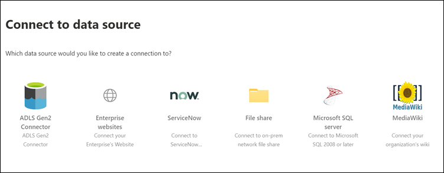
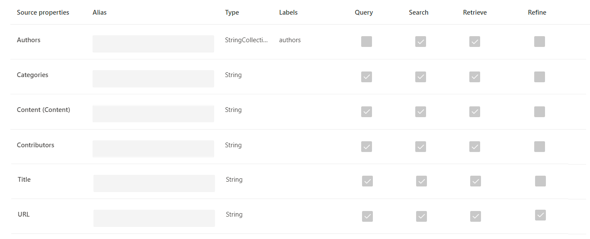
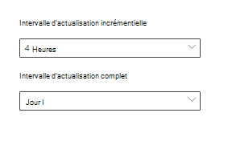

<!-- markdownlint-disable no-trailing-punctuation -->

# Configurer votre connecteur créé par Microsoft pour Microsoft Search

Cet article vous guide tout au long de la procédure de configuration d’un connecteur créé par Microsoft. Il décrit le flux de configuration d’une connexion dans le [Centre d’administration](https://admin.microsoft.com)365 de Microsoft. Pour plus d’informations sur la configuration de connecteurs créés par Microsoft, consultez les articles suivants :

* [Azure Data Lake Storage Gen2](azure-data-lake-connector.md)
* [Sites web d’entreprise](enterprise-web-connector.md)
* [Partage de fichiers](file-share-connector.md)
* [MediaWiki](mediawiki-connector.md)
* [Microsoft SQL Server](MSSQL-connector.md)
* [ServiceNow](servicenow-connector.md)

## Configurer

Pour configurer les connecteurs créés par Microsoft, accédez au [Centre d’administration](https://admin.microsoft.com):

1. Connectez-vous à votre compte avec les informations d’identification de votre client de test [Microsoft 365](https://www.microsoft.com/microsoft-365) .
2. Accédez à **paramètres**  >  **Microsoft Search**  >  **Connectors**.
3. Sélectionnez **Ajouter un connecteur**.
4. Dans la liste des connecteurs disponibles, sélectionnez le connecteur de votre choix.

### Nommer le connecteur

Pour créer une connexion, spécifiez d’abord les attributs suivants :

1. Nom de la connexion
2. ID de connexion
3. Description (facultatif)

L’ID de connexion crée des propriétés implicites pour votre connecteur. Il doit contenir uniquement des caractères alphanumériques et comporter jusqu’à 32 caractères.

### Se connecter à une source de données

Le processus de connexion de données varie en fonction du type de connecteur. Pour en savoir plus sur la connexion à votre source de données locale, consultez la rubrique [installer une passerelle de données locale](https://aka.ms/configuregateway).

### Sélectionner les propriétés de la source

Les champs de données définis par votre source de données tierce en tant que propriétés source sont indexés dans Microsoft Search. Pour modifier ces propriétés, sélectionnez **modifier les propriétés** dans la barre latérale à droite de la page **connecteurs** . Vous pouvez sélectionner **jusqu’à 64 propriétés source**.

### Gérer le schéma de recherche

Les administrateurs peuvent définir les attributs du schéma de recherche pour contrôler la fonctionnalité de recherche de chaque propriété source. Un schéma de recherche permet de déterminer les résultats affichés sur la page des résultats de la recherche et les informations que les utilisateurs finaux peuvent afficher et auxquels ils peuvent accéder.

Les attributs de schéma de recherche incluent des **recherches pouvant**faire l’objet d’une recherche, d’une **requête**ou d’une **récupération**. Le tableau suivant répertorie chacun des attributs pris en charge par les connecteurs Microsoft Graph et explique leurs fonctions.

**Attribut de schéma de recherche** | **Fonction** | **Exemple**
--- | --- | ---
FAIRE l’objet | Rend le texte d’une propriété pouvant faire l’objet d’une recherche. Le contenu de la propriété est inclus dans l’index de texte intégral. | Si la propriété est **title**, une requête pour **Enterprise** renvoie des réponses qui contiennent le mot **entreprise** dans n’importe quel texte ou titre.
QUERYABLE | Recherche par requête une correspondance pour une propriété particulière. Le nom de la propriété peut ensuite être spécifié dans la requête, soit par programme, soit par mot Verbatim. |  Si la propriété **title** peut être Requery, le titre de la requête **: Enterprise** est pris en charge.
AFFICHABLE dans | Seules les propriétés récupérables peuvent être utilisées dans le type de résultat et s’afficher dans le résultat de la recherche. |

Pour tous les connecteurs à l’exception du connecteur de partage de fichiers, les types personnalisés doivent être définis manuellement. Pour activer les fonctionnalités de recherche pour chaque champ, vous avez besoin d’un schéma de recherche mappé à une liste de propriétés. L’Assistant de connexion sélectionne automatiquement un schéma de recherche en fonction de l’ensemble des propriétés sources que vous choisissez. Vous pouvez modifier ce schéma en activant les cases à cocher pour chaque propriété et attribut dans la page schéma de recherche.

Ces restrictions et recommandations s’appliquent aux paramètres de schéma de recherche :

* Pour les connecteurs qui indexent des types personnalisés, nous vous recommandons de **ne pas** marquer le champ qui contient l' **extrait**de contenu principal. Des problèmes de performances significatifs se produisent lorsque les résultats de la recherche sont affichés avec cet attribut de recherche. Le champ de contenu de **texte** d’un article de la base de connaissances [ServiceNow](https://www.servicenow.com) en est un exemple.
* Seules les propriétés marquées comme rendu récupérables dans les résultats de la recherche et peuvent être utilisées pour créer des types de résultats modernes (MRTs).
* Seules les propriétés de chaîne peuvent être marquées comme pouvant faire l’objet d’une recherche.

> [!Note]
> Après avoir créé une connexion, vous **ne pouvez** plus modifier le schéma. Pour ce faire, vous devez supprimer votre connexion et en créer une nouvelle.

### Gérer les autorisations de recherche

Les listes de contrôle d’accès déterminent les utilisateurs de votre organisation qui peuvent accéder à chaque élément de données. Le connecteur de partage de fichiers prend en charge uniquement les listes de Contrã’le d’accès qui peuvent être mappées à [Azure Active Directory (Azure AD)](https://docs.microsoft.com/azure/active-directory/). Tous les autres connecteurs prennent en charge les autorisations de recherche visibles par tous les utilisateurs.

### Définir la planification d’actualisation

La planification de l’actualisation détermine la fréquence à laquelle vos données sont synchronisées avec l’index dans Microsoft Graph et Microsoft Search. Vous pouvez planifier l’actualisation de deux manières : analyse complète ou analyse incrémentielle.

Avec une **analyse complète**, le moteur de recherche traite et indexe chaque élément dans la source de contenu, quelles que soient les analyses précédentes. L’analyse complète fonctionne de manière optimale dans les situations suivantes :

* Vous devez détecter les suppressions de données.
* L’analyse incrémentielle n’a pas pu analyser le contenu pour les erreurs.
* Une mise à jour logicielle pour Microsoft Search est requise. Les mises à jour modifient le schéma de recherche.
* Les ACL ont été modifiées.
* Les règles d’analyse ont été modifiées.

Avec une **analyse incrémentielle**, le moteur de recherche peut traiter et indexer uniquement les éléments qui ont été créés ou modifiés depuis la dernière analyse réussie. Par conséquent, toutes les données de la source de contenu ne sont pas réindexées. Les analyses incrémentielles conviennent mieux pour détecter le contenu, les métadonnées, les autorisations et les autres mises à jour.

Les analyses incrémentielles sont beaucoup plus rapides que les analyses complètes, car les éléments inchangés ne sont pas traités. Pour maintenir une synchronisation des données précise entre la source de contenu et l’index de recherche, vous devez exécuter régulièrement les deux analyses.

Chaque connecteur dispose d’un ensemble optimal de planifications d’actualisation en fonction de la fréquence à laquelle les données sont modifiées et du type de modifications.

### Vérifier les paramètres du connecteur

Une fois que vous avez configuré votre connecteur, le [Centre d’administration](https://admin.microsoft.com) vous amène sur une page où vous pouvez vérifier vos paramètres. Vous pouvez revenir au processus de configuration pour modifier un paramètre avant de confirmer la connexion. Pour plus d’informations, consultez [la rubrique Manage Your Connector](manage-connector.md).

## Étapes suivantes : personnaliser la page de résultats de recherche

Avec l’interface utilisateur de Microsoft Search (IU), vos utilisateurs finals peuvent rechercher du contenu à partir de vos applications de productivité [microsoft 365](https://www.microsoft.com/microsoft-365) et de l’écosystème Microsoft plus large. Un secteur vertical de recherche fait référence aux onglets qui apparaissent lorsqu’un utilisateur affiche ses résultats de recherche dans [SharePoint](https://sharepoint.com/), [Microsoft Office](https://Office.com)et Microsoft Search dans [Bing](https://Bing.com). Vous pouvez personnaliser les secteurs verticaux de recherche pour affiner les résultats, de sorte que seul un certain type de résultats de recherche s’affiche. Ces secteurs verticaux apparaissent sous forme d’onglet dans la partie supérieure de la page des résultats de la recherche. Un type de résultat moderne (MRT) est l’interface utilisateur qui désigne le mode de présentation des résultats.

Vous devez créer vos propres types de résultats verticaux et de résultats, afin que les utilisateurs finaux puissent afficher les résultats de la recherche à partir de nouvelles connexions. Sans cette étape, les données de votre connexion ne s’afficheront pas sur la page des résultats de la recherche.

Pour en savoir plus sur la création de vos secteurs verticaux et MRTs, voir Personnalisation de la [page de résultats de recherche](customize-search-page.md).

## Comment savoir si cela a fonctionné ?

Accédez à la liste de vos connexions publiées sous l’onglet **connecteurs** dans le [Centre d’administration](https://admin.microsoft.com). Pour savoir comment effectuer des mises à jour et des suppressions, consultez [la rubrique Manage Your Connector](manage-connector.md).
