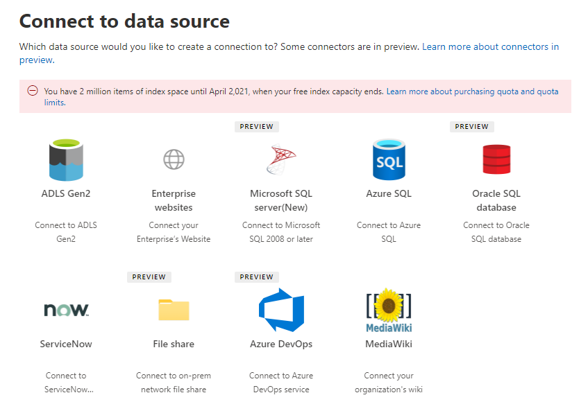

<!-- Previous ms.author: monaray -->

<!-- markdownlint-disable no-trailing-punctuation -->

# Vue d’ensemble de la configuration des connecteurs Graph par Microsoft 

Cet article montre le processus de base requis pour configurer les connecteurs Graph par **Microsoft** dans le [Centre d'administration Microsoft 365](https://admin.microsoft.com). Ce processus simple comprend les étapes suivantes :  
<!---Add links to each section in the doc--->

1. [Ajouter un connecteur Graph dans le Centre d’administration Microsoft 365](#step-1-add-a-graph-connector-in-the-microsoft-365-admin-center)
2. [Nommer la connexion](#step-2-name-the-connection)
3. [Configurer les paramètres de connexion](#step-3-configure-the-connection-settings)
4. [Sélectionner des propriétés](#step-4-select-properties)
5. [Gérer les autorisations de recherche](#step-5-manage-search-permissions)
6. [Attribuer des étiquettes de propriété](#step-6-assign-property-labels)
7. [Gérer le schéma](#step-7-manage-schema)
8. [Rafraîchir les paramètres](#step-8-refresh-settings)
9. [Examiner la connexion](#step-9-review-connection)

Cet article inclut également des informations sur la résolution des problèmes, les limitations et les étapes suivantes :

* [Résolution des problèmes](#troubleshooting)
* [Limites](#limitations)
* [Étapes suivantes](#next-steps)

> [!NOTE]
> Le processus d’installation est similaire pour tous les connecteurs Graph microsoft, mais n’est pas exactement le même. **En plus de lire cet article, n’oubliez pas de lire les informations spécifiques au connecteur pour votre source de données.**  

<!---## Before you get started-->

<!---Insert "Before you get started" recommendations for this data source-->

## Étape 1 : Ajouter un connecteur Graph dans le Centre d'administration Microsoft 365

Pour configurer l’un des connecteurs d’Graph microsoft, Graph les étapes suivantes :

1. Connectez-vous à votre compte d’administrateur dans [le Centre d'administration Microsoft 365](https://admin.microsoft.com).

2. Dans le volet de navigation, **sélectionnez Paramètres,** puis **recherchez & intelligence.** Sélectionnez [l’onglet Sources de données.](https://admin.microsoft.com/Adminportal/Home#/MicrosoftSearch/Connectors)

3. Sélectionnez **+Ajouter,** puis sélectionnez la source de données de votre choix dans le menu des options disponibles.

   > [!div class="mx-imgBorder"]
   > 

> [!NOTE]
> Vous pouvez ajouter un maximum de dix Graph connexions à chaque client.

## Étape 2 : Nommer la connexion

Spécifiez les attributs ci-après :

* Name (obligatoire)
* ID de connexion (obligatoire)
* Description (facultatif)
* Case à cocher (obligatoire)

L’ID de connexion crée des propriétés implicites pour votre connecteur. Il ne doit contenir que des caractères alphanumériques et un maximum de 32 caractères.

## Étape 3 : Configurer les paramètres de connexion

Le processus de configuration des paramètres de connexion varie en fonction du type de source de données. Consultez [les informations spécifiques au](/microsoftsearch/servicenow-connector#step-31-basic-authentication) connecteur pour le type de source de données que vous souhaitez ajouter à votre client pour effectuer cette étape du processus d’installation.  

Pour en savoir plus sur la connexion à une source de données sur site, voir Installer une passerelle [de données sur site.](/data-integration/gateway/service-gateway-install)

## Étape 4 : Sélectionner les propriétés

Vous pouvez choisir les propriétés qui seront indexées par Recherche Microsoft. 

La requête ServiceNow peut être utilisée pour filtrer vos données avant qu’elles ne soient indexées par Recherche Microsoft ; Cela vous permet de mieux contrôler les données qui peuvent être recherchés. Pour en savoir plus sur les requêtes ServiceNow, voir [En savoir plus sur les requêtes ServiceNow.](https://go.microsoft.com/fwlink/?linkid=2151447) 

## Étape 5 : Gérer les autorisations de recherche

Les listes de contrôle d’accès déterminent les utilisateurs de votre organisation qui peuvent accéder à chaque élément.  

Certains connecteurs tels que [Microsoft SQL](MSSQL-connector.md) et Azure Data Lake [Stockage Gen2](azure-data-lake-connector.md) Azure Active Directory [(Azure AD)](/azure/active-directory/) en natif.

D’autres connecteurs tels que [ServiceNow Knowledge,](servicenow-knowledge-connector.md) [ServiceNow Catalog,](servicenow-catalog-connector.md) [Azure DevOps](azure-devops-connector.md)et [Salesforce](salesforce-connector.md) prise en charge la synchronisation des utilisateurs et groupes non Azure AD.  

La sélection de tout le monde permet à tous les membres de votre organisation d’voir les résultats de la recherche à partir de cette source de données.

## Étape 6 : Attribuer des étiquettes de propriété

Vous pouvez affecter des étiquettes sémantiques à vos propriétés source sur la page « Attribuer des étiquettes de propriétés ». Les étiquettes sont des balises connues fournies par Microsoft qui fournissent une signification sémantique. Ils permettent à Microsoft d’intégrer vos données de connecteur dans Microsoft 365 expériences telles que la recherche améliorée, les cartes de personnes, la découverte intelligente et bien plus encore.  

Le tableau suivant répertorie les étiquettes actuellement pris en charge et leurs descriptions.  

Étiquette | Description
--- | ---  
**title** | Titre de l’élément que vous souhaitez voir dans la recherche et d’autres expériences
**url** | URL cible de l’élément dans le système source
**Créé par** | Nom de la personne qui a créé l’élément
**Auteur de la dernière modification** | Nom de la personne qui a modifié l’élément le plus récemment
**Authors** | Nom des personnes qui ont participé/ont participé à l’élément
**Date et heure de création** | Quand l’élément a-t-il été créé ?
**Heure de la dernière modification** | Quand l’élément a-t-il été modifié le plus récemment ?
**Nom de fichier** | Nom de l’élément de fichier
**Extension de fichier** | Type d’élément de fichier tel que .pdf ou .word

Les propriétés de cette page sont pré-sélectionnées en fonction de votre source de données, mais vous pouvez modifier cette sélection si une autre propriété convient mieux à une étiquette particulière.  

Le titre **de l’étiquette** est l’étiquette la plus importante. Il est **vivement recommandé d’avoir** une propriété affectée à cette étiquette afin que votre connexion participe à l’expérience [de cluster de résultats.](result-cluster.md)

Un mappage incorrect des étiquettes entraîne une expérience de recherche insérante. Certaines étiquettes ne peuvent pas se voir attribuer de propriété.  

## Étape 7 : Gérer le schéma

### Propriété de contenu

Il est recommandé de  sélectionner une propriété de contenu dans le menu déroulant des options ou de conserver la valeur par défaut si elle est présente. Cette propriété est utilisée pour l’indexation de texte intégral du contenu, la génération d’extraits de page de résultats de recherche, la participation au [cluster](result-cluster.md) de résultats, la détection de langue, la prise en charge HTML/texte, le classement et la pertinence, ainsi que la formulation des requêtes.

Si vous sélectionnez une propriété de contenu, vous avez la possibilité d’utiliser la propriété générée par le système **ResultSnippet** lorsque vous créez [votre type de résultat.](customize-results-layout.md) Cette propriété sert d’espace réservé pour les extraits de code dynamiques générés à partir de la propriété de contenu au moment de la requête. Si vous utilisez cette propriété dans votre type de résultat, des extraits de code sont générés dans vos résultats de recherche.

### Création d’alias pour les propriétés source

Vous pouvez ajouter des alias à vos propriétés sous la colonne « Alias » dans la page Gérer le schéma. Les alias sont des noms convivial pour vos propriétés et sont également utilisés dans les requêtes et dans la création de filtres. Ils sont également utilisés pour normaliser les propriétés source à partir de plusieurs connexions de telle façon qu’elles ont le même nom. Ainsi, vous pouvez créer un filtre unique pour un secteur vertical avec plusieurs connexions. Pour plus d’informations, voir [Personnaliser la page des résultats de la recherche.](customize-search-page.md)  

### Attributs de schéma de recherche

Vous pouvez définir les attributs de schéma de recherche pour contrôler les fonctionnalités de recherche de chaque propriété source. Un schéma de recherche permet de déterminer les résultats affichés sur la page des résultats de la recherche et les informations que les utilisateurs finaux peuvent afficher et consulter.

Les attributs de schéma de recherche incluent des options **pour interroger,** **rechercher,** **récupérer** et **affiner**. Le tableau suivant répertorie chacun des attributs que les connecteurs Graph Microsoft Graph et explique leurs fonctions.

Attribut de schéma de recherche | Fonction | Exemple
--- | --- | ---
SEARCH | Rend le contenu de texte d’une propriété utilisable dans une recherche. Le contenu de la propriété est inclus dans l’index de texte intégral. | Si la propriété est **un titre,** une requête pour **Enterprise** renvoie des réponses qui contiennent le mot Enterprise **dans** n’importe quel texte ou titre.
REQUÊTE | Recherche par requête une correspondance pour une propriété particulière. Le nom de la propriété peut ensuite être spécifié dans la requête par programme ou par mot. |  Si la **propriété Title** peut être interrogé, la requête **Title: Enterprise** est prise en charge.
RETRIEVE | Seules les propriétés récupérables peuvent être utilisées dans le type de résultat et s’afficher dans le résultat de recherche. |
AFFINER | L’option d’affinment peut être utilisée comme dans la page Recherche Microsoft résultats. | Les utilisateurs de votre organisation peuvent [filtrer](custom-filters.md) par **URL** dans la page des résultats de la recherche si la propriété affiner est marquée lors de la configuration de la connexion

Pour tous les connecteurs à l’exception du connecteur de partage de fichiers, les types personnalisés doivent être définies manuellement. Pour activer les fonctionnalités de recherche pour chaque champ, vous avez besoin d’un schéma de recherche mappé à une liste de propriétés. L’Assistant Connexion sélectionne automatiquement un schéma de recherche basé sur l’ensemble des propriétés sources que vous choisissez. Vous pouvez modifier ce schéma en sélectionnant les cases à cocher pour chaque propriété et attribut dans la page de schéma de recherche.

> [!div class="mx-imgBorder"]
> 

### Restrictions et recommandations pour les paramètres de schéma de recherche

* La **propriété de** contenu est uniquement utilisable dans une recherche. Une fois sélectionnée dans ladown, cette propriété ne peut pas être utilisée avec les options **retrieve** ou **query**.

* Des problèmes de performances importants se produisent lorsque les résultats de la recherche s’restituer avec **la propriété de** contenu. Par exemple, le **champ de** contenu Texte d’un article de la base de connaissances [ServiceNow.](https://www.servicenow.com)

* Seules les propriétés marquées comme récupérables sont restituer dans les résultats de la recherche et peuvent être utilisées pour créer des types de résultats modernes (MRT).

* Seules les propriétés de chaîne peuvent être marquées comme utilisables dans une recherche.

> [!NOTE]
> Après avoir créé une connexion, vous **ne pouvez pas** modifier le schéma. Pour ce faire, vous devez supprimer votre connexion et en créer une nouvelle.

## Étape 8 : Actualiser les paramètres

L’intervalle d’actualisation détermine la fréquence de synchronisation de vos données entre la source de données et Recherche Microsoft. Chaque type de source de données possède un ensemble différent de planifications d’actualisation optimales en fonction de la fréquence de modification des données et du type de modifications.

Il existe deux types d’intervalles d’actualisation: l’actualisation complète et l’actualisation incrémentielle, mais les actualisations incrémentielles ne sont pas disponibles pour certaines sources de données.  

Avec une actualisation complète, le moteur de recherche traite et indexe les éléments qui ont été modifiés dans la source de contenu, quelles que soient les analyses précédentes. Une actualisation complète est la meilleure pour les situations ci-après :

* Détection de suppressions de données.
* L’actualisation incrémentielle a trouvé des erreurs et a échoué.
* Les ACA ont été modifiées.
* Les règles d’analyse ont été modifiées.
* Le schéma de la connexion a été mis à jour (les mises à jour de schéma ne sont pas encore pris en charge).

Avec une actualisation **incrémentielle,** le moteur de recherche peut traiter et indexer uniquement les éléments qui ont été créés ou modifiés depuis la dernière analyse réussie. Par conséquent, toutes les données de la source de contenu ne sont pas réindexées. Les actualisations incrémentielles fonctionnent mieux pour détecter le contenu, les métadonnées, les autorisations et d’autres mises à jour.

Les actualisations incrémentielles sont beaucoup plus rapides que les actualisations complètes, car les éléments inchangés ne sont pas traitées. Toutefois, si vous choisissez d’exécuter des actualisations incrémentielles, vous devez toujours exécuter régulièrement des actualisations complètes pour maintenir une synchronisation correcte des données entre la source de contenu et l’index de recherche.

> [!div class="mx-imgBorder"]
> 

<!---Change screenshot for one that shows both options in new UI (try ServiceNow)--->

## Étape 9 : Examiner la connexion

Vous pouvez passer en revue l’intégralité de votre configuration et modifier les paramètres selon vos besoins avant d’achever la connexion. **N’oubliez pas de lire les informations spécifiques au connecteur pour votre source de données si vous ne l’avez pas déjà fait.** Sélectionnez **Terminer la** mise à jour lorsque vous êtes prêt à terminer la connexion.

### Vérifier si la configuration de la connexion a fonctionné

Go to the list of your published connections under the **Connectors** tab in the [admin center](https://admin.microsoft.com). Pour découvrir comment effectuer des mises à jour et des suppressions, voir [Gérer votre connecteur.](manage-connector.md)

## Résolution des problèmes
<!---Insert troubleshooting recommendations for this data source-->
Lisez les informations spécifiques au connecteur pour votre source de données. 

> [!NOTE]
> À ce stade, certains articles spécifiques au connecteur n’incluent pas de recommandations de résolution des problèmes.

## Limites
<!---Insert limitations for this data source-->
Pour en savoir plus sur les limitations qui s’appliquent à toutes les sources de données, consultez l’article Vue [d’ensemble de Microsoft Graph connecteurs.](connectors-overview.md)

Consultez les informations spécifiques au connecteur pour votre source de données afin de savoir si d’autres limitations s’appliquent à ce connecteur Graph spécifique.

## Étapes suivantes

Après avoir publié la connexion, vous devez personnaliser la page des résultats de la recherche. Pour en savoir plus sur la personnalisation des résultats de recherche, voir [Personnaliser la page des résultats de la recherche.](customize-search-page.md)
