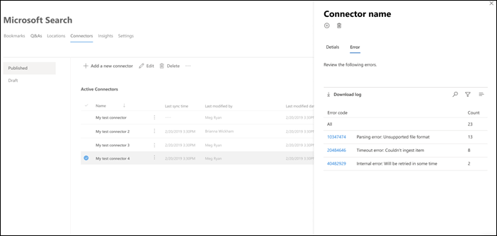
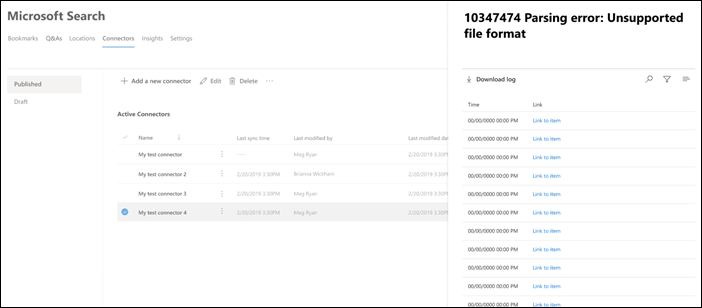

<!-- markdownlint-disable no-inline-html -->

# Afficher les détails et les erreurs de connexion pour Microsoft Search (recherche Microsoft)

Pour accéder à vos connecteurs et les gérer, vous devez être désigné comme administrateur de recherche pour votre client. Contactez votre administrateur client pour vous fournir le rôle d’administrateur de recherche.

Accédez à [l’onglet Connecteurs](https://admin.microsoft.com/Adminportal/Home#/MicrosoftSearch/Connectors) dans le [Centre d’administration Microsoft 365.](https://admin.microsoft.com)

Vous pouvez afficher les détails et les erreurs de connexion lorsque vous cliquez sur la connexion sous [l’onglet Connecteurs.](https://admin.microsoft.com/Adminportal/Home#/MicrosoftSearch/Connectors)  

## Afficher vos dernières informations d’analyse

Une fois la première analyse incrémentielle ou complète terminée, les dernières valeurs de données d’analyse sont affichées sous le dernier en-tête d’analyse dans le volet de détails. S’il n’y a pas eu de dernière analyse en cours d’analyse, aucune information ne s’y trouvait sous le dernier en-tête d’analyse. Ces informations sur la dernière analyse vous aideront à obtenir des informations sur la façon dont l’analyse a été effectuée et à effectuer les étapes nécessaires, le cas échéant.

Les dernières valeurs d’analyse suivantes seront disponibles pour chaque connexion :

Valeur | Description
--- | ---
**Terminé à l'** | Date et heure de fin de la dernière analyse
**Type** | Analyse incrémentielle ou complète
**Duration** | combien de temps la dernière analyse a-t-elle pris pour se terminer
**Réussites** | Nombre d’éléments qui ont été correctement ingérés lors de la dernière analyse
**Erreurs** | Nombre d’éléments qui ont fait l’objet d’une erreur lors de la dernière analyse

## Surveiller les erreurs

Pour chaque **connecteur actif sous** l’onglet **Connecteurs,** toutes les erreurs d’analyse existantes s’affiche sous **l’onglet** Erreur. L’onglet répertorie les codes d’erreur, le nombre de chacun et les options de téléchargement du journal des erreurs. Voir l’exemple dans l’image suivante. Sélectionnez **un code d’erreur** pour afficher les détails de l’erreur.

Pour afficher les détails spécifiques d’une erreur, sélectionnez son code d’erreur. Un écran s’affiche avec les détails de l’erreur et un lien. Les erreurs les plus récentes apparaissent en haut. Voir l’exemple dans le tableau suivant.

Vous trouverez ci-dessous la liste des différentes erreurs qui peuvent apparaître sur n’importe quelle connexion. Si ces solutions ne fonctionnent pas, contactez le support technique ou envoyez-nous vos [commentaires.](connectors-feedback.md)

Code d’erreur | Message d’erreur | Solution
--- | --- | ---
1000 | La source de données n’est pas disponible. Vérifiez votre connexion Internet ou assurez-vous que la source de données est toujours accessible par le connecteur. | Cette erreur se produit lorsque la source de données n’est pas accessible en raison d’un problème réseau ou lorsque la source de données elle-même est supprimée, déplacée ou renommée. Vérifiez si les détails de la source de données fournis sont toujours valides.
1001 | Ne peut pas mettre à jour les données, car la source de données limitation le connecteur. | Pour limiter la source de données, vérifiez si ses limites d’échelle peuvent être augmentées ou patientez jusqu’à une heure moins longue du trafic de la journée.
1002 | Ne peut pas s’authentifier auprès de la source de données. Vérifiez que les informations d’identification associées à cette source de données sont correctes. | Cliquez sur **Modifier** pour mettre à jour les informations d’authentification.
1003 | Le compte associé au connecteur n’est pas autorisé à accéder à l’élément. |  Assurez-vous que le compte approprié a accès à l’élément que vous souhaitez indexer.
1004 | Impossible d’atteindre la passerelle de données sur site. Assurez-vous que le service de passerelle est en cours d’exécution et que les détails de la passerelle sont mis à jour dans la configuration de connexion. | Vérifiez l’ordinateur avec la passerelle, ouvrez l’application Power BI Gateway et assurez-vous que la passerelle est en cours d’exécution. Vérifiez que la passerelle utilise le même compte d’administrateur que Microsoft Search (recherche Microsoft), puis assurez-vous que tous les détails de la passerelle sont tous mis à jour dans la configuration de connexion.
1005 | Les informations d’identification associées à cette source de données ont expiré. Renouvelez les informations d’identification et mettez à jour la connexion. | Cliquez sur **Modifier** pour mettre à jour les informations d’authentification.
1006 | La version de votre passerelle n’est plus à jour et ne prend plus en charge ce connecteur. Vous devrez mettre à jour la passerelle. | Visitez Installer [une passerelle](https://docs.microsoft.com/data-integration/gateway/service-gateway-install) de données sur site pour télécharger et installer la dernière version de la passerelle Power BI sur l’ordinateur contenant la passerelle.
1007 | Aucune licence Power BI valide n’est détectée. Vous avez besoin d’une licence Power BI valide pour effectuer cette analyse. | Vous avez besoin d’une licence Power BI valide pour effectuer cette analyse. Vérifiez que votre organisation dispose d’une licence valide. Si c’est le cas, essayez à nouveau. Si ce n’est pas le cas, obtenez une licence, puis essayez à nouveau.
1008 | L’utilisation totale du quota de votre client a atteint sa limite. | Essayez de supprimer une connexion pour libérer une partie de votre quota ou ajustez vos filtres d’ingestion afin d’apporter moins de données. Si ceux-ci ne résolvent pas le problème, contactez le support Microsoft.
1009 | L’utilisation totale du quota pour votre connexion a atteint sa limite. | Essayez d’ajuster vos filtres d’ingestion pour apporter moins de données. Si cela ne résout pas le problème, contactez le support Microsoft.
1010 | L’utilisation totale du quota pour l’indexation de groupes non Azure AD a atteint sa limite de 100 000. | Essayez de supprimer une connexion pour libérer une partie de votre quota ou ajustez vos filtres d’ingestion afin d’apporter moins de données. Si ceux-ci ne résolvent pas le problème, contactez le support Microsoft.
1011 | [L’agent](on-prem-agent.md) de connecteur Graph n’est pas accessible ou hors connexion. | 
1012 | L’authentification à votre connexion a échoué en raison d’un mode d’authentification non pris en compte. | Modifiez la connexion pour mettre à jour les paramètres d’authentification de votre connexion.
2001 | L’indexation est limitée en raison d’un grand nombre de mises à jour dans la file d’attente. En fonction de la file d’attente, la fin des mises à jour peut prendre un certain temps. | Veuillez patienter jusqu’à ce que la file d’attente soit effacée.
2002 | L’indexation a échoué en raison d’une mise en forme d’élément non pris en compte. | Pour plus d’informations, voir la documentation spécifique au connecteur.
2003 | L’indexation a échoué en raison d’un contenu d’élément non pris en compte. | Pour plus d’informations, voir la documentation spécifique au connecteur.
2004 | L’indexation a échoué en raison d’un élément ou d’une taille de fichier non pris en compte. | Pour plus d’informations, voir la documentation spécifique au connecteur.
2005 | L’indexation a échoué car l’URI est trop long. | Pour plus d’informations, voir la documentation spécifique au connecteur.
2006 | Échec du mappage utilisateur en raison d’une formule de mappage non valide ou d’aucun utilisateur Azure AD avec cette propriété. | Essayez de supprimer et de recréer la connexion avec une formule de mappage différente. 
2007 | Cet élément n’est pas affiché dans Recherche Microsoft, car certains utilisateurs ou groupes sans autorisation d’affichage de cet élément n’ont pas pu être indexés. | 
2008 | Les connexions ne peuvent pas avoir de groupes non Azure AD avec plus de 50 000 membres. | Essayez de supprimer des utilisateurs d’un groupe ou essayez de supprimer des éléments ACLed avec ce groupe de l’ingestion et de recréer la connexion.
2009 | L’indexation de groupe non Azure AD est temporairement suspendue en raison d’un grand nombre de demandes. L’indexation reprend lorsque le système termine le traitement de ces demandes. Veuillez revenir plus tard. | 
2010 | Cette connexion n’est plus valide en raison d’une mise à jour réalisée par Microsoft. Supprimez la connexion et créez-en une. | Supprimez la connexion et créez-en une.
5000 | Un problème s’est passé. Si cela se poursuit, contactez le support technique. |
