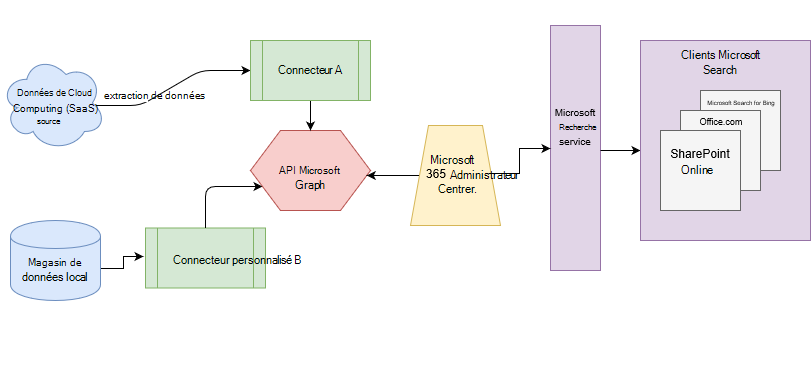

# Vue d’ensemble des connecteurs Microsoft GraphOverview of Microsoft Graph connectors

Microsoft Search indexe toutes vos données Microsoft 365 de façon à ce qu’elles puissent être recherchées pour les utilisateurs.Microsoft Search indexes all your Microsoft 365 data to make it searchable for users. Avec les connecteurs Microsoft Graph, votre organisation peut indexer des données tierces pour apparaître dans les résultats de recherche de Microsoft.With Microsoft Graph connectors, your organization can index third-party data to appear in Microsoft Search results. Les données tierces peuvent être hébergées sur site ou dans les nuages publics ou privés.The third-party data can be hosted on-premises or in the public or private clouds. Les connecteurs développent les types de sources de contenu pouvant faire l’objet d’une recherche dans vos applications de productivité Microsoft 365 et l’écosystème Microsoft plus large.Connectors expand the types of content sources that are searchable in your Microsoft 365 productivity apps and the broader Microsoft ecosystem.

> [!IMPORTANT]
> **Clause d’exclusion de responsabilité**: les connecteurs Microsoft Graph et les API Microsoft Search (index and Search) sont actuellement en version préliminaire.**DISCLAIMER**: Microsoft Graph connectors and Microsoft Search APIs (index and search) are currently in preview. Pour en savoir plus sur l’aperçu, consultez la rubrique [aperçu des connecteurs Microsoft Graph](connectors-preview.md).To learn more about the preview, see [Microsoft Graph connectors preview](connectors-preview.md). Pour participer à l’aperçu, vous devez d’abord envoyer le formulaire d’abonnement de l' [aperçu des connecteurs Microsoft Graph](https://forms.office.com/Pages/ResponsePage.aspx?id=v4j5cvGGr0GRqy180BHbRxWYgu82J_RFnMMATAS6_chUNVYwNU1CMDNZUDBSSDZKWVo2RDJDRjRLQi4u).To participate in the preview, you must first submit the [Microsoft Graph Connectors Preview Signup form](https://forms.office.com/Pages/ResponsePage.aspx?id=v4j5cvGGr0GRqy180BHbRxWYgu82J_RFnMMATAS6_chUNVYwNU1CMDNZUDBSSDZKWVo2RDJDRjRLQi4u).

## ArchitectureArchitecture
Le diagramme d’architecture suivant de la plateforme Microsoft Graph montre comment le contenu du connecteur passe par l’indexation de contenu aux résultats de l’utilisateur dans les clients [Microsoft Search](https://docs.microsoft.com/microsoftsearch/overview-microsoft-search) .The following architectural diagram of the Microsoft Graph platform shows how connector content flows through content indexing to user results in [Microsoft Search](https://docs.microsoft.com/microsoftsearch/overview-microsoft-search) clients. Cet article décrit chacun des blocs de construction clés du processus de flux de données des connecteurs Microsoft Graph.This article explains each of the key building blocks in the Microsoft Graph connectors data flow process.

L’API instancie une connexion par source de données.The API instantiates one connection per data source. L’API indexe et stocke les données.Then the API indexes and stores the data. Les connexions établies interagissent avec Microsoft Search, afin que les utilisateurs puissent obtenir des résultats de recherche.Established connections interact with Microsoft Search, so users can get search results.

Vous pouvez configurer tous les connecteurs créés par Microsoft dans le [Centre d’administration 365 de Microsoft](https://admin.microsoft.com).You can configure all the Microsoft-built connectors in the [Microsoft 365 admin center](https://admin.microsoft.com). Le centre d’administration simplifie la configuration de votre connecteur avec une interface utilisateur simple.The admin center simplifies configuring your connector with a simple user interface.

Pour créer une **connexion** à une source de données, les administrateurs ont besoin d’un accès authentifié aux données et à l’intégralité du référentiel de contenu.To create a **connection** to a data source, admins need authenticated access to the data and the entire content repository. Les données sont chargées pour l’indexation par le service connecteur Graph.The data is fed to the graph connector service for indexing.

## Connecteurs disponiblesAvailable connectors
Il existe actuellement 6 connecteurs créés par Microsoft et plus de 100 connecteurs sont disponibles auprès de nos partenaires pour l’écosystème.There are currently 6 Microsoft-built connectors, and over 100 connectors are available from our ecosystem partners.

Pour afficher un aperçu des connecteurs de l’un de nos partenaires de l’écosystème, contactez-les directement.To preview connectors from one of our ecosystem partners, contact them directly. Pour plus d’informations, consultez la [Galerie des connecteurs Microsoft Graph](connectors-gallery.md).For more information, see the [Microsoft Graph connectors gallery](connectors-gallery.md).

Vous pouvez également [créer votre propre connecteur](https://docs.microsoft.com/graph/search-concept-overview).You can also [build your own connector](https://docs.microsoft.com/graph/search-concept-overview).

### Connecteurs par MicrosoftConnectors by Microsoft
La version d’évaluation des connecteurs Microsoft Graph comprend 6 connecteurs créés par Microsoft.The Microsoft Graph connectors preview release includes 6 Microsoft-built connectors. Vous pouvez les configurer dans le [Centre d’administration 365 de Microsoft](https://admin.microsoft.com) et apprendre à [configurer votre connecteur créé par Microsoft](configure-connector.md).You can set them up in the [Microsoft 365 admin center](https://admin.microsoft.com) and learn how to [Set up your Microsoft-built connector](configure-connector.md).

Les sections suivantes fournissent des descriptions succinctes de ces connecteurs créés par Microsoft.The following sections provide brief descriptions for these Microsoft-built connectors. Vous pouvez obtenir plus d’informations dans les Articles liés à chaque connecteur.You can get more information in the linked articles for each connector.

- **[Azure Data Lake Storage Gen2](https://docs.microsoft.com/azure/storage/blobs/data-lake-storage-introduction)**.**[Azure Data Lake Storage Gen2](https://docs.microsoft.com/azure/storage/blobs/data-lake-storage-introduction)**. Avec ce connecteur Microsoft Graph, les utilisateurs de votre organisation peuvent rechercher des fichiers et du contenu stockés dans des conteneurs d’objets BLOB Azure.With this Microsoft Graph connector, users in your organization can search for files and content stored in Azure Blob containers. Le connecteur Azure Data Lake Storage Gen2 indexe également les dossiers activés dans la hiérarchie dans les comptes Gen2 de stockage Azure Data Lake que vous spécifiez.The Azure Data Lake Storage Gen2 connector also indexes hierarchy-enabled folders in Azure Data Lake Storage Gen2 accounts that you specify.
En savoir plus sur le [connecteur Azure Data Lake Storage Gen2](azure-data-lake-connector.md).Learn more about the [Azure Data Lake Storage Gen2 connector](azure-data-lake-connector.md).

- **Sites Web d’entreprise**.**Enterprise websites**. Avec ce connecteur Microsoft Graph, les utilisateurs de votre organisation peuvent effectuer des recherches dans des pages de n’importe quel site Web d’entreprise non SharePoint.With this Microsoft Graph connector, users in your organization can search over pages in any non-SharePoint enterprise website.
En savoir plus sur le [connecteur de sites Web d’entreprise](enterprise-web-connector.md).Learn more about the [Enterprise websites connector](enterprise-web-connector.md).

- **Partage de fichiers**.**File share**. Avec ce connecteur Microsoft Graph, les utilisateurs de votre organisation peuvent rechercher des fichiers stockés sur des partages de fichiers Windows locaux.With this Microsoft Graph connector, users in your organization can search for files stored on on-premises Windows file shares.
En savoir plus sur le [connecteur de partage de fichiers](file-share-connector.md).Learn more about the [File share connector](file-share-connector.md).

- **[MediaWiki](https://www.mediawiki.org/wiki/MediaWiki)**.**[MediaWiki](https://www.mediawiki.org/wiki/MediaWiki)**. Avec ce connecteur Microsoft Graph, les utilisateurs peuvent rechercher des Articles de la base de connaissances sur des sites wiki créés par votre organisation avec MediaWiki.With this Microsoft Graph connector, users can search for knowledge-base articles on wiki sites your organization creates with MediaWiki.
En savoir plus sur le [connecteur MediaWiki](mediawiki-connector.md).Learn more about the [MediaWiki connector](mediawiki-connector.md).

- **[Microsoft SQL Server](https://www.microsoft.com/sql-server/sql-server-2017)**.**[Microsoft SQL server](https://www.microsoft.com/sql-server/sql-server-2017)**. Avec ce connecteur Microsoft Graph, les utilisateurs de votre organisation peuvent rechercher des données dans des bases de données SQL Server locales.With this Microsoft Graph connector, users in your organization can search for data in on-premises SQL server databases.
En savoir plus sur le [Connecteur Microsoft SQL Server](MSSQL-connector.md).Learn more about the [Microsoft SQL server connector](MSSQL-connector.md).

- **[ServiceNow](https://www.servicenow.com)**.**[ServiceNow](https://www.servicenow.com)**. Avec ce connecteur Microsoft Graph, les utilisateurs de votre organisation peuvent rechercher des Articles de la base de connaissances à partir de votre instance ServiceNow.With this Microsoft Graph connector, users in your organization can search for knowledge-base articles from your ServiceNow instance.
En savoir plus sur le [connecteur ServiceNow](servicenow-connector.md).Learn more about the [ServiceNow connector](servicenow-connector.md).

### Connecteurs de nos partenairesConnectors from our partners
Il existe plus de 100 connecteurs disponibles pour un aperçu auprès de nos partenaires de l’écosystème.There are over 100 connectors available for preview from our ecosystem partners. Pour afficher un aperçu des connecteurs de l’un de nos partenaires de l’écosystème, contactez-les directement.To preview connectors from one of our ecosystem partners, contact them directly.
Pour en savoir plus sur les connecteurs de nos partenaires, consultez la [Galerie de connecteurs Microsoft Graph](connectors-gallery.md).Learn more about connectors from our partners in the [Microsoft Graph connectors gallery](connectors-gallery.md).

### Créer votre propre connecteurBuild your own connector
Pour indexer des fichiers ou des types de données personnalisés, les développeurs peuvent créer des connecteurs dans [Microsoft Graph](https://developer.microsoft.com/graph/).To index custom data types or files, developers can create connectors in [Microsoft Graph](https://developer.microsoft.com/graph/). Un connecteur est une application qui [crée une connexion](https://docs.microsoft.com/graph/search-index-manage-connections) et envoie des éléments dans l’index de recherche Microsoft.A connector is an application that [creates a connection](https://docs.microsoft.com/graph/search-index-manage-connections) and pushes items into the Microsoft Search index. Pour plus d’informations, reportez-vous à la rubrique [vue d’ensemble de l’expérience Microsoft Search pour les applications sur Microsoft Graph](https://docs.microsoft.com/graph/search-concept-overview).For more information, see the [Overview for extending the Microsoft Search experience for apps on Microsoft Graph](https://docs.microsoft.com/graph/search-concept-overview).

### Résultats de la recherche avec votre connecteur personnaliséSearch results with your custom-built connector
Une fois que les données personnalisées sont indexées, les développeurs peuvent [interroger ces données](https://docs.microsoft.com/graph/search-concept-custom-types).Once custom data is indexed, developers can [query this data](https://docs.microsoft.com/graph/search-concept-custom-types). Vous pouvez afficher vos données dans n’importe quelle application.You can view your data in any application. Pour plus d’informations, reportez-vous à la rubrique [vue d’ensemble de l’expérience Microsoft Search pour les applications sur Microsoft Graph](https://docs.microsoft.com/graph/search-concept-overview).For more information, see the [Overview for extending the Microsoft Search experience for apps on Microsoft Graph](https://docs.microsoft.com/graph/search-concept-overview).

## Critères de licenceLicense requirements
Pour afficher les données des connecteurs dans les résultats de la recherche, les utilisateurs doivent disposer de l’un des abonnements Microsoft 365 suivants :To view data from connectors in your search results, users must have one of the following Microsoft 365 subscriptions:
- <a href="https://www.microsoft.com/microsoft-365/compare-all-microsoft-365-plans" target="_blank">Microsoft 365 pour entreprise E3 ou E5</a><a href="https://www.microsoft.com/microsoft-365/compare-all-microsoft-365-plans" target="_blank">Microsoft 365 for enterprise E3 or E5</a>
- <a href="https://www.microsoft.com/microsoft-365/academic/compare-office-365-education-plans?activetab=tab:primaryr1" target="_blank">Microsoft 365 éducation a3 ou a5</a><a href="https://www.microsoft.com/microsoft-365/academic/compare-office-365-education-plans?activetab=tab:primaryr1" target="_blank">Microsoft 365 Education A3 or A5</a>
