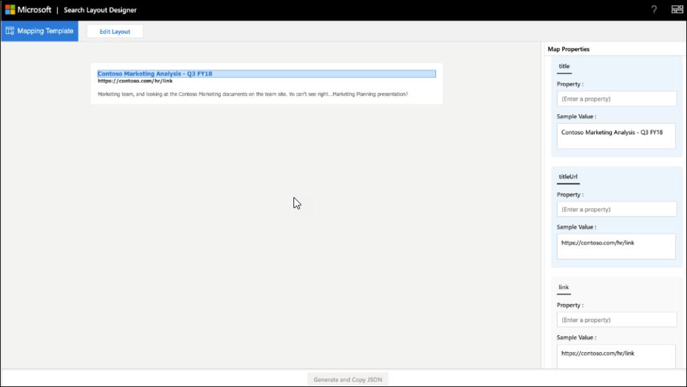

<!-- markdownlint-disable no-hard-tabs -->
# <a name="create-a-layout-to-customize-search-results"></a>Créer une disposition pour personnaliser les résultats de recherche

Vous pouvez concevoir la disposition des résultats pour un secteur vertical personnalisé à l’aide du concepteur de disposition de recherche. Vous pouvez commencer à concevoir la disposition en choisissant les modèles proposés dans le concepteur de disposition et en les utilisant s’ils correspondent à vos besoins. Vous pouvez également choisir de modifier ces modèles de différentes manières pour vous adapter à vos besoins. Par exemple, ajoutez/supprimez des images, ajoutez/supprimez du texte et modifiez du texte. Si aucun des modèles ne répond à vos besoins, vous pouvez choisir de commencer à concevoir votre disposition à l’aide d’un modèle vide.  

Une fois la disposition prête, utilisez le langage [de](/adaptive-cards/templating/language) modèle de cartes adaptatives pour créer un JSON de disposition de résultat qui est utilisé pour définir un type de résultat. Vous mappagez les propriétés de résultat à la disposition à l’aide de l’étape Mappage dans le concepteur de disposition.  

## <a name="create-a-layout-on-your-own"></a>Créer une disposition par vous-même

La création d’une disposition par vous-même nécessite une connaissance des [cartes adaptatives](/adaptive-cards/authoring-cards/getting-started) et de [leur schéma.](https://adaptivecards.io/explorer/) La disposition des résultats de recherche utilise un sous-ensemble des éléments offerts par les cartes adaptatives, et vous pouvez utiliser le concepteur de disposition pour en savoir plus sur l’ensemble d’éléments pris en charge.  

Lors de la création de votre propre disposition, créez la disposition de carte adaptative à l’aide des données de votre connecteur, puis finalisez la disposition.
Il existe deux étapes principales pour créer votre propre disposition :

- Concevez la disposition.
- Séparez les données du modèle.

### <a name="design-the-layout"></a>Conception de la mise en page

Dans cet exemple, nous montrons une disposition avec un en-tête, un lien et un texte descriptif.


Et voici le fichier JSON associé à la disposition :

```json
{
    "type": "AdaptiveCard",
    "version": "1.3",
    "body": [
        {
            "type": "ColumnSet",
            "columns": [
                {
                    "type": "Column",
                    "width": 8,
                    "items": [
                        {
                            "type": "TextBlock",
                            "text": "Contoso Marketing Analysis - Q3 FY18",
                            "color": "Accent",
                            "size": "Medium",
                            "spacing": "None",
                            "weight": "Bolder"
                        },
                        {
                            "type": "TextBlock",
                            "text": "https://contoso.com/hr/link",
                            "spacing": "None",
                            "color": "Dark",
                            "weight": "Bolder"
                        },
                        {
                            "type": "TextBlock",
                            "text": "Marketing team at Contoso.., and looking at the Contoso Marketing documents on the team site. This contains the data from FY20 and will taken over to FY21...Marketing Planning is ongoing for FY20..",
                            "wrap": true,
                            "maxLines": 2,
                            "spacing": "Medium"
                        }
                    ],
                    "horizontalAlignment": "Center",
                    "spacing": "None"
                }
            ]
        }
    ],
    "$schema": "http://adaptivecards.io/schemas/adaptive-card.json"
}
```

### <a name="separate-the-data-from-the-layout"></a>Séparer les données de la disposition

Vous pouvez séparer les données de la disposition et les lier.

Voici la disposition JSON après la liaison des données :

```json
{
    "type": "AdaptiveCard",
    "version": "1.3",
    "body": [
        {
            "type": "ColumnSet",
            "columns": [
                {
                    "type": "Column",
                    "width": 8,
                    "items": [
                        {
                            "type": "TextBlock",
                            "text": "[${title}](${titleUrl})",
                            "color": "Accent",
                            "size": "Medium",
                            "spacing": "None",
                            "weight": "Bolder"
                        },
                        {
                            "type": "TextBlock",
                            "text": "${link}",
                            "spacing": "None",
                            "color": "Dark",
                            "weight": "Bolder"
                        },
                        {
                            "type": "TextBlock",
                            "text": "${description}",
                            "wrap": true,
                            "maxLines": 2,
                            "spacing": "Medium"
                        }
                    ],
                    "horizontalAlignment": "Center",
                    "spacing": "None"
                }
            ]
        }
    ],
    "$schema": "http://adaptivecards.io/schemas/adaptive-card.json"
}
```

Exemple de données :  spécifiez des exemples de données dans l’exemple d’éditeur de données pour afficher la carte liée aux données en **mode Aperçu.**

```json
{

    "title": "Contoso Marketing Analysis - Q3 FY18",
    "titleUrl": "https://contoso.com/hr/link",
    "link": "https://contoso.com/hr/link",
    "description": "Marketing team, and looking at the Contoso Marketing documents on the team site. Yo can't see right...Marketing Planning presentation?"

}
```

## <a name="map-the-layout-to-the-result-properties"></a>Ma cartographier la disposition sur les propriétés des résultats

Vous devez maque chaque champ de la disposition sur une propriété de résultat ou une propriété de connecteur pour générer la disposition des résultats JSON.



Sélectionnez un champ dans la disposition pour mettre en évidence les variables qui doivent être mappées. Vous pouvez utiliser plusieurs variables pour un seul champ, et tous les champs doivent être mappés aux propriétés de résultat.

### <a name="show-snippet-on-search-result"></a>Afficher l’extrait de code sur le résultat de la recherche  

Les extraits de code dynamiques générés sur **la** propriété de contenu du résultat du connecteur peuvent être affichés sur le résultat de recherche. **ResultSnippet est** la propriété système qui agit comme une propriété d’espace réservé pour les extraits de code générés pour chaque résultat de connecteur. Pour afficher les extraits de code sur la disposition des résultats, la propriété système **ResultSnippet** doit être mappée sur un champ approprié, par exemple Description, dans la disposition des résultats de la recherche. Les extraits de code générés sur chaque résultat mettent également en évidence les correspondances dans l’extrait de code avec le terme de requête entré par l’utilisateur.

## <a name="things-to-consider"></a>Informations importantes

Avant de commencer, vous devez faire quelques opérations et éviter d’avoir à faire en sorte que vos dispositions soient réussies.

### <a name="do"></a>À faire

- Modifiez un modèle pour fournir le lien de logo dans la disposition si vous utilisez des liens statiques pour les logos et non pour les propriétés de résultat.
- Validez la disposition des résultats pour les scénarios dans lequel aucune donnée n’est renvoyée pour une propriété de résultat utilisée dans le résultat JSON. Utilisez la `$when` condition pour masquer un élément si la propriété ne contient pas de données.  
- Assurez-vous que les types de données de `$when` la condition et de la propriété de résultat correspondent. Par exemple, ne comparez pas `Number` avec `Text` dans la `$when` condition.  
- Pensez aux exigences de thème lors de la conception d’une disposition des résultats.  
- Assurez-vous que `Textblock`   l’élément peut gérer le contenu dynamique. Vous pouvez utiliser les `wrap` propriétés et `maxLines` les propriétés d’élément à cet effet.
- Formatez correctement la date lors de `{DATE()}` l’utilisation dans Markdown.  

### <a name="dont"></a>À ne pas faire

- Ne définissez pas de types de données non valides lors de la liaison de valeurs. Pour plus d’informations sur les types de données, voir [Gérer le schéma de recherche.](/sharepoint/search/manage-the-search-schema)
- Évitez de rogler le résultat sur la page de résultats en suivant la hauteur maximale de la disposition des résultats JSON. Si vous dépassez la hauteur maximale de la mise en page des résultats, le résultat est rogé sur la page de résultats.
- N’utilisez pas de `px` valeurs dans les propriétés de l’élément.
- N’utilisez pas markdown avec la **propriété ResultSnippet** dans la disposition des résultats pour mettre en évidence la correspondance de requête dans le résultat de la recherche.

## <a name="resources"></a>Ressources

[Personnaliser la page des résultats de la recherche](customize-search-page.md)

[Cartes adaptatives](/adaptive-cards/authoring-cards/getting-started)

[Langage du modèle de cartes adaptatives](/adaptive-cards/templating/language)

[Schéma de carte adaptative](https://adaptivecards.io/explorer/)
