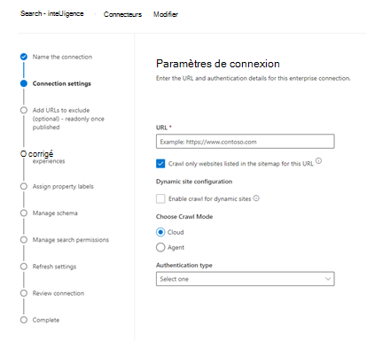

<!---Previous ms.author: monaray --->

<!-- markdownlint-disable no-inline-html -->

# Enterprise sites web Graph connecteur

Le connecteur Enterprise sites web Graph permet à votre organisation d’indexer des articles et du contenu à partir de ses sites web **internes.** Après avoir configuré le connecteur et synchronisé le contenu à partir du site web, les utilisateurs finaux peuvent rechercher ce contenu à partir de n’Recherche Microsoft client.

> [!NOTE]
> Lisez [**l’article Configurer votre connecteur Graph pour**](configure-connector.md) comprendre les instructions générales Graph d’installation des connecteurs.

Cet article est réservé à toute personne qui configure, exécute et surveille un connecteur Enterprise sites web. Il complète le processus de configuration général et affiche des instructions qui s’appliquent uniquement au connecteur Enterprise sites web. Cet article inclut également des informations [sur la résolution des problèmes](#troubleshooting) et les [limitations.](#limitations)

<!---## Before you get started-->

<!---Insert "Before you get started" recommendations for this data source-->

## Étape 1 : Ajouter un connecteur Graph dans le Centre d’administration Microsoft 365

Suivez les [instructions d’installation générales.](./configure-connector.md)
<!---If the above phrase does not apply, delete it and insert specific details for your data source that are different from general setup instructions.-->

## Étape 2 : Nommer la connexion

Suivez les [instructions d’installation générales.](./configure-connector.md)
<!---If the above phrase does not apply, delete it and insert specific details for your data source that are different from general setup instructions.-->

## Étape 3 : Configurer les paramètres de connexion

Pour vous connecter à votre source de données, indiquez l’URL racine du site web, sélectionnez une source d’analyse et le type d’authentification que vous souhaitez utiliser : Aucune, Authentification de base ou OAuth 2.0 avec [Azure Active Directory (Azure AD).](/azure/active-directory/) Une fois ces informations terminées, sélectionnez Connexion de test pour vérifier vos paramètres.

### URL

Utilisez le champ URL pour spécifier la racine du site web que vous souhaitez analyser. Le connecteur de sites web d’entreprise utilisera cette URL comme point de départ et suivra tous les liens de cette URL pour son analyse.

### Analyser les sites web répertoriés dans le plan de site

Lorsqu’il est sélectionné, le connecteur analyse uniquement les URL répertoriées dans le plan de site. S’il n’est pas sélectionné ou si aucun plan de site n’est trouvé, le connecteur analyse en profondeur tous les liens trouvés sur l’URL racine du site.

> [!div class="mx-imgBorder"]
> 

### Mode d’analyse : cloud ou local

Le mode d’analyse détermine le type de sites web que vous souhaitez indexer, en nuage ou en local. Pour vos sites web cloud, sélectionnez **Cloud** comme mode d’analyse.

En outre, le connecteur prend désormais en charge l’analyse des sites web locaux. Pour accéder à vos données sur site, vous devez d’abord installer et configurer l’agent Graph connecteur. Pour plus d’informations, [voir Graph agent connecteur.](./on-prem-agent.md)

Pour vos sites web locaux, sélectionnez **Agent** comme mode d’analyse et, dans le champ **Agent** local, choisissez l’agent de connecteur Graph que vous avez installé et configuré précédemment.  

### Authentification

L’authentification de base nécessite un nom d’utilisateur et un mot de passe. Créez ce compte de bot à l’aide [Centre d’administration Microsoft 365](https://admin.microsoft.com).

OAuth 2.0 avec [Azure AD](/azure/active-directory/) nécessite un ID de ressource, un ID client et une secret client. OAuth 2.0 fonctionne uniquement avec le mode Cloud.

Pour plus d’informations, voir [Authorize access to Azure Active Directory web applications using OAuth 2.0 code grant flow](/azure/active-directory/develop/v1-protocols-oauth-code). Inscrivez-vous avec les valeurs suivantes :

**Nom :** Recherche Microsoft  
**Redirect_URI :**`https://gcs.office.com/v1.0/admin/oauth/callback`

Pour obtenir les valeurs de la ressource, client_id et client_secret, accédez à Utiliser le **code** d’autorisation pour demander un jeton d’accès sur la page web de l’URL de redirection.

Pour plus d’informations, voir Démarrage rapide : inscrire [une application avec le Plateforme d’identités Microsoft](/azure/active-directory/develop/quickstart-register-app).

## Étape 3a : Ajouter des URL à exclure (restrictions d’analyse facultatives)

Il existe deux façons d’empêcher l’analyse des pages : les empêcher dans votre fichier robots.txt ou les ajouter à la liste d’exclusions.

### Prise en charge des robots.txt

Le connecteur vérifie s’il existe un fichier robots.txt pour votre site racine et, s’il en existe un, il suit et respecte les instructions trouvées dans ce fichier. Si vous ne souhaitez pas que le connecteur analyse certaines pages ou répertoires sur votre site, vous pouvez appeler ces pages ou répertoires dans les déclarations « Disallow » dans votre fichier robots.txt.

### Ajouter des URL à exclure

Vous pouvez éventuellement créer une liste **d’exclusions** pour exclure certaines URL de l’analyse si ce contenu est sensible ou ne vaut pas la peine d’être analyser. Pour créer une liste d’exclusions, parcourez l’URL racine. Vous pouvez ajouter les URL exclues à la liste pendant le processus de configuration.

## Étape 4 : Attribuer des étiquettes de propriété

Vous pouvez affecter une propriété source à chaque étiquette en choisissant dans un menu d’options. Bien que cette étape ne soit pas obligatoire, le fait d’avoir certaines étiquettes de propriétés améliorera la pertinence de la recherche et garantira des résultats de recherche plus précis pour les utilisateurs finaux.

## Étape 5 : Gérer le schéma

Dans  l’écran Gérer le schéma, vous pouvez modifier les attributs de schéma (les options sont **Requête,** **Rechercher,** Récupérer et **Affiner)** associés aux propriétés, ajouter des alias facultatifs et choisir la propriété **Content.**

## Étape 6 : Gérer les autorisations de recherche

Le connecteur Enterprise sites web prend uniquement en charge les autorisations de recherche visibles par **Tout le monde.** Les données indexées apparaissent dans les résultats de la recherche et sont visibles par tous les utilisateurs de l’organisation.

## Étape 7 : Définir la planification de l’actualisation

Le connecteur Enterprise sites web prend uniquement en charge une actualisation complète. Cela signifie que le connecteur va réacrader tout le contenu du site web pendant chaque actualisation. Pour vous assurer que le connecteur obtient suffisamment de temps pour analyser le contenu, nous vous recommandons de définir un intervalle de planification d’actualisation important. Nous vous recommandons une actualisation programmée entre une et deux semaines.

## Étape 8 : Examiner la connexion

Suivez les [instructions d’installation générales.](./configure-connector.md)
<!---If the above phrase does not apply, delete it and insert specific details for your data source that are different from general setup instructions.-->

## Résolution des problèmes

Lors de la lecture du contenu du site web, l’analyse peut rencontrer des erreurs sources, qui sont représentées par les codes d’erreur détaillés ci-dessous. Pour obtenir plus d’informations sur les types d’erreurs, allez à la page détails des **erreurs** après avoir sélectionné la connexion. Sélectionnez le **code d’erreur** pour voir les erreurs plus détaillées. Reportez-vous [également à Gérer votre connecteur pour](./manage-connector.md) en savoir plus.

 Code d’erreur détaillé | Message d’erreur
 --- | ---
 6001 | Le site en cours d’indexation n’est pas accessible
 6005 | La page source en cours d’indexation a été bloquée par la configuration robots.txt'indexation.
 6008 | Impossible de résoudre le DNS
 6009 | Pour toutes les erreurs côté client (à l’exception de HTTP 404, 408), reportez-vous aux codes d’erreur HTTP 4xx pour plus d’informations.
 6013 | La page source en cours d’indexation est in trouvée. (Erreur HTTP 404)
 6018 | La page source ne répond pas et la demande a pris fin. (Erreur HTTP 408)
 6021 | La page source tentée d’indexer n’a pas de contenu textuel sur la page.
 6023 | La page source tentée d’indexer n’est pas pris en charge (pas une page HTML)
 6024 | La page source en cours d’indexation a un contenu non pris en compte.

* Les erreurs 6001-6013 se produisent lorsque la source de données n’est pas accessible en raison d’un problème réseau ou lorsque la source de données elle-même est supprimée, déplacée ou renommée. Vérifiez si les détails de la source de données fournis sont toujours valides.
* Les erreurs 6021-6024 se produisent lorsque la source de données contient du contenu non textuel sur la page ou lorsque la page n’est pas un code HTML. Vérifiez la source de données et ajoutez cette page dans la liste d’exclusions ou ignorez l’erreur.

## Limites

Le connecteur Enterprise sites web ne prend pas en charge la recherche de données sur **les pages web dynamiques.** Des exemples de ces pages web sont stockés dans des systèmes de gestion de contenu tels que [Cas](https://www.atlassian.com/software/confluence) et [Unily,](https://www.unily.com/) ou des bases de données qui stockent du contenu de site web.