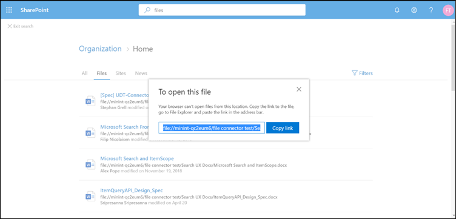

# <a name="file-share-connector"></a><span data-ttu-id="7bdbc-103">Connecteur de partage de fichiers</span><span class="sxs-lookup"><span data-stu-id="7bdbc-103">File share connector</span></span>

<span data-ttu-id="7bdbc-104">Avec le connecteur de partage de fichiers, les utilisateurs de votre organisation peuvent effectuer des recherches dans des partages de fichiers locaux.</span><span class="sxs-lookup"><span data-stu-id="7bdbc-104">With the File share connector, users in your organization can search on-premises file shares.</span></span> <span data-ttu-id="7bdbc-105">Les résultats de la recherche de ces partages sont fusionnés avec les résultats provenant de SharePoint et de Microsoft OneDrive entreprise.</span><span class="sxs-lookup"><span data-stu-id="7bdbc-105">The search results from these shares merge with the results from SharePoint and Microsoft OneDrive for Business.</span></span>

<span data-ttu-id="7bdbc-106">Cet article est destiné aux administrateurs 365 de Microsoft ou toute personne qui configure, exécute et surveille un connecteur de partage de fichiers.</span><span class="sxs-lookup"><span data-stu-id="7bdbc-106">This article is for Microsoft 365 administrators or anyone who configures, runs, and monitors a File share connector.</span></span> <span data-ttu-id="7bdbc-107">Elle explique comment configurer les fonctionnalités de connecteur et de connecteur, ainsi que les restrictions et les techniques de résolution des problèmes.</span><span class="sxs-lookup"><span data-stu-id="7bdbc-107">It explains how to configure your connector and connector capabilities, limitations, and troubleshooting techniques.</span></span>

## <a name="install-a-data-gateway"></a><span data-ttu-id="7bdbc-108">Installer une passerelle de données</span><span class="sxs-lookup"><span data-stu-id="7bdbc-108">Install a data gateway</span></span>
<span data-ttu-id="7bdbc-109">Pour accéder à vos données tierces, vous devez installer et configurer une passerelle Microsoft Power BI.</span><span class="sxs-lookup"><span data-stu-id="7bdbc-109">In order to access your third-party data, you must install and configure a Microsoft Power BI gateway.</span></span> <span data-ttu-id="7bdbc-110">Pour en savoir plus, consultez la rubrique [Install an on-](https://docs.microsoft.com/data-integration/gateway/service-gateway-install) premises Gateway.</span><span class="sxs-lookup"><span data-stu-id="7bdbc-110">See [Install an on-premises gateway](https://docs.microsoft.com/data-integration/gateway/service-gateway-install) to learn more.</span></span>  

## <a name="content-requirements"></a><span data-ttu-id="7bdbc-111">Exigences en matière de contenu</span><span class="sxs-lookup"><span data-stu-id="7bdbc-111">Content requirements</span></span>
<span data-ttu-id="7bdbc-112">**Types de fichiers**.</span><span class="sxs-lookup"><span data-stu-id="7bdbc-112">**File types**.</span></span> <span data-ttu-id="7bdbc-113">Seuls les fichiers de ces formats peuvent être indexés et recherchés : DOC, DOCM, DOCX, DOT, DOTX, EML, GIF, HTML, JPEG, MHT, MHTML, MSG, NWS, OBD, OBT, ODP, ODS, ODT, ONE, PDF, POT, PPS, PPT, PPTM, PPTX, TXT, XLB, XLC, XLSB, XLS, XLSX, XLT, XLXM, XML, XPS et ZIP.</span><span class="sxs-lookup"><span data-stu-id="7bdbc-113">Only files in these formats can be indexed and searched: DOC, DOCM, DOCX, DOT, DOTX, EML, GIF, HTML, JPEG, MHT, MHTML, MSG, NWS, OBD, OBT, ODP, ODS, ODT, ONE, PDF, POT, PPS, PPT, PPTM, PPTX, TXT, XLB, XLC, XLSB, XLS, XLSX, XLT, XLXM, XML, XPS, and ZIP.</span></span> <span data-ttu-id="7bdbc-114">Seul le contenu textuel de ces formats est indexé.</span><span class="sxs-lookup"><span data-stu-id="7bdbc-114">Only the textual content of these formats is indexed.</span></span> <span data-ttu-id="7bdbc-115">Tout le contenu multimédia est ignoré.</span><span class="sxs-lookup"><span data-stu-id="7bdbc-115">All multimedia content is ignored.</span></span>
 
<span data-ttu-id="7bdbc-116">**Limites de taille de fichier**.</span><span class="sxs-lookup"><span data-stu-id="7bdbc-116">**File size limits**.</span></span> <span data-ttu-id="7bdbc-117">La taille maximale de fichier prise en charge est de 100 Mo.</span><span class="sxs-lookup"><span data-stu-id="7bdbc-117">The maximum supported file size is 100 MB.</span></span> <span data-ttu-id="7bdbc-118">Les fichiers qui dépassent 100 Mo sont ignorés de l’indexation.</span><span class="sxs-lookup"><span data-stu-id="7bdbc-118">Files that exceed 100 MB are skipped from indexing.</span></span> <span data-ttu-id="7bdbc-119">La limite de taille post-traitée maximale est de 4 Mo.</span><span class="sxs-lookup"><span data-stu-id="7bdbc-119">The maximum post-processed size limit is 4 MB.</span></span> <span data-ttu-id="7bdbc-120">Le traitement s’arrête lorsque la taille d’un fichier atteint 4 Mo.</span><span class="sxs-lookup"><span data-stu-id="7bdbc-120">Processing stops when a file's size reaches 4 MB.</span></span> <span data-ttu-id="7bdbc-121">Par conséquent, il se peut que certaines expressions présentes dans le fichier ne fonctionnent pas pour la recherche.</span><span class="sxs-lookup"><span data-stu-id="7bdbc-121">As a result, some phrases present in the file might not work for search.</span></span>

## <a name="connect-to-a-data-source"></a><span data-ttu-id="7bdbc-122">Se connecter à une source de données</span><span class="sxs-lookup"><span data-stu-id="7bdbc-122">Connect to a data source</span></span>
<span data-ttu-id="7bdbc-123">Sur la page **se connecter à la source de données** , sélectionnez **partage de fichiers** et indiquez le nom, l’ID de connexion et la description.</span><span class="sxs-lookup"><span data-stu-id="7bdbc-123">On the **Connect to data source** page, select **File share** and provide the name, connection ID, and description.</span></span> <span data-ttu-id="7bdbc-124">Sur la page suivante, indiquez le chemin d’accès au partage de fichiers et sélectionnez votre passerelle précédemment installée.</span><span class="sxs-lookup"><span data-stu-id="7bdbc-124">In the next page, provide the path to the file share and select your previously installed gateway.</span></span> <span data-ttu-id="7bdbc-125">Entrez les informations d’identification d’un compte d’utilisateur Windows avec accès en lecture à tous les fichiers du partage.</span><span class="sxs-lookup"><span data-stu-id="7bdbc-125">Enter the credentials for a Windows user account with read access to all the files in the share.</span></span> <span data-ttu-id="7bdbc-126">Passez en revue les autres paramètres et publiez la connexion.</span><span class="sxs-lookup"><span data-stu-id="7bdbc-126">Go through the rest of the settings and publish the connection.</span></span>

## <a name="set-the-refresh-schedule"></a><span data-ttu-id="7bdbc-127">Définir la planification d’actualisation</span><span class="sxs-lookup"><span data-stu-id="7bdbc-127">Set the refresh schedule</span></span>
<span data-ttu-id="7bdbc-128">L’intervalle de planification des actualisations par défaut recommandé est de 15 minutes, mais vous pouvez le remplacer par un autre intervalle de votre choix.</span><span class="sxs-lookup"><span data-stu-id="7bdbc-128">The recommended default refresh schedule interval is 15 minutes, but you can change it to another interval that you prefer.</span></span>

## <a name="set-up-your-search-results-page"></a><span data-ttu-id="7bdbc-129">Configurer votre page de résultats de recherche</span><span class="sxs-lookup"><span data-stu-id="7bdbc-129">Set up your search results page</span></span>
<span data-ttu-id="7bdbc-130">Pour afficher les résultats d’une connexion de fichiers différente dans les onglets **tous** et **fichiers** , vous devez configurer une page de résultats de moteur de recherche SharePoint :</span><span class="sxs-lookup"><span data-stu-id="7bdbc-130">To display different file connection results in the **All** and **Files** tabs, you need to set up a SharePoint search engine results page:</span></span>
- <span data-ttu-id="7bdbc-131">Le tableau **tous** présente les résultats combinés à partir de vos connexions au fichier, des fichiers SharePoint, des fichiers OneDrive et des sites SharePoint.</span><span class="sxs-lookup"><span data-stu-id="7bdbc-131">The **All** table shows combined results from your file connections, SharePoint files, OneDrive files, and SharePoint sites.</span></span> 
- <span data-ttu-id="7bdbc-132">Le fichier vertical affiche tous les résultats **des fichiers de** vos connexions, SharePoint et OneDrive.</span><span class="sxs-lookup"><span data-stu-id="7bdbc-132">The **Files** vertical shows all file results from your connections, SharePoint, and OneDrive.</span></span>
<span data-ttu-id="7bdbc-133">Les résultats des connexions de fichiers sont ajoutés aux résultats déjà existants dans les deux secteurs (tous) et **tous** les **fichiers (fichiers** ).</span><span class="sxs-lookup"><span data-stu-id="7bdbc-133">Results from file connections are added to already existing results in both the **All** and **Files** verticals.</span></span>

<span data-ttu-id="7bdbc-134">Pour configurer votre page de résultats de recherche, procédez comme suit :</span><span class="sxs-lookup"><span data-stu-id="7bdbc-134">To set up your search results page, take these steps:</span></span>
1. <span data-ttu-id="7bdbc-135">Créer une collection de sites SharePoint avec une page de recherche moderne.</span><span class="sxs-lookup"><span data-stu-id="7bdbc-135">Create a SharePoint site collection with a modern search page.</span></span>

2. <span data-ttu-id="7bdbc-136">Installez [SharePoint Online Management Shell](https://www.microsoft.com/download/details.aspx?id=35588).</span><span class="sxs-lookup"><span data-stu-id="7bdbc-136">Install a [SharePoint Online Management Shell](https://www.microsoft.com/download/details.aspx?id=35588).</span></span>

3. <span data-ttu-id="7bdbc-137">Ouvrez SharePoint Online Management Shell en tant qu’administrateur et importez le module **Microsoft. SharePoint. client. dll** présent à l’adresse `C:\Windows\Microsoft.NET\assembly\GAC_MSIL\Microsoft.SharePoint.Client\v4.0_16.0.0.0__71e9bce111e9429c\Microsoft.SharePoint.Client.dll`.</span><span class="sxs-lookup"><span data-stu-id="7bdbc-137">Open SharePoint Online Management Shell as an administrator and import the **Microsoft.SharePoint.Client.dll** module present at `C:\Windows\Microsoft.NET\assembly\GAC_MSIL\Microsoft.SharePoint.Client\v4.0_16.0.0.0__71e9bce111e9429c\Microsoft.SharePoint.Client.dll`.</span></span>

> [!NOTE]
> <span data-ttu-id="7bdbc-138">Ce chemin d’accès peut ne pas être le même pour tous les utilisateurs.</span><span class="sxs-lookup"><span data-stu-id="7bdbc-138">This path might not be the same for all users.</span></span>

<span data-ttu-id="7bdbc-139">Pour importer le module, exécutez la commande suivante dans SharePoint Online Management Shell :</span><span class="sxs-lookup"><span data-stu-id="7bdbc-139">To import the module, run this command in SharePoint Online Management Shell:</span></span>
```bash
Import-Module "C:\Windows\Microsoft.NET\assembly\GAC_MSIL\Microsoft.SharePoint.Client\v4.0_16.0.0.0__71e9bce111e9429c\Microsoft.SharePoint.Client.dll" 
```

4. <span data-ttu-id="7bdbc-140">À présent, exécutez le script suivant :</span><span class="sxs-lookup"><span data-stu-id="7bdbc-140">Now run this script:</span></span>
```bash
$orgName = Read-Host -prompt 'Please enter your org name'
$userName = Read-Host -prompt 'Enter user name'
$userCreds = Get-Credential -UserName $userName -Message "Type the password"
Connect-SPOService -Url https://$orgName-admin.sharepoint.com -Credential $userCreds

$url = Read-Host -Prompt 'Please enter the site url'
$site = Get-SPOSite -Identity $url
Set-SPOSite $url -DenyAddAndCustomizePages 0

$pwd = Read-Host -AsSecureString 'type the password'
$context = New-Object Microsoft.SharePoint.Client.ClientContext($url)
$credential = New-Object Microsoft.SharePoint.Client.SharePointOnlineCredentials($userName, $pwd)
$context.Credentials = $credential
$web = $context.Web
$context.Load($web)
$web.AllProperties["AllVerticalContent"] = "Combined"
$web.Update()
$context.ExecuteQuery()
$web.AllProperties["FilesVerticalContent"] = "ConnectorsOnly"
$web.Update()
$context.ExecuteQuery()
Set-SPOSite $url -DenyAddAndCustomizePages 1

Write-Host "Success" -ForegroundColor Cyan
Read-Host -Prompt 'Press enter to exit'
```

5. <span data-ttu-id="7bdbc-141">Entrez les valeurs requises dans PowerShell, telles que le nom de l’organisation, le nom d’utilisateur, le mot de passe et l’URL du site.</span><span class="sxs-lookup"><span data-stu-id="7bdbc-141">Enter the required values in PowerShell, such as organization name, username, password, and site URL.</span></span> <span data-ttu-id="7bdbc-142">Par **exemple**, si vos informations d’identification d’administrateur `admin@a830edad9050849823J19081300.onmicrosoft.com`sont, le nom de votre organisation est **a830edad9050849823J19081300**et l’URL de `https:// a830edad9050849823J19081300.sharepoint.com`votre site est.</span><span class="sxs-lookup"><span data-stu-id="7bdbc-142">As an **example**, if your admin credentials are `admin@a830edad9050849823J19081300.onmicrosoft.com`, then your organization name is **a830edad9050849823J19081300**, and your site URL is `https:// a830edad9050849823J19081300.sharepoint.com`.</span></span>

> [!NOTE]
> <span data-ttu-id="7bdbc-143">Le paramètre **AllProperties** ne peut être réalisé qu’au niveau d’une collection de sites (site teams/comms).</span><span class="sxs-lookup"><span data-stu-id="7bdbc-143">The **AllProperties** setting can only be done at a site collection level (Teams/Comms site).</span></span>

6. <span data-ttu-id="7bdbc-144">À présent, vous pouvez rechercher des fichiers indexés et afficher les résultats dans les onglets **tous** et **fichiers** .</span><span class="sxs-lookup"><span data-stu-id="7bdbc-144">Now you can search for indexed files and see results in both the **All** and **Files** tabs.</span></span>

## <a name="search-for-file-share-content-in-the-search-results-page"></a><span data-ttu-id="7bdbc-145">Rechercher du contenu de partage de fichiers dans la page des résultats de la recherche</span><span class="sxs-lookup"><span data-stu-id="7bdbc-145">Search for file share content in the search results page</span></span>
<span data-ttu-id="7bdbc-146">Pour rechercher du contenu indexé, accédez à la page d’accueil SharePoint de votre client de test.</span><span class="sxs-lookup"><span data-stu-id="7bdbc-146">To search for indexed content, go to the SharePoint home page of your test tenant.</span></span> <span data-ttu-id="7bdbc-147">Les résultats s’affichent dans les onglets **tous** et **fichiers** .</span><span class="sxs-lookup"><span data-stu-id="7bdbc-147">Results will be displayed in the **All** and **Files** tabs.</span></span>

<span data-ttu-id="7bdbc-148">En raison des restrictions du navigateur, vous ne pouvez pas sélectionner un fichier de résultats pour afficher ou ouvrir des fichiers à partir de recherches de partage de fichiers locales.</span><span class="sxs-lookup"><span data-stu-id="7bdbc-148">Because of browser restrictions, you can't select a file result to view or open files from local file share searches.</span></span> <span data-ttu-id="7bdbc-149">Pour ouvrir ces fichiers, copiez le lien du résultat du fichier et collez-le dans la barre d’adresses du navigateur de votre système.</span><span class="sxs-lookup"><span data-stu-id="7bdbc-149">To open these files, copy the file result's link and paste it into the address bar of your system's browser.</span></span> <span data-ttu-id="7bdbc-150">Pour Windows, utilisez l’Explorateur Windows.</span><span class="sxs-lookup"><span data-stu-id="7bdbc-150">For Windows, use Windows Explorer.</span></span> <span data-ttu-id="7bdbc-151">Vous pouvez ensuite ouvrir le fichier sur votre système.</span><span class="sxs-lookup"><span data-stu-id="7bdbc-151">Then you can open the file on your system.</span></span>



## <a name="troubleshooting"></a><span data-ttu-id="7bdbc-153">Résolution des problèmes</span><span class="sxs-lookup"><span data-stu-id="7bdbc-153">Troubleshooting</span></span>
<span data-ttu-id="7bdbc-154">Si une connexion est mal rencontrée, son statut indique **failed**.</span><span class="sxs-lookup"><span data-stu-id="7bdbc-154">If something is critically wrong with a connection, its status shows as **failed**.</span></span> <span data-ttu-id="7bdbc-155">Pour plus d’informations sur les trois types d’erreurs, accédez à la page Détails de l' **erreur** et sélectionnez la connexion ayant échoué.</span><span class="sxs-lookup"><span data-stu-id="7bdbc-155">To get more information on the three types of errors, go to the **error details** page and select the failing connection.</span></span> <span data-ttu-id="7bdbc-156">Pour en savoir plus, consultez [la rubrique Manage Your Connector](manage-connector.md) .</span><span class="sxs-lookup"><span data-stu-id="7bdbc-156">See [Manage your connector](manage-connector.md) to learn more.</span></span>
1. <span data-ttu-id="7bdbc-157">**Passerelle inaccessible (code d’erreur : 11)**.</span><span class="sxs-lookup"><span data-stu-id="7bdbc-157">**Gateway not reachable (error code: 11)**.</span></span> <span data-ttu-id="7bdbc-158">L’ordinateur de passerelle pour la connexion est inactif.</span><span class="sxs-lookup"><span data-stu-id="7bdbc-158">The gateway machine for the connection is down.</span></span> <span data-ttu-id="7bdbc-159">Vérifiez si le processus Microsoft Power BI s’exécute sur l’ordinateur de passerelle.</span><span class="sxs-lookup"><span data-stu-id="7bdbc-159">Verify if the Microsoft Power BI process runs on the gateway machine.</span></span>
2. <span data-ttu-id="7bdbc-160">**Erreur d’authentification (code d’erreur : 12)**.</span><span class="sxs-lookup"><span data-stu-id="7bdbc-160">**Authentication error (error code: 12)**.</span></span> <span data-ttu-id="7bdbc-161">Les informations d’identification utilisées pour la création de la connexion ont expiré ou ne sont plus valides.</span><span class="sxs-lookup"><span data-stu-id="7bdbc-161">The credentials that were used for creating the connection expired or are no longer valid.</span></span> <span data-ttu-id="7bdbc-162">Pour résoudre cette erreur, entrez des informations d’identification valides.</span><span class="sxs-lookup"><span data-stu-id="7bdbc-162">To resolve this error, enter valid credentials.</span></span>
3. <span data-ttu-id="7bdbc-163">**Erreur interne (code d’erreur : autre que 11 ou 12)**.</span><span class="sxs-lookup"><span data-stu-id="7bdbc-163">**Internal error (error code: anything other than 11 or 12)**.</span></span> <span data-ttu-id="7bdbc-164">Il y a une erreur dans l’infrastructure connecteur.</span><span class="sxs-lookup"><span data-stu-id="7bdbc-164">There's an error in the connector infrastructure.</span></span> <span data-ttu-id="7bdbc-165">Consultez l’article sur les [Commentaires](connectors-feedback.md) pour savoir comment signaler ces erreurs.</span><span class="sxs-lookup"><span data-stu-id="7bdbc-165">See the [Feedback](connectors-feedback.md) article to find out how to report these errors.</span></span>

## <a name="limitations"></a><span data-ttu-id="7bdbc-166">Limites</span><span class="sxs-lookup"><span data-stu-id="7bdbc-166">Limitations</span></span>
<span data-ttu-id="7bdbc-167">Le connecteur de partage de fichiers présente ces limitations dans la version d’évaluation :</span><span class="sxs-lookup"><span data-stu-id="7bdbc-167">The File share connector has these limitations in the preview release:</span></span>
* <span data-ttu-id="7bdbc-168">Vous pouvez uniquement indexer les fichiers avec des propriétés fixes, pas les fichiers avec des propriétés personnalisées.</span><span class="sxs-lookup"><span data-stu-id="7bdbc-168">You can only index files with fixed properties, not files with custom properties.</span></span>
* <span data-ttu-id="7bdbc-169">Les listes de contrôle d’accès de partage de fichiers ne sont actuellement pas prises en charge.</span><span class="sxs-lookup"><span data-stu-id="7bdbc-169">File share Access Control Lists (ACLs) aren't currently supported.</span></span> <span data-ttu-id="7bdbc-170">Seules les listes de Contrã’le d’accès NTFS fichiers sont prises en charge.</span><span class="sxs-lookup"><span data-stu-id="7bdbc-170">Only file NTFS ACLs are supported.</span></span>
* <span data-ttu-id="7bdbc-171">Les identités externes ne sont pas prises en charge.</span><span class="sxs-lookup"><span data-stu-id="7bdbc-171">External identities aren't supported.</span></span> <span data-ttu-id="7bdbc-172">Ils doivent être mappés à des identités Azure Active Directory.</span><span class="sxs-lookup"><span data-stu-id="7bdbc-172">They must be mapped to Azure Active Directory identities.</span></span>
