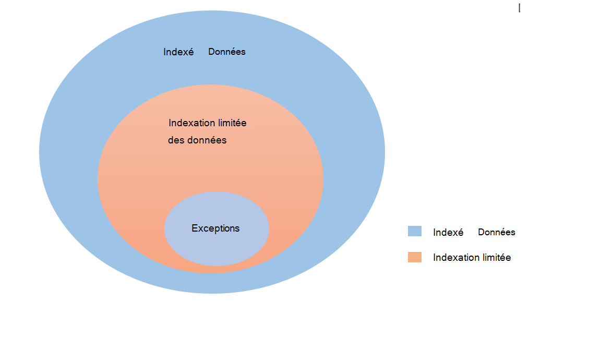
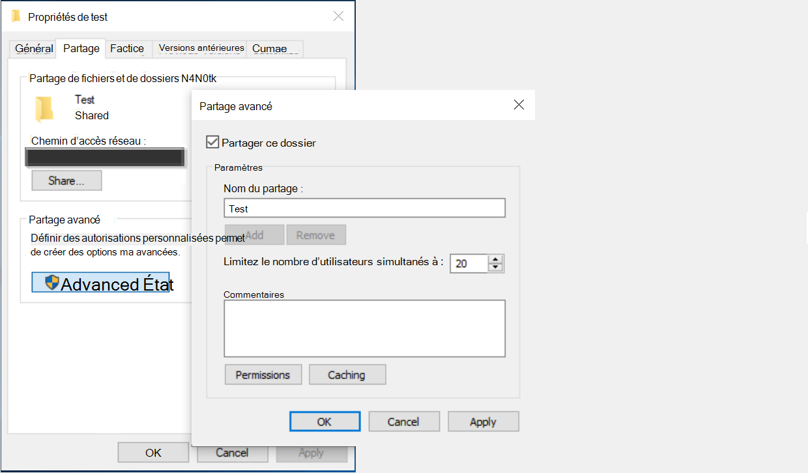

<!---Previous ms.author: rusamai --->

# Connecteur d’Graph partage de fichiers

Le connecteur de partage de Graph permet aux utilisateurs de votre organisation de rechercher des partages de fichiers Windows locaux.

> [!NOTE]
> Lisez [**l’article**](configure-connector.md) Installation de votre connecteur Graph pour comprendre le processus d’installation Graph des connecteurs.

## Avant de commencer

### Installer l’agent Graph connecteur d’installation

Pour indexer vos partages Windows de fichiers, vous devez installer et inscrire l’agent Graph connecteur. Pour plus [d’informations, voir Installer Graph’agent](graph-connector-agent.md) connecteur de connexion.  

### Exigences en matière de contenu

### Types de fichiers

Le contenu des formats suivants peut être indexé et recherché : DOC, DOCM, DOCX, DOTX, EML, GIF, HTML, JPEG, MHT, MHTML, MSG, NWS, OBD, OBT, ODP, ODS, ODT, ONE, PDF, POT, PPS, PPT, PPTM, PPTX, TXT, XLB, XLC, XLSB, XLSX, XLSX, XLT, XLXM, XML, XPS et ZIP. Seul le contenu textuel de ces formats est indexé. Tout le contenu multimédia est ignoré. Pour tout fichier qui n’appartient pas à ce format, les métadonnées seules sont indexées.

### Limites de taille de fichier

La taille maximale de fichier prise en charge est de 100 Mo. Les fichiers dont la valeur est supérieure à 100 Mo ne sont pas indexés. La taille limite post-traitée maximale est de 4 Mo. Le traitement s’arrête lorsque la taille d’un fichier atteint 4 Mo. Par conséquent, certaines expressions présentes dans le fichier peuvent ne pas fonctionner pour la recherche.

## Étape 1 : Ajouter un connecteur Graph dans le Centre d’administration Microsoft 365

Suivez les [instructions d’installation générales.](./configure-connector.md)
<!---If the above phrase does not apply, delete it and insert specific details for your data source that are different from general setup instructions.-->

## Étape 2 : Nommer la connexion

Suivez les [instructions d’installation générales.](./configure-connector.md)
<!---If the above phrase does not apply, delete it and insert specific details for your data source that are different from general setup instructions.-->

## Étape 3 : Configurer les paramètres de connexion

Dans la page **Connecter** source de  données, sélectionnez Partage de fichiers et indiquez le nom, l’ID de connexion et la description. Sur la page suivante, fournissez le chemin d’accès au partage de fichiers et sélectionnez votre agent de connecteur Graph précédemment installé. Entrez les informations d’identification [d’un Windows](https://microsoft.com/windows) d’utilisateur Microsoft avec un accès en lecture à tous les fichiers du partage de fichiers.

### Conserver l’heure du dernier accès

Lorsque le connecteur tente d’analyser un fichier, le champ « Heure du dernier accès » dans ses métadonnées est mis à jour. Si vous dépendez de ce champ pour les solutions d’archivage et de sauvegarde et que vous ne souhaitez pas le mettre à jour lorsque le connecteur y accède, vous pouvez configurer cette option dans la page **Paramètres** avancés.

## Étape 4 : Limites pour l’indexation de fichiers

Lors de la configuration d’une connexion de partage de fichiers, l’administrateur peut limiter l’indexation des fichiers et des dossiers. Il existe plusieurs façons de le faire :

#### Basé sur les types de fichiers

Seul le contenu textuel de ces formats est indexé : DOC, DOCM, DOCX, DOTX, EML, HTML, MHT, MHTML, MSG, NWS, OBD, OBT, ODP, ODT, ODT, ONE, PDF, POT, PPS, PPT, PPTM, PPTX, TXT, XLB, XLC, XLSB, XLS, XLSX, XLT, XLXM, XML, XPS. Pour les fichiers multimédias et les fichiers qui n’appartiennent pas à ce format, les seules métadonnées sont indexées.

#### En fonction de la date de dernière modification ou du nombre de jours depuis la dernière modification

#### Chemin d’accès réseau complet du fichier/dossier ou de l’expression régulière pour limiter l’indexation 

Dans le chemin d’accès réseau, utilisez le caractère d’échappatoire ( \\ ) avant les caractères spéciaux tels que \\ . Exemple : pour le chemin \\ \\ d’accès CONTOSO FILE SHAREDFOLDER, la façon correcte d’entrer est \\ \\ \\ \\ \\ \\ CONTOSO \\ \\ FILE \\ \\ SHAREDFOLDER

Vous pouvez trouver les règles d’écriture d’expression [régulière ici](https://docs.microsoft.com/dotnet/standard/base-types/regular-expression-language-quick-reference)

L’administrateur aurait également la possibilité d’accorder une exception à la règle de limite. La priorité de la règle d’exception a priorité sur les règles de limite. De la même manière, une exception peut être définie en donnant un chemin d’accès au dossier/fichier pour les éléments que nous voulons inclure dans l’indexation.

## Étape 5 : Gérer les autorisations de recherche

Vous pouvez restreindre l’autorisation de rechercher n’importe quel fichier en fonction des listes de contrôle d’accès de partage ou des listes de contrôle d’accès NTFS (New Technology File System), en sélectionnant l’option souhaitée dans la page Gérer les **autorisations de** recherche. Les comptes et groupes d’utilisateurs fournis dans ces listes de contrôle d’accès doivent être gérés par Active Directory (AD). Si vous utilisez un autre système pour la gestion des comptes d’utilisateurs, vous pouvez sélectionner l’option « tout le monde » qui permet aux utilisateurs de rechercher tous les fichiers sans restrictions d’accès. Toutefois, lorsque les utilisateurs tentent d’ouvrir le fichier, les contrôles d’accès définies au niveau de la source s’appliquent.

Notez que windows fournit par défaut l’autorisation « Lecture » à « Tout le monde » dans les AAL de partage lorsqu’un dossier est partagé sur le réseau. Par extension, si vous choisissez partager des ACA dans Gérer les autorisations de recherche, les **utilisateurs** pourront rechercher tous les fichiers. Si vous souhaitez restreindre l’accès, supprimez l’accès « Lecture » pour « Tout le monde » dans les partages de fichiers et fournissez l’accès uniquement aux utilisateurs et groupes souhaités. Le connecteur lit ensuite ces restrictions d’accès et les applique à la recherche.

Vous pouvez choisir les ACA de partage uniquement si le chemin d’accès au partage que vous avez fourni suit le format de chemin d’accès UNC. Vous pouvez créer un chemin d’accès au format UNC en allant à « Partage avancé » sous l’option « Partage ».

## Étape 6 : Attribuer des étiquettes de propriété

Suivez les [instructions d’installation générales.](./configure-connector.md)
<!---If the above phrase does not apply, delete it and insert specific details for your data source that are different from general setup instructions.-->

## Étape 7 : Gérer le schéma

Suivez les [instructions d’installation générales.](./configure-connector.md)
<!---If the above phrase does not apply, delete it and insert specific details for your data source that are different from general setup instructions.-->

## Étape 8 : Choisir les paramètres d’actualisation

Suivez les [instructions d’installation générales.](./configure-connector.md)
<!---If the above phrase does not apply, delete it and insert specific details for your data source that are different from general setup instructions.-->

## Étape 9 : Examiner la connexion

Suivez les [instructions d’installation générales.](./configure-connector.md)
<!---If the above phrase does not apply, delete it and insert specific details for your data source that are different from general setup 
instructions.-->

<!---## Troubleshooting-->
<!---Insert troubleshooting recommendations for this data source-->

<!---## Limitations-->
<!---Insert limitations for this data source-->
