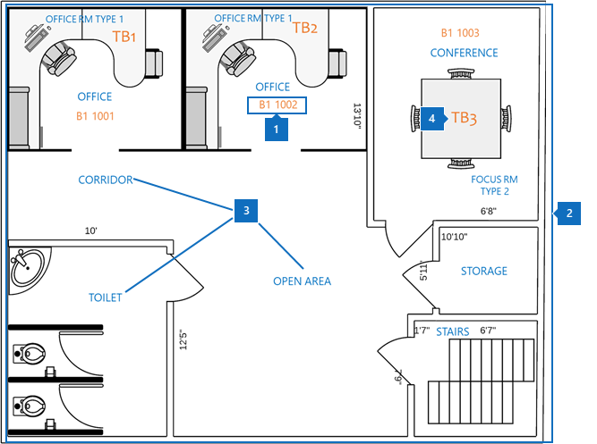
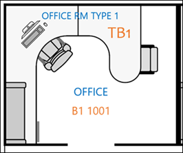
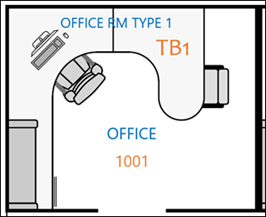
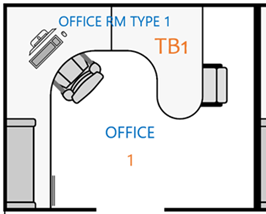

# Meilleures pratiques pour les plans d’étage de Microsoft Search

Pour implémenter correctement les plans d’étage de Microsoft Search, vous devez coordonner trois types de données :

- **Génération des données d’emplacement**: quel format et comment ajouter ?
- **Plan d’étage plan au format DWG**: comment afficher et quelles données doivent-elles contenir pour une réussite maximale ?
- **Emplacement du Bureau de l’employé dans [Azure Active Directory (Azure AD)](https://azure.microsoft.com/services/active-directory/)**: quel format utiliser et comment ajouter ?  

Les meilleures pratiques pour le déploiement des plans d’étage de Microsoft Search sont également décrites dans les sections suivantes.

## Création des données d’emplacement
Avant d’ajouter des plans d’étage, vous devez ajouter vos bâtiments aux emplacements de recherche Microsoft. Fournissez les données de création requises suivantes :

|Génération des données requises  |Exemple  |
|---------|---------|
|Nom     |    Bâtiment 1, New York City     |
|Rue     |     123 toute Avenue, New York, NY 10118  |
|Latitude-Longitude (facultatif)   |    40,760539,-73,975341      |
|Mots clés     |    Bureau de New York, bâtiment 1, bureau principal, siège social     |

Vous pouvez ajouter plusieurs bâtiments à la fois à l’aide de la fonctionnalité d' **importation** de l’onglet **emplacements** au lieu d’ajouter un par un. Avec la fonctionnalité d' **importation** , vous pouvez spécifier la latitude-longitude. Pour plus d’informations, consultez la rubrique [Manage locations](manage-locations.md).

## Plan d’étage plan au format DWG
Pour créer des cartes dans Microsoft Search, vous devez télécharger des plans d’étage au format DWG avec des informations spécifiques. Pour en savoir plus sur la création et l’affichage des fichiers au format DWG, consultez la rubrique [DWG visualisers](https://www.autodesk.in/products/dwg). 

Les cartes de plan d’étage affichent quatre éléments :

1. **Numéros de chambre**: dans l’exemple suivant, les numéros de pièce sont définis comme **B1 1001** et **B1 1002**. **B1** est le code de bâtiment, et **1001** contient le numéro de plancher **1** et le numéro d’Office **001**.
1. **Dispositions de salle**: pour vous aider à clarifier les détails lorsque plusieurs utilisateurs partagent un bureau, vous pouvez définir des mises en page comme les chaises et le bureau.
1. **Types de salle**: certains exemples incluent Office, corridor, zone ouverte et toilettes.
1. **Informations sur les biens**: si les utilisateurs se trouvent dans un espace ouvert, vous pouvez indiquer le bureau auquel ils sont assis. Dans cet exemple, les bureaux sont notés par **TB1** et **TB2**.

Dans ce diagramme, les numéros de salle sont les éléments les plus importants. Ils sont mappés à l’emplacement de bureau d’une personne sur son compte d’utilisateur, comme illustré dans l’image suivante.

Ces informations sont stockées dans [Azure ad](https://azure.microsoft.com/services/active-directory/) dans la propriété **PhysicalDeliveryOfficeName** . Dans le centre d' [administration](https://admin.microsoft.com)365 de Microsoft, il s’agit de la propriété **Office** qui peut être ajoutée **aux utilisateurs actifs**.

### Fichiers DWG
Microsoft Search nécessite des fichiers de plan d’étage en DWG, qui est un format de dessin [AutoCAD](https://www.autodesk.com/autocad) . Les fichiers doivent contenir des données de **disposition** et d' **étiquette** . Les **numéros de salle** représentent les étiquettes les plus importantes pour les plans d’étage.

Nous vous recommandons de créer votre système de numérotation Office avec la méthode de correspondance exacte indiquée dans le tableau suivant. Mais vous n’êtes pas limité à cette étiquette. Par exemple, si l’emplacement du Bureau de l’utilisateur dans [Azure ad](https://azure.microsoft.com/services/active-directory/) est **B1 1001**, vous pouvez étiqueter le numéro de la salle dans le fichier DWG avec l’une des options suivantes.

|Match  |Disposition  |
|---------|---------|
|Correspondance exacte avec l’emplacement du Bureau (recommandé)   **B1 1001**   Code de bâtiment : B1 Plancher : 1  Numéro de la salle : 001    |         |
|Faire correspondre le plancher et le numéro de la salle   **1001** Plancher : 1  Numéro de la salle : 001    |      |
|Respecter uniquement le numéro de la salle   **0,1** Numéro de la salle : 1        |         |

## Emplacement du Bureau du compte d’utilisateur
Pour mapper l’emplacement d’un employé, les numéros de pièce dans les fichiers DWG sont mappés sur les emplacements de bureau dans le compte de l’utilisateur dans [Azure ad](https://azure.microsoft.com/services/active-directory/). La propriété de l' **emplacement** du Bureau doit correspondre aux informations relatives à l’emplacement du bureau dans le fichier DWG.

Le tableau suivant décrit les meilleures pratiques pour le mappage des données de localisation :

|Meilleures pratiques  |Explication |
|---------|---------|
|Incluez le code de bâtiment, le plancher et le numéro de la salle.     |   Ces données vous permettent de faire des correspondances exactes.     |
|Incluez un séparateur après la création des codes et des étages.     |  Séparez les codes de bâtiment et les numéros de salle par un séparateur ou un espace, comme dans les exemples suivants :  B1 1001  B1/1001   B1-1001.   |
|Le numéro de la salle suit toujours le code de construction, l’aile et les informations de plancher.     |  Si le numéro de la salle est **1001**, définissez l’emplacement du Bureau sur **B1 1001**, **B1/1001**ou **B1-1001**.   Si le numéro de la pièce est **F1-001**, définissez l’emplacement du Bureau sur **B1 F1-001** ou **B1/F1-001**.   Si le numéro de la salle est **1**, définissez l’emplacement [Azure AD](https://azure.microsoft.com/services/active-directory/) sur **B1 1001**, **B1/1001**ou **B1-F1-001**.       |
|

## Étapes suivantes
[Gérer les emplacements](manage-locations.md) 
[Gérer les plans d’étage](manage-floorplans.md)