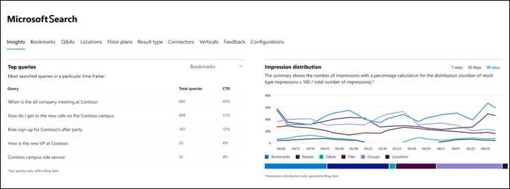
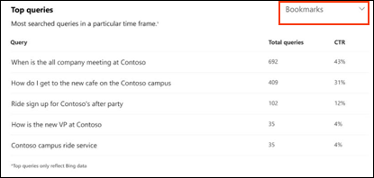
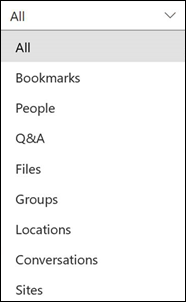
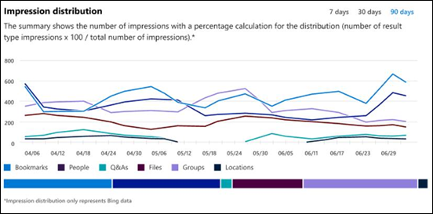

# Rapports de tableau de bord Insights Microsoft SearchMicrosoft Search Insights dashboard reports

Vous pouvez utiliser le tableau de bord Insights de Microsoft Search pour gérer les données Bing de vos réponses publiées.You can use the Microsoft Search insights dashboard to manage the Bing data for your published answers. Il s’agit juste d’une des étapes nécessaires pour [faciliter la recherche de contenu](make-content-easy-to-find.md) pour vos utilisateurs.This is just one of the steps needed to [make content easy to find](make-content-easy-to-find.md) for your users.

Lorsque vous accédez à Microsoft Search pour la première fois dans le centre d’administration Microsoft 365, vous pouvez entrer dans le tableau de bord Insights.When you first go to Microsoft Search in the Microsoft 365 admin center, you'll enter on the Insights dashboard.

Voici les rapports disponibles dans le tableau de bord Insights.Here are the reports that are available on the insights dashboard.

> [!NOTE]
> Les données des rapports représentent uniquement les données Bing.The data in the reports only represents Bing data.

## requêtes les plus courantes ;Top queries

Ce rapport fournit des détails sur les requêtes de recherche Bing les plus à 2000 que les utilisateurs exécutent.This report gives details about the top 2000 Bing search queries that users run. Pour qu’une requête apparaisse dans les **requêtes les plus fréquentes**, la requête doit obtenir au moins trois clics.For a query to appear in **Top queries**, the query must get at least three clicks.

Un taux de clic faible signifie que les utilisateurs ne trouvent pas ce qu’ils cherchent.A low click-through rate (CTR) means that users aren’t finding what they’re looking for.

Vous pouvez choisir différentes vues du rapport en filtrant sur le type de réponse.You can choose different views of the report by filtering on the type of answer. Par exemple, si vous souhaitez simplement afficher les requêtes les plus fréquentes pour les signets, sélectionnez la liste déroulante dans le coin supérieur droit du rapport, puis cliquez sur **signets**.For example if you just want to view the top queries for Bookmarks, select the drop-down in the upper-right corner of the report, and then select **Bookmarks**. Par défaut, **tous les** types de réponses sont affichés.By default, **All** answer types are shown.

## Distribution d’impressionImpression distribution

Ce rapport affiche la distribution de l’impression dans Bing dans le temps pour diverses réponses.This report shows impression distribution in Bing over time for various answers. Voici des exemples de signets, de personnes, de Q&A, de fichiers, d’emplacements, de sites de fichiers, de groupes et de conversations.Examples are bookmarks, people, Q&A, files, locations, file sites, groups, and conversations. 

La distribution d’impression peut aider les administrateurs à comprendre ce que recherche les utilisateurs au cours d’une période spécifiée.Impression Distribution can help admins understand what users look for during a specified period.
