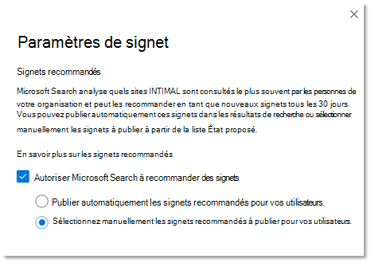

# Gérer des signets

Les signets aident les personnes à trouver rapidement des sites et des outils importants avec une simple recherche. Chaque signet comprend un titre, une URL, un ensemble de mots clés convivial pour déclencher le signet et une catégorie.

## Qu’est-ce qui fait un bon signet ?

Un grand signet possède quatre éléments clés :

1. Titre fort et **informatif.** Ne pas atteindre plus de huit mots ou environ 60 caractères au maximum. Vous souhaitez que vos utilisateurs cliquent sur le titre et visualisent le contenu, mais évitez les clics évidents :
    - Bon : essayez les favoris de cette semaine à partir du menu de la menu. Le titre est clair, concis et intéressant, mais il peut s’agit d’un surpromising.
    - Meilleure : menu de la semaine. N’est pas surpromise ou son comme une ad.
    - Évitez : vous ne pensez pas ce qui arrive au menu de la menu de la semaine. Utilise des clichés clickbait qui ressemblent à une nouvelle.
2. Description **succincte**, d’environ 300 caractères, qui résume l’objectif ou la fonctionnalité de la ressource liée.
3. Collection de mots **clés qui aideront** les personnes à trouver le signet lors de leur recherche. Nous vous suggérons un minimum de cinq mots clés. Incluez également les variantes que les membres de votre organisation peuvent utiliser, par exemple, le menu restaurant, les menus du déjeuner et le menu café.
4. Ensemble utile de **catégories qui** facilitent le tri et le filtrage des signets dans le Centre d’administration. Vos utilisateurs ne voient jamais les catégories affectées.

## Créer des réponses de signet

Dans la [Centre d’administration Microsoft 365,](https://admin.microsoft.com/)sélectionnez [Signets](https://admin.microsoft.com/Adminportal/Home#/MicrosoftSearch/bookmarks) et choisissez la façon dont vous souhaitez créer de nouveaux signets :

- Ajouter des signets
- Importer les SharePoint résultats
- Ajouter des signets par défaut et des signets suggérés
- Importer des signets
- Publier ou réviser les signets recommandés

### Ajouter des signets

Les administrateurs et les éditeurs de recherche peuvent ajouter des signets dans le Centre d’administration Microsoft 365 et les publier ou les enregistrer dans un brouillon. La publication d’un signet actualisé immédiatement l’index de recherche, le rendant immédiatement accessible aux utilisateurs. Vous pouvez également planifier un signet en spécifiant la date et l’heure de sa publication.

- **Publié**: les signets sont disponibles pour les utilisateurs de l’organisation via Recherche Microsoft.
- **Brouillon**: les signets enregistrés en tant que brouillons ne sont pas disponibles pour vos utilisateurs. Utilisez cet état si vous ou d’autres parties prenantes souhaitez consulter ou mettre à jour les signets avant de les publier.
- **Scheduled**: signets qui seront publiés à la date et à l’heure spécifiées.

Vous pouvez utiliser l’extension Recherche Microsoft navigateur créateur de contenu pour ajouter facilement des signets. Il vous suffit d’aller sur le site que vous souhaitez ajouter en tant que signet, puis de cliquer sur Ajouter dans l’extension. Pour installer l’extension pour Microsoft Edge ou Google Chrome, allez dans le [magasin web Chrome](https://chrome.google.com/webstore/detail/microsoft-search-content/nocnablpaoeecfmfnjoheefkogmleipm) et ajoutez-la à votre navigateur.

### Importer les SharePoint résultats

Si votre organisation a installé les résultats promus dans SharePoint, vous pouvez importer les titres, les URL et les descriptions des résultats promus pour votre client dans Recherche Microsoft et mettre le contenu importé à la disposition de vos utilisateurs. Dans la plupart des cas, l’importation SharePoint résultats ne prend que quelques minutes. Si vous importez un grand nombre de résultats, cela peut prendre jusqu’à 48 heures. Il s’agit d’un moyen simple pour remplir rapidement les résultats de la recherche et le rendre plus efficace pour vos utilisateurs. Nous vous recommandons d’utiliser les résultats promus de SharePoint comme référence pour comprendre comment nommer et créer des résultats de recherche pertinents.

### Ajouter des signets par défaut et suggérés

Nous avons inclus des signets suggérés par défaut que vos utilisateurs peuvent trouver utiles, notamment des signets pour les ressources humaines, les avantages, le support technique, la gestion des mots de passe, etc. Examinez, mettez à jour et publiez ces signets suggérés pour fournir des résultats de haute qualité immédiatement à vos utilisateurs.

Vos utilisateurs peuvent également suggérer des signets que vous souhaitez voir ajoutés à l’aide de liens de commentaires dans Recherche Microsoft. Leurs recommandations apparaissent sous la mesure de signets suggérés.

### Importer des signets

Utilisez la fonctionnalité d’importation pour faciliter l’ajout ou la modification d’un grand nombre de signets. Utilisez-le pour :

- Ajout en bloc de signets : ajoutez des détails dans le fichier de modèle de signet, puis importez-le.
- Modification en bloc de signets : exportez des signets vers un fichier .csv, modifiez les détails du signet dans le fichier exporté, puis importez le fichier modifié.

Quelques points importants sur le fichier de modèle :

- Ne modifiez jamais les données dans ces champs *: ID,* *Dernière modification* et Dernière *modification par*
- Si vous incluez *l’ID* d’un signet existant, il sera remplacé par les informations dans le fichier d’importation.
- Pour les signets existants avec le même titre ou url, le signet est mis à jour avec les informations dans le fichier d’importation.
- Certains champs du fichier modèle ne sont pas obligatoires, et les champs obligatoires varient en fonction de l’état du signet.
- En fonction du *champ État,* les signets sont enregistrés en tant que brouillons, suggérés, programmés, exclus, ou ils seront publiés automatiquement.
- Pour les partenaires qui gèrent plusieurs organisations, vous pouvez exporter vos signets d’une organisation et les importer dans une autre. Toutefois, vous devez supprimer les données dans la colonne *ID* avant d’importer.

### Éviter les erreurs d’importation

Une erreur se produit lorsqu’il manque des données obligatoires ou que celles-ci ne sont pas valides. Un fichier journal signalant les lignes et colonnes à corriger est alors généré. Apportez les modifications nécessaires et essayez à nouveau d’importer le fichier. Vous ne pouvez pas importer ou enregistrer de signets tant que toutes les erreurs n’ont pas été résolues.

Pour éviter les erreurs, assurez-vous que votre fichier d’importation est correctement mis en forme et :

- qu’il inclut la ligne d’en-tête ainsi que toutes les colonnes qui se trouvaient dans le modèle d’importation ;
- que l’ordre des colonnes est le même que celui du modèle d’importation.
- Toutes les colonnes ont des valeurs, à l’exception des trois qui peuvent être vides : *ID,* Dernière modification *et* *Dernière modification par*
- La *colonne État* n’est pas vide, il s’agit d’informations requises
- Lors de l’importation de signets publiés, suggérés, programmés ou brouillons, les *colonnes* *Titre,* *URL* et Mots clés sont obligatoires.
- Lors de l’importation de signets exclus, la colonne *URL* est requise

Pour éviter les erreurs de duplication de signet à signet :

- N’utilisez pas d’URL en double pour différents signets. Si une URL est affectée à un autre signet et que vous essayez de l’ajouter à nouveau à partir d’un fichier d’importation, vous obtenez une erreur. Cela s’applique également aux URL en double pour d’autres types de réponses.
- Lors de la mise à jour des signets existants, utilisez la colonne *ID de* signet. Vous pouvez mettre à jour toute autre propriété d’un signet existant, telle que le mot clé ou la description, mais vous devez vous assurer que *l’ID* du signet se trouve dans la colonne appropriée du fichier d’importation. Si *l’ID de* signet est présent, il ne sera pas traité comme un nouvel ajout et ne sera pas traité comme une erreur.

### Publier ou réviser les signets recommandés

Pour réduire l’effort manuel requis pour ajouter des signets, Recherche Microsoft pouvez évaluer les liens SharePoint de votre organisation et recommander des signets. Vous pouvez les consulter avant de les publier ou les configurer pour les publier automatiquement. Aucune configuration n’est nécessaire pour les signets recommandés, ils sont activés et configurés sur autopublish par défaut. Pour modifier ces paramètres à tout moment, sélectionnez Gérer les **signets** pour ouvrir le panneau Paramètres du signet.

Si les signets recommandés sont activés, le moteur de recommandation évalue SharePoint sites de votre organisation pour identifier les liens à trafic élevé. Après une période d’évaluation initiale, les signets recommandés seront publiés automatiquement ou ajoutés à la liste des signets suggérés. Le cycle suivant ,une période d’évaluation de 30 jours suivie de l’autopublishing ou de l’ajout de signets suggérés, commence.

Nous vous suggérons d’examiner régulièrement ces signets publiés automatiquement ou suggérés par les administrateurs ou les éditeurs de recherche. En outre, les signets recommandés n’incluent jamais les URL trouvées dans les signets publiés, suggérés, programmés ou exclus existants.

Pour vous assurer que seuls les utilisateurs ayant accès voient un signet recommandé dans les résultats de travail, une fonctionnalité de vérification d’accès est incluse pour tous les signets recommandés. Les utilisateurs ne voient jamais de signet recommandé pour un site SharePoint’ils ne peuvent pas y accéder. Cette vérification d’accès est  contrôlée par l’option Uniquement les personnes ayant accès à ce lien dans le paramètre Groupes pour chaque signet recommandé.

La vérification d’accès s’arrête si l’URL du signet recommandé ou le paramètre Groupes est modifié.

Pour empêcher le moteur de recommandation de publier ou de suggérer un signet à un site particulier, vous pouvez ajouter l’URL à une liste exclue. Le moteur de recommandation ne publiera jamais ou ne suggèrera jamais de signet pour un site exclu ou une page au sein d’un site exclu.

## À propos des mots clés et des mots clés réservés

Un signet peut avoir plusieurs mots clés et partager le même mot clé, mais le mot clé réservé ne peut pas être partagé. Un mot clé réservé est un terme ou une expression unique qui déclenche un signet spécifique. Un mot clé réservé peut être associé à une seule réponse. Utilisez les mots clés réservés avec parcimonie.

## Questions fréquentes (FAQ)

**Q : Combien de temps faut-il pour qu’un signet soit visible dans Recherche Microsoft après sa publication ?**

**R :**  Un signet est disponible dans la Recherche Microsoft immédiatement après la publication.

**Q : Combien de temps faut-il pour qu’un signet recommandé apparaisse ?**

**R :**  Les signets recommandés apparaissent uniquement dans Recherche Microsoft si les signets recommandés et l’autopublishing sont activés. Pendant la période d’évaluation initiale, le moteur de recommandation évaluera SharePoint trafic pour identifier les signets appropriés, puis les autopublier. Une fois publiés, ils sont immédiatement disponibles Recherche Microsoft.

**Q : Combien de temps faut-il pour qu’un signet supprimé soit supprimé Recherche Microsoft résultats ?**

**R**: Les signets supprimés sont immédiatement supprimés des résultats du travail.

**Q : Est-ce Recherche Microsoft des signets provenant de sites dans toutes les langues ?**

**R**: Oui, Recherche Microsoft pouvez recommander des signets à partir de n’importe quel site SharePoint interne, quelle que soit la langue.

**Q : Puis-je arrêter d’afficher les signets recommandés dans les résultats de la recherche ?**

**R :** Pour arrêter d’afficher les signets recommandés, désélectez le paramètre autopublish dans votre centre d’administration. Les signets recommandés seront ajoutés à la liste des signets suggérés.

**Q : Comment puis-je identifier un signet recommandé dans les résultats de la recherche ou le Centre d’administration ?**

**R :** Dans les résultats de la recherche, les signets recommandés incluent l’expression « Suggéré pour vous » avant l’URL. Dans le Centre d’administration, les signets recommandés auront la valeur Propriétaire « SYSTEM ».

**Q : Comment l’accès à un signet recommandé est-il géré ?**

**R**: Un moteur d’accès conçu par Microsoft détermine si l’URL du signet est accessible à un utilisateur particulier et affiche uniquement le signet recommandé à l’audience correcte. Toutefois, si l’URL est modifiée ou si le paramètre Groupes est modifié, le moteur d’accès ingénieur est désactivé.

**Q : Que se passe-t-il si aucune action n’est prise sur les signets recommandés ajoutés à la liste suggérée ?**

**R**: Pour éviter un volume élevé de signets dans la liste suggérée, un signet recommandé (propriétaire = SYSTÈME) sera purgé après 180 jours.

**Q : Où trouver l’ID d’application pour une application Power App ?**

**R**: Go to the Power Apps site and view the Details pane for the app. En savoir plus sur [l’obtention d’un ID d’application.](/powerapps/maker/canvas-apps/get-sessionid#get-an-app-id)