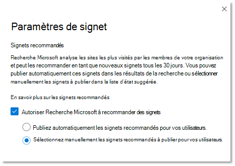

# Gérer des signetsManage bookmarks

Les signets aident les personnes à trouver rapidement des sites et des outils importants avec une simple recherche.Bookmarks help people quickly find important sites and tools with just a search. Chaque signet comprend un titre, une URL, un ensemble de mots clés convivial pour déclencher le signet et une catégorie.Each bookmark includes a title, URL, a set of user-friendly keywords to trigger the bookmark, and a category.

## Qu’est-ce qui fait un bon signet ?What makes a great bookmark

Un grand signet possède quatre éléments clés :A great bookmark has four key elements:

1. Titre fort et **informatif.**A strong, informative **title**. Ne pas atteindre plus de huit mots ou environ 60 caractères au maximum.Aim for no more than eight words or about 60 characters maximum. Vous souhaitez que vos utilisateurs cliquent sur le titre et visualisent le contenu, mais évitez les clics évidents :You want your users to click on the title and view the content, but avoid obvious clickbait:
    - Bon : essayez les favoris de cette semaine à partir du menu de la menu.Good: Try this week’s tasty favorites from the cafeteria menu. Le titre est clair, concis et intéressant, mais peut être surpromising.Title is clear, concise, and interesting, but could be overpromising.
    - Meilleure : menu de la semaine.Better: This week’s cafeteria menu. N’est pas surpromise ou son comme une ad.Doesn't overpromise or sound like an ad.
    - Évitez : vous ne pensez pas ce qui arrive au menu de la menu de la semaine.Avoid: You won’t believe what’s coming to the cafeteria menu this week. Utilise des clichés clickbait qui ressemblent à une nouvelle.Uses clickbait clichés that sound like an ad.
2. Description **succincte**, d’environ 300 caractères, qui résume l’objectif ou la fonctionnalité de la ressource liée.A succinct **description**, about 300 characters, that summarizes the purpose or functionality of the linked resource.
3. Collection de mots **clés qui aideront** les personnes à trouver le signet lors de leur recherche.A collection of **keywords** that will help people find the bookmark when they search. Nous vous suggérons un minimum de cinq mots clés.We suggest a minimum of at least five keywords. Incluez également les variantes que les membres de votre organisation peuvent utiliser, par exemple, le menu restaurant, les menus du déjeuner et le menu café.Also, include variations that people in your organization might use, for example, dining menu, lunch menus, and café menu could all be variations for cafeteria menu.
4. Ensemble utile de **catégories qui** facilitent le tri et le filtrage des signets dans le Centre d’administration.A helpful set of **categories** that make it easier to sort and filter bookmarks in the admin center. Vos utilisateurs ne voient jamais les catégories affectées.Your users never see the assigned categories.

## Créer des réponses de signetCreate bookmark answers

Dans le [Centre d’administration Microsoft 365,](https://admin.microsoft.com/)sélectionnez Signets et choisissez comment créer de nouveaux signets : In the [Microsoft 365 admin center](https://admin.microsoft.com/), go to [Bookmarks](https://admin.microsoft.com/Adminportal/Home#/MicrosoftSearch/bookmarks) and choose how you want to create new bookmarks:

- Ajouter des signetsAdd bookmarks
- Importer les résultats SharePointImport SharePoint results
- Ajouter des signets par défaut et des signets suggérésAdd default bookmarks and suggested bookmarks
- Importer des signetsImport bookmarks
- Publier ou réviser les signets recommandésPublish or review recommended bookmarks

### Ajouter des signetsAdd bookmarks

Les administrateurs et les éditeurs de recherche peuvent ajouter des signets dans le Centre d’administration Microsoft 365 et les publier ou les enregistrer dans un brouillon.Search admins and editors can add bookmarks in the Microsoft 365 admin center and either publish or save them to draft. La publication d’un signet actualisé immédiatement l’index de recherche, le rendant immédiatement accessible aux utilisateurs.Publishing a bookmark immediately refreshes the search index, making it discoverable to users right away. Vous pouvez également planifier un signet en spécifiant la date et l’heure de sa publication.You can also schedule a bookmark by specifying the date and time it will be published.

- **Publié**: les signets sont disponibles pour les utilisateurs de l’organisation via Microsoft Search (recherche Microsoft).**Published**: Bookmarks are available to the organization’s users through Microsoft Search.
- **Brouillon**: les signets enregistrés en tant que brouillons ne sont pas disponibles pour vos utilisateurs.**Draft**: Bookmarks saved as drafts aren't available to your users. Utilisez cet état si vous ou d’autres parties prenantes souhaitez consulter ou mettre à jour les signets avant de les publier.Use this status if you or other stakeholders want to review or update bookmarks before publishing them.
- **Scheduled**: signets qui seront publiés à la date et à l’heure spécifiées.**Scheduled**: Bookmarks that will be published on the specified date and time.

Vous pouvez utiliser l’extension de navigateur créateur de contenu Microsoft Search pour ajouter facilement des signets.You can use the Microsoft Search content creator browser extension to easily add bookmarks. Pour installer l’extension de navigateur, allez sur le site que vous souhaitez ajouter en tant que signet, puis cliquez sur Ajouter dans l’extension.To install the browser extension, go to the site you want to add as a bookmark, and click Add in the extension.
Installez l’extension pour Edge et Chrome :Install the extension for Edge and Chrome:

- Pour Chromium Edge ou Chrome : allez dans le [magasin web Chrome](https://chrome.google.com/webstore/detail/microsoft-search-content/nocnablpaoeecfmfnjoheefkogmleipm) et ajoutez l’extension.For Chromium Edge or Chrome: go to the [Chrome web store](https://chrome.google.com/webstore/detail/microsoft-search-content/nocnablpaoeecfmfnjoheefkogmleipm) and add the extension.
- Pour edge hérité : allez dans le [Microsoft Store](https://www.microsoft.com/p/microsoft-search-content-creator/9nrqdbcbwq55?activetab=pivot:overviewtab) et ajoutez l’extension.For legacy Edge: go to the [Microsoft Store](https://www.microsoft.com/p/microsoft-search-content-creator/9nrqdbcbwq55?activetab=pivot:overviewtab) and add the extension.

### Importer les résultats SharePointImport SharePoint results

Si votre organisation a mis en place des résultats promus dans SharePoint, vous pouvez importer les titres, les URL et les descriptions des résultats promus pour votre client dans Recherche Microsoft et mettre le contenu importé à la disposition de vos utilisateurs.If your organization set up Promoted Results in SharePoint, you can import the titles, URLs, and descriptions from the Promoted Results for your tenant into Microsoft Search and make the imported content available to your users. Dans la plupart des cas, l’importation des résultats SharePoint ne prend que quelques minutes.In most cases, importing SharePoint results takes just a few minutes. Si vous importez un grand nombre de résultats, cela peut prendre jusqu’à 48 heures.If you're importing a large number of results, it may take up to 48 hours. Il s’agit d’un moyen simple pour remplir rapidement les résultats de la recherche et le rendre plus efficace pour vos utilisateurs.This is an easy way to quickly populate search results and make it more effective for your users. Nous vous recommandons d’utiliser des résultats promus de SharePoint comme référence pour comprendre comment nommer et créer des résultats de recherche pertinents.We recommend using promoted results from SharePoint as a reference to understand how to name and create relevant search results.

### Ajouter des signets par défaut et suggérésAdd default and suggested bookmarks

Nous avons inclus des signets suggérés par défaut que vos utilisateurs peuvent trouver utiles, notamment des signets pour les ressources humaines, les avantages, le support technique, la gestion des mots de passe, etc.We've included some default suggested bookmarks that your users may find helpful, including bookmarks for HR, benefits, IT support, password management and more. Examinez, mettez à jour et publiez ces signets suggérés pour fournir des résultats de haute qualité immédiatement à vos utilisateurs.Review, update, and publish these suggested bookmarks to provide high-quality results to your users right away.

Vos utilisateurs peuvent également suggérer des signets que vous souhaitez voir ajoutés à l’aide de liens de commentaires dans Microsoft Search (recherche Microsoft).Your users can also suggest bookmarks that would like to see added using feedback links in Microsoft Search. Leurs recommandations apparaissent sous la mesure de signets suggérés.Their recommendations will appear as suggested bookmarks.

### Importer des signetsImport bookmarks

Utilisez la fonctionnalité d’importation pour faciliter l’ajout ou la modification d’un grand nombre de signets.Use the Import feature to make adding or editing a large number of bookmarks faster and easier. Utilisez-le pour :Use it to:

- Ajout en bloc de signets : ajoutez des détails dans le fichier de modèle de signet, puis importez-le.Bulk add bookmarks: Add details in the bookmark template file, and then import it.
- Modification en bloc de signets : exportez des signets dans un fichier .csv, modifiez les détails du signet dans le fichier exporté, puis importez le fichier modifié.Bulk edit bookmarks: Export bookmarks to a .csv file, edit the bookmark details in the exported file, and then import the edited file.

Quelques points importants sur le fichier de modèle :A few important points about the template file:

- Ne modifiez jamais les données dans ces champs *: ID,* *Dernière modification* et Dernière *modification par*Never edit data in these fields: *ID*, *Last Modified*, and *Last Modified By*
- Si vous incluez *l’ID* d’un signet existant, il sera remplacé par les informations dans le fichier d’importation.If you include the *ID* of an existing bookmark, it will be replaced with the information in the import file.
- Pour les signets existants avec le même titre ou url, le signet est mis à jour avec les informations dans le fichier d’importation.For existing bookmarks with the same title or URL, the bookmark will be updated with information in the import file.
- Certains champs du fichier modèle ne sont pas obligatoires, et les champs obligatoires varient en fonction de l’état du signet.Not all fields in the template file are required and required fields vary depending on the bookmark state.
- En fonction du *champ État,* les signets sont enregistrés en tant que brouillons, suggérés, programmés, exclus, ou ils seront publiés automatiquement.Based on the *State* field, bookmarks will be saved as draft, suggested, scheduled, excluded, or they'll be published automatically.
- Pour les partenaires qui gèrent plusieurs organisations, vous pouvez exporter vos signets d’une organisation et les importer dans une autre.For partners who manage multiple organizations, you can export your bookmarks from one org and import them into another. Toutefois, vous devez supprimer les données dans la colonne *ID* avant d’importer.But you must remove the data in the *ID* column before you import.

### Éviter les erreurs d’importationPrevent import errors

Une erreur se produit lorsqu’il manque des données obligatoires ou que celles-ci ne sont pas valides. Un fichier journal signalant les lignes et colonnes à corriger est alors généré.You'll get an error if any required data is missing or invalid, and a log file is generated with more information about the rows and columns to be corrected. Apportez les modifications nécessaires et essayez à nouveau d’importer le fichier.Make necessary edits and try importing the file again. Vous ne pouvez pas importer ou enregistrer de signets tant que toutes les erreurs n’ont pas été résolues.You can't import or save any bookmarks until all errors are resolved.

Pour éviter les erreurs, assurez-vous que votre fichier d’importation est correctement mis en forme et :To prevent errors, make sure your import file is properly formatted and:

- qu’il inclut la ligne d’en-tête ainsi que toutes les colonnes qui se trouvaient dans le modèle d’importation ;Includes the header row and all the columns that were in the import template
- que l’ordre des colonnes est le même que celui du modèle d’importation.The column order is the same as the import template
- Toutes les colonnes ont des valeurs, à l’exception des trois qui peuvent être vides : *ID,* Dernière modification *et* *Dernière modification par*All columns have values, except the three that can be empty: *ID*, *Last Modified*, and *Last Modified By*
- La *colonne État* n’est pas vide, il s’agit d’informations requisesThe *State* column isn't empty, it's required information
- Lors de l’importation de signets publiés, suggérés, programmés ou brouillons, les *colonnes* *Titre,* *URL* et Mots clés sont obligatoires.When importing Published, Suggested, Scheduled, or Draft bookmarks, the *Title*, *URL*, and *Keywords* columns are required
- Lors de l’importation de signets exclus, la colonne *URL* est requiseWhen importing Excluded bookmarks, the *URL* column is required

Pour éviter les erreurs de duplication de signet à signet :To prevent bookmark-to-bookmark duplication errors:

- N’utilisez pas d’URL en double pour différents signets.Don't use duplicate URLS for different bookmarks. Si une URL est affectée à un autre signet et que vous essayez de l’ajouter à nouveau à partir d’un fichier d’importation, vous obtenez une erreur.If a URL is assigned to another bookmark and you try to add it again from an import file, you'll get an error. Cela s’applique également aux URL en double pour d’autres types de réponses.This also applies to duplicate URLs for other types of answers.
- Lors de la mise à jour des signets existants, utilisez la colonne *ID de* signet.When updating existing bookmarks, use the *bookmark ID* column. Vous pouvez mettre à jour toute autre propriété d’un signet existant, telle que le mot clé ou la description, mais vous devez vous assurer que *l’ID* du signet se trouve dans la colonne appropriée du fichier d’importation.You can update any other property of an existing bookmark, such as keyword or description, but you should make sure the *bookmark ID* is in the appropriate column of the import file. Si *l’ID de* signet est présent, il ne sera pas traité comme un nouvel ajout et ne sera pas traité comme une erreur.If the *bookmark ID* is present, it won't be treated as new addition and won't be processed as an error.

### Publier ou réviser les signets recommandésPublish or review recommended bookmarks

Pour réduire l’effort manuel requis pour ajouter des signets, Recherche Microsoft peut évaluer les liens SharePoint de votre organisation et recommander des signets.To reduce the manual effort required to add bookmarks, Microsoft Search can evaluate your organization's SharePoint links and recommend bookmarks. Vous pouvez les consulter avant de les publier ou les configurer pour les publier automatiquement.You can review them before publishing or set them to automatically publish. Aucune configuration n’est nécessaire pour les signets recommandés, ils sont activés et configurés sur l’autopublish par défaut.No setup is needed for recommended bookmarks, they're enabled and set to autopublish by default. Pour modifier ces paramètres à tout moment, sélectionnez Gérer les **signets** pour ouvrir le panneau Paramètres du signet.To change these settings at any time, select **Manage bookmarks** to open the Bookmark settings panel.

Si les signets recommandés sont activés, le moteur de recommandation évalue les sites SharePoint de votre organisation pour identifier les liens à fort trafic.If recommended bookmarks are enabled, the recommendation engine will evaluate SharePoint sites in your organization to identify high-traffic links. Après une période d’évaluation initiale, les signets recommandés seront publiés automatiquement ou ajoutés à la liste des signets suggérés.After an initial evaluation period, the recommended bookmarks will either be autopublished or added to the list of suggested bookmarks. Le cycle suivant ,une période d’évaluation de 30 jours suivie de l’autopublishing ou de l’ajout de signets suggérés, commence.The next cycle—a 30-day evaluation period followed by autopublishing or adding suggested bookmarks—will then begin.

Nous vous suggérons d’examiner régulièrement ces signets publiés automatiquement ou suggérés par les administrateurs ou les éditeurs de recherche.We suggest Search admins or editors review these autopublished or suggested bookmarks regularly. En outre, les signets recommandés n’incluent jamais les URL trouvées dans les signets publiés, suggérés, programmés ou exclus existants.Also, recommended bookmarks will never include URLs found in existing Published, Suggested, Scheduled, or Excluded bookmarks.

Pour vous assurer que seuls les utilisateurs ayant accès voient un signet recommandé dans les résultats de travail, une fonctionnalité de vérification d’accès est incluse pour tous les signets recommandés.To ensure only users with access will see a recommended bookmark in work results, an access check feature is included for all recommended bookmarks. Les utilisateurs ne voient jamais un signet recommandé pour un site SharePoint à qui ils ne peuvent pas accéder.Users will never see a recommended bookmark for a SharePoint site they can't access. Cette vérification d’accès est  contrôlée par l’option Uniquement les personnes ayant accès à ce lien dans le paramètre Groupes pour chaque signet recommandé.This access check is controlled by the option **Only people with access to this link** in the Groups setting for each recommended bookmark.

La vérification d’accès s’arrête si l’URL du signet recommandé ou le paramètre Groupes est modifié.The access check will stop if the URL in the recommended bookmark or the Groups setting is changed.

Pour empêcher le moteur de recommandation de publier ou de suggérer un signet à un site particulier, vous pouvez ajouter l’URL à une liste exclue.To prevent the recommendation engine from publishing or suggesting a bookmark to a particular site, you can add the URL to an excluded list. Le moteur de recommandation ne publiera jamais ou ne suggèrera jamais de signet pour un site exclu ou une page au sein d’un site exclu.The recommendation engine will never publish or suggest a bookmark for an excluded site or a page within an excluded site.

## À propos des mots clés et des mots clés réservésAbout keywords and reserved keywords

Un signet peut avoir plusieurs mots clés et partager le même mot clé, mais le mot clé réservé ne peut pas être partagé.A bookmark can have several keywords and share the same keyword, but reserved keyword can't be shared. Un mot clé réservé est un terme ou une expression unique qui déclenche un signet spécifique.A reserved keyword is a unique term or phrase that triggers one specific bookmark. Un mot clé réservé peut être associé à une seule réponse.A reserved keyword can be associated with one answer only. Utilisez les mots clés réservés avec parcimonie.Use reserved keywords sparingly.

## Foire aux questionsFrequently asked questions

**Q : Combien de temps faut-il pour qu’un signet soit visible dans Microsoft Search (recherche Microsoft) après sa publication ?****Q: How long does it take for a bookmark to be visible in Microsoft Search after it's published?**

**R :**  Un signet est disponible dans Recherche Microsoft immédiatement après la publication.**A:**  A bookmark is available in Microsoft Search immediately after publishing.

**Q : Combien de temps faut-il pour qu’un signet recommandé apparaisse ?****Q: How long does it take for a recommended bookmark to appear?**

**R :**  Les signets recommandés apparaissent uniquement dans Recherche Microsoft si les signets recommandés et l’autopublishing sont activés.**A:**  Recommended bookmarks will only appear in Microsoft Search if both Recommended bookmarks and autopublishing are enabled. Pendant la période d’évaluation initiale, le moteur de recommandation évalue le trafic SharePoint pour identifier les signets appropriés, puis les autopublier.During the initial evaluation period, the recommendation engine will evaluate SharePoint traffic to identify suitable bookmarks and then autopublish them. Une fois publiés, ils sont immédiatement disponibles dans Microsoft Search (recherche Microsoft).Once published they become available immediately in Microsoft Search.

**Q : Combien de temps faut-il pour qu’un signet supprimé soit supprimé des résultats de recherche Microsoft ?****Q: How long does it take for a deleted bookmark to be removed from Microsoft Search results?**

**R**: Les signets supprimés sont immédiatement supprimés des résultats du travail.**A**: Deleted bookmarks are immediately removed from work results.

**Q : Microsoft Search (recherche Microsoft) recommandera-t-il des signets à partir de sites dans toutes les langues ?****Q: Will Microsoft Search recommend bookmarks from sites in all languages?**

**R**: Oui, Microsoft Search (recherche Microsoft) peut recommander des signets à partir de n’importe quel site SharePoint interne, quelle que soit la langue.**A**: Yes, Microsoft Search can recommend bookmarks from any internal SharePoint site, regardless of the language.

**Q : Puis-je arrêter d’afficher les signets recommandés dans les résultats de la recherche ?****Q: Can I stop showing recommended bookmarks in search results?**

**R :** Pour arrêter d’afficher les signets recommandés, désélectez le paramètre autopublish dans votre centre d’administration.**A:** To stop showing recommended bookmarks, turn the autopublish setting off in your admin center. Les signets recommandés seront ajoutés à la liste des signets suggérés.Recommended bookmarks will be added to the list of suggested bookmarks.

**Q : Comment puis-je identifier un signet recommandé dans les résultats de la recherche ou dans le Centre d’administration ?****Q: How can I identify a recommended bookmark in search results or the admin center?**

**R :** Dans les résultats de la recherche, les signets recommandés incluent l’expression « Suggéré pour vous » avant l’URL.**A:** In search results, recommended bookmarks include the phrase "Suggested for you" before the URL. Dans le Centre d’administration, les signets recommandés auront la valeur Propriétaire « SYSTEM ».In the admin center, recommended bookmarks will have an Owner value of "SYSTEM".

**Q : Comment l’accès à un signet recommandé est-il géré ?****Q: How is access to a recommended bookmark managed?**

**R**: Un moteur d’accès conçu par Microsoft détermine si l’URL du signet est accessible à un utilisateur particulier et affiche uniquement le signet recommandé à l’audience correcte.**A**: A Microsoft-engineered access engine determines if the bookmark URL is accessible to a particular user and will only show the recommended bookmark to the correct audience. Toutefois, si l’URL est modifiée ou si le paramètre Groupes est modifié, le moteur d’accès ingénieur est désactivé.However, if the URL is edited or the Groups setting is changed, the engineered access engine will be disabled.

**Q : Que se passe-t-il si aucune action n’est prise sur les signets recommandés ajoutés à la liste suggérée ?****Q: What happens if no action is taken on recommended bookmarks added to the Suggested list?**

**R**: Pour éviter un volume élevé de signets dans la liste suggérée, un signet recommandé (propriétaire = SYSTÈME) sera purgé après 180 jours.**A**: To avoid a high volume of bookmarks in the suggested list, a recommended bookmark (owner = SYSTEM) will be purged after 180 days.

**Q : Où trouver l’ID d’application pour une application Power App ?****Q: Where do I find the App ID for a Power App?**

**R**: Go to the Power Apps site and view the Details pane for the app.**A**: Go to the Power Apps site and view the Details pane for the app. En savoir plus sur [l’obtention d’un ID d’application.](/powerapps/maker/canvas-apps/get-sessionid#get-an-app-id)Learn more about [getting an app ID](/powerapps/maker/canvas-apps/get-sessionid#get-an-app-id).