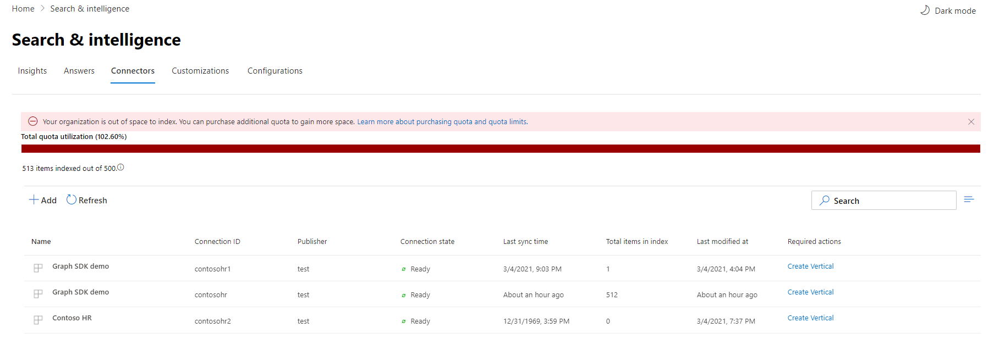

<!-- markdownlint-disable no-inline-html -->

# Surveiller vos connexionsMonitor your connections

Pour accéder à vos connecteurs et les gérer, vous devez être désigné comme administrateur de recherche pour votre client.To access and manage your connectors, you must be designated as a search administrator for your tenant. Contactez votre administrateur client pour vous fournir le rôle d’administrateur de recherche.Contact your tenant administrator to provision you for the search administrator role.

## Opérations de connexionConnection Operations

Accédez à [l’onglet Connecteurs](https://admin.microsoft.com/Adminportal/Home#/MicrosoftSearch/Connectors) dans le [Centre d’administration Microsoft 365.](https://admin.microsoft.com)Navigate to the [Connectors tab](https://admin.microsoft.com/Adminportal/Home#/MicrosoftSearch/Connectors) in the [Microsoft 365 admin center](https://admin.microsoft.com).

Pour chaque type de connecteur, le Centre [d’administration Microsoft 365](https://admin.microsoft.com) prend en charge les opérations indiquées dans le tableau suivant :For each connector type, the [Microsoft 365 admin center](https://admin.microsoft.com) supports the operations shown in the following table:

OpérationOperation | Connecteurs Graph par MicrosoftGraph connectors by Microsoft | Connecteurs partenaires ou GraphPartner or Graph connectors
--- | --- | ---
Ajouter une connexionAdd a connection | :heavy_check_mark : (voir [vue d’ensemble du programme d’installation)](configure-connector.md):heavy_check_mark: (See [Setup overview](configure-connector.md)) | :x : (faire référence à l’UX de votre partenaire ou de votre connecteur personnalisé):x: (Refer to your partner or custom-built connector admin UX)
Supprimer une connexionDelete a connection | :heavy_check_mark: | :heavy_check_mark:
Modifier une connexion publiéeEdit a published connection | :heavy_check_mark : nom et description:heavy_check_mark: Name and Description   :heavy_check_mark : paramètres de connexion:heavy_check_mark: Connection settings   :heavy_check_mark : étiquettes de propriété:heavy_check_mark: Property labels   :heavy_check_mark : schéma:heavy_check_mark: Schema   :heavy_check_mark : planification d’actualisation:heavy_check_mark: Refresh schedule   | :heavy_check_mark: NomName   :heavy_check_mark : Description:heavy_check_mark: Description
Modifier un brouillon de connexionEdit a draft connection | :heavy_check_mark: | :x:

## Surveiller l’état de votre connexionMonitor your connection state

Après avoir créé une connexion, le nombre d’éléments **traitées** s’affiche sous l’onglet Connecteurs de la page **Recherche Microsoft.**After you create a connection, the number of processed items shows on the **Connectors** tab on the **Microsoft Search** page. Une fois l’analyse complète initiale terminée, la progression des analyses incrémentielles périodiques s’affiche.After the initial full crawl completes successfully, the progress for periodic incremental crawls displays. Cette page fournit des informations sur les opérations quotidiennes du connecteur et une vue d’ensemble des journaux et de l’historique des erreurs.This page provides information about the connector's day-to-day operations and an overview of the logs and error history.

Cinq états s’affiche dans la colonne **État** par rapport à chaque connexion :Five states show up in the **State** column against each connection:

* **Synchronisation.****Syncing**. Le connecteur analyse les données de la source pour indexer les éléments existants et effectuer des mises à jour.The connector is crawling the data from the source to index the existing items and make any updates.

* **Prêt**: la connexion est prête et aucune analyse active n’est en cours d’exécution.**Ready**: The connection is ready, and there's no active crawl running against it. **L’heure de la** dernière synchronisation indique à quel moment la dernière analyse réussie s’est produite.**Last sync time** indicates when the last successful crawl happened. La connexion est aussi nouvelle que l’heure de la dernière synchronisation.The connection is as fresh as the last sync time.

* **Suspendu**.**Paused**. Les analyses sont suspendues par les administrateurs via l’option de pause.The crawls are paused by the admins through the pause option. L’analyse suivante s’exécute uniquement lorsqu’elle est reprise manuellement.The next crawl runs only when it's manually resumed. Toutefois, les données de cette connexion sont toujours utilisables dans une recherche.However, the data from this connection continues to be searchable.

* **Échec**.**Failed**. La connexion a connu une défaillance critique.The connection had a critical failure. Cette erreur nécessite une intervention manuelle.This error requires manual intervention. L’administrateur doit prendre les mesures appropriées en fonction du message d’erreur affiché.The admin needs to take appropriate action based on the error message shown. Les données qui ont été indexées jusqu’à ce que l’erreur se soit produite sont utilisables dans une recherche.Data that was indexed until the error occurred is searchable.

* **Suppression échouée.****Delete Failed**. La suppression de la connexion a échoué.The deletion of connection failed. Selon la raison de l’échec, les données peuvent toujours être indexées, le quota d’élément peut toujours être consommé et les analyses peuvent encore s’exécuter pour la connexion.Depending upon the failure reason, the data might still be indexed, item quota may still be consumed and crawls might still run for the connection. Il est recommandé d’essayer de supprimer à nouveau la connexion dans cet état.It is recommended to try deleting the connection again in this state.

## Surveiller l’utilisation de votre quota d’indexMonitor your index quota utilization

Le quota d’index et la consommation disponibles sont affichés sur la page d’accueil des connecteurs.The available index quota and consumption is displayed on the connectors landing page.

 
>[!NOTE]
>Pendant la période d’aperçu, chaque organisation qui essaie des connecteurs Graph a été fournie avec un quota fixe gratuit de 2 millions d’éléments sur toutes les connexions.During the preview period, every organization trying out Graph connectors was provided a free fixed quota of up to 2 million items across all connections. Les connecteurs Graph étant généralement disponibles, le quota gratuit expirera le 1er avril 2021 pour les organisations qui ont utilisé des connecteurs Graph en prévisualisation.With Graph connectors being generally available, the free quota will expire on April 1st, 2021 for those organizations who have been using Graph connectors in preview.
>Les connecteurs Graph créés par Microsoft et étiquetés comme « [Aperçu](./connectors-overview.md) » ne seront pas inclus dans le quota d’index facturé total pour votre organisation.Microsoft-built Graph connectors labeled as ["Preview"](./connectors-overview.md) will not be included in the total charged index quota for your organization. Toutefois, il est comptabilisé dans le nombre maximum de 10 connexions que vous pouvez configurer pour votre organisation et le nombre maximum de 7 millions d’éléments que votre organisation peut indexer entre les connexions ; Chaque connexion est limitée à 700 000 éléments.However, it will count towards the max number of 10 connections you can configure for your organization and the max number of 7 million items your organization can index across connections; each connection is limited 700,000 items. 

La barre d’utilisation des quotas indiquera différents états en fonction de la consommation de quota par votre organisation :The quota utilization bar will indicate various states based on consumption of quota by your organization:

ÉtatState | Niveaux d’utilisation des quotasQuota utilization levels
--- | --- 
NormalNormal | 0-79%0-79%
ÉlevéHigh | 80-89%80-89%
CritiqueCritical | 90%-99%90%-99%
CompletFull | 100 %100%

<!-- 

-->

Le nombre d’éléments indexés s’affiche également avec chaque connexion.The number of items indexed will also be displayed with each connection. Le nombre d’éléments indexés par chaque connexion contribue au quota total disponible pour votre organisation.The number of items indexed by each connection contributes to the total quota available for your organization.

Lorsque le quota d’index est dépassé pour votre organisation, toutes les connexions actives sont touchées et ces connexions fonctionnent dans un état **dépassé** limite.When index quota is exceeded for your organization, all active connections will be impacted, and those connections will operate in **limit exceeded** state. Dans cet état, vos connexions activesIn this state, your active connections  

* Ne sera pas en mesure d’ajouter de nouveaux éléments.Will not be able to add new items.

* Sera en mesure de mettre à jour ou de supprimer des éléments existants.Will be able to update or delete existing items.

Pour résoudre ce problème, vous pouvez :To fix this, you can do any of the following:

* Découvrez comment acheter un quota d’index pour votre organisation en matière de [licences et de tarification.](licensing.md)Learn how to purchase index quota for your organization at [Licensing requirements and pricing](licensing.md).

* Identifiez les connexions qui ont trop de contenu en cours d’ingestion et mettez-les à jour pour indexer moins d’éléments afin de faire de la place pour le quota.Identify connections which have too much content being ingested and update them to index fewer items to make room for quota. Pour mettre à jour la connexion, vous devez supprimer et créer une connexion avec un nouveau filtre d’ingestion qui apporte moins d’éléments.To update the connection, you must delete and create a new connection with a new ingestion filter which brings in fewer items.

* Supprimer définitivement une ou plusieurs connexionsPermanently delete one or more connections