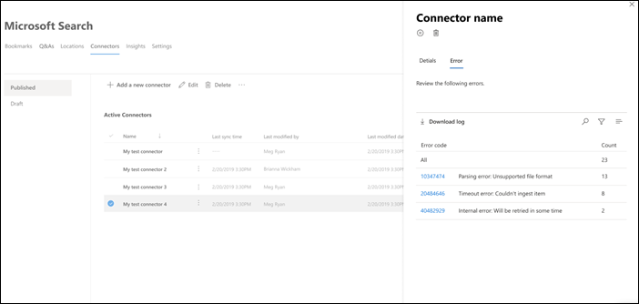
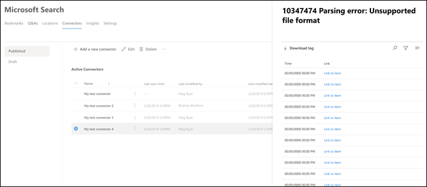

# Gérer votre connecteur pour Microsoft Search

Pour accéder à vos connecteurs et les gérer, vous devez être désigné en tant qu’administrateur de recherche pour votre client. Contactez votre administrateur client pour vous approvisionner pour le rôle d’administrateur de recherche.

## Prise en main

1. Connectez-vous au [Centre d’administration Microsoft 365](https://admin.microsoft.com).
2. Accédez à **paramètres** > **Microsoft Search** > **Connectors**.

Pour chaque type de connecteur, le [Centre d’administration Microsoft 365](https://admin.microsoft.com) prend en charge les opérations indiquées dans le tableau suivant :

**Opération** | **Connecteur créé par Microsoft** | **Connecteur partenaire ou personnalisé**
--- | --- | ---
Ajouter une connexion | : heavy_check_mark : (voir [Configure Your Microsoft-Built Connector](configure-connector.md)) | : x : (reportez-vous à votre partenaire ou à l’expérience utilisateur d’administration des connecteurs personnalisés)
Supprimer une connexion | :heavy_check_mark: | :heavy_check_mark:
Modifier une connexion publiée | : heavy_check_mark : nom   : heavy_check_mark : description   : heavy_check_mark : informations d’identification d’authentification pour votre source de données externe   : heavy_check_mark : informations d’identification de la passerelle pour votre source de données locale   : heavy_check_mark : actualiser la planification   | : heavy_check_mark : nom   : heavy_check_mark : description
Modifier une connexion brouillon | :heavy_check_mark: | ActiveX

## Surveiller l’état de votre connexion
Une fois que vous avez créé une connexion, le nombre d’éléments traités est affiché sous l’onglet **connecteurs** de la page **Microsoft Search** . Une fois l’analyse complète initiale terminée, la progression des analyses incrémentielles périodiques s’affiche. Cette page fournit des informations sur les opérations quotidiennes du connecteur et une vue d’ensemble des journaux et de l’historique des erreurs.

Quatre États apparaissent dans la colonne d' **État** pour chaque connexion :
* **Synchronisation**. Le connecteur analyse les données à partir de la source pour indexer les éléments existants et effectuer toutes les mises à jour.
* **Activé**: la connexion est activée et il n’y a aucune analyse active en cours d’exécution sur celle-ci. **Heure de la dernière synchronisation** indique la date de la dernière analyse réussie. La connexion est aussi récente que la dernière heure de synchronisation.
* **Suspendu**. Les analyses sont suspendues par les administrateurs via l’option pause. L’analyse suivante n’est exécutée qu’en cas de reprise manuelle. Toutefois, les données de cette connexion continuent d’être recherchées.
* **Échec**. Échec critique de la connexion. Cette erreur nécessite une intervention manuelle. L’administrateur doit prendre les mesures appropriées en fonction du message d’erreur qui s’affiche. Les données qui ont été indexées jusqu’à ce que l’erreur se produise soient utilisables dans une requête.

### Surveiller les erreurs
Pour chaque **connecteur actif** sous l’onglet **connecteurs** , toutes les erreurs d’analyse existantes apparaissent sous l’onglet **erreur** . L’onglet répertorie les codes d’erreur, le décompte de chaque option de téléchargement et le journal des erreurs. Consultez l’exemple dans l’image suivante. Sélectionnez un **code d’erreur** pour afficher les détails de l’erreur.

Pour afficher les détails spécifiques d’une erreur, sélectionnez son code d’erreur. Un écran s’affiche avec les détails de l’erreur et un lien. Les erreurs les plus récentes apparaissent en haut. Voir l’exemple dans le tableau suivant.

## Limitations de l’aperçu
* Lorsque vous **publiez** un connecteur créé par Microsoft, la création de la connexion peut prendre quelques minutes. Pendant ce temps, la connexion indique son état en attente. En outre, il n’existe pas d’actualisation automatique, vous devez donc procéder à une actualisation manuelle.
* Le [Centre d’administration Microsoft 365](https://admin.microsoft.com) ne prend pas en charge l’affichage et la modification du **schéma de recherche** après la publication d’une connexion. Pour modifier le schéma de recherche, supprimez votre connexion, puis créez-en une nouvelle.
* Lorsque vous gérez la planification d' **actualisation**de votre connexion, le nombre d’éléments synchronisés au cours de chaque session s’affiche. Toutefois, l’historique de synchronisation n’est pas disponible.
