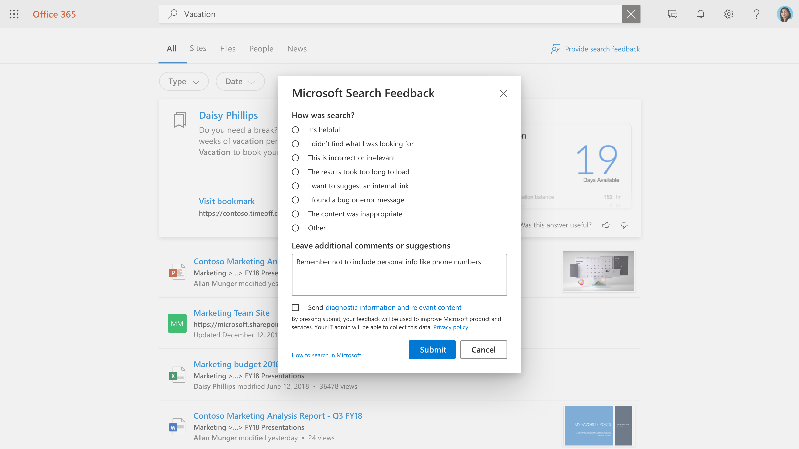

# Gestion des commentaires des utilisateurs

La création d’une excellente expérience de recherche pour vos utilisateurs est un partenariat entre Microsoft et l’administrateur de recherche. Les commentaires de vos utilisateurs nous permettent d’évaluer en permanence le produit et de l’affiner pour une expérience de qualité. Certains commentaires, toutefois, sont mieux traités par vous.

Nous proposons maintenant des outils qui vous permettront de passer en revue et de gérer les commentaires que vos utilisateurs fournissent sur l’expérience de recherche.

## Comment les utilisateurs envoient des commentaires

Lorsque les membres de votre organisation utilisent Recherche Microsoft, ils peuvent avoir des commentaires sur l’expérience. Lorsqu’ils cliquent sur un lien de commentaires sur la page de résultats, ils peuvent classer leurs commentaires et inclure des commentaires supplémentaires.

Les utilisateurs ont également la possibilité d’envoyer leur requête et d’autres informations de diagnostic, ainsi que la catégorie et les commentaires, à Microsoft. [En savoir plus](https://privacy.microsoft.com/en-US/privacystatement) sur la confidentialité et la façon dont nous protégeons ces données. Les données de diagnostic contiennent les informations les plus critiques dont Microsoft a besoin pour utiliser l’élément de commentaires pour l’amélioration du produit.

La plupart des soumissions de commentaires apparaissent dans la section [Commentaires](https://admin.microsoft.com/Adminportal/Home#/MicrosoftSearch/feedback) du centre d Recherche Microsoft’administration. Les commentaires envoyés avec le je **souhaite** suggérer une catégorie de lien interne apparaissent sous la mesure d’un signet suggéré dans la section [Signets](https://admin-ignite.microsoft.com/Adminportal/Home#/MicrosoftSearch/bookmarks) et peuvent être vus en filtrant l’état **suggéré.**

## Commentaires sur la révision

Dans la page [Commentaires,](https://admin.microsoft.com/Adminportal/Home#/MicrosoftSearch/feedback) vous pouvez examiner et exporter les commentaires envoyés par les membres de votre organisation au cours des 30 derniers jours. Une fois qu’un utilisateur a soumis des commentaires, il apparaît dans cette liste dans les 20 minutes. Vous pouvez utiliser le bouton Actualiser pour vous assurer que vous regardez les données les plus récentes

À l’aide d’un filtre, vous pouvez voir les commentaires pour des types de réponses spécifiques. Vous pouvez également filtrer par source et plage de dates.

Vous pouvez utiliser la zone de recherche au-dessus de la liste de commentaires pour rechercher des commentaires sur une requête spécifique.

Dans la liste des commentaires, la colonne Verbatim indique quels commentaires de l’utilisateur incluent également un commentaire ou une suggestion. Pour le lire, cliquez sur la requête pour ouvrir le **panneau Détails.**

>[!NOTE]
>Lors du déploiement initial sur les expériences de recherche d’administrateur et d’utilisateur final, l’apparition des éléments de commentaires sur le portail d’administration peut prendre jusqu’à deux semaines.

## Mettre à jour l’état des commentaires

À mesure que les commentaires  entrent en réponse, il sera dans un état Nouveau et restera là jusqu’à ce que vous le changez en *Résolu ou* En *double*.

Pour modifier cet état :

1. En plus de la requête, sélectionnez **Plus d’options** (trois points verticaux).
1. Dans le menu, **sélectionnez Marquer comme résolu** ou **Marquer comme doublon.**
1. La liste s’actualise et affiche l’état mis à jour.

Vous pouvez également mettre à jour l’état de plusieurs éléments, simplement les sélectionner, puis sélectionner Plus d’options à côté de l’un de ces éléments.

## Exporter les commentaires

Si vous souhaitez partager des commentaires de recherche avec d’autres personnes ou les conserver pendant plus de 30 jours, cliquez sur **Exporter.** Un .csv nommé Commentaires avec la date, tel que « Feedbacks_10_31_2020.csv », sera automatiquement téléchargé.

## Envoyer des commentaires aux utilisateurs à Microsoft

Par défaut, tous les commentaires des utilisateurs sont envoyés à Microsoft en plus de vous. Pour arrêter d’envoyer des commentaires à Microsoft, cliquez sur Gérer les **paramètres** et cochez la case Envoyer automatiquement les commentaires des utilisateurs **à Microsoft.** L’application de cette modification peut prendre jusqu’à 24 heures.

Si vous avez décidé de ne pas envoyer automatiquement de commentaires à Microsoft, vous pouvez toujours envoyer des commentaires individuels à Microsoft.

1. Sélectionnez les commentaires que vous souhaitez partager.
1. Dans la barre d’action, sélectionnez Plus (trois points), puis cliquez **sur Envoyer des commentaires à Microsoft.**

1. L’état dans la colonne Envoyé à Microsoft est en attente. Lorsque le commentaire est envoyé, il est changé en Oui.

Si vous partagez des commentaires automatiquement ou manuellement, il n’inclut jamais les requêtes et autres informations de diagnostic pour les utilisateurs qui ont choisi de ne pas inclure ces informations.

## Suggestions sur l’utilisation des commentaires

En tant qu’administrateur de recherche, vous devez comprendre les principales personnes de votre organisation et les types de contenu avec qui ces personnes interagissent et recherchent généralement. Avec cette compréhension, vous pouvez utiliser les commentaires pour apporter des améliorations ciblées à l’expérience de recherche de vos utilisateurs.

1. « Je n’ai pas trouvé ce que je recherchais » et des commentaires similaires peuvent être utilisés pour identifier le contenu voulu par les utilisateurs, mais n’est pas inclus actuellement dans l’index de recherche. La détermination de cette situation fait souvent l’objet d’enquêtes et d’inférences basées sur la compréhension de vos utilisateurs. Une fois trouvé, déterminez les méthodes d’utilisation de ce contenu les plus appropriées :
    1. Les signets sont utiles pour les sources de contenu qui ont une page d’accueil de haute qualité et une variété limitée de termes de recherche, afin que la communauté d’utilisateurs obtient un résultat de haute qualité à partir du signet et puisse ensuite trouver efficacement ce qu’elle recherche.
    1. Q&A sont utiles pour les réponses individuelles qui sont assez fréquentes, mais qui ne changent pas.
    1. Les connecteurs sont utiles pour les sources de contenu avec une grande variété de contenu et une grande variété de termes de recherche.
1. « Le chargement des résultats a pris trop de temps » & « J’ai trouvé un problème » peut être un indicateur d’un problème plus large. La recherche quotidienne de ces commentaires peut vous aider et, si plusieurs cas s’affichent, vous pouvez vérifier l’expérience de recherche pour vous-même et ouvrir un dossier de support auprès de Microsoft si nécessaire. Ce type de commentaires est également important pour Microsoft et constitue une excellente raison de nous faire part de tous les commentaires.
1. « Je souhaite suggérer un lien interne » peut être évalué pour être ajouté en tant que signets ou contenu connecté. Votre première idée doit être un signet . Si le signet est très utilisé, vous pouvez envisager d’apporter du contenu via un connecteur pour permettre une expérience de recherche encore plus riche.
