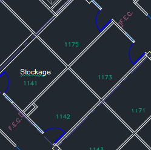
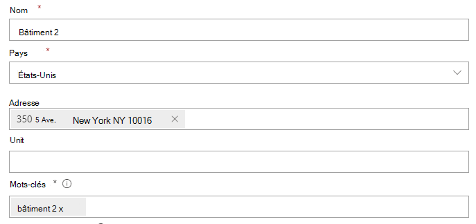
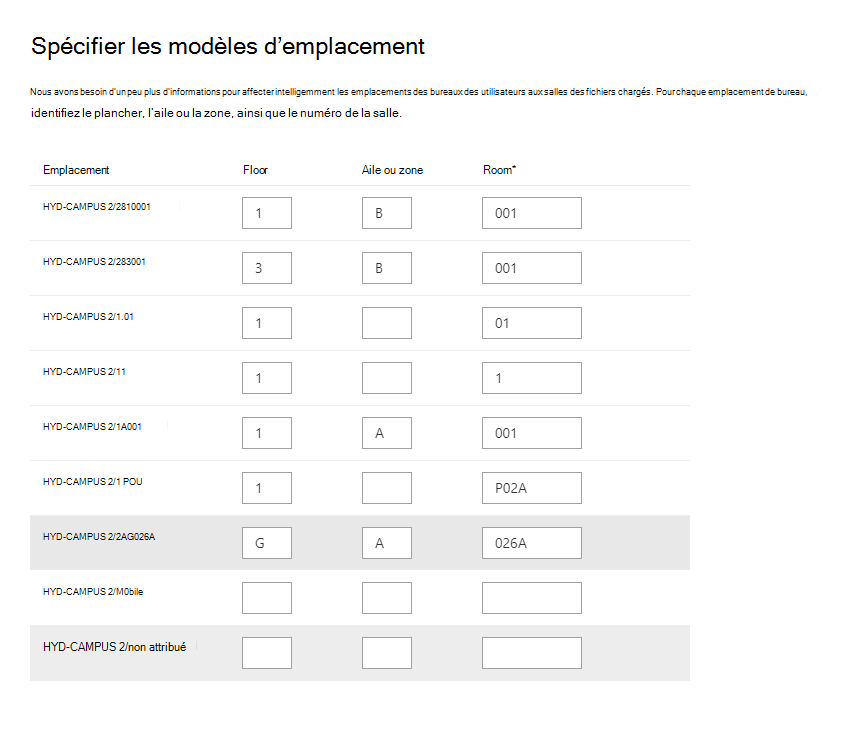
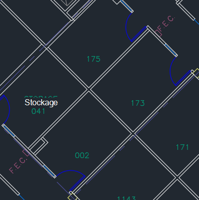

# Gérer les plans d’étage

Les plans **d’étage Recherche Microsoft** aux utilisateurs de trouver des personnes et des salles de réunion dans un bâtiment. Les plans d’étage répondent aux questions suivantes :

- Où se trouve le bureau de Pierre Deyoung ?
- Bâtiment 2 étage 3
- Rechercher 2/11173

## Ajouter des plans d’étage

Suivez ces étapes pour configurer les réponses aux plans **d’étage dans Recherche Microsoft**.

### Étape 1 : Déterminer vos codes de construction

Les codes de construction sont utilisés dans le cadre de l’emplacement du bureau d’un utilisateur. Vous utiliserez ces codes lors de la mise à jour des profils utilisateur. Supposons que votre organisation possède un bâtiment à cet emplacement : *Building 2, 350 5th Avenue, New York City, NY 10016*

Voici quelques exemples de code de ce bâtiment : 2, B2, Building2, Building 2 ou NYCB2. Chaque bâtiment doit avoir un code unique.

### Étape 2 : Passer en revue vos plans d’étage

Les fichiers de plans d’étage doivent être au format DWG ; Les fichiers DWG peuvent contenir des étiquettes de texte. Lorsqu’une étiquette de texte marque une salle, elle est appelée étiquette de salle. Le fichier DWG doit avoir **au moins 10 salles marquées** avec des étiquettes. Voici quelques exemples de fichiers DWG avec différents types d’étiquettes :

|**Étiquettes de texte, y compris les étiquettes de salle**|**Étiquettes de texte mais pas d’étiquettes de salle**|**Aucune étiquette de texte**|
|:-----:|:-----:|:-----:|
||||

Consultez la section [FAQ](#frequently-asked-questions) pour plus d’informations sur l’affichage et la mise à jour des fichiers DWG.

### Étape 3 : Mettre à jour les emplacements des bureaux sur les profils utilisateur

L’emplacement du bureau d’un utilisateur est une combinaison d’un code de construction et d’une étiquette de salle. Par exemple, si le code de construction est *2* et que l’étiquette de la salle est *1173*, l’emplacement du bureau est *2/1173*.

Ajouter ou mettre à jour des emplacements de bureau pour chaque utilisateur de votre organisation. Vous pouvez modifier l’emplacement du bureau sur le profil utilisateur dans le [Centre d’administration Microsoft 365](https://admin.microsoft.com) ou vous pouvez modifier votre annuaire Active Directory local pour le synchroniser avec Azure Active Directory. *PhysicalDeliveryOfficeName est* le champ utilisé pour l’emplacement du bureau. Si vos étiquettes de salle n’incluent pas de numéros d’étage, consultez le FAQ pour obtenir des conseils.

Dans cet exemple, le bureau de Celui-ci se trouve dans la salle 1173 de l’étage 1 du bâtiment 2.

> [!NOTE]
> Pour voir les emplacements de bureau mis à jour lors de la recherche de plans d’étage, vous devez mettre à jour les emplacements de bureau pour au moins **10** personnes sur chaque étage.

### Étape 4 : Vérifier l’emplacement du bureau

Utilisez **Recherche Microsoft** pour rechercher un utilisateur et vérifier que son bureau s’affiche correctement. Si vous avez mis à jour des emplacements, vous devrez peut-être attendre **jusqu’à 72** heures avant que les mises à jour apparaissent dans les résultats de la recherche.

### Étape 5 : Ajouter des emplacements de construction

Les plans d’étage [utilisent des](manage-locations.md) emplacements pour définir vos bâtiments. Dans la [Centre d’administration Microsoft 365](https://admin.microsoft.com), allez à [**Emplacements,**](https://admin.microsoft.com/Adminportal/Home#/MicrosoftSearch/locations)puis sélectionnez **Ajouter**. Entrez le nom, l’adresse et les mots clés du bâtiment. Ajoutez autant de bâtiments que nécessaire.

Pour plus d’informations sur les emplacements, voir [Gérer les emplacements](manage-locations.md)

### Étape 6 : Collecter et organiser les bureaux

Avant de pouvoir utiliser des plans d’étage, les bureaux doivent être indexés. Il s’agit d’une opération en une seule fois qui peut prendre jusqu’à 48 heures. Le temps total dépend de la taille de votre organisation.

Dans [le Centre d’administration,](https://admin.microsoft.com)allez aux [**plans Floor,**](https://admin.microsoft.com/Adminportal/Home#/MicrosoftSearch/floorplans)puis sélectionnez **Commencer.** Si vous ne voyez pas cet avis, cette étape est déjà terminée pour votre organisation.

### Étape 7 : Télécharger plan d’étage

1. Dans le Centre [d’administration,](https://admin.microsoft.com)allez aux [**plans Floor.**](https://admin.microsoft.com/Adminportal/Home#/MicrosoftSearch/floorplans)
2. Sélectionnez un bâtiment dans la liste liste et sélectionnez **Suivant.** Si le bâtiment n’est pas répertorié, revenir en arrière et [ajouter des emplacements de construction.](#step-5-add-building-locations)
3. Sélectionnez **Télécharger fichiers,** puis choisissez le plan d’étage que vous téléchargez.
4. Une fois le chargement terminé, vous devez entrer le numéro d’étage qui est représenté dans le fichier du plan d’étage. Ensuite, sélectionnez **Suivant**.
5. (Facultatif) Si votre étage possède des pistes ou des zones, entrez ce détail.
6. Vous verrez un écran de révision répertoriant le nombre d’emplacements de bureaux qui ont été mappés aux plans d’étage. Sélectionnez **Détails** pour vous assurer que le mappage est correct.
    - Si aucun utilisateur n’est mappé ou si vous n’êtes pas satisfait du mappage, sélectionnez **Continuer le mappage.** Pour publier, **sélectionnez Ignorer et publier.**
7. Entrez le code de construction de ce plan d’étage. Le code de construction se trouve sur la propriété de l’emplacement du bureau des utilisateurs. Par exemple, si l’emplacement du bureau d’un utilisateur est **2/1173,** le code de construction est **2**.
8. Sur l’écran de révision, répétez l’étape 6 pour vous assurer que le mappage est correct.
9. (Facultatif) Examinez et identifiez les modèles d’emplacement pour tous les plans d’étage chargés, puis sélectionnez **Suivant**.
10. Sur l’écran de révision, répétez l’étape 6 pour vous assurer que le mappage est correct.
11. Lorsque vous êtes prêt, sélectionnez **Publier** pour rendre le plan d’étage disponible **dans Recherche Microsoft**.

> [!NOTE]
> **La publication des plans d’étage prend 48 heures.** Après cela, vos utilisateurs voient un plan d’étage semblable à celui ci-dessous lorsqu’ils recherchent le bureau d’un collègue.

### Étape 8 : (Facultatif) Spécifier des modèles d’emplacement

Après le chargement d’un plan d’étage, les étiquettes de texte sont comparées aux emplacements de bureau dans les profils de vos utilisateurs. S’il y a moins de 10 correspondances, l’écran Spécifier des **modèles d’emplacement** s’affiche. Les modèles d’emplacement sont utilisés pour extraire les informations d’étage, d’aile et de salle des bureaux.

Seule l’espace est nécessaire, le sol et l’aile sont facultatifs et vous pouvez ignorer les emplacements selon vos besoins.

## Modifier les plans d’étage

Pour mettre à jour un plan d’étage existant, sélectionnez le plan d’étage à modifier, puis sélectionnez **Modifier.** A apporté vos modifications et les enregistrer.

## Résolution des problèmes

|**Étape**|**Message d’erreur**|**Type**|**Action**|
|:-----|:-----|:-----|:-----|
|Télécharger plans d’étage|Impossible de lire CC_1.dwg. Veuillez charger à nouveau ou supprimer le plan d’étage.|Erreur|Essayez de charger à nouveau le fichier. Si cela ne fonctionne pas, supprimez le fichier et recommencez.|
|Télécharger plans d’étage|Il existe deux fichiers nommés CC_1.dwg. Supprimez l’un d’eux ou téléchargez-le à nouveau avec un autre nom.|Erreur|Si le nom de fichier est incorrect, rendez le nom de fichier unique en ajoutant des informations d’étage ou d’aile, puis téléchargez à nouveau le fichier. Si vous avez accidentellement ajouté le même fichier à deux reprises, supprimez-le simplement.|
|Télécharger plans d’étage|Aucune donnée trouvée.|Erreur|Vérifiez votre fichier pour vous assurer qu’il est correct, puis téléchargez-le à nouveau ou supprimez-le.|
|Télécharger plans d’étage|Des références externes sont manquantes dans ce fichier. Chargez CC_1_furniture.dwg ou supprimez ce fichier.|Avertissement|Télécharger fichiers de référence externe ou supprimer.|
|Télécharger plans d’étage|Nous n’avons pas pu lire les numéros de salle ou les balises dans le fichier DWG. Supprimez ce fichier.|Avertissement|Vérifiez votre fichier DWG pour vous assurer que les données sont incluses, puis supprimez le fichier et essayez à nouveau.|
|Lier des emplacements de bureau|Aucun emplacement de bureau trouvé dans Azure Active Directory. Ajoutez des données d’emplacement Azure Active Directory avant de définir des plans d’étage.|Erreur|[Mettre à jour les emplacements des bureaux sur les profils utilisateur](#step-3-update-office-locations-on-user-profiles) |

## Foire aux questions

**Q :** Comment afficher et modifier des fichiers DWG ?

**R :** Utilisez l’une de ces options pour afficher les fichiers DWG :

- Télécharger fichier à SharePoint et ouvrez-le.
- Ouvrez le fichier [dans Microsoft Visio](https://support.office.com/article/Open-insert-convert-and-save-DWG-and-DXF-AutoCAD-drawings-60cab691-0f4c-4fc9-b775-583273c8dac5) ou [autodesk DWG TrueView](https://www.autodesk.com/products/dwg).
- Télécharger fichier à la visionneuse en ligne du [autodesk.](https://viewer.autodesk.com/)

**Q :** Comment ajouter des étiquettes de texte à des salles non marquées ?

**R :** Ouvrez le fichier DWG dans un éditeur et [ajoutez des étiquettes de salle.](https://knowledge.autodesk.com/support/autocad-map-3d/learn-explore/caas/CloudHelp/cloudhelp/2019/ENU/MAP3D-Learn/files/GUID-4854F184-6279-4E0C-9487-34A4759017F6-htm.html)

**Q :** Comment créer ou modifier des fichiers DWG à des fins de test ?

**R :** Créez un fichier DWG dans Microsoft Visio, autodesk AutoCAD ou tout autre éditeur DWG. Assurez-vous que 10 salles ou plus sont étiquetées dans le fichier.

**Q :** Quel est le meilleur format pour les étiquettes de texte dans les fichiers DWG ?

**R :** Pour obtenir de meilleurs résultats, les étiquettes de texte doivent contenir des numéros d’étage et des numéros de salle. Les exemples ci-dessous utilisent 2 ou SC pour le code de construction.
<!-- markdownlint-disable no-inline-html -->
|Types d’étiquettes de salle|Floor|Room|Exemple d’étiquette de texte|Office emplacement (code de construction/étiquette de texte)|
|:-----|:-----|:-----|:-----|:-----|
|Possède le numéro d’étage et de salle|1|173|1173|2/1173|
|| 21|45|21045|2/21045|
||23|100 000|23-100K|23/02-100K|
||1|G06-07|1G06-07|2/1G06-07|
||2|1024A|02.1024A|2/02.1024A|
||2|1024A|02.1024A|2/02.1024A|
||2|105.01|2105.01|2/2105.01|
|Possède le code de construction, l’étage et le numéro de salle|0|X-11-M-12|2-0-X-11-M-12|2/2-0-X-11-M-12 2-0-X-11-M-12|
||2|128A|22128A|2/22128A 22128A|
||1|B2-11|21-B2-11|21/02-B2-11 21-B2-11|
||2|45|SC2045|SC/SC2045 SC2045|

**Q :** Puis-je utiliser un fichier DWG qui n’inclut pas de numéros d’étage ?

**R :** Si, tu peux. Lorsque vous mettez à jour les emplacements de bureau dans le profil Azure Active Directory de l’utilisateur, incluez le numéro d’étage dans le numéro de la salle, même s’il est manquant dans le fichier DWG. Une fois le fichier téléchargé, l’écran Spécifier les modèles d’emplacement s’affiche et vous pouvez indiquer les deux valeurs.

Par exemple, un fichier DWG qui inclut des numéros de salle, mais aucun numéro d’étage, peut ressembler à ceci :

L’emplacement du bureau dans le profil de l’utilisateur doit être le 2/1175 où « 2 » est le code de construction, « 1 » est le numéro d’étage et « 175 » le numéro de salle.
