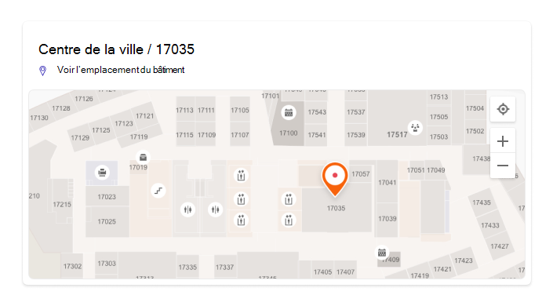
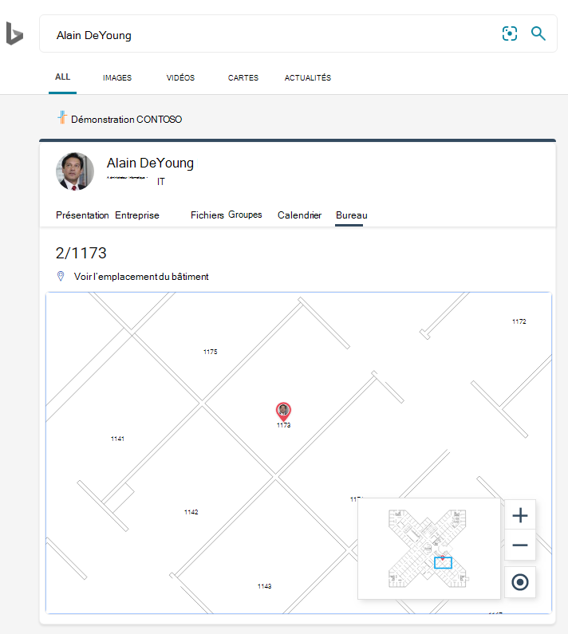
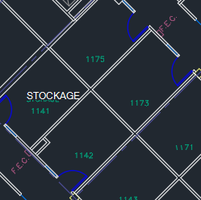
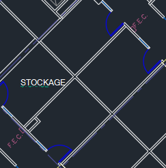
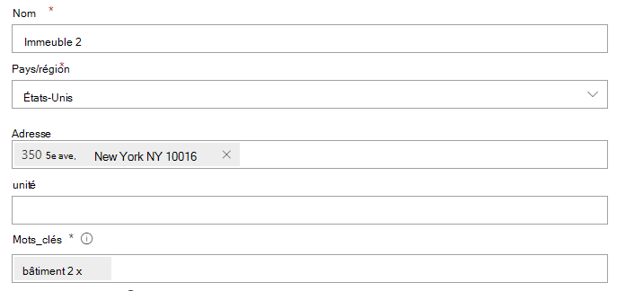
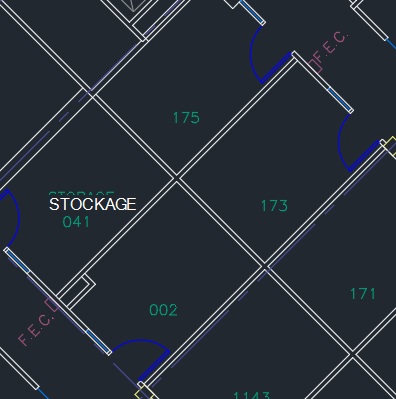

# Gérer les plans d’étage

Les plans d’étage Recherche Microsoft aux utilisateurs de trouver des personnes, des salles et des espaces dans un bâtiment. Les modèles de requête qui incluent le nom complet, le prénom, le nom de la salle ou l’emplacement d’une personne, comme ces exemples, retournent un plan d’étage :

- Où se trouve le bureau de Pierre Deyoung ?
- Où se trouve le bureau de Son bureau ?
- Bâtiment 2 étage 3
- Workspace-1
- B1/1.20

## Expérience des utilisateurs

Les utilisateurs peuvent voir les réponses du plan [d’étage Bing,](https://bing.com) [SharePoint](http://sharepoint.com/)et [Office 365](https://office.com). D’autres points d’entrée qui retournent Bing résultats, notamment Windows recherche et la Microsoft Edge d’adresses, sont également pris en charge. Lorsque les utilisateurs recherchent un nom de salle ou un emplacement, ils voient le point d’intérêt marqué dans la réponse du plan d’étage.

> [!div class="mx-imgBorder"]
> 

Lorsqu’ils recherchent le bureau d’une personne, ils voient une réponse similaire, avec l’image de profil de la personne sur le marqueur.

> [!div class="mx-imgBorder"]
> 

## Ajouter des plans d’étage

Suivez ces étapes pour configurer les réponses des plans d’étage Recherche Microsoft.

### Étape 1 : Déterminer vos codes de construction

Les codes de construction sont utilisés dans le cadre de l’emplacement du bureau d’un utilisateur. Vous utiliserez ces codes lors de la mise à jour des profils utilisateur. Supposons que votre organisation possède un bâtiment à cette adresse : *Building 2, 350 5th Avenue, New York City, NY 10016*

Voici quelques exemples de code du bâtiment : 2, B2, Building2, Building 2 ou NYCB2. Chaque bâtiment doit avoir un code unique.

### Étape 2 : Passer en revue vos plans d’étage

Les fichiers de plans d’étage doivent être au format DWG, qui prend en charge les étiquettes de texte. Lorsqu’une étiquette de texte marque une salle, elle est appelée étiquette de salle. Voici quelques exemples de fichiers DWG avec différents types d’étiquettes :

| Étiquettes de texte, y compris les étiquettes de salle | Étiquettes de texte mais pas d’étiquettes de salle | Aucune étiquette de texte |
|:-----:|:-----:|:-----:|
||||

En tant que meilleure pratique, les étiquettes de texte DWG doivent contenir des numéros d’étage, des numéros d’aile (le cas besoin) et des numéros de salle, dans cet ordre. Consultez les [FAQ pour obtenir](#frequently-asked-questions) plus d’exemples de formats d’étiquette de texte et des informations sur l’affichage et la mise à jour des fichiers DWG.

### Étape 3 : Mettre à jour les emplacements des bureaux sur les profils utilisateur

L’emplacement du bureau d’un utilisateur est une combinaison d’un code de construction et d’une étiquette de salle. Par exemple, si le code de construction est *2* et que l’étiquette de la salle est *1173*, l’emplacement du bureau est *2/1173*.

Ajouter ou mettre à jour des emplacements de bureau pour les utilisateurs avec un emplacement de travail affecté. Vous pouvez le faire à partir de leur profil utilisateur dans les centres d’administration [Microsoft 365](https://admin.microsoft.com) ou [Azure Active Directory,](https://portal.azure.com/) ou de votre annuaire Active Directory local (se synchronisera avec Azure Active Directory). *PhysicalDeliveryOfficeName est* le champ utilisé pour l’emplacement du bureau. Si les étiquettes de votre salle n’incluent pas de numéro d’étage, consultez le FAQ pour obtenir des [conseils.](#frequently-asked-questions)

Dans cet exemple, le bureau de Celui-ci se trouve dans la salle 1173 de l’étage 1 du bâtiment 2.

> [!div class="mx-imgBorder"]
> 

Pour configurer des plans d’étage pour les salles de réunion, ajoutez des emplacements de bureau pour eux dans la section Salles [& équipement](https://admin.microsoft.com/Adminportal/Home#/ResourceMailbox) du Centre d'administration Microsoft 365. Pour plus d’informations, voir Configurer des boîtes aux lettres de [salle et d’équipement.](/microsoft-365/admin/manage/room-and-equipment-mailboxes#set-up-room-and-equipment-mailboxes) Si les membres de votre organisation peuvent planifier la salle ou la ressource pour une réunion ou un événement, voir Modifier la façon dont une boîte aux lettres de salle gère les demandes [de réunion.](/Exchange/recipients/room-mailboxes#change-how-a-room-mailbox-handles-meeting-requests) Pour plus d’informations sur la configuration des espaces de travail, y compris la configuration des boîtes aux lettres de salle, voir le billet sur la réservation d’un espace de [travail dans Outlook](https://techcommunity.microsoft.com/t5/exchange-team-blog/book-a-workspace-in-outlook/ba-p/1524560).

### Étape 4 : Vérifier l’emplacement du bureau

Utilisez Recherche Microsoft pour rechercher un utilisateur et vérifier que son bureau s’affiche correctement. Vous devrez peut-être attendre **jusqu’à 72** heures avant que les mises à jour apparaissent dans les résultats de la recherche.

> [!div class="mx-imgBorder"]
> 

### Étape 5 : Ajouter des emplacements de construction

Les plans d’étage [utilisent des emplacements](manage-locations.md) pour définir vos bâtiments. Dans la [Centre d'administration Microsoft 365](https://admin.microsoft.com), allez à [**Emplacements,**](https://admin.microsoft.com/Adminportal/Home#/MicrosoftSearch/locations)puis sélectionnez **Ajouter**. Entrez le nom, l’adresse et les mots clés du bâtiment. Ajoutez autant de bâtiments que nécessaire.

> [!div class="mx-imgBorder"]
> 

Pour plus d’informations sur les emplacements, voir [Gérer les emplacements](manage-locations.md)

### Étape 6 : collecter et organiser les emplacements de bureau

Avant de pouvoir charger des plans d’étage, les bureaux doivent être indexés. Cette opération en une seule opération peut prendre jusqu’à 48 heures. Le temps total dépend de la taille de votre organisation.

Dans [le Centre d’administration,](https://admin.microsoft.com)allez aux [**plans Floor,**](https://admin.microsoft.com/Adminportal/Home#/MicrosoftSearch/floorplans)puis **sélectionnez Commencer l’indexation.** Si vous ne voyez pas cet avis, cette étape est déjà terminée pour votre organisation.

### Étape 7 : Télécharger plans d’étage

1. Dans le centre [d’administration,](https://admin.microsoft.com)allez aux [**plans Floor.**](https://admin.microsoft.com/Adminportal/Home#/MicrosoftSearch/floorplans)

2. Sélectionnez un bâtiment dans la liste liste et sélectionnez **Suivant.** Si le bâtiment n’est pas répertorié, revenir en arrière et [ajouter des emplacements de construction.](#step-5-add-building-locations)

3. Sélectionnez **Télécharger fichiers,** puis choisissez le plan d’étage à télécharger.

4. Une fois le chargement terminé, vous devez entrer le numéro d’étage qui est représenté dans le fichier du plan d’étage. Ensuite, sélectionnez **Suivant**.

5. (Facultatif) Si votre étage possède des pistes ou des zones, entrez ce détail.

6. Vous verrez un écran de révision répertoriant le nombre d’emplacements de bureaux qui ont été mappés aux plans d’étage. Sélectionnez **Détails** pour vous assurer que le mappage est correct.
    - Si aucun utilisateur n’est mappé ou si vous n’êtes pas satisfait du mappage, sélectionnez **Continuer le mappage.**
    - Pour publier, **sélectionnez Ignorer et publier.**

1. Entrez le code de construction de ce plan d’étage. Le code de construction se trouve sur la propriété de l’emplacement du bureau des utilisateurs. Par exemple, si l’emplacement du bureau d’un utilisateur est **2/1173,** le code de construction est **2**.

1. Sur l’écran de révision, répétez l’étape 6 pour vous assurer que le mappage est correct. Si vous êtes satisfait du mappage, sélectionnez Continuer le **mappage** et **Ignorez et publiez.** Si ce n’est pas le cas, sélectionnez **Continuer le mappage** et sélectionnez l’écran Spécifier les modèles d’emplacement.

1. (Facultatif) Examinez et identifiez la logique d’attribution de noms pour tous les modèles d’emplacement uniques pour ce bâtiment dans votre répertoire Azure, puis sélectionnez **Suivant**.

1. Sur l’écran de révision, répétez l’étape 6 pour vous assurer que le mappage est correct.

1. Lorsque vous êtes prêt, sélectionnez **Publier** pour rendre le plan d’étage disponible dans Recherche Microsoft.

> [!NOTE]
> **La publication des plans d’étage prend 48 heures.** Après cela, vos utilisateurs voient un plan d’étage semblable à celui ci-dessous lorsqu’ils recherchent le bureau d’un collègue.

> [!div class="mx-imgBorder"]
> 

### Étape 8 : (Facultatif) Spécifier des modèles d’emplacement

Après le chargement d’un plan d’étage, les étiquettes de texte de salle sont comparées aux emplacements de bureau dans les profils de vos utilisateurs. Si les emplacements de bureau ou les étiquettes de texte ne suivent pas systématiquement les modèles d’attribution de noms recommandés aux étapes [2](#step-2-review-your-floor-plans) et [3,](#step-3-update-office-locations-on-user-profiles)utilisez l’écran Spécifier des **modèles** d’emplacement pour ajouter des informations supplémentaires pour terminer le mappage. Les modèles d’emplacement sont utilisés pour extraire les informations d’étage, d’aile et de salle des bureaux AAD.

> [!div class="mx-imgBorder"]
> 

Le sol et l’aile sont facultatifs, seule l’espace est nécessaire et vous pouvez ignorer les emplacements selon vos besoins.

## Mettre à jour les plans d’étage

Avant de mettre à jour un plan d’étage existant, assurez-vous que vos bureaux AAD sont à jour et que vous avez attendu 48 heures avant que les mises à jour AAD soient traitées. Pour mettre à jour un plan d’étage, sélectionnez plans d’étage, sélectionnez le bâtiment pour le plan d’étage, puis sélectionnez **Modifier**. Si le plan d’étage a été modifié structurellement, en raison d’une transformation par exemple, supprimez l’ancien fichier, puis téléchargez et publiez le nouveau fichier DWG.

> [!NOTE]
> Vous n’avez pas besoin de mettre à jour les plans d’étage lorsque les utilisateurs se déplacent vers un étage qui a déjà été mappé. Il suffit de mettre à jour son profil utilisateur pour refléter le nouvel emplacement du bureau :
>
> - Dans la Centre d'administration Microsoft 365 (Utilisateurs actifs > compte > gérer les informations de contact)
> - Dans le Centre d’administration Azure Active Director (utilisateurs > profil > modifier les informations de contact)
> - Dans active Directory sur site (se synchronisera avec Azure Active Directory)

## Supprimer des plans d’étage

Pour supprimer un plan d’étage unique, sélectionnez [le bâtiment.](https://admin.microsoft.com/Adminportal/Home#/MicrosoftSearch/floorplans) Ensuite, sélectionnez le plan d’étage et **sélectionnez Supprimer.** Pour supprimer tous les plans d’étage d’un bâtiment, allez à [Emplacements,](https://admin.microsoft.com/Adminportal/Home#/MicrosoftSearch/locations)sélectionnez le bâtiment, puis sélectionnez **Supprimer.**  

## Résolution des problèmes

| Étape | Message d’erreur | Type | Action |
|:-----|:-----|:-----|:-----|
|Télécharger plans d’étage|Impossible de lire CC_1.dwg. Veuillez charger à nouveau ou supprimer le plan d’étage.|Erreur|Essayez de charger à nouveau le fichier. Si cela ne fonctionne pas, supprimez le fichier et essayez à nouveau.|
|Télécharger plans d’étage|Il existe deux fichiers nommés CC_1.dwg. Supprimez l’un d’eux ou téléchargez-le à nouveau avec un autre nom.|Erreur|Si le nom de fichier est incorrect, ajoutez le numéro d’étage ou d’aile pour créer un nom de fichier unique et téléchargez-le à nouveau. Si vous avez accidentellement ajouté le même fichier deux fois, supprimez simplement l’un d’eux.|
|Télécharger plans d’étage|Aucune donnée trouvée.|Erreur|Vérifiez votre fichier pour vous assurer qu’il est correct, puis téléchargez-le à nouveau ou supprimez-le.|
|Télécharger plans d’étage|Des références externes sont manquantes dans ce fichier. Chargez CC_1_furniture.dwg ou supprimez ce fichier.|Avertissement|Télécharger fichiers de référence externe ou supprimer.|
|Télécharger plans d’étage|Nous n’avons pas pu lire les numéros de salle ou les balises dans le fichier DWG. Supprimez ce fichier.|Avertissement|Vérifiez votre fichier DWG pour vous assurer que les données sont incluses, puis supprimez le fichier et essayez à nouveau.|
|Lier des emplacements de bureau|Aucun emplacement de bureau trouvé dans Azure Active Directory. Ajoutez des données d’emplacement Azure Active Directory avant de définir des plans d’étage.|Erreur|[Mettre à jour les emplacements des bureaux sur les profils utilisateur](#step-3-update-office-locations-on-user-profiles) |

## Foire aux questions

**Q :** Comment afficher et modifier des fichiers DWG ?

**R :** Utilisez l’une de ces options pour afficher les fichiers DWG :

- Télécharger fichier à SharePoint et ouvrez-le.
- Ouvrez le fichier [dans Microsoft Visio](https://support.office.com/article/Open-insert-convert-and-save-DWG-and-DXF-AutoCAD-drawings-60cab691-0f4c-4fc9-b775-583273c8dac5) ou [autodesk DWG TrueView](https://www.autodesk.com/products/dwg).
- Télécharger le fichier dans la visionneuse en ligne du [autodesk.](https://viewer.autodesk.com/)

Vous pouvez créer ou modifier un fichier DWG dans n’importe quel éditeur DWG, y compris Visio ou autodesk AutoCAD. Pour utiliser Visio, voir [Créer un plan d’étage.](https://support.microsoft.com/office/create-a-floor-plan-ec17da08-64aa-4ead-9b9b-35e821645791) La taille maximale d’un fichier DWG est de 16 Mo.

**Q :** Comment ajouter des étiquettes de texte à des salles non marquées ?

**R :** Ouvrez le fichier DWG dans un éditeur et [ajoutez des étiquettes de salle.](https://knowledge.autodesk.com/support/autocad-map-3d/learn-explore/caas/CloudHelp/cloudhelp/2019/ENU/MAP3D-Learn/files/GUID-4854F184-6279-4E0C-9487-34A4759017F6-htm.html)

**Q :** Quel est le meilleur format pour les étiquettes de texte dans les fichiers DWG ?

**R :** Pour obtenir de meilleurs résultats, les étiquettes de texte DWG doivent être une seule ligne qui contient les numéros d’étage, les numéros d’aile (le cas besoin) et les numéros de salle, dans cet ordre. Les exemples ci-dessous utilisent 2 ou CITY CENTER pour le code de construction.
<!-- markdownlint-disable no-inline-html -->
|Types d’étiquettes de salle|Floor|Wing/Zone|Room|Exemple d’étiquette de texte|Office (code de construction/étiquette de texte)|
|:-----|:-----|:-----|:-----|:-----|:-----|
|Possède le numéro d’étage et de salle|1| |173|1173|2/1173|
|| 21| |45|21045|2/21045|
||23| |100 000|23-100K|23/02-100K|
||1| |G06-07|1G06-07|CITY CENTER/1G06-07|
||2| |1024A|02.1024A|CITY CENTER/02.1024A|
|Possède le numéro d’étage, d’aile et de salle|1|A|173|1A173|2/1A173
||2|Z1|128b|2Z1128b|2/2Z1128b

En outre, dans le fichier DWG, n’incluez pas d’étiquettes de texte supplémentaires, comme les dimensions de la salle ou le nom de l’architecte.

**Q :** Existe-t-il des limites de caractères pour les étiquettes de texte ?

**R :** Les étiquettes de texte doivent être une seule ligne. Des caractères spéciaux peuvent être utilisés pour les codes de construction ou les étiquettes de salle, mais pas pour les valeurs d’étage ou d’aile.

**Q :** Puis-je utiliser un fichier DWG qui n’inclut pas de numéros d’étage ?

**R :** Nous vous recommandons d’inclure des numéros d’étage dans les étiquettes de texte DWG, mais elles ne sont pas obligatoires, voir les modèles d’attribution de noms à [l’étape 2.](#step-2-review-your-floor-plans) En outre, vous devez toujours inclure le numéro d’étage dans l’emplacement du bureau dans les informations de contact de l’utilisateur. Après avoir téléchargé le fichier DWG, vous devez utiliser l’écran facultatif Spécifier des modèles d’emplacement pour terminer le processus de mappage de ces **étiquettes** non standard.

Par exemple, un fichier DWG qui inclut des numéros de salle, mais aucun numéro d’étage, peut ressembler à ceci :

> [!div class="mx-imgBorder"]
> 

L’emplacement du bureau dans le profil de l’utilisateur est le 2/1175 où « 2 » est le code de construction, « 1 » est le numéro d’étage et « 175 » le numéro de salle.

**Q :** J’ai ajouté un emplacement de bâtiment, pourquoi ne voyez-vous pas l’option d’ajout d’un plan d’étage ?

**R :** Les emplacements de construction récemment ajoutés ou mis à jour peuvent ne pas encore se trouver dans l’index de recherche. L’apparition d’emplacements nouveaux ou modifiés dans les résultats de la recherche peut prendre plusieurs heures. En outre, si le bâtiment possède un plan d’étage provisoire ou publié, sélectionnez le nom du bâtiment, puis ajoutez d’autres plans.

**Q :** Pourquoi la liste Sélectionner une liste de construction n’affiche-t-elle pas ma liste complète des emplacements ?

**R :** Seuls les bâtiments sans plan d’étage apparaissent dans la liste Sélectionner un bâtiment. Pour les bâtiments avec au moins un plan d’étage provisoire ou publié, ajoutez d’autres plans d’étage en sélectionnant le bâtiment dans la liste, puis en téléchargeant.

**Q :** Existe-t-il des limites au nombre de plans d’étage que je peux télécharger ?

**R :** Non. Il n’y a pas de maximum, par bâtiment ou par organisation.

**Q :** Puis-je utiliser un fichier DWG qui contient des plans pour plusieurs secteurs/zones au sein d’un même étage ?

**R :** Tant que tous les plans sont pour le même étage, vous pouvez télécharger un fichier DWG qui contient des plans d’étage pour plusieurs zones/zones. Assurez-vous que les étiquettes de texte et les emplacements de bureau suivent les meilleures pratiques d’attribution de noms aux [étapes 2](#step-2-review-your-floor-plans) et [3.](#step-3-update-office-locations-on-user-profiles)

Si le fichier DWG contient des données pour plusieurs domaines, laissez le champ d’aile vide lorsque vous téléchargez.

**Q :** Puis-je charger deux fichiers DWG pour le même étage, l’un avec uniquement le plancher défini et l’autre avec le plancher et l’aile définis ?

**R :** Vous pouvez charger plusieurs fichiers DWG pour le même étage, mais vous devez indiquer une wing ou une zone pour chaque fichier. Dans l’exemple ci-dessous, vous devez entrer une valeur Wing ou zone pour le fichier FloorPlan1.dwg avant de passer à l’écran suivant. Si le fichier de plan d’étage n’a pas d’aile ou possède plusieurs étages, entrez une valeur telle que 0 ou X dans le champ Wing ou zone pour continuer.

> [!div class="mx-imgBorder"]
> 

**Q :** Puis-je télécharger et mettre à jour plusieurs plans d’étage en même temps ?

**R :** Vous pouvez charger plusieurs plans d’étage pour un seul bâtiment en même temps. Les opérations en bloc, telles que l’importation de plans d’étage pour plusieurs bâtiments, ne sont pas disponibles.

**Q :** Mon organisation compte des centaines d’utilisateurs. Dois-je spécifier des modèles d’emplacements pour chacun d’eux ?

**R :** Non. Si vous avez suivi les recommandations de mise en forme pour les étiquettes et les emplacements des bureaux aux étapes [2](#step-2-review-your-floor-plans) et [3,](#step-3-update-office-locations-on-user-profiles)et que vous avez terminé les éléments 1 à 8 de l’étape [7,](#step-7-upload-floor-plans)vous ne devriez pas avoir à spécifier de modèles d’emplacements.

Toutefois, si vos utilisateurs ne sont toujours pas mappés ou que vous n’êtes pas satisfait du mappage, terminez l’étape [facultative 8](#step-8-optional-specify-location-patterns). À l’étape 8, vous devez définir chaque modèle d’emplacement *unique* trouvé dans votre Azure AD pour ce code de construction. Par exemple, vous téléchargez un plan d’étage pour le bâtiment A, qui compte 1 000 bureaux. Cinq modèles d’emplacement différents sont utilisés pour les bureaux dans le bâtiment A. Lorsque vous spécifiez des modèles d’emplacement, vous devez définir les cinq modèles qui apparaissent dans votre Azure AD pour le bâtiment.

**Q :** Puis-je créer des réponses de plan d’étage pour les salles de conférence, les salles de réunion ou les espaces qui ne sont pas affectés à une personne ?

**R :** Si, tu peux. Ajoutez simplement la salle de réunion à votre liste de salles et d’équipements. Pour plus d’informations, voir Configurer des boîtes aux lettres de [salle et d’équipement.](/microsoft-365/admin/manage/room-and-equipment-mailboxes#set-up-room-and-equipment-mailboxes) Si les membres de votre organisation peuvent planifier la salle ou la ressource pour une réunion ou un événement, voir Modifier la façon dont une boîte aux lettres de salle gère les demandes [de réunion.](/Exchange/recipients/room-mailboxes#change-how-a-room-mailbox-handles-meeting-requests) Pour configurer des espaces de travail, y compris la configuration des boîtes aux lettres de salle, consultez le billet sur la réservation d’un espace de [travail dans Outlook](https://techcommunity.microsoft.com/t5/exchange-team-blog/book-a-workspace-in-outlook/ba-p/1524560). Pour les plans d’étage, suivez les recommandations pour les étiquettes de salle DWG à [l’étape 2](#step-2-review-your-floor-plans) et l’emplacement du profil à [l’étape 3.](#step-3-update-office-locations-on-user-profiles) Après avoir ajouté une salle ou un espace de travail, vous devrez attendre 72 heures pour que l’index soit mis à jour avant de télécharger le plan d’étage.

**Q :** J’ai effectué toutes les étapes pour ajouter un plan d’étage. Pourquoi n’apparaissent-ils pas dans Recherche Microsoft résultats ?

**R :** Un lien vers la réponse au plan d’étage peut apparaître au milieu de la page des résultats de la recherche. Ce type de classement peut se produire lorsqu’il y a moins de confiance que la réponse correspond à l’intention de la recherche. Si aucune information n’apparaît sur la page des résultats, vérifiez que les recherches suivent un modèle de requête pris en charge : un nom de bureau, un nom d’utilisateur ou un emplacement de bureau tel qu’il apparaît dans AAD. Les correspondances partielles ou floues ne sont pas pris en charge pour les recherches de plan d’étage.

**Q :** J’ai ajouté des plans d’étage pour les espaces de travail de mon organisation. Pourquoi ne s’affichent-ils pas lors de la réservation d’un espace de travail Outlook ?

**R :** Actuellement, seul Outlook Mobile prend en charge les plans d’étage d’espace de travail. Ils ne sont pas disponibles dans le bureau ou l’application web. Pour plus d’informations, voir le billet sur [la réservation d’un](https://techcommunity.microsoft.com/t5/exchange-team-blog/book-a-workspace-in-outlook/ba-p/1524560)espace de travail dans Outlook .

**Q :** Mes utilisateurs peuvent-ils réserver une salle de réunion à partir d’un plan d’étage ?

**R :** Les réponses au plan d’étage n’incluent pas la possibilité de réserver ou de réserver une salle. Utilisez [l’Assistant Planification ou la](https://support.microsoft.com/office/use-the-scheduling-assistant-and-room-finder-for-meetings-in-outlook-2e00ac07-cef1-47c8-9b99-77372434d3fa) recherche de salle dans Outlook pour réserver une salle de réunion.

**Q :** Pouvez-vous décrire un scénario dans lequel j’ai besoin de spécifier des modèles d’emplacement ?

**R :** Supposons que vous avez un bâtiment avec le code « Design B » et que vous essayez d’ajouter un plan pour le premier étage, « F1 ». Les emplacements de bureau sur les profils des utilisateurs ont les valeurs ci-après indiquant leurs numéros de bureau à l’étage :

- Utilisateur 1 : DesignB/F121
- Utilisateur 2 : DesignB/F122
- Utilisateur 3 : DesignB/F123
- Utilisateur 4 : DesignB/F124
- Utilisateur 5 : DesignB/F1-25
- Utilisateur 6 : DesignB/F1-26

Le fichier DWG de l’étage possède les étiquettes de texte pour les mêmes cubes :

-  21
- 22
- 23
- 24
- 25
- 26

En raison des différences entre les emplacements de bureau qui apparaissent sur les profils des utilisateurs et les étiquettes de texte correspondantes (DesignB/F121 et 21, DesignB/F1-25 et 25), Recherche Microsoft ne peut pas les faire correspondre. Après avoir téléchargé le fichier, la révision initiale indique que zéro emplacement a été mappé. Continuez le mappage et, dans l’étape Des emplacements des bureaux de liens, entrez le code de construction, DesignB.

Dans la deuxième étape de révision, Recherche Microsoft ignore la valeur du code de construction dans les bureaux des utilisateurs et tente à nouveau de faire correspondre les emplacements de bureau et les étiquettes de texte (F121 et 21, F1-25 et 25). Le deuxième avis montre que zéro emplacement a été mappé. Vous devrez continuer le mappage. À ce stade, vous serez invité à spécifier des modèles d’emplacement.

Lorsque vous spécifiez des modèles d’emplacement, vous n’avez pas besoin d’ajouter d’informations pour chaque bureau, uniquement pour les *modèles uniques* qui apparaissent dans votre Azure AD. Dans cette étape, Recherche Microsoft détermine tous les modèles d’emplacement uniques pour le bâtiment, il n’est pas limité au plan d’étage que vous avez téléchargé. Pour les utilisateurs de ce scénario, il existe deux modèles d’emplacement uniques. Vous verrez un emplacement choisi de manière aléatoire pour chaque modèle. Entrez les valeurs d’étage et de salle correspondantes :

|Lieu|&nbsp;|Floor|Wing ou zone|Room|
|:-----|:-----|:-----|:-----|:-----|
|DesignB/F123| |F1 | |23|
|DesignB/F1-26| |F1| |-26|

Ensuite, Recherche Microsoft applique la logique correspondante à tous les emplacements du bâtiment qui utilisent ces modèles et fait deux vérifications :

1. Pour les salles, les valeurs correspondent-elles à l’une des étiquettes de texte dans le fichier DWG ?
1. Lorsqu’elles sont concassées, les valeurs Floor, Wing et Room correspondent-elles à l’une des étiquettes de texte du fichier DWG ?

Si l’une ou l’autre des vérifications renvoie une correspondance, le mappage d’emplacement pour ce modèle est réussi et vous passerez à l’étape finale. Dans l’étape Prêt à l’utilisation, vous verrez le nombre d’utilisateurs mappés aux emplacements du plan d’étage. Pour vérifier, allez dans le volet d’informations. Dans ce scénario, seuls les utilisateurs 1 à 4 seraient mappés. La méthode préférée pour maîtr les utilisateurs 5 et 6 consiste à mettre à jour leur profil utilisateur pour suivre le modèle spécifié, DesignB/F125. Vous pouvez également modifier les étiquettes de texte dans le fichier DWG pour qu’ils correspondent au modèle unique, -25 au lieu de 25.
