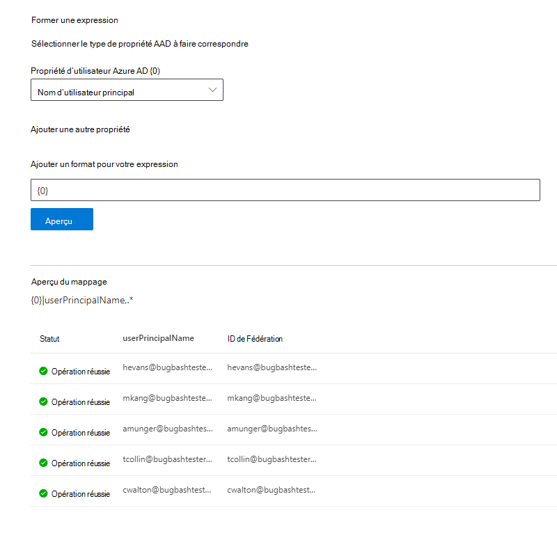

# Mapper vos identités Azure AD  

Cet article vous guide tout au long des étapes de mappage de vos identités Azure AD à un identificateur unique pour votre source de données (identité non Azure AD) afin que les utilisateurs de votre liste de contrôle d’accès avec des identités autres que Azure AD puissent voir les résultats de la recherche de connecteur étendues à ceux-ci.

Ces étapes s’appliquent uniquement aux administrateurs de recherche qui configurent un connecteur [Salesforce](salesforce-connector.md) par Microsoft avec des autorisations de recherche pour « uniquement les personnes ayant accès à cette source de données » et le type d’identité « AAD ». Les étapes suivantes vous expliquent comment mapper les propriétés de votre utilisateur Azure AD aux ID de **Fédération** de vos utilisateurs.

>[!NOTE]
>Si vous configurez un [connecteur Salesforce](salesforce-connector.md) et que vous sélectionnez **uniquement les personnes ayant accès à cette source de données** et le type d’identité **non-AAD** sur l’écran des autorisations de recherche, reportez-vous à la rubrique [mapper votre article d’identités non Azure ad](map-non-aad.md) pour obtenir des informations sur la façon de mapper des identités non Azure ad.  

## Étapes de mappage de vos propriétés Azure AD

### 1. Sélectionnez les propriétés de l’utilisateur Azure AD à mapper

Vous pouvez sélectionner les propriétés Azure AD que vous devez mapper à l’ID de Fédération.

Vous pouvez sélectionner une propriété utilisateur Azure AD dans la liste déroulante. Vous pouvez également ajouter autant de propriétés d’utilisateur Azure AD que vous le souhaitez si ces propriétés sont nécessaires pour créer le mappage d’ID de Fédération pour votre organisation.

### 2. créer une formule pour terminer le mappage

Vous pouvez combiner les valeurs des propriétés de l’utilisateur Azure AD pour former l’ID de Fédération unique.

Dans la zone formule, « {0} » correspond à la *première* propriété Azure ad que vous avez sélectionnée. « {1} » correspond à la *deuxième* propriété Azure ad que vous avez sélectionnée. « {2} » correspond à la *troisième* propriété Azure ad, et ainsi de suite.  

Voici quelques exemples de formules avec des résultats d’expressions régulières et des sorties de formule :

| Exemple de formule                  | Valeur de {0} la propriété pour un exemple d’utilisateur                 | Valeur de {1} la propriété pour un exemple d’utilisateur           | Sortie de la formule                  |
| :------------------- | :------------------- |:---------------|:---------------|
| {0}.{1} @contoso. com  | FirstName | prénom |firstname.lastname@contoso.com
| {0}@domain. com                 | identifi                 |             |userid@domain.com

Une fois que vous avez fourni votre formule, vous pouvez éventuellement cliquer sur **Aperçu** pour afficher un aperçu de 5 utilisateurs aléatoires de votre source de données avec leurs mappages utilisateur respectifs appliqués. La sortie de l’aperçu inclut la valeur des propriétés de l’utilisateur Azure AD sélectionnées à l’étape 1 pour ces utilisateurs et le résultat de la formule finale fournie à l’étape 2 pour cet utilisateur. Il indique également si la sortie de la formule peut être résolue en utilisateur Azure AD dans votre client via une icône « réussite » ou « échec ».  

>[!NOTE]
>Vous pouvez continuer à créer votre connexion si un ou plusieurs mappages utilisateur ont un État « échec » une fois que vous avez cliqué sur **Aperçu**. L’aperçu montre 5 utilisateurs aléatoires et leurs mappages à partir de votre source de données. Si le mappage que vous fournissez ne mappe pas tous les utilisateurs, vous pouvez observer ce cas.

## Exemple de mappage Azure AD

Consultez la capture instantanée ci-dessous pour obtenir un exemple de mappage Azure AD.

## Limites  

- Un seul mappage est pris en charge pour tous les utilisateurs. Les mappages conditionnels ne sont pas pris en charge.  

- Vous ne pouvez pas modifier votre mappage une fois la connexion publiée.  

- Les expressions Regex sur les propriétés de l’utilisateur Azure AD ne sont pas prises en charge pour la transformation d’ID de Fédération Azure AD.