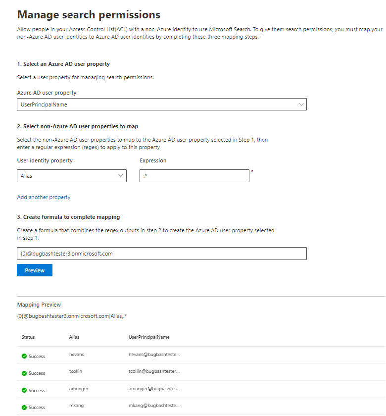

# Mapper vos identités non Azure ADMap your non-Azure AD Identities  

Cet article vous guide tout au long des étapes de mappage de vos identités non Azure AD à vos identités Azure AD, de sorte que les utilisateurs de votre liste de contrôle d’accès avec des identités non Azure AD puissent voir les résultats de la recherche de connecteur étendues à ceux-ci.This article walks you through the steps of mapping your non-Azure AD identities to your Azure AD identities so that people in your Access Control List (ACL) with non-Azure AD identities can see connector search results scoped to them.

Ces étapes s’appliquent uniquement aux administrateurs de recherche qui configurent un [ServiceNow](servicenow-connector.md) ou un connecteur [Salesforce](salesforce-connector.md) par Microsoft avec des autorisations de recherche pour « uniquement les personnes ayant accès à cette source de données » et le type d’identité « non AAD ».These steps are only relevant to search administrators who are setting up a [ServiceNow](servicenow-connector.md) or [Salesforce](salesforce-connector.md) connectors by Microsoft with search permissions for "Only people with access to this data source" and identity type "Non-AAD."

>[!NOTE]
>Si vous configurez un connecteur Salesforce et que vous sélectionnez **uniquement les personnes ayant accès à cette source de données** et le type d’identité **AAD** sur l’écran des autorisations de recherche, reportez-vous à la rubrique mapper votre article d' [identité Azure ad](map-aad.md) pour obtenir la procédure de mappage des identités Azure ad.If you are setting up a Salesforce connector and select **Only people with access to this data source** and identity type **AAD** on the search permissions screen, refer to the [Map your Azure AD Identities](map-aad.md) article for steps on how to map Azure AD identities.  

## Étapes de mappage de vos propriétés d’annonce non AzureSteps for mapping your non-Azure AD properties

### 1. Sélectionnez une propriété utilisateur Azure AD1. Select an Azure AD user property  

Vous pouvez sélectionner la propriété utilisateur Azure AD pour laquelle vous créez le mappage.You can select the Azure AD user property you are creating the mapping for. Il s’agit de la propriété cible que vous souhaitez mapper à vos identités AD non Azure.This is the target property you are aiming to map your non-Azure AD identities to.  

Vous pouvez sélectionner l’une des propriétés Azure AD suivantes :You can select one of the following Azure AD properties:

| Propriété Azure ADAzure AD property    | DéfinitionDefinition           | ExempleExample         |
| :------------------- | :------------------- |:--------------- |
| Nom d’utilisateur principal (UPN)User Principal Name (UPN)  | Un UPN se compose d’un préfixe UPN (le nom du compte d’utilisateur) et d’un suffixe UPN (nom de domaine DNS).A UPN consists of a UPN prefix (the user account name) and a UPN suffix (a DNS domain name). Le préfixe est joint au suffixe en utilisant le symbole « @ ».The prefix is joined with the suffix using the "@" symbol. | us1@contoso.onmicrosoft.comus1@contoso.onmicrosoft.com |
| ID Azure ADAzure AD ID                 | Un ID Azure AD pour un utilisateur donné est le GUID unique de l’utilisateur.An Azure AD ID for a given user is the unique GUID of the user.                 | 58006c96-9e6e-45ea-8c88-4a56851eefad58006c96-9e6e-45ea-8c88-4a56851eefad            |
| ID de sécurité Active Directory (SID)Active Directory Security ID (SID)                  | SID (identificateur de sécurité) est un identificateur unique utilisé par Active Directory pour identifier les objets en tant que principal de sécurité.SID (Security Identifier) is a unique identifier that Active Directory uses to identify objects as security principal.                  | S-1-5-21-453406510-812318184-4183662089S-1-5-21-453406510-812318184-4183662089             |

### 2. Sélectionnez les propriétés de l’utilisateur non Azure AD à mapper2. Select non-Azure AD user properties to map

Vous pouvez sélectionner les propriétés non Azure AD extraites de votre source de données pour appliquer des expressions régulières.You can select non-Azure AD properties pulled from your data source to apply regular expressions on. Pour en savoir plus sur l’emplacement de ces propriétés dans votre source de données, voir les pages [ServiceNow](servicenow-connector.md) et [Salesforce](salesforce-connector.md) .To learn more about where to find these properties in your data source, see the [ServiceNow](servicenow-connector.md) and [Salesforce](salesforce-connector.md) pages.  

Vous pouvez sélectionner une propriété d’utilisateur non Azure AD dans la liste déroulante et fournir une expression régulière à appliquer aux valeurs de ces propriétés d’utilisateur.You can select a non-Azure AD user property from the dropdown and provide a regular expression to be applied on those user property values. Pour en savoir plus sur les expressions régulières, consultez la rubrique [Regular expression Reference]( https://docs.microsoft.com/dotnet/standard/base-types/regular-expression-language-quick-reference).To learn more about regular expressions, see [regular expression reference]( https://docs.microsoft.com/dotnet/standard/base-types/regular-expression-language-quick-reference).  

Voici quelques exemples d’expressions régulières et leurs sorties appliquées à un exemple de chaîne :Below are some examples of regular expressions and their outputs applied to a sample string: 

| Exemple de chaîneSample String                  | Expression régulièreRegular expression                 | Sortie de l’expression régulière sur l’exemple de chaîneOutput of regular expression on sample string           |
| :------------------- | :------------------- |:---------------|
| Alexis VasquezAlexis Vasquez  | .\*.\* | Alexis VasquezAlexis Vasquez |
| Alexis VasquezAlexis Vasquez                 | ..$..$                 | facilesez            |
| Alexis VasquezAlexis Vasquez                  | (\w +) $(\w+)$                  | VasquezVasquez             |

Vous pouvez ajouter autant de propriétés d’utilisateur non Azure AD que vous le souhaitez pour les expressions.You can add as many non-Azure AD user properties as you would like expressions for. Vous pouvez appliquer différentes expressions régulières à la même propriété utilisateur si votre formule finale garantit que.You can apply different regular expressions to the same user property if your final formula warrants that.  

### 3. créer une formule pour terminer le mappage3. Create formula to complete mapping

Vous pouvez combiner les sorties des expressions régulières appliquées à chacune de vos propriétés d’utilisateur non Azure AD pour former la propriété Azure AD sélectionnée à l’étape 1.You can combine the outputs of the regular expressions applied to each of your non-Azure AD user properties to form the Azure AD property selected in step 1.

Dans la zone formule, « {0} » correspond à la sortie de l’expression régulière appliquée à la *première* propriété non Azure ad que vous avez sélectionnée.In the formula box, "{0}" corresponds to the output of the regular expression applied to the *first* non-Azure AD property you selected. « {1} » correspond à la sortie de l’expression régulière appliquée à la *deuxième* propriété non Azure ad que vous avez sélectionnée."{1}" corresponds to the output of the regular expression applied to the *second* non-Azure AD property you selected. « {2} » correspond à la sortie de l’expression régulière appliquée à la *troisième* propriété non Azure ad, et ainsi de suite."{2}" corresponds to the output of the regular expression applied to the *third* non-Azure AD property, and so on.  

Voici quelques exemples de formules avec des résultats d’expressions régulières et des sorties de formule :Below are some examples of formulas with sample regular expression outputs and formula outputs: 

| Exemple de formuleSample formula                  | Valeur de {0} on Sample UserValue of {0} on sample user                 | Valeur de {1} on Sample UserValue of {1} on sample user           | Sortie de la formuleOutput of formula                  |
| :------------------- | :------------------- |:---------------|:---------------|
| {0}.{1} @contoso. com{0}.{1}@contoso.com  | FirstNamefirstname | prénomlastname |firstname.lastname@contoso.comfirstname.lastname@contoso.com
| {0}@domain. com{0}@domain.com                 | identifiuserid                 |             |userid@domain.comuserid@domain.com

Une fois que vous avez fourni votre formule, vous pouvez éventuellement cliquer sur **Aperçu** pour afficher un aperçu de 5 utilisateurs aléatoires de votre source de données avec leurs mappages utilisateur respectifs appliqués.After you provide your formula, you can optionally click **Preview** to see a preview of 5 random users from your data source with their respective user mappings applied. La sortie de l’aperçu inclut la valeur des propriétés utilisateur non Azure AD sélectionnées à l’étape 2 pour ces utilisateurs et le résultat de la formule finale fournie à l’étape 3 pour cet utilisateur.The output of the preview includes the value of the non-Azure AD user properties selected in step 2 for those users and the output of the final formula provided in step 3 for that user. Il indique également si la sortie de la formule peut être résolue en utilisateur Azure AD dans votre client via une icône « réussite » ou « échec ».It also indicates whether the output of the formula could be resolved to an Azure AD user in your tenant via a "Success" or "Failed" icon.  

>[!NOTE]
>Vous pouvez continuer à créer votre connexion si un ou plusieurs mappages utilisateur ont un État « échec » une fois que vous avez cliqué sur **Aperçu**.You can still proceed with creating your connection if one or more user mappings have a "Failed" status after you click **Preview**. L’aperçu montre 5 utilisateurs aléatoires et leurs mappages à partir de votre source de données.The preview shows 5 random users and their mappings from your data source. Si le mappage que vous fournissez ne mappe pas tous les utilisateurs, vous pouvez observer ce cas.If the mapping you provide does not map all users, you may experience this case.

## Exemple de mappage de publicités non AzureSample non-Azure AD mapping

Consultez la capture instantanée ci-dessous pour un exemple de mappage de publicités non Azure.See the snapshot below for a sample non-Azure AD mapping.

## LimitesLimitations  

- Un seul mappage est pris en charge pour tous les utilisateurs.Only one mapping is supported for all users. Les mappages conditionnels ne sont pas pris en charge.Conditional mappings are not supported.  

- Vous ne pouvez pas modifier votre mappage une fois la connexion publiée.You cannot change your mapping once the connection is published.  

- Seules les expressions régulières par rapport aux propriétés utilisateur non AAD sont actuellement prises en charge pour la transformation.Only regex-based expressions against the non-AAD user properties are currently supported for the transformation.

- Seules 3 identités Azure AD vous pouvez choisir de mapper (UPN, ID Azure AD et SID AD).There are only 3 Azure AD identities you can choose to map to (UPN, Azure AD ID, and AD SID).