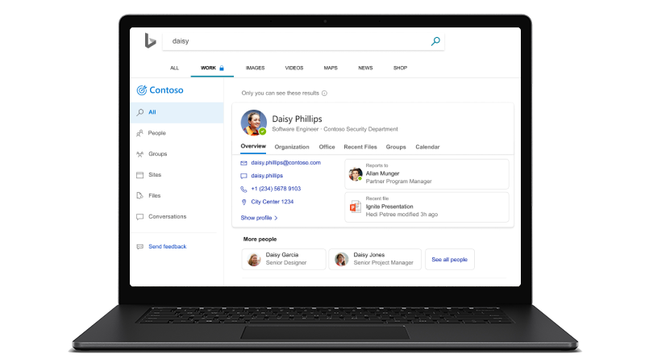

# Microsoft Search

<ul class="panelContent cardsW cols cols2">
    <li>
        

            

                

                    

                        

                            
                        

                    

                    

                    

                

            

        

    </li>
    <li>
        

            

                

                    

                        <h2>Pourquoi Microsoft Search(recherche Microsoft)</h2>
                        
Obtenir une expérience de recherche d'entreprise qui augmente la productivité et vous permet de gagner du temps en fournissant des résultats de recherche plus pertinents pour votre organisation

                        
<a href="why-microsoft-search.md">En savoir plus</a>

                    

                

            

        

    </li>
</ul>

<h2>Rubriques proposées</h2>

<ul class="panelContent cardsW">
    <li>
        

            

                

                    

                        

                            
                        

                    

                    

                        <h3>Fonctionnalités clés</h3>
                        
Voir les fonctionnalités disponibles pour les administrateurs et les utilisateurs, y compris les éléments que vous trouverez lors de la recherche

                        
<a href="features.md">En savoir plus</a>

                    

                

            

        

    </li>
    <li>
        

            

                

                    

                        

                            
                        

                    

                    

                        <h3>Configuration rapide de l'administrateur</h3>
                        
Découvrez comment activer Microsoft Search et le configurer pour votre organisation en quatre étapes simples

                        
<a href="quick-set-up.md">Démarrer maintenant</a>

                    

                

            

        

    </li>
    <li>
        

            

                

                    

                        

                            
                        

                    

                    

                        <h3>FAQ</h3>
                        
Obtenez des réponses à certaines des questions fréquemment posées à propos de Microsoft Search

                        
<a href="faqs.md">Parcourir le Forum aux questions</a>

                    

                

            

        

    </li>
</ul>

<ul class="panelContent cardsW cols cols2">
    <li>
        

            

                

                    

                        <h2>Utiliser Microsoft Search</h2>
                        
Microsoft Search est un moyen simple, rapide et plus sûr de trouver des informations, de gagner en productivité et de travailler plus efficacement

                        
<a href="use/about-microsoft-search.md">En savoir plus</a>

                    

                

            

        

    </li>
    <li>
        

            

                

                    

                        

                            
                        

                    

                    

                    

                

            

        

    </li>
</ul>

<h2>Plus d'informations</h2>
<ul class="panelContent cardsW">
    <li>
        

            

                

                    

                        
<a href="security.md">Sécurité</a>

                        
<a href="requirements.md">Configuration requise</a>
  
                        
<a href="about-the-admin-portal.md">À propos du portail d’Administration</a>

                    

                

            

        

    </li>
    <li>
        

            

                

                    

                        
<a href="quick-set-up.md">Configuration rapide</a>

                        
<a href="connected-services.md">Services connectés</a>

                        
<a href="set-up-microsoft-search.md">Configuration de la recherche Microsoft</a>

                    

                

            

        

    </li>
    <li>
        

            

                

                    

                        
<a href="create-bookmarks.md">Créer des signets</a>

                        
<a href="create-qas.md">Créer des Questions-réponses</a>

                        
<a href="add-users.md">Gérer les utilisateurs</a>

                    

                

            

        

    </li>
</ul>  