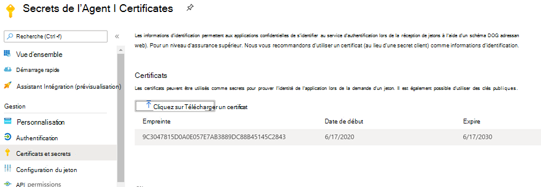

# <a name="graph-connector-agent"></a>Agent de connecteur Graph

L’utilisation de connecteurs Graph sur site nécessite l’installation du logiciel *d’agent du connecteur Graph.* Il permet de sécuriser le transfert de données entre les données sur site et les API du connecteur Graph. Cet article vous guide tout au long de l’installation et de la configuration de l’agent.

## <a name="installation"></a>Installation

Téléchargez la dernière version de l’agent de connecteur Graph [ici](https://aka.ms/gcadownload) et installez le logiciel à l’aide de l’Assistant d’installation. À l’aide de la configuration recommandée de l’ordinateur décrite ci-dessous, le logiciel peut gérer jusqu’à trois connexions. Toutes les connexions au-delà peuvent dégrader les performances de toutes les connexions sur l’agent.

Configuration recommandée :

* Windows 10, Windows Server 2016 R2 et supérieur
* [.NET Core Desktop Runtime 3.1 (x64)](https://dotnet.microsoft.com/download/dotnet-core/3.1)
* 8 cœurs, 3 GHz
* 16 Go de RAM, 2 Go d’espace disque
* Accès réseau à la source de données et à Internet via 443

Après avoir installé l’agent, si les serveurs proxy ou les pare-feu de votre organisation bloquent la communication vers des domaines inconnus, ajoutez-en ci-dessous à la liste d’accès.

1. *.servicebus.windows.net
2. *.events.data.microsoft.com
3. https://<span>login.microsoftonline.</span>com
4. https://<span>gcs.office.</span> com/
5. https://<span>graph.microsoft.</span> com/


## <a name="create-and-configure-an-app-for-the-agent"></a>Créer et configurer une application pour l’agent  

Tout d’abord, connectez-vous et notez que le privilège minimal requis sur le compte est administrateur de recherche. L’agent vous demandera ensuite de fournir des détails d’authentification. Utilisez les étapes ci-dessous pour créer une application et générer les détails d’authentification requis.

### <a name="create-an-app"></a>Créer une application

1. Go to the [Azure portal](https://portal.azure.com) and sign in with admin credentials for the tenant.
2. Accédez **aux inscriptions d’applications Azure Active Directory** à partir du volet de navigation et  ->   sélectionnez **Nouvelle inscription.**
3. Fournissez un nom pour l’application et sélectionnez **Enregistrer.**
4. Notez l’ID de l’application (client).
5. Ouvrez **les autorisations d’API** à partir du volet de navigation et **sélectionnez Ajouter une autorisation.**
6. Sélectionnez **Microsoft Graph,** puis les **autorisations d’application.**
7. Recherchez « ExternalItem.ReadWrite.All » et « Directory.Read.All » dans les autorisations, puis sélectionnez **Ajouter des autorisations.**
8. Sélectionnez **Accorder le consentement de l’administrateur pour [TenantName]** et confirmez en sélectionnant **Oui**.
9. Vérifiez que les autorisations sont dans l’état « accordé ».
     

### <a name="configure-authentication"></a>Configuration de l’authentification

Les détails de l’authentification peuvent être fournis à l’aide d’une secret client ou d’un certificat. Suivez les étapes de votre choix.

#### <a name="configuring-the-client-secret-for-authentication"></a>Configuration de la secret client pour l’authentification

1. Go to the [Azure portal](https://portal.azure.com) and sign in with admin credentials for the tenant.
2. Ouvrez **l’inscription** de l’application à partir du volet de navigation et allez à l’application appropriée. Sous **Gérer,** **sélectionnez Certificats et secrets.**
3. Sélectionnez **Nouvelle secret client** et sélectionnez une période d’expiration pour la secret. Copiez la secret généré et enregistrez-le, car il ne sera pas affiché à nouveau.
4. Utilisez cette question secrète client avec l’ID d’application pour configurer l’agent. Vous ne pouvez pas utiliser d’espaces vides dans **le champ Nom** de l’agent. Les caractères numériques alpha sont acceptés.

#### <a name="using-a-certificate-for-authentication"></a>Utilisation d’un certificat pour l’authentification

Il existe trois étapes simples pour l’utilisation de l’authentification basée sur les certificats :

1. Créer ou obtenir un certificat
1. Télécharger le certificat sur le portail Azure
1. Affecter le certificat à l’agent

##### <a name="step-1-get-a-certificate"></a>Étape 1 : Obtenir un certificat

Le script ci-dessous peut être utilisé pour générer un certificat auto-signé. Votre organisation peut ne pas autoriser les certificats auto-signés. Dans ce cas, utilisez ces informations pour comprendre les exigences et acquérir un certificat conformément aux stratégies de votre organisation.

```Powershell
$dnsName = "<TenantDomain like agent.onmicrosoft.com>" # Your DNS name
$password = "<password>" # Certificate password
$folderPath = "D:\New folder\" # Where do you want the files to get saved to? The folder needs to exist.
$fileName = "agentcert" # What do you want to call the cert files? without the file extension
$yearsValid = 10 # Number of years until you need to renew the certificate
$certStoreLocation = "cert:\LocalMachine\My"
$expirationDate = (Get-Date).AddYears($yearsValid)
$certificate = New-SelfSignedCertificate -DnsName $dnsName -CertStoreLocation $certStoreLocation -NotAfter $expirationDate -KeyExportPolicy Exportable -KeySpec Signature
$certificatePath = $certStoreLocation + '\' + $certificate.Thumbprint
$filePath = $folderPath + '\' + $fileName
$securePassword = ConvertTo-SecureString -String $password -Force -AsPlainText
Export-Certificate -Cert $certificatePath -FilePath ($filePath + '.cer')
Export-PfxCertificate -Cert $certificatePath -FilePath ($filePath + '.pfx') -Password $securePassword
```

##### <a name="step-2-upload-the-certificate-in-the-azure-portal"></a>Étape 2 : Télécharger le certificat dans le portail Azure

1. Ouvrez l’application et accédez à la section Certificats et secrets à partir du volet gauche
1. Sélectionnez « Télécharger le certificat » et téléchargez le fichier .cer
1. Ouvrez **l’inscription de** **l’application et sélectionnez Certificats et secrets** dans le volet de navigation. Copiez l’empreinte numérique du certificat.



##### <a name="step-3-assign-the-certificate-to-the-agent"></a>Étape 3 : Attribuer le certificat à l’agent

Si vous avez utilisé l’exemple de script pour générer un certificat, le fichier PFX se trouve à l’emplacement identifié dans le script.

1. Téléchargez le fichier pfx de certificat sur l’ordinateur de l’agent.
1. Double-cliquez sur le fichier pfx pour lancer la boîte de dialogue d’installation du certificat.
1. Sélectionnez « Ordinateur local » pour l’emplacement du magasin lors de l’installation du certificat.
1. Après avoir installé le certificat, ouvrez « Gérer les certificats d’ordinateur » via le menu Démarrer
1. Sélectionnez le certificat nouvellement installé sous « Personnel » > « Certificats »
1. Cliquez avec le bouton droit sur le cert et sélectionnez « Toutes les tâches » > « Gérer les clés privées... » Option
1. Dans la boîte de dialogue Autorisations, sélectionnez ajouter une option. Dans la boîte de dialogue de sélection de l’utilisateur, écrivez : « NT Service\GcaHostService » et cliquez sur « OK ». Ne cliquez pas sur le bouton « Vérifier les noms ».
1. Cliquez sur OK dans la boîte de dialogue Autorisations. L’ordinateur de l’agent est maintenant configuré pour que l’agent génère des jetons à l’aide du certificat.

## <a name="troubleshooting"></a>Résolution des problèmes
1. Si une connexion échoue avec l’erreur « 1011 : l’agent du connecteur Graph n’est pas accessible ou hors connexion ». Connectez-vous à l’ordinateur où l’agent est installé et démarrez l’application de l’agent si elle n’est pas déjà en cours d’exécution. Si la connexion continue d’échouer, vérifiez que le certificat ou la secret client fourni à l’agent lors de l’inscription n’a pas expiré et qu’il dispose des autorisations requises.
