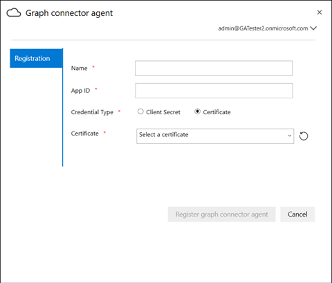

# Agent localOn-Prem Agent

## Agent de connecteur GraphGraph connector agent

Les connecteurs Graph local requièrent l’installation du logiciel de *l’agent Graph Connector* .On-prem Graph connectors require you to install *Graph connector agent* software. Elle permet de transférer rapidement et en toute sécurité des données entre des services de données et de Cloud Computing.It allows quick and secure data transfer between on-premises data and cloud services. Cet article vous guide tout au long des étapes d’installation et de configuration du logiciel.This article guides you through the steps of installing and configuring the software. Une fois configuré, il sera disponible pour la création de connexions à vos sources de données local à partir du [Centre d’administration Microsoft 365](https://admin.microsoft.com).Once configured, it will be available for creating connections to your on-prem data sources from the [Microsoft 365 admin center](https://admin.microsoft.com).

## InstallationInstallation

Téléchargez la dernière version de l’agent connecteur Graph à l’aide de [ce lien](https://download.microsoft.com/download/d/d/e/dde18236-9c67-437d-a864-894a0a888ef2/AgentPackage.msi) et installez le logiciel à l’aide de l’Assistant d’installation.Download the latest version of Graph connector agent using [this link](https://download.microsoft.com/download/d/d/e/dde18236-9c67-437d-a864-894a0a888ef2/AgentPackage.msi) and install the software using the installation wizard. Avec la configuration recommandée de l’ordinateur décrit ci-dessous, le logiciel peut gérer de manière transparente jusqu’à trois connexions.With the recommended configuration of the machine described below, the software can seamlessly handle up to three connections. Toutes les connexions au-delà de cela risquent de dégrader les performances.Any connections beyond that might degrade the performance.

Configuration recommandée :Recommended configuration:

* Windows 10, Windows Server 2012 R2 et versions ultérieuresWindows 10, Windows Server 2012 R2 and above
* 8 cœurs, 3 GHz8 cores, 3GHz
* 16 Go de RAM, 1 Go d’espace disque16GB RAM, 1GB Disk Space
* Accès réseau à la source de données et à Internet via 443Network access to data source and internet through 443

## Création de l’application pour l’agentCreating App for the agent  

L’instance de l’agent doit comporter peu de paramètres critiques avant de créer des connexions.The agent instance needs to be fed few critical parameters before you create connections. Ces paramètres incluent des détails d’authentification requis pour l’utilisation des API de réception Graph.These parameters include authentication details required for using Graph ingestion APIs.  

Étapes de création de l’application pour l’agent.Steps for creating App for the agent.

1. Accédez au [portail Azure](https://portal.azure.com) et connectez-vous avec les informations d’identification d’administrateur pour le client.Go to the [Azure portal](https://portal.azure.com) and sign in with admin credentials for the tenant.
2. Accédez à **Azure Active Directory**  ->  ,**inscriptions des applications** dans le volet de navigation, puis sélectionnez **nouvelle inscription**.Navigate to **Azure Active Directory** -> **App registrations** from the navigation pane and select **New registration**.
3. Fournissez un nom pour l’application, puis sélectionnez **Enregistrer**.Provide a name for the app and select **Register**.
4. Notez l’ID de l’application (client).Make a note of the Application (client) ID.
5. Ouvrez les autorisations de l' **API** à partir du volet de navigation et sélectionnez **Ajouter une autorisation**.Open **API permissions** from the navigation pane and select **Add a permission**.
6. Sélectionnez **Microsoft Graph** , puis **autorisations d’application**.Select **Microsoft Graph** and then **Application permissions**.
7. Recherchez « ExternalItem. ReadWrite. All » et « Directory. Read. All » à partir des autorisations, puis sélectionnez **Ajouter des autorisations**.Search for "ExternalItem.ReadWrite.All" and "Directory.Read.All" from the permissions and select **Add permissions**.
8. Sélectionnez **accorder le consentement de l’administrateur pour [TenantName]** et confirmez-le en sélectionnant **Oui**.Select **Grant admin consent for [TenantName]** and confirm by selecting **Yes**.
9. Vérifiez que les autorisations sont dans l’État accordé.Check that the permissions are in the granted state.
     

## Configuration de l’agent de connecteur GraphConfiguring Graph connector agent

Une fois que vous avez créé l’application pour l’agent, vous devez configurer l’agent avec les détails d’authentification appropriés.Once you have created the App for the agent, you must configure the agent with appropriate authentication details.

Les détails de l’authentification peuvent être fournis dans l’un des formulaires suivants.Authentication details can be provided in one of the following forms.

### Configuration de la clé secrète client pour l’authentificationConfiguring the client secret for authentication

1. Accédez au [portail Azure](https://portal.azure.com) et connectez-vous avec les informations d’identification d’administrateur pour le client.Go to the [Azure portal](https://portal.azure.com) and sign in with admin credentials for the tenant.
2. Ouvrez **inscription** de l’application dans le volet de navigation et accédez à l’application appropriée.Open **App Registration** from the navigation pane and go to the appropriate App. Sous **gérer**, sélectionnez **certificats et secrets**.Under **Manage**, select **Certificates and secrets**.
3. Sélectionnez **nouvelle clé secrète client** et sélectionnez une période d’expiration pour la clé secrète.Select **New Client secret** and select an expiry period for the secret. Copiez la clé secrète générée et enregistrez-la, car elle ne s’affichera plus.Copy the generated secret and save it because it will not be shown again.
4. Utilisez cette clé secrète client avec l’ID de l’application pour configurer l’agent.Use this Client secret along with the Application ID to configure the agent. N’utilisez pas d’espaces dans le champ **nom** de l’agent.Do not use any blank spaces in the **Name** field of the agent. Les caractères numériques alphanumériques sont acceptés.Alpha numeric characters are accepted.

## Utilisation d’un certificat d’empreinte numérique pour l’authentificationUsing thumbprint certificate for authentication

Si vous avez déjà configuré les détails d’authentification en suivant [la configuration de la clé secrète client pour l’authentification](#configuring-the-client-secret-for-authentication) , vous pouvez passer directement à la [rubrique Configuration Overview](configure-connector.md).If you have already configured the authentication details by following [Configuring the client secret for authentication](#configuring-the-client-secret-for-authentication) , then you can jump directly to [Setup overview](configure-connector.md).

1. Ouvrez **inscription** de l’application et sélectionnez **certificats et secrets** dans le volet de navigation.Open **App registration** and select **Certificates and secrets** from the navigation pane. Copiez l’empreinte de certificat.Copy the certificate thumbprint.

2. Utilisez la clé secrète client ou l’empreinte numérique pour enregistrer l’agent connecteur Graph.Use either the client secret or thumbprint to register the Graph connector agent.

