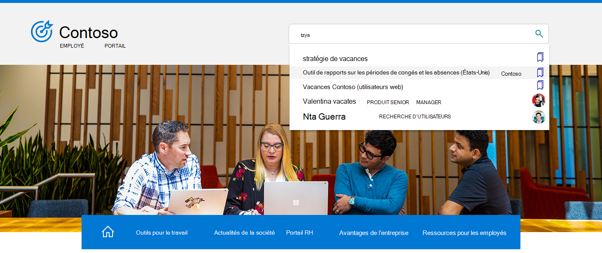

# Vue d’ensemble Recherche Microsoft dans Bing

Recherche Microsoft dans Bing regroupe les fonctionnalités de Recherche Microsoft et Bing recherche web. Il offre une expérience de recherche familière qui permet aux utilisateurs de trouver des résultats pertinents de votre organisation et du web. Pour préserver la sécurité et la sécurité de vos utilisateurs et de vos données, les utilisateurs doivent se connecter à leur compte scolaire ou Bing pour pouvoir trouver des résultats internes.

## Ce que voient les utilisateurs

Lorsque les membres de votre organisation utilisent Recherche Microsoft dans Bing, il existe deux endroits où ils peuvent voir les résultats scolaires ou de travail :

- Page TOUS les résultats : s’il existe un résultat scolaire ou scolaire pertinent, il apparaît en haut de la page des résultats de la recherche, suivi des résultats web publics.
- Page de résultats TRAVAIL ou ÉCOLE : seuls les résultats de votre organisation apparaissent sur cette page. Il n’inclut jamais les résultats web publics.

:::image type="content" alt-text="Pages de résultats de travail et toutes les pages pour Contoso et la page des résultats scolaires pour l’école secondaire Contoso." source="media/msb-overview/all-work-school-serps.gif" lightbox="media/msb-overview/all-work-school-serps.gif":::

Les utilisateurs peuvent facilement identifier les résultats professionnels ou scolaires en cherchant le logo, le nom ou l’image de leur profil de votre organisation.

## Getting started with Recherche Microsoft in Bing

Recherche Microsoft dans Bing est activé par défaut pour tous les membres de votre organisation. Si un utilisateur s’est déjà inscrit à son compte scolaire ou scolaire sur un autre service (par exemple, Outlook, Microsoft Teams ou SharePoint), il est automatiquement inscrit au même compte lorsqu’il Bing. Pour en savoir plus, consultez [Sécurité et confidentialité pour Recherche Microsoft dans Bing](security-for-search.md).

Si vous ne connaissez pas Recherche Microsoft dans Bing, nous vous suggérons de consulter le guide Recherche Microsoft du Bing [Admin Essentials pour](https://aka.ms/SearchAdminEssentials) obtenir des informations sur la configuration et le déploiement. Pour faciliter la sensibilisation des utilisateurs Recherche Microsoft, notre [kit d’adoption](https://aka.ms/SearchAdoptionKit) inclut des ressources de formation et de communication.

## Rechercher des expériences professionnelles et scolaires

Recherche Microsoft dans Bing offre des expériences de recherche adaptées aux besoins des utilisateurs professionnels et scolaires. Dans les organisations avec des plans de service d’entreprise, les utilisateurs obtiennent une expérience de recherche conçue pour le travail, y compris les graphiques organisationnels et Power BI réponses.

Les utilisateurs des organisations ayant des plans de service d’enseignement auront une expérience conçue pour la recherche scolaire, y compris les réponses sur les cours et les devoirs à venir.

Si votre organisation dispose de plans de service d’enseignement et d’entreprise, vous pouvez sélectionner une Recherche Microsoft dans Bing expérience utilisateur pour vos utilisateurs, qu’ils travaillent ou scolaires. Pour plus d’informations, voir [Sélectionner une expérience de recherche scolaire ou professionnelle.](/microsoftsearch/select-work-school-search-experience)

## Ajouter Recherche Microsoft de Bing à votre intranet

Recherche Microsoft est conçu pour faciliter l’accès aux informations internes partout où vos utilisateurs sont en recherche. Si les membres de votre organisation utilisent votre site intranet pour lancer une recherche scolaire ou scolaire, envisagez d’ajouter une zone de recherche incorporée à votre site.

Avec un script simple, vous pouvez ajouter une zone de recherche personnalisée et même la diriger vers un secteur vertical personnalisé. Pour plus d’informations, voir [Ajouter une zone de recherche à votre site intranet.](add-a-search-box-to-your-intranet-site.md)

## Définir les valeurs par défaut pour faciliter la recherche au travail ou à l’école

Pour faciliter l’adoption des Recherche Microsoft dans Bing, envisagez d’en faire une partie transparente de la journée de vos utilisateurs en fixant les valeurs par défaut.

**Navigateur par** défaut : lorsque vous Microsoft Edge navigateur par défaut, vos utilisateurs peuvent effectuer des recherches dans votre organisation et obtenir des suggestions de recherche pertinentes, directement à partir de la barre d’adresses. La recherche à partir de la barre d’adresses est rapide et facile à trouver, et il n’est pas nécessaire d’Bing pour lancer une recherche. Pour plus d’informations, [voir Définir Microsoft Edge comme navigateur par défaut.](/deployedge/edge-default-browser)

**Moteur de** recherche par défaut : si la modification de votre navigateur par défaut n’est pas une option, vous pouvez activer la recherche scolaire ou scolaire à partir de la barre d’adresses en Bing comme moteur de recherche par défaut. Pour plus d’informations, [voir Make Bing the default search engine](set-default-search-engine.md). Si votre organisation dispose d’un plan de service Applications Microsoft 365 pour les grandes entreprises (anciennement Office 365 ProPlus), vous pouvez définir Bing comme moteur de recherche par défaut pour Google Chrome en déployant le Recherche Microsoft dans l’extension Bing. Pour plus d’informations, [voir Recherche Microsoft dans Bing et Applications Microsoft 365 pour les grandes entreprises](/deployoffice/microsoft-search-bing).

**Page d’accueil** par défaut : la définition de Bing comme page d’accueil par défaut de votre organisation n’active pas la recherche au travail ou à l’école à partir de la barre d’adresses, mais elle offre un moyen simple d’accéder à bing.com. Pour plus d’informations, [voir Make Bing.com the default home page](set-default-homepage.md).

## Sécurité et confidentialité

Recherche Microsoft dans Bing utilise des mesures de sécurité et de confidentialité améliorées pour protéger les données de votre organisation et vos utilisateurs. Pour plus d’informations, voir Sécurité et confidentialité pour Recherche Microsoft dans [Bing](security-for-search.md) et comment Recherche Microsoft dans Bing aide à sécuriser [vos informations.](https://support.microsoft.com/office/how-microsoft-search-in-bing-helps-keep-your-info-secure-cbce46ae-bb1f-4d0e-86f1-5984f4589113)

## Voir aussi

- [Vue d’ensemble de Recherche Microsoft](overview-microsoft-search.md)
- [Planifier votre contenu](plan-your-content.md)
