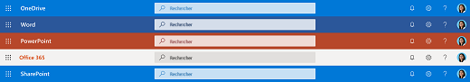
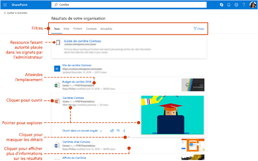

# Vue d’ensemble de Recherche MicrosoftOverview of Microsoft Search

Recherche Microsoft est la capacité de recherche unifiée dans les applications de productivité Microsoft 365 et l’écosystème de Microsoft plus large.Microsoft Search is the unified search capability in the Microsoft 365 productivity apps and the broader Microsoft ecosystem. Au fil du temps Recherche Microsoft sera disponible dans de plus en plus d’applications sur Microsoft 365.Over time Microsoft Search will be available in more and more apps across Microsoft 365.

Recherche Microsoft permet aux utilisateurs de trouver les réponses adaptées, personnes et le contenu pour effectuer leurs tâches dans l’application où elles travaillent déjà.Microsoft Search helps users find the right answers, people, and content to complete their tasks in the app they’re already working in.

- Les utilisateurs obtiennent des résultats pertinents dans le **contexte** de l’application à partir de laquelle ils effectuent la recherche.Users get results that are relevant in the **context** of the app they search from. Par exemple, quand ils effectuent une recherche dans Outlook, ils trouvent des e-mails, pas des sites SharePoint.For example, when they search in Outlook, they find emails, not sites in SharePoint. Lorsqu’ils recherchent dans SharePoint, ils trouvent des sites, pages et fichiers.When they search in SharePoint, they find sites, pages, and files.
- Quelle que soit l’application dans laquelle les utilisateurs travaillent ; Recherche Microsoft est **personnel**.Whichever app users are working in; Microsoft Search is **personal**.  Recherche Microsoft utilise les données de Microsoft Graph pour afficher les résultats qui sont pertinents pour vous.Microsoft Search uses insights from the Microsoft Graph to show results that are relevant to each user. Chaque utilisateur peut voir des résultats différents, même s’ils cherchaient les même mots.Each user might see different results, even if they search for the same words. Ils ne voient que les résultats auxquels ils ont déjà accès, Recherche Microsoft ne modifie pas les autorisations.They only see results that they already have access to, Microsoft Search doesn’t change permissions.
- Les utilisateurs n’ont pas besoin de se souvenir où se trouvent les informations.Users don’t need to remember where the information is located. Par exemple, un utilisateur travaille dans Word et souhaite réutiliser l’information d’une présentation qu’un collègue a partagée à partir de leur espace OneDrive.For example, a user is working in Word and wants to reuse information from a presentation that a colleague shared from their OneDrive. Il est inutile pour basculer vers OneDrive et rechercher cette présentation, ils peuvent simplement effectuer une recherche à partir de Word.There’s no need to switch to OneDrive and search for that presentation, they can simply search from Word.  
- Dans [Bing](https://bing.com), les utilisateurs obtiennent des résultats relatifs à leur organisation en plus des résultats web publics.When in Bing, users get results from within their organization in addition to the public web results.

## Ce que voient les utilisateursWhat users see

Dans Bing, les utilisateurs utilisent la même zone de recherche que pour les recherches web.In Bing, users use the same search box as for web searches. Dans les applications Microsoft 365, la zone Recherche Microsoft figure dans la barre d’en-tête.In the Microsoft 365 apps, users find the Microsoft Search box in the header bar. Elle se présente ainsi :It looks like this:

Lorsque les utilisateurs cliquent dans la zone de recherche, la recherche suggère des résultats basés sur leur activité récente dans Office 365 et basés sur le contenu populaire dans votre organisation.When users click in the search box, search suggests results based on their previous activity in Office 365 and based on content that’s trending in your organization. Les fichiers sur lesquels ils ont été récemment travaillé, les commandes qu’ils ont utilisées récemment ainsi que les personnes avec qui ils collaborent sont considérés comme des exemples d’activité que la recherche prend en compte.Files they were working on recently, commands they’ve used recently as well as people they collaborate with are examples of activity that search considers. Lorsque les utilisateurs commencent à taper dans la zone de recherche, les résultats suggérées se mettent à jour.As users start typing in the search box, the suggested results update. Les utilisateurs peuvent ouvrir les résultats de recherche directement à partir de la zone de recherche.Users can open search results right from the search box. Voici un exemple de recherche dans SharePoint.Here's an example of a search in SharePoint.

Si les suggestions dans la zone de recherche ne conviennent pas, l’action de la touche **Entrée** ouvre la liste complète des résultats.If the suggestions in the search box aren’t what they’re looking for, **Enter** opens the full list of results. Ils peuvent utiliser les métadonnées telles que : qui a modifié l’élément et quand, où se trouvent les éléments, mais aussi afficher un aperçu pour déterminer si c’est ce qu’ils cherchent.They can use metadata such as who last modified the item and when, where the items is located, as well as preview it to determine if it’s what they’re looking for.

## Avantages de la fonctionnalité Recherche MicrosoftBenefits of Microsoft Search

**Recherche au sein de Microsoft 365 à partir d’une zone de Recherche Microsoft** : les utilisateurs peuvent effectuer des recherches dans une zone de Recherche Microsoft et revenir rapidement à ce qu’ils faisaient.**Search across Microsoft 365 from any Microsoft Search box** – Users can search from any Microsoft Search box and get quickly back to what they were doing. La fonctionnalité Recherche Microsoft réunit les résultats provenant de sources de données dans Office 365, sont SharePoint, OneDrive Entreprise et Exchange.Microsoft Search brings together results from data sources in Office 365, including SharePoint, OneDrive for Business, and Exchange.

**Facile de rechercher** : Recherche Microsoft suggère les résultats en fonction de précédentes activités des utilisateurs dans Office 365, directement dans la zone de recherche.**Easy to search** – Microsoft Search suggests results based on users’ previous activity in Office 365, right in the search box.

**Recherche les dossiers partagés** : Recherche Microsoft utilise la compréhension de requête avancée pour simplifier la recherche de fichiers partagés.**Find shared files** – Microsoft Search uses advanced query understanding to make finding shared files simple. Les utilisateurs peuvent facilement trouver des fichiers sur lesquels ils collaborent.Users can easily find files they’re collaborating on.

**Afficher du contenu pertinent** : promouvoir les informations et réponses dont vos utilisateurs ont besoin pour effectuer les tâches, par exemple stratégies, avantages, les ressources, outils et bien plus encore.**Show relevant content** – Promote the information and answers your users need to complete tasks, for example policies, benefits, resources, tools, and more. Vous pouvez également cibler des groupes spécifiques, tels que les nouvelles recrues ou les employés à distance.You can also target specific groups, like new hires or remote workers.

**Recherche Microsoft évolue** : l’ensemble de types de contenu que les utilisateurs peuvent rechercher et l’intelligence de la zone de recherche augmenteront au fil du temps.**Microsoft Search evolves** – The set of content types users can search for and the intelligence of the search box will grow over time.

**Administrer sur toutes les applications** : Recherche Microsoft est **activé** par défaut, puis toute administration que vous effectuez s’applique à Recherche Microsoft dans toutes les applications.**Administer across all apps** – Microsoft Search is **on** by default and any administration you do applies to Microsoft Search in all the apps.

## Applications disposant actuellement de la fonctionnalité Recherche MicrosoftApps that currently have Microsoft Search

 La fonctionnalité Recherche Microsoft est activée par défaut pour toutes les applications Microsoft qui la prennent en charge.Microsoft Search is turned on by default for all Microsoft apps that support it. Tous les utilisateurs doivent se connecter avec un compte professionnel ou scolaire.All a user needs to do is to sign in with a work or school account.

Les applications suivantes offrent actuellement Recherche Microsoft :The following apps currently offer Microsoft Search:
- SharePoint OnlineSharePoint Online
- OneDrive EntrepriseOneDrive for Business
- Outlook sur le webOutlook on the web
- Applications Office sur WindowsOffice apps on Windows

En outre, les utilisateurs connectés peuvent trouver Recherche Microsoft dans :In addition, signed-in users find Microsoft Search in:

- Page d’accueil de BingBing homepage
- Office.comOffice.com
- Les pages d’accueil de Word, Excel et PowerPoint OnlineThe starting pages for Word, Excel, and PowerPoint Online

Les utilisateurs peuvent également lancer une recherche dans Bing à partir de la barre d’adresse de Microsoft Edge, s’ils utilisent Bing comme moteur de recherche par défaut.Users can also initiate a search in Bing from the Edge address bar, if they are using Bing as their default search engine.

## Configuration requiseRequirements

Vous devez disposer de l'un des abonnements Office 365 ou Microsoft 365 suivants :You must have one of the following Office 365 or Microsoft 365 subscriptions:

- Office 365 Business Essentials ou Office Business PremiumOffice 365 Business Essentials and Business Premium
- Office 365 A1/A3/A5Office 365 A1/A3/A5
- Office 365 éducation E1/E3Office 365 Education E1/E3
- Office 365 Entreprise E1/E3/E3 développeur/E5Office 365 Enterprise E1/E3/E3 developer/E5
- Office 365 F1Office 365 F1
- Microsoft 365 BusinessMicrosoft 365 Business
- Microsoft 365 A3/A5Microsoft 365 A3/A5
- Microsoft 365 F1/E3/E5Microsoft 365 F1/E3/E5

Les utilisateurs et les administrateurs de recherche doivent se voir attribuer ces licences.Both users and search admins must be assigned on of these licenses. Seuls les utilisateurs dotés de comptes actifs peuvent utiliser Recherche Microsoft. Ils doivent être **connectés**, car Recherche Microsoft requiert Azure Active DirectoryOnly users with active accounts can use Microsoft Search, and they must be **signed in**, because Microsoft Search requires Azure Active Directory

## Personnaliser Recherche Microsoft à votre organisationTailoring Microsoft Search to your organization

En tant qu’administrateur, vous pouvez simplifier pour vos utilisateurs l’obtention de résultats spécifiques d’une organisation quand ils font une recherche à partir de leur page d’accueil SharePoint, office.com ou Bing.As an admin you can make it easy for your users to get good organization-specific results when they search from their SharePoint start page, Office.com, or Bing. Pour ce faire, vous devez définir les réponses que Recherche Microsoft affiche en réponse à certains mots clés dans les requêtes.You do this by defining answers that Microsoft Search shows in response to certain keywords in queries. Il existe plusieurs types de réponses que vous pouvez définir :There are several types of answer that you can define: 

**Afficher du contenu utile** : aider les utilisateurs à trouver des outils et ressources importants au sein de votre organisation en leur créant des signets.**Show useful content** – Help users find important tools and resources within your organization by bookmarking them. Tout comme vous pouvez créer un signet pour une page Web publique, vous pouvez créer un signet pour toute page Web interne, que vos utilisateurs peuvent rechercher.Just as you can create a bookmark to a public webpage, you can create a bookmark for any internal webpage, which your users can search for. Vous pouvez également intégrer une application Power dans le signet pour que les utilisateurs puissent effectuer leurs tâches directement à partir du signet.You can also integrate a Power App in the bookmark so users can complete their task directly from the bookmark.

**Offrir des réponses aux questions fréquemment posées** : apporter les meilleures réponses aux questions les plus fréquemment posées au sein de votre organisation.**Offer answers to common questions** – Give the best answer for the most frequently asked questions in your organization. Lorsque les utilisateurs entrent une question courante dans la zone de recherche, Recherche Microsoft affiche la réponse au lieu de simplement fournir un lien vers la page web.When users enter a common question in the search box, Microsoft Search shows the answer as a result instead of just providing a link to the web page.

**Afficher les emplacements utiles** : afficher des résultats et les informations d’adresse pour des bâtiments de votre organisation, bureaux et autres espaces de travail sur une carte.**Show useful locations** – Show map results and address information for your organization's buildings, offices, and other workspaces on a map. Les utilisateurs peuvent utiliser les cartes pour obtenir des instructions, voir ce qui est proche et bien plus encore.Users can use the maps to get directions, see what's nearby, and more.

Vous pouvez afficher les statistiques d’utilisation qui indiquent la manière dont les utilisateurs sont en contact avec vos réponses et si les utilisateurs trouvent ce qu’ils cherchent.You can view usage statistics that show how users are engaging with your answers and whether users are finding what they were looking for. Sur cette base, vous pouvez affiner les réponses ou en ajouter de nouvelles.Based on this you can fine-tune answers or add new answers.

Pour plus d’informations sur l’utilisation des mots clés et des mots clés réservés, consultez la rubrique [Faciliter la recherche de contenu](make-content-easy-to-find.md).For more information about using keywords and reserved keywords, see [Make content easy to find](make-content-easy-to-find.md).

## Dans quel contenu la recherche est-elle effectuée ?What content is searched?

Le fonctionnalité Recherche Microsoft effectue une recherche dans du contenu que votre organisation a stocké dans SharePoint Online, OneDrive Entreprise et Exchange, y compris dans la liste d’adresses globale et les groupes Office 365.Microsoft Search searches in an the content that your organization has stored in SharePoint Online, OneDrive for Business, and Exchange, including the global address list and Office 365 groups. Recherche Microsoft n'effectue pas de recherche parmi les clients et n'affiche pas les résultats des contenus partagés par les entreprises.Microsoft Search does not search across tenants or show results from content that's shared by organizations. Si votre organisation a mis en place un environnement SharePoint hybride utilisant une fonctionnalité de recherche hybride dans le cloud, Recherche Microsoft renvoie les résultats de recherche du contenu SharePoint en ligne et local, y compris tout contenu externe que vous avez connecté à votre environnement SharePoint Server.If your organization has set up a hybrid SharePoint environment using cloud hybrid search, Microsoft Search returns search results from both online and on-premises SharePoint content, including any external content you’ve connected to your SharePoint Server environment. [Apprenez-en davantage sur les environnements hybrides de recherche](https://docs.microsoft.com/sharepoint/hybrid/learn-about-cloud-hybrid-search-for-sharepoint).[Learn more about hybrid search environments](https://docs.microsoft.com/sharepoint/hybrid/learn-about-cloud-hybrid-search-for-sharepoint).

Lorsque des utilisateurs effectuent une recherche à partir de la page d’accueil de SharePoint ou d’Office.com, la fonctionnalité Recherche Microsoft effectue une recherche dans tout le contenu de leur organisation et présente les résultats que l'utilisateur est autorisé à voir.When users search from the SharePoint start page or Office.com, Microsoft Search searches across all the content in their organization and presents the results that the user has permission to see. C’est ce qu’on appelle l’**étendue de recherche globale**.This is known as the **global search scope**.

Lorsque des utilisateurs recherchent à partir de Bing, ils obtiennent les résultats les plus pertinents trouvés dans tout le contenu de leur organisation incorporé dans la liste des résultats provenant du **web**.When users search from Bing, users get the most relevant results from all the content in their organization embedded in the list of results from the **web**. S’ils ont besoin d’afficher **tous** les résultats provenant de l’organisation, l’étendue de recherche globale est à portée de clic.If they need to see **all** organizational results, the global search scope is only a click away.

## Quels types de résultats les utilisateurs peuvent-ils trouver ?What types of results can users find?
Les utilisateurs trouvent les types de résultats suivants selon qu’ils recherchent à partir de :Users find the following types of results when they search from:

**SharePoint**: fichiers, dossiers, membres de votre organisation, organigrammes hiérarchiques, sites, pages de site, actualités, listes et éléments de liste.**SharePoint**: Files, folders, people in your organization, organization charts, sites, site pages, news, lists and list items. Si spécifié, réponses aux questions fréquemment posées, signets menant à des informations faisant autorité, localisations et outils.If defined, answers to common questions, bookmarks that lead to authoritative information, locations, and tools. [Découvrez les types de fichiers que vous pouvez trouver](https://docs.microsoft.com/SharePoint/technical-reference/default-crawled-file-name-extensions-and-parsed-file-types).[Learn which types of files you can find](https://docs.microsoft.com/SharePoint/technical-reference/default-crawled-file-name-extensions-and-parsed-file-types).

**Pages d’accueil Office.com et Word, Excel et PowerPoint Online** : applications, fichiers, dossiers, contacts, organigrammes hiérarchiques, sites SharePoint, pages de site, listes et éléments de liste.**Office.com and Word, Excel, and PowerPoint Online start pages**: Apps, files, folders, people, organization charts, SharePoint sites, site pages, lists and list items. Si spécifié, réponses aux questions fréquemment posées, signets menant à des informations faisant autorité, localisations et outils.If defined, answers to common questions, bookmarks that lead to authoritative information, locations, and tools. Des fichiers du même type que dans SharePoint peuvent être trouvés.Files of the same type as in SharePoint can be found.

**Bing** : contenu sur le web public, fichiers, groupes Office 365, contacts, conversations Yammer et Teams, organigrammes, sites SharePoint.**Bing**: Content on the public web, files, Office 365 groups, people, Yammer and Teams conversations, organization charts, SharePoint sites. Si spécifié, réponses aux questions fréquemment posées, signets menant à des informations faisant autorité, localisations et outils.If defined, answers to common questions, bookmarks that lead to authoritative information, locations, and tools.  Des fichiers Word, Excel, PowerPoint, Visio, OneNote et PDF peuvent être trouvés.Word, Excel, PowerPoint, Visio, OneNote, and PDF files can be found.

**Outlook** : messages électroniques, pièces jointes et membres de votre organisation.**Outlook**: Emails, attachments, and people in your organization.

**Applications Office sur Windows** : actions dans l’application, contacts de votre organisation et sur le web, fichiers, explications de mots, correspondances pour la requête dans le fichier ou dans le contenu d’aide, contenu sur le web.**Office apps on Windows**: Actions in the app, people in your organization and on the web, files, word explanations, matches for the query inside the file or in help content, content on the web. Fichiers Word, Excel, PowerPoint, Visio et OneNote sont accessibles.Word, Excel, PowerPoint, Visio, and OneNote files can be found.

**OneDrive**: les fichiers du même type que dans SharePoint sont accessibles.**OneDrive**: Files of the same type as in SharePoint can be found.

## Comment fonctionne Recherche Microsoft ?How does Microsoft Search work?

Lorsqu’un utilisateur effectue une recherche, Recherche Microsoft traite la requête et analyse l’objectif de recherche de plus grandes phrases, à l’aide de l’Intelligence artificielle (AI) pour en savoir plus sur les phrases courantes superflues que les utilisateurs ajoutent à leurs requêtes et qui n’ont pas d’impact sur leur objectif de recherche.When a user searches, Microsoft Search processes the query and parses search intent from larger phrases, using Artificial Intelligence (AI) to learn common superfluous phrases users add to their queries that don't impact their search intent. Par exemple, lorsqu’un utilisateur recherche « comment modifier mon mot de passe », nous extrayons les mots les moins importants de la requête, puis déclenchons la recherche en nous basant sur les mots pertinents comme par exemple, « modifier mot de passe ».For example, when a user searches for "how to change my password" we extract the less important words from the query and trigger based on the relevant ones like "change password".  

Recherche Microsoft ne crée pas de nouvel index, il recherche les index existants de SharePoint Online, de OneDrive Entreprise et de contenu Exchange.Microsoft Search does not create a new index, it searches the existing indexes of SharePoint Online, OneDrive for Business, and Exchange content.

Les résultats de recherche que l’utilisateur est **autorisé** à voir sont présentés dans la page de résultats de recherche.The search results that the user has **permission** to see are presented on the search results page. Recherche Microsoft utilise des algorithmes de classement intelligent pour classer les résultats selon la pertinence.Microsoft Search uses intelligent ranking algorithms to order results based on relevance.

## Recherche Microsoft dans SharePointMicrosoft Search in SharePoint

La fonctionnalité Recherche Microsoft est l’expérience de recherche moderne dans SharePoint Online.Microsoft Search in SharePoint is the modern search experience in SharePoint Online. SharePoint Online offre également une expérience de recherche classique.SharePoint Online also offers a classic search experience. Les deux expériences sont activées par défaut et toutes deux recherchent dans le même contenu.Both experiences are on by default and both search the same content. En tant qu’administrateur de recherche, vous ne pouvez ni activer, ni désactiver ces expériences de recherche.As a search administrator you can’t turn on either experience in SharePoint Online. L’expérience de recherche de vos utilisateurs dépend de l’endroit depuis lequel ils effectuent une recherche :Which search experience your users get depends on where they search from:

- Les utilisateurs accèdent à la zone Recherche Microsoft sur la page d’accueil de SharePoint, des sites hub, des sites de communication et des sites d’équipe modernes.Users get the Microsoft Search box on the SharePoint start page, hub sites, communication sites, and modern team sites.
- Les utilisateurs accèdent à la zone de recherche classique sur des sites de publication, des sites d’équipe classiques et dans le centre de recherche.Users get the classic search box on publishing sites, classic team sites, and in the Search Center.

Vous pouvez personnaliser l’expérience de recherche classique, par exemple en ajoutant des affinements personnalisés à la page de résultats de recherche ou en affichant différemment un certain type de résultat.You can customize the classic search experience, for example by adding custom refiners to the search results page or displaying a certain type of result differently. Vous ne pouvez pas personnaliser l’expérience de Recherche Microsoft dans SharePoint de la même manière.You can’t customize the Microsoft Search experience in SharePoint like that. Certaines personnalisations que vous apportez à la recherche classique peuvent avoir une incidence sur la fonctionnalité Recherche Microsoft dans SharePoint.Some of the customizations you make for classic search might impact Microsoft Search in SharePoint. Si votre organisation compte utiliser les deux expériences de recherche dans SharePoint, [découvrez les différences entre celles-ci et comment éviter toute incidence sur la fonctionnalité Recherche Microsoft dans SharePoint](https://docs.microsoft.com/sharepoint/differences-classic-modern-search).If your organization will use both search experiences in SharePoint, [learn about the differences and how to avoid impacting Microsoft Search in SharePoint](https://docs.microsoft.com/sharepoint/differences-classic-modern-search).

## La Recherche Microsoft dans Bing protège les recherches relatives à l’entrepriseMicrosoft Search in Bing protects enterprise searches 
Lorsqu’un utilisateur entre une requête de recherche d’entreprise dans Recherche Microsoft, deux requêtes de recherche simultanées ont lieu : (1) une recherche des ressources internes à l’entreprise, et (2) une recherche distincte des résultats publics par Bing.com.When a user enters an enterprise search query in Microsoft Search, two simultaneous search requests occur: (1) a search of the enterprise’s internal resources, and (2) a separate search of public results from Bing.com. Étant donné que les recherches d’entreprise peuvent être sensibles, Recherche Microsoft a implémenté un groupe de mesures d’approbation qui décrivent la façon dont les résultats publics de Bing.com sont gérés.Because enterprise searches might be sensitive, Microsoft Search has implemented a set of trust measures that describe how the separate search of public results from Bing.com is handled. 
-   **Journalisation****Logging**
    - Tous les journaux de recherche relatifs au trafic Recherche Microsoft sont dissociés de l’identité de votre lieu de travail.All search logs that pertain to Microsoft Search traffic are disassociated from your workplace identity.
    - Si un ensemble de restrictions ou de seuils de fréquence est respecté, ce qui nous permet de nous assurer que la requête n’est pas spécifique à une organisation, la requête est traitée comme décrit dans la section des services Bing de la [Déclaration de confidentialité](https://privacy.microsoft.com/privacystatement).If a set of restrictions or frequency thresholds are met which give us confidence that the query is not specific to a particular organization, the query will be treated as described in the Bing services section of the [Privacy Statement](https://privacy.microsoft.com/privacystatement). Par exemple, ces requêtes sont utilisées pour modeler et entrainer des fonctionnalités publiques telles que la suggestion automatique ou les recherches associées.For example, such queries will be used to model and train public features such as autosuggest or related searches. 
    - Les requêtes qui ne répondent pas à ces restrictions ou seuils de fréquence seront stockées séparément du trafic public, hors Recherche Microsoft.Queries that do not meet the set of restrictions or frequency thresholds will be stored separately from public, non-Microsoft Search traffic.
-   **Publicité****Advertising**
    - Les publicités affichées sur Bing.com dans le cadre de la recherche d’entreprise sont uniquement liées au contenu des requêtes de recherche.Advertising shown on Bing.com in connection with enterprise searches is solely related to the content of the search queries. Les publicités ne sont jamais ciblées pour les utilisateurs en fonction de leur identité professionnelle.Ads are never targeted to a user based on their work identity or organization.

## Voir aussiSee also

[Configuration de la recherche MicrosoftSet up Microsoft Search](setup-microsoft-search.md)

[Rendre le contenu plus facilement trouvableMake content easy to find](make-content-easy-to-find.md)
