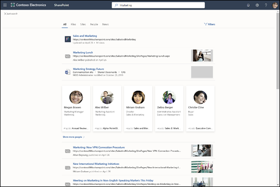

# Vue d’ensemble de Recherche Microsoft

Microsoft Search (recherche Microsoft) vous aide à trouver ce dont vous avez besoin pour effectuer ce sur quoi vous travaillez. Que vous recherchiez des personnes, des fichiers, des organigrammes, des sites ou des réponses à des questions courantes, vous pouvez utiliser Recherche Microsoft tout au long de votre journée de travail pour obtenir des réponses.

Recherche Microsoft permet aux utilisateurs de trouver les bonnes réponses, les personnes et le contenu pour effectuer leurs tâches dans l’application dans qui ils travaillent déjà.

- Les utilisateurs obtiennent des résultats pertinents dans le **contexte** de l’application à partir de laquelle ils effectuent la recherche. Par exemple, lorsqu’ils recherchent dans [Microsoft Outlook,](https://www.microsoft.com/outlook)ils trouvent des e-mails, et non des sites [SharePoint.](http://sharepoint.com/) Lorsqu’ils recherchent dans SharePoint, ils trouvent des sites, pages et fichiers.
- Quelle que soit l’application dans laquelle les utilisateurs travaillent ; Recherche Microsoft est **personnel**. Microsoft Search (recherche Microsoft) utilise des informations de [Microsoft Graph](https://developer.microsoft.com/graph/) pour afficher les résultats qui sont pertinents pour chaque utilisateur. Chaque utilisateur peut voir des résultats différents, même s’ils cherchaient les même mots. Ils voient uniquement les résultats qu’ils ont déjà accès, Microsoft Search (recherche Microsoft) ne modifie pas les autorisations.
- Les utilisateurs n’ont pas besoin de se souvenir où se trouvent les informations. Par exemple, un utilisateur travaille dans [Microsoft Word](https://products.office.com/word) et souhaite réutiliser les informations d’une présentation qu’un collègue a partagée à partir de [son OneDrive.](https://onedrive.live.com/about/) Il n’est pas nécessaire de basculer vers OneDrive et de rechercher cette présentation, ils peuvent simplement effectuer une recherche à partir de Word.
- Dans [Bing](https://bing.com), les utilisateurs obtiennent des résultats relatifs à leur organisation en plus des résultats web publics.

## Ce que voient les utilisateurs

Dans [Bing,](https://bing.com)les utilisateurs utilisent la même zone de recherche que pour les recherches web. Dans les applications Office, les utilisateurs trouvent la zone Recherche Microsoft dans la barre d’en-tête. Elle se présente ainsi :

Lorsque les utilisateurs cliquent dans la zone de recherche, la recherche suggère des résultats en fonction de leur activité précédente dans Office 365 et en fonction du contenu qui est en cours de tendance dans votre organisation.  Les fichiers sur qui ils travaillaient récemment, les commandes qu’ils ont utilisées récemment ainsi que les personnes avec qui ils collaborent sont des exemples d’activités que la recherche considère. Lorsque les utilisateurs commencent à taper dans **la** zone de recherche, les résultats suggérés sont mis à jour. Les utilisateurs peuvent ouvrir les résultats de recherche directement à partir de **la zone de** recherche. Voici un exemple de recherche dans [SharePoint.](http://sharepoint.com/)

Si les suggestions dans la zone de recherche ne sont pas ce que les utilisateurs recherchent, **Entrée** ouvre la liste complète des résultats. Ils peuvent utiliser des métadonnées telles que qui a modifié l’élément en dernier et quand, où se trouve l’élément, et l’afficher en aperçu pour déterminer s’il s’agit de ce qu’ils recherchent.

## Avantages de la fonctionnalité Recherche Microsoft

**Recherche au sein de Microsoft 365 à partir d’une zone de Recherche Microsoft** : les utilisateurs peuvent effectuer des recherches dans une zone de Recherche Microsoft et revenir rapidement à ce qu’ils faisaient. Recherche Microsoft rassemble les résultats à partir de sources de données dans Office 365, y compris [SharePoint,](http://sharepoint.com/) [Microsoft OneDrive](https://onedrive.live.com/about/business/)Entreprise et [Microsoft Exchange Server](https://products.office.com/exchange/microsoft-exchange-server).

**Facile à rechercher** : Recherche Microsoft suggère des résultats en fonction de l’activité précédente des utilisateurs dans Office 365, directement dans **la zone de** recherche.

**Recherche les dossiers partagés** : Recherche Microsoft utilise la compréhension de requête avancée pour simplifier la recherche de fichiers partagés. Les utilisateurs peuvent facilement trouver des fichiers sur lesquels ils collaborent.

**Afficher du contenu pertinent** : promouvoir les informations et réponses dont vos utilisateurs ont besoin pour effectuer les tâches, par exemple stratégies, avantages, les ressources, outils et bien plus encore. Vous pouvez également cibler des groupes spécifiques, tels que de nouveaux employés, des travailleurs à distance ou des zones géographiques différentes.

**Administrer sur toutes les applications** : Recherche Microsoft est **activé** par défaut, puis toute administration que vous effectuez s’applique à Recherche Microsoft dans toutes les applications.

## Personnaliser Recherche Microsoft à votre organisation

En tant qu’administrateur, vous pouvez créer une expérience de recherche Microsoft incroyable pour vos utilisateurs.

**Afficher du contenu utile** : les réponses fournissent des résultats rapides et faisant autorité pour rechercher des requêtes basées sur des mots clés. [Planifiez votre contenu.](plan-your-content.md)

**Ajouter du contenu externe** : les connecteurs Microsoft Graph vous permettent d’ajouter du contenu externe dans l’index. Utilisez des connecteurs pour enrichir l’expérience de recherche avec des données et des fichiers en dehors de Microsoft 365. [Vue d’ensemble des connecteurs Microsoft Graph](connectors-overview.md)

**Personnaliser l’expérience utilisateur :** vous pouvez personnaliser l’expérience utilisateur par le biais de secteurs verticaux et d’autres configurations. [Personnaliser la page Recherche Microsoft](customize-search-page.md)

## Contenu recherché

Recherche Microsoft affiche le contenu que votre organisation a stocké dans Microsoft 365 ou indexé via des connecteurs. Microsoft Search (recherche Microsoft) ne recherche pas sur les clients ou n’affiche pas les résultats à partir du contenu partagé par d’autres organisations. Si votre organisation a mis en place un environnement SharePoint hybride à l’aide de la recherche hybride sur le cloud, Recherche Microsoft renvoie les résultats de recherche à partir du contenu SharePoint en ligne et local, y compris tout contenu externe que vous avez connecté à votre environnement SharePoint Server. [Apprenez-en davantage sur les environnements hybrides de recherche](https://docs.microsoft.com/sharepoint/hybrid/learn-about-cloud-hybrid-search-for-sharepoint).

Les utilisateurs obtiennent les mêmes résultats de recherche qu’ils obtiennent à partir d’autres emplacements et obtiennent également des résultats à partir d’Internet.

## Fonctionnement de Microsoft Search (recherche Microsoft)

Lorsqu’un utilisateur effectue une recherche, Recherche Microsoft traite la requête et analyse l’objectif de recherche de plus grandes phrases, à l’aide de l’Intelligence artificielle (AI) pour en savoir plus sur les phrases courantes superflues que les utilisateurs ajoutent à leurs requêtes et qui n’ont pas d’impact sur leur objectif de recherche. Par exemple, lorsqu’un utilisateur recherche « comment modifier mon mot de passe », nous extrayons les mots les moins importants de la requête, puis déclenchons la recherche en nous basant sur les mots pertinents comme par exemple, « modifier mot de passe ».  
Les résultats de recherche que l’utilisateur est **autorisé** à voir sont présentés dans la page de résultats de recherche. Recherche Microsoft utilise des algorithmes de classement intelligent pour classer les résultats selon la pertinence.

## Protection des données de votre entreprise par Microsoft Search (recherche Microsoft) dans Bing

[Sécurité et confidentialité pour Microsoft Search (recherche Microsoft) dans Bing](security-for-search.md)

## Voir aussi

[Configuration de la recherche Microsoft](setup-microsoft-search.md)
