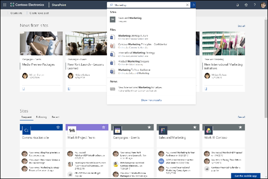

# Vue d’ensemble de Recherche Microsoft

Microsoft Search vous aide à trouver ce dont vous avez besoin pour effectuer ce que vous utilisez. Que vous cherchiez des personnes, des fichiers, des organigrammes, des sites ou des réponses aux questions courantes, vous pouvez utiliser Microsoft Search tout au long de votre journée de travail pour obtenir des réponses.

Recherche Microsoft permet aux utilisateurs de trouver les réponses adaptées, personnes et le contenu pour effectuer leurs tâches dans l’application où elles travaillent déjà.

- Les utilisateurs obtiennent des résultats pertinents dans le **contexte** de l’application à partir de laquelle ils effectuent la recherche. Par exemple, lorsqu’ils recherchent dans [Microsoft Outlook](https://www.microsoft.com/outlook), ils trouvent des courriers électroniques et non des sites [SharePoint](http://sharepoint.com/) . Lorsqu’ils recherchent dans SharePoint, ils trouvent des sites, pages et fichiers.
- Quelle que soit l’application dans laquelle les utilisateurs travaillent ; Recherche Microsoft est **personnel**. Microsoft Search utilise des informations de [Microsoft Graph](https://developer.microsoft.com/graph/) pour afficher les résultats pertinents pour chaque utilisateur. Chaque utilisateur peut voir des résultats différents, même s’ils cherchaient les même mots. Ils ne voient que les résultats auxquels ils ont déjà accès, Recherche Microsoft ne modifie pas les autorisations.
- Les utilisateurs n’ont pas besoin de se souvenir où se trouvent les informations. Par exemple, un utilisateur travaille dans [Microsoft Word](https://products.office.com/word) et souhaite réutiliser les informations d’une présentation qu’un collègue partage à partir de son [OneDrive](https://onedrive.live.com/about/). Il est inutile pour basculer vers OneDrive et rechercher cette présentation, ils peuvent simplement effectuer une recherche à partir de Word.
- Dans [Bing](https://bing.com), les utilisateurs obtiennent des résultats relatifs à leur organisation en plus des résultats web publics.

## Ce que voient les utilisateurs

Dans [Bing](https://bing.com), les utilisateurs utilisent la même zone de recherche que pour les recherches sur le Web. Dans les applications Office, les utilisateurs trouvent la zone de recherche Microsoft dans la barre d’en-tête. Elle se présente ainsi :

Lorsque les utilisateurs cliquent dans la zone de **recherche** , la recherche suggère des résultats en fonction de leur activité précédente dans Office 365 et en fonction du contenu qui fait l’objet de tendances dans votre organisation. Les fichiers sur lesquels ils ont été récemment travaillé, les commandes qu’ils ont utilisées récemment ainsi que les personnes avec qui ils collaborent sont considérés comme des exemples d’activité que la recherche prend en compte. Au fur et à mesure que les utilisateurs commencent à taper dans la zone de **recherche** , la mise à jour des résultats suggérés. Les utilisateurs peuvent ouvrir les résultats de la recherche directement à partir de la zone de **recherche** . Voici un exemple de recherche dans [SharePoint](http://sharepoint.com/).

Si les suggestions de la zone de recherche ne correspondent pas à ce que les utilisateurs recherchent, **Entrez** ouvre la liste complète des résultats. Ils peuvent utiliser les métadonnées telles que : qui a modifié l’élément et quand, où se trouvent les éléments, mais aussi afficher un aperçu pour déterminer si c’est ce qu’ils cherchent.

## Avantages de la fonctionnalité Recherche Microsoft

**Recherche au sein de Microsoft 365 à partir d’une zone de Recherche Microsoft** : les utilisateurs peuvent effectuer des recherches dans une zone de Recherche Microsoft et revenir rapidement à ce qu’ils faisaient. Microsoft Search rassemble les résultats de sources de données dans Office 365, y compris [SharePoint](http://sharepoint.com/), [Microsoft OneDrive entreprise](https://onedrive.live.com/about/business/)et [Microsoft Exchange Server](https://products.office.com/exchange/microsoft-exchange-server).

**Facile à rechercher** : Microsoft Search suggère des résultats en fonction de l’activité précédente des utilisateurs dans Office 365, directement dans la zone de **recherche** .

**Recherche les dossiers partagés** : Recherche Microsoft utilise la compréhension de requête avancée pour simplifier la recherche de fichiers partagés. Les utilisateurs peuvent facilement trouver des fichiers sur lesquels ils collaborent.

**Afficher du contenu pertinent** : promouvoir les informations et réponses dont vos utilisateurs ont besoin pour effectuer les tâches, par exemple stratégies, avantages, les ressources, outils et bien plus encore. Vous pouvez également cibler des groupes spécifiques, tels que de nouveaux employés, des travailleurs distants ou des régions géographiques différentes.

**Administrer sur toutes les applications** : Recherche Microsoft est **activé** par défaut, puis toute administration que vous effectuez s’applique à Recherche Microsoft dans toutes les applications.

## Personnaliser Recherche Microsoft à votre organisation

En tant qu’administrateur, vous pouvez créer une expérience de recherche Microsoft incroyable pour vos utilisateurs. 

**Afficher un contenu utile** : les réponses fournissent des résultats faisant autorité pour les requêtes de recherche basées sur des mots clés. [Faciliter la recherche de contenu](make-content-easy-to-find.md).

**Ajout de contenu externe** : les connecteurs Microsoft Graph vous permettent d’intégrer du contenu externe à l’index. Utilisez des connecteurs pour enrichir l’expérience de recherche avec des données et des fichiers en dehors de Microsoft 365. [Vue d’ensemble des connecteurs Microsoft Graph](connectors-overview.md)

**Personnaliser l’expérience utilisateur** : vous pouvez personnaliser l’expérience utilisateur en utilisant des configurations verticales et d’autres configurations. [Personnaliser la page Microsoft Search](customize-search-page.md)

## Dans quel contenu la recherche est-elle effectuée ?

Microsoft Search affiche le contenu que votre organisation a stocké dans Microsoft 365 ou indexé par le biais de connecteurs. Microsoft Search ne recherche pas dans les clients ni n’affiche les résultats provenant de contenu partagé par d’autres organisations. Si votre organisation a mis en place un environnement SharePoint hybride utilisant une fonctionnalité de recherche hybride dans le cloud, Recherche Microsoft renvoie les résultats de recherche du contenu SharePoint en ligne et local, y compris tout contenu externe que vous avez connecté à votre environnement SharePoint Server. [Apprenez-en davantage sur les environnements hybrides de recherche](https://docs.microsoft.com/sharepoint/hybrid/learn-about-cloud-hybrid-search-for-sharepoint).

Les utilisateurs obtiendront les mêmes résultats de recherche d’entreprise qu’ils obtiennent d’autres emplacements et obtiendront également des résultats à partir d’Internet.

## Comment fonctionne Recherche Microsoft ?

Lorsqu’un utilisateur effectue une recherche, Recherche Microsoft traite la requête et analyse l’objectif de recherche de plus grandes phrases, à l’aide de l’Intelligence artificielle (AI) pour en savoir plus sur les phrases courantes superflues que les utilisateurs ajoutent à leurs requêtes et qui n’ont pas d’impact sur leur objectif de recherche. Par exemple, lorsqu’un utilisateur recherche « comment modifier mon mot de passe », nous extrayons les mots les moins importants de la requête, puis déclenchons la recherche en nous basant sur les mots pertinents comme par exemple, « modifier mot de passe ».  
Les résultats de recherche que l’utilisateur est **autorisé** à voir sont présentés dans la page de résultats de recherche. Recherche Microsoft utilise des algorithmes de classement intelligent pour classer les résultats selon la pertinence.

## La Recherche Microsoft dans Bing protège les recherches relatives à l’entreprise

Lorsqu’un utilisateur entre une requête de recherche dans Microsoft Search dans Bing, deux requêtes de recherche simultanées se produisent :

- Une recherche des ressources internes de votre organisation.
- Une recherche distincte des résultats publics à partir de Bing.com. 

Étant donné que les recherches d’entreprise peuvent être sensibles, Microsoft Search a implémenté un ensemble de mesures d’approbation qui décrivent le mode `Bing.com` de gestion de la recherche séparée des résultats publics.

### Logging
- Tous `Bing.com` les journaux de recherche relatifs à Microsoft Search dans le trafic Bing sont désassociés à l’identité de votre espace de travail.
- Si un ensemble de restrictions ou de seuils de fréquence est respecté, ce qui nous permet de nous assurer que la requête n’est pas spécifique à une organisation, la requête est traitée comme décrit dans la section des services Bing de la [Déclaration de confidentialité](https://privacy.microsoft.com/privacystatement). Par exemple, ces requêtes seront utilisées pour modéliser et former des fonctionnalités publiques, telles que des suggestions automatiques ou des recherches associées.
- Les requêtes qui ne répondent pas à ces restrictions ou seuils de fréquence seront stockées séparément du trafic public, hors Recherche Microsoft.
### Publicité 
Les publicités affichées `Bing.com` en relation avec les recherches d’entreprise sont uniquement liées au contenu des requêtes de recherche. Les publicités ne sont jamais ciblées pour les utilisateurs en fonction de leur identité professionnelle.

## Voir aussi

[Configuration de la recherche Microsoft](setup-microsoft-search.md)

[Rendre le contenu plus facilement trouvable](make-content-easy-to-find.md)
