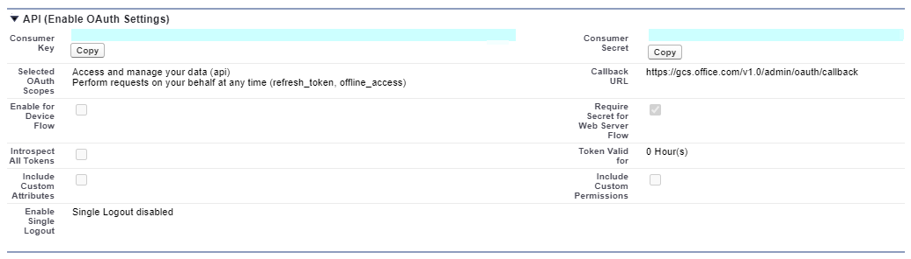
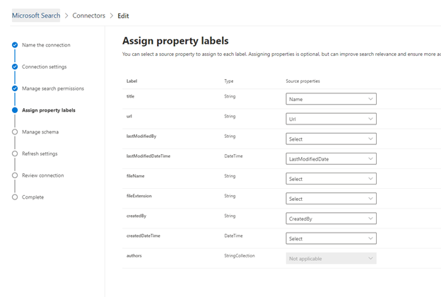

# Connecteur SalesforceSalesforce connector

Avec le connecteur de graphique Salesforce, votre organisation peut indexer des contacts, des opportunités, des prospects et des objets de comptes dans votre instance Salesforce.With the Salesforce Graph connector, your organization can index Contacts, Opportunities, Leads and Accounts objects in your Salesforce instance. Après avoir configuré le connecteur et le contenu d’index à partir de Salesforce, les utilisateurs finals peuvent rechercher ces éléments à partir d’un client Microsoft Search.After you configure the connector and index content from Salesforce, end users can search for those items from any Microsoft Search client

Cet article est destiné aux administrateurs [365 de Microsoft](https://www.microsoft.com/microsoft-365) ou toute personne qui configure, exécute et surveille un connecteur Salesforce.This article is for [Microsoft 365](https://www.microsoft.com/microsoft-365) administrators or anyone who configures, runs, and monitors a Salesforce connector. Elle explique comment configurer les fonctionnalités de connecteur et de connecteur, ainsi que les restrictions et les techniques de résolution des problèmes.It explains how to configure your connector and connector capabilities, limitations, and troubleshooting techniques.

>[!IMPORTANT]
>Le connecteur de graphique Salesforce prend actuellement en charge les versions estivales : 20, printemps, 20, hiver 20 et été 19.The Salesforce Graph connector currently supports Summer ’20, Spring’20, Winter’20, and Summer ’19 versions.

## Paramètres de connexionConnection settings

Pour vous connecter à votre instance Salesforce, vous avez besoin de l’URL de votre instance de Salesforce, de l’ID client et de la clé secrète client pour l’authentification OAuth.To connect to your Salesforce instance, you need your Salesforce instance URL, the Client ID, and Client Secret for OAuth authentication. Les étapes suivantes expliquent comment vous ou votre administrateur Salesforce pouvez obtenir ces informations à partir de votre compte Salesforce :The following steps explain how you or your Salesforce administrator can get this information from your Salesforce account:

- Connectez-vous à votre instance Salesforce et accédez à la configuration.Log in to your Salesforce instance and go to Setup

- Accédez à applications-> gestionnaire d’applications.Navigate to Apps -> App Manager.

- Sélectionnez **nouvelle application connectée**.Select **New connected app**.

- Complétez la section API comme suit :Complete the API section as follows:

    - Activez la case à cocher **activer les paramètres OAuth**.Select the checkbox for **Enable Oauth Settings**.

    - Spécifiez l’URL de rappel comme suit : [https://gcs.office.com/v1.0/admin/oauth/callback](https://gcs.office.com/v1.0/admin/oauth/callback)Specify the Callback URL as: [https://gcs.office.com/v1.0/admin/oauth/callback](https://gcs.office.com/v1.0/admin/oauth/callback)

    - Sélectionnez ces étendues OAuth requises.Select these required OAuth scopes. 

        - Accéder aux données et les gérer (API)Access and manage your data (api) 

        - Effectuer des demandes en votre nom à tout moment (refresh_token, offline_access)Perform requests on your behalf at any time (refresh_token, offline_access) 

    - Activez la case à cocher **exiger une clé secrète pour le flux de serveur Web**.Select the checkbox for **Require secret for web server flow**.

    - Enregistrez l’application.Save the app.
    
      

- Copiez la clé de consommateur et la clé secrète consommateur.Copy the consumer key and the consumer secret. Ceux-ci seront utilisés comme ID client et clé secrète client lorsque vous configurez les paramètres de connexion de votre connecteur Graph dans le portail d’administration Microsoft 365.These will be used as the Client ID and the Client Secret when you configure the Connection Settings for your Graph Connector in the Microsoft 365 admin portal.

  
- Avant de fermer votre instance de Salesforce, effectuez les étapes suivantes pour vous assurer que les jetons d’actualisation n’expirent pas :Before closing your Salesforce instance, perform the following steps to ensure that refresh tokens do not expire: 
    - Accédez à applications-> App ManagerGo to Apps -> App Manager
    - Recherchez l’application que vous venez de créer et sélectionnez la liste déroulante sur la droite.Find the app you just created and select the drop down on the right. Sélectionnez **gérer**Select **Manage**
    - Sélectionnez **modifier les stratégies**Select **edit policies**
    - Pour la stratégie de jeton d’actualisation, sélectionnez le **jeton d’actualisation est valide jusqu’à révoqué** .For refresh token policy, select **Refresh token is valid until revoked**

  

Vous pouvez désormais utiliser le [Centre d’administration M365](https://admin.microsoft.com/) pour terminer le reste du processus de configuration de votre connecteur Graph.You can now use the [M365 Admin Center](https://admin.microsoft.com/) to complete the rest of the setup process for your Graph connector.  

Configurez les paramètres de connexion de votre connecteur Graph comme suit :Configure the Connection settings for your Graph connector as follows:

- Pour l’URL d’instance, utilisez https://[domaine]. My. salesforce. com où Domain serait le domaine Salesforce de votre organisation.For the Instance URL, use https://[domain].my.salesforce.com where domain would be the Salesforce domain for your organization. 
- Entrez l’ID client et la clé secrète client que vous avez obtenus à partir de votre instance Salesforce et sélectionnez connexion.Enter the Client ID and Client Secret you obtained from your Salesforce instance and select Sign in.
- S’il s’agit de la première fois que vous tentez de vous connecter avec ces paramètres, une fenêtre contextuelle s’affiche pour vous demander de vous connecter à la force de connexion avec votre nom d’utilisateur et votre mot de passe d’administrateur.If this is the first time you have attempted to Sign in with these settings, you will get a pop up asking you to login to Salesforce with your admin username and password. La capture d’écran ci-dessous montre le menu contextuel.The screenshot below shows the popup. Entrez vos informations d’identification et sélectionnez connexion.Enter your credentials and select Log in.

  

  >[!NOTE]
  >Si la fenêtre contextuelle ne s’affiche pas, elle peut être bloquée dans votre navigateur, vous devez donc autoriser les fenêtres publicitaires intempestives et les redirections.If the pop up does not appear, it might be getting blocked in your browser, so you must allow pop-ups and redirects.

  >[!NOTE]
  >Si votre organisation utilise l’authentification unique (SSO), vous pouvez sélectionner **utiliser un domaine personnalisé** dans le coin inférieur droit de l’interface de connexion.If your organization uses single sign-on (SSO), you can select **Use Custom Domain** in the bottom, right-hand corner of the login interface. Entrez le domaine, puis cliquez sur **Continuer**.Enter the domain and then select **Continue**. Il accède à la page de connexion spécifique de votre organisation où vous pouvez vous connecter à l’aide de l’authentification unique.It will go to your organization specific login page where you will have an option to login with SSO.

- Vérifiez que la connexion a réussi en recherchant une bannière verte indiquant « connexion réussie » comme illustré dans la capture d’écran ci-dessous.Check that the connection was successful by searching for a green banner that says "Connection successful" as show in the screenshot below.

  

## Gérer les autorisations de rechercheManage search permissions
Vous devrez choisir les utilisateurs qui verront les résultats de la recherche à partir de cette source de données.You will need to choose which users will see search results from this data source. Si vous autorisez uniquement certains utilisateurs Azure Active Directory (AAD) ou non AAD à afficher les résultats de la recherche, vous devrez mapper les identités.If you allow only certain Azure Active Directory (AAD) or Non-AAD users to see the search results, you will then need to map the identities.

### Sélectionner des autorisationsSelect Permissions
Vous pouvez choisir d’ingérer les listes de contrôle d’accès (ACL) à partir de votre instance Salesforce ou vous pouvez autoriser tous les membres de votre organisation à consulter les résultats de la recherche à partir de cette source de données.You can choose to ingest Access Control Lists (ACLs) from your Salesforce instance, or you can allow everyone in your organization to see search results from this data source. Les listes de Contrã’le d’accès peuvent inclure des identités AAD (Azure Active Directory), des identités non AAD, ou les deux.ACLs can include Azure Active Directory (AAD) identities, Non-AAD identities, or both.

### Mapper des identités non AADMap non-AAD identities 
Si vous avez choisi d’une liste de contrôle d’accès à partir de votre instance Salesforce et que vous avez sélectionné « non AAD » pour le type d’identité, voir [mapper vos identités non Azure ad ](map-non-aad.md) pour obtenir des instructions sur le mappage des identités.If you chose to ingest an ACL from your Salesforce instance and selected "non-AAD" for the identity type see [Map your non-Azure AD Identities ](map-non-aad.md) for instructions on mapping the identities.

### Mapper des identités AADMap AAD identities
Si vous avez choisi d’une liste de contrôle d’accès à partir de votre instance Salesforce et que vous avez sélectionné « AAD » pour le type d’identité, voir [mapper vos identités Azure ad](map-aad.md) pour obtenir des instructions sur le mappage des identités.If you chose to ingest an ACL from your Salesforce instance and selected "AAD" for the identity type see [Map your Azure AD Identities](map-aad.md) for instructions on mapping the identities.

## Affecter des étiquettes de propriétéAssign property labels 
Vous pouvez affecter une propriété source à chaque étiquette en choisissant dans un menu d’options.You can assign a source property to each label by choosing from a menu of options. Si cette étape n’est pas obligatoire, le fait d’avoir des étiquettes de propriété améliore la pertinence de la recherche et garantit des résultats de recherche plus précis pour les utilisateurs finaux.While this step is not mandatory, having some property labels will improve the search relevance and ensure more accurate search results for end users. Par défaut, certaines étiquettes telles que « titre », « URL » et « LastModifiedBy » ont déjà reçu des propriétés source.By default, some of the Labels like ”Title”, “url”, and  “LastModifiedBy” have already been assigned source properties.

## Gérer le schémaManage Schema
Vous pouvez sélectionner les propriétés sources à indexer pour qu’elles puissent apparaître dans les résultats de la recherche.You can select what source properties should be indexed so that they can show up in search results. Par défaut, l’Assistant Connexion sélectionne un schéma de recherche en fonction d’un ensemble de propriétés source.The connection wizard by default selects a search schema based on a set of source properties. Vous pouvez le modifier en activant les cases à cocher de chaque propriété et attribut dans la page schéma de recherche.You can modify it by selecting the check boxes for each property and attribute in the search schema page. Les attributs de schéma de recherche incluent la recherche, la requête, l’extraction et l’affinement.Search schema attributes include Search, Query, Retrieve and Refine. Affiner vous permet de définir les propriétés qui peuvent être utilisées ultérieurement en tant qu’affinements personnalisés ou filtres dans l’expérience de recherche.Refine allows you to define the properties which can be later used as custom refiners or filters in the search experience.  

## Définir la planification d’actualisationSet the refresh schedule

Le connecteur Salesforce prend uniquement en charge l’actualisation des planifications pour les analyses complètes actuellement.The Salesforce connector only supports refresh schedules for full crawls currently.

>[!IMPORTANT]
>Une analyse complète recherche les objets et les utilisateurs supprimés qui ont été précédemment synchronisés avec l’index de recherche Microsoft.A full crawl finds deleted objects and users that were previously synced to the Microsoft Search index.

La planification recommandée est d’une semaine pour une analyse complète.The recommended schedule is one week for a full crawl.

## LimitesLimitations

- Le connecteur Graph ne prend actuellement pas en charge le partage et le partage basés sur un apex basé sur les territoires à l’aide de groupes personnels de salesforce.The Graph connector does not currently support Apex based , territory-based sharing and sharing using personal groups from Salesforce.
- Il existe un bogue connu dans l’API Salesforce que le connecteur Graph utilise lorsque les valeurs par défaut à l’échelle de l’organisation privée pour les prospects ne sont pas honorées actuellement.There is a known bug in the Salesforce API that the Graph connector uses where the private org wide defaults for leads is not honored currently.  
- Si un champ a une sécurité au niveau champ (FLS) définie pour un profil, le connecteur Graph n’admettra pas ce champ aux profils de cette organisation Salesforce. Par conséquent, les utilisateurs ne pourront pas Rechercher des valeurs de ces champs, ni s’afficher dans les résultats.If a field has field level security (FLS) set for a profile, the Graph connector will not ingest that field for any profiles in that Salesforce org. Users will thus not be able to search on values for those fields, nor will it  show up in the results.  
- Toutes les FLS configurées seront honorées pendant les synchronisations complètes du connecteur.Any FLS set up will be honored during the Full syncs of the connector.
- Dans l’écran gérer le schéma, ces noms de propriétés standard courants sont répertoriés une fois et la sélection est effectuée pour les rendre interutilisables, pouvant faire l’objet d’une recherche et d’une extraction s’appliquent à tout ou aucun.In the Manage Schema screen these common standard property names are listed once and the selection done to make them queryable, searchable and retrievable apply to all or none.
    - NomName
    - UrlUrl 
    - DescriptionDescription
    - FaxFax
    - TéléphonePhone
    - MobilePhoneMobilePhone
    - E-mailEmail
    - TypeType
    - TitreTitle
    - AccountIdAccountId
    - AccountNameAccountName
    - AccountUrlAccountUrl
    - AccountOwnerAccountOwner
    - AccountOwnerUrlAccountOwnerUrl
    - PropriétaireOwner
    - OwnerUrlOwnerUrl
    - CreatedByCreatedBy 
    - CreatedByUrlCreatedByUrl 
    - LastModifiedByLastModifiedBy 
    - LastModifiedByUrlLastModifiedByUrl 
    - LastModifiedDateLastModifiedDate
    - ObjectNameObjectName 
