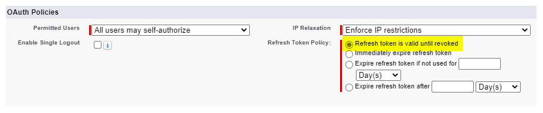
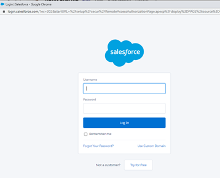
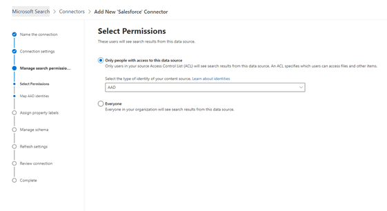

<!---Previous ms.author: rusamai --->

# Connecteur Salesforce Graph (prévisualisation)Salesforce Graph connector (preview)

Le connecteur Salesforce Graph permet à votre organisation d’indexer les objets Contacts, Opportunités, Prospects et Comptes dans votre instance Salesforce.The Salesforce Graph connector, allows your organization to index Contacts, Opportunities, Leads, and Accounts objects in your Salesforce instance. Après avoir configuré le connecteur et indexé le contenu à partir de Salesforce, les utilisateurs finaux peuvent rechercher ces éléments à partir de n’importe quel client Recherche Microsoft.After you configure the connector and index content from Salesforce, end users can search for those items from any Microsoft Search client.

> [!NOTE]
> Lisez [**l’article Configuration de votre connecteur Graph**](configure-connector.md) pour comprendre les instructions générales d’installation des connecteurs Graph.Read the [**Setup for your Graph connector**](configure-connector.md) article to understand the general Graph connectors setup instructions.

Cet article est réservé à toute personne qui configure, exécute et surveille un connecteur Salesforce Graph.This article is for anyone who configures, runs, and monitors a Salesforce Graph connector. Il complète le processus d’installation général et affiche des instructions qui s’appliquent uniquement au connecteur Salesforce Graph.It supplements the general setup process, and shows instructions that apply only for the Salesforce Graph connector. Cet article inclut également des informations sur [les limitations.](#limitations)This article also includes information about [Limitations](#limitations).

>[!IMPORTANT]
>Le connecteur Salesforce Graph prend actuellement en charge Summer '19 ou une ultérieure.The Salesforce Graph connector currently supports Summer '19 or later.

## Avant de commencerBefore you get started

Pour vous connecter à votre instance Salesforce, vous avez besoin de votre URL d’instance Salesforce, de l’ID client et de la secret client pour l’authentification OAuth.To connect to your Salesforce instance, you need your Salesforce instance URL, the Client ID, and Client Secret for OAuth authentication. Les étapes suivantes expliquent comment vous ou votre administrateur Salesforce pouvez obtenir ces informations à partir de votre compte Salesforce :The following steps explain how you or your Salesforce administrator can get this information from your Salesforce account:

- Connectez-vous à votre instance Salesforce et allez au programme d’installationLog in to your Salesforce instance and go to Setup

- Accédez à Apps -> App Manager.Navigate to Apps -> App Manager.

- Sélectionnez **Nouvelle application connectée.**Select **New connected app**.

- Remplissez la section API comme suit :Complete the API section as follows:

    - Activez la case à **cocher Activer les paramètres Oauth.**Select the checkbox for **Enable Oauth Settings**.

    - Spécifiez l’URL de rappel comme : [https://gcs.office.com/v1.0/admin/oauth/callback](https://gcs.office.com/v1.0/admin/oauth/callback)Specify the Callback URL as: [https://gcs.office.com/v1.0/admin/oauth/callback](https://gcs.office.com/v1.0/admin/oauth/callback)

    - Sélectionnez les étendues OAuth requises.Select these required OAuth scopes.

        - Accéder à vos données (api) et les gérerAccess and manage your data (api)

        - Effectuer des demandes en votre nom à tout moment (refresh_token, offline_access)Perform requests on your behalf at any time (refresh_token, offline_access)

    - Cochez la case exiger **une secret pour le flux de serveur web.**Select the checkbox for **Require secret for web server flow**.

    - Enregistrez l’application.Save the app.
    
      > [!div class="mx-imgBorder"]
      > 

- Copiez la clé grand public et la clé secrète consommateur.Copy the consumer key and the consumer secret. Ces informations sont utilisées comme ID client et secret client lorsque vous configurez les paramètres de connexion de votre connecteur Graph dans le portail d’administration Microsoft 365.This information will be used as the Client ID and the Client Secret when you configure the Connection Settings for your Graph Connector in the Microsoft 365 admin portal.

  > [!div class="mx-imgBorder"]
  > Consumer Key is at top of left column and Consumer Secret is at top of right column.](media/salesforce-connector/clientsecret.png)
  
- Avant de fermer votre instance Salesforce, suivez ces étapes pour vous assurer que les jetons d’actualisation n’expirent pas :Before closing your Salesforce instance, follow these steps to ensure that refresh tokens don't expire:
    - Go to Apps -> App ManagerGo to Apps -> App Manager
    - Recherchez l’application que vous avez créée et sélectionnez la drop-down sur la droite.Find the app you created and select the drop-down on the right. Sélectionnez **Gérer**Select **Manage**
    - Sélectionner des **stratégies de modification**Select **edit policies**
    - Pour la stratégie de jeton d’actualisation, **sélectionnez Le jeton d’actualisation est valide jusqu’à ce qu’il soit révoqué**For refresh token policy, select **Refresh token is valid until revoked**

  > [!div class="mx-imgBorder"]
  > 

Vous pouvez désormais utiliser le [Centre d’administration M365](https://admin.microsoft.com/) pour terminer le reste du processus de configuration de votre connecteur Graph.You can now use the [M365 Admin Center](https://admin.microsoft.com/) to complete the rest of the setup process for your Graph connector.

## Étape 1 : Ajouter un connecteur Graph dans le Centre d’administration Microsoft 365Step 1: Add a Graph connector in the Microsoft 365 admin center

Suivez les [instructions d’installation générales.](https://docs.microsoft.com/microsoftsearch/configure-connector)Follow the general [setup instructions](https://docs.microsoft.com/microsoftsearch/configure-connector).
<!---If the above phrase does not apply, delete it and insert specific details for your data source that are different from general setup instructions.-->

## Étape 2 : Nommer la connexionStep 2: Name the connection

Suivez les [instructions d’installation générales.](https://docs.microsoft.com/microsoftsearch/configure-connector)Follow the general [setup instructions](https://docs.microsoft.com/microsoftsearch/configure-connector).
<!---If the above phrase does not apply, delete it and insert specific details for your data source that are different from general setup instructions.-->

## Étape 3 : Configurer les paramètres de connexionStep 3: Configure the connection settings

Pour l’URL de l’instance, utilisez https://[domaine].my.salesforce.com où le domaine serait le domaine Salesforce de votre organisation.For the Instance URL, use https://[domain].my.salesforce.com where domain would be the Salesforce domain for your organization.

Entrez l’ID client et la secret client que vous avez obtenus à partir de votre instance Salesforce, puis sélectionnez Se connectez.Enter the Client ID and Client Secret you obtained from your Salesforce instance and select Sign in.

La première fois que vous tentez de vous connecter à l’aide de ces paramètres, une fenêtre vous demande de vous connecter à Salesforce avec votre nom d’utilisateur et votre mot de passe d’administrateur.The first time you've attempted to sign in with these settings, you'll get a pop-up asking you to log in to Salesforce with your admin username and password. La capture d’écran ci-dessous montre la fenêtre pop-up.The screenshot below shows the popup. Entrez vos informations d’identification, puis sélectionnez « Se connecter ».Enter your credentials and select "Log In".

  

  >[!NOTE]
  >Si la fenêtre pop-up n’apparaît pas, elle risque d’être bloquée dans votre navigateur. Vous devez donc autoriser les fenêtres pop-up et les redirections.If the pop up does not appear, it might be getting blocked in your browser, so you must allow pop-ups and redirects.

Vérifiez que la connexion a réussi en recherchant une bannière verte qui indique « Connexion réussie », comme indiqué dans la capture d’écran ci-dessous.Check that the connection was successful by searching for a green banner that says "Connection successful" as show in the screenshot below.

  > [!div class="mx-imgBorder"]
  > 

## Étape 4 : Gérer les autorisations de rechercheStep 4: Manage search permissions

Vous devez choisir les utilisateurs qui voient les résultats de la recherche à partir de cette source de données.You'll need to choose which users will see search results from this data source. Si vous autorisez uniquement certains utilisateurs Azure Active Directory (Azure AD) ou non Azure AD à voir les résultats de la recherche, assurez-vous de ma cartographier les identités.If you allow only certain Azure Active Directory (Azure AD) or Non-Azure AD users to see the search results, make sure you map the identities.

## Étape 4a : Sélectionner les autorisationsStep 4a: Select permissions

Vous pouvez choisir d’ingèrer des listes de contrôle d’accès à partir de votre instance Salesforce ou autoriser tous les membres de votre organisation à voir les résultats de recherche provenant de cette source de données.You can choose to ingest Access Control Lists (ACLs) from your Salesforce instance, or allow everyone in your organization to see search results from this data source. Les ALA peuvent inclure des identités Azure Active Directory (AAD) (utilisateurs fédérés d’Azure AD à Salesforce), des identités non Azure AD (utilisateurs Salesforce natifs ayant des identités correspondantes dans Azure AD) ou les deux.ACLs can include Azure Active Directory (AAD) identities (users who are federated from Azure AD to Salesforce), non-Azure AD identities (native Salesforce users who have corresponding identities in Azure AD), or both.

>[!NOTE]
>Si vous utilisez un fournisseur d’identité tiers comme Ping ID ou secureAuth, vous devez sélectionner « non-AAD » comme type d’identité.If you use a third-party Identity Provider like Ping ID or secureAuth, you should select "non-AAD" as the identity type.

> [!div class="mx-imgBorder"]
> 

Si vous avez choisi d’ing d’une ACL à partir de votre instance Salesforce et que vous avez sélectionné « non-AAD » pour le type d’identité, voir Mappage de vos [identités non Azure AD](map-non-aad.md) pour obtenir des instructions sur le mappage des identités.If you chose to ingest an ACL from your Salesforce instance and selected "non-AAD" for the identity type, see [Map your non-Azure AD Identities](map-non-aad.md) for instructions on mapping the identities.

## Étape 4b : Maser les identités AADStep 4b: Map AAD identities

Si vous avez choisi d’ing d’une ACL à partir de votre instance Salesforce et que vous avez sélectionné « AAD » pour le type d’identité, voir Mappage de vos [identités Azure AD](map-aad.md) pour obtenir des instructions sur le mappage des identités.If you chose to ingest an ACL from your Salesforce instance and selected "AAD" for the identity type, see [Map your Azure AD Identities](map-aad.md) for instructions on mapping the identities. Pour savoir comment configurer Azure AD SSO pour Salesforce, consultez ce [didacticiel.](https://docs.microsoft.com/azure/active-directory/saas-apps/salesforce-tutorial)To learn how to set up Azure AD SSO for Salesforce, see this [tutorial](https://docs.microsoft.com/azure/active-directory/saas-apps/salesforce-tutorial).

## Étape 5 : Attribuer des étiquettes de propriétéStep 5: Assign property labels

Vous pouvez affecter une propriété source à chaque étiquette en choisissant dans un menu d’options.You can assign a source property to each label by choosing from a menu of options. Bien que cette étape ne soit pas obligatoire, le fait d’avoir certaines étiquettes de propriétés améliorera la pertinence de la recherche et garantira de meilleurs résultats de recherche pour les utilisateurs finaux.While this step is not mandatory, having some property labels will improve the search relevance and ensure better search results for end users. Par défaut, certaines étiquettes telles que « Titre », « URL », « CreatedBy » et « LastModifiedBy » se sont déjà vu attribuer des propriétés source.By default, some of the Labels like "Title," "URL," "CreatedBy," and  "LastModifiedBy" have already been assigned source properties.

## Étape 6 : Gérer le schémaStep 6: Manage schema

Vous pouvez sélectionner les propriétés source qui doivent être indexées afin qu’elles s’afficheront dans les résultats de la recherche.You can select what source properties should be indexed so that they show up in search results. L’Assistant Connexion sélectionne par défaut un schéma de recherche basé sur un ensemble de propriétés source.The connection wizard by default selects a search schema based on a set of source properties. Vous pouvez le modifier en élecant les cases à cocher de chaque propriété et attribut de la page de schéma de recherche.You can modify it by selecting the check boxes for each property and attribute in the search schema page. Les attributs de schéma de recherche incluent recherche, requête, récupération et affiner.Search schema attributes include Search, Query, Retrieve, and Refine.
L’affinement vous permet de définir les propriétés qui peuvent être utilisées ultérieurement en tant qu’affinements ou filtres personnalisés dans l’expérience de recherche.Refine allows you to define the properties that can be later used as custom refiners or filters in the search experience.  

> [!div class="mx-imgBorder"]
> The options are Query, Search, Retrieve, and Refine](media/salesforce-connector/sf9.png)

## Étape 7 : Définir la planification de l’actualisationStep 7: Set the refresh schedule

Le connecteur Salesforce prend uniquement en charge les planifications d’actualisation pour les analyse complètes actuellement.The Salesforce connector only supports refresh schedules for full crawls currently.

>[!IMPORTANT]
>Une analyse complète recherche des objets et des utilisateurs supprimés qui ont été précédemment synchronisés avec l’index recherche Microsoft.A full crawl finds deleted objects and users that were previously synced to the Microsoft Search index.

La planification recommandée est d’une semaine pour une analyse complète.The recommended schedule is one week for a full crawl.

## Étape 8 : Examiner la connexionStep 8: Review connection

Suivez les [instructions d’installation générales.](https://docs.microsoft.com/microsoftsearch/configure-connector)Follow the general [setup instructions](https://docs.microsoft.com/microsoftsearch/configure-connector).
<!---If the above phrase does not apply, delete it and insert specific details for your data source that are different from general setup instructions.-->

<!---## Troubleshooting-->
<!---Insert troubleshooting recommendations for this data source-->

## LimitesLimitations

- Le connecteur Graph ne prend actuellement pas en charge le partage et le partage basés sur un territoire à l’aide de groupes personnels de Salesforce.The Graph connector doesn't currently support Apex based, territory-based sharing and sharing using personal groups from Salesforce.
- Il existe un bogue connu dans l’API Salesforce que le connecteur Graph utilise, où les valeurs par défaut privées à l’échelle de l’organisation pour les prospects ne sont pas honorées actuellement.There's a known bug in the Salesforce API the Graph connector uses, where the private org-wide defaults for leads aren't honored currently.  
- Si un champ a la sécurité au niveau du champ (FLS) définie pour un profil, le connecteur Graph n’inserre pas ce champ pour les profils dans cette organisation Salesforce. Par conséquent, les utilisateurs ne pourront pas rechercher sur les valeurs de ces champs, ni s’afficher dans les résultats.If a field has field level security (FLS) set for a profile, the Graph connector won't ingest that field for any profiles in that Salesforce org. As a result, users won't be able to search on values for those fields, nor will it show up in the results.  
- Dans l’écran Gérer le schéma, ces noms de propriétés standard communs sont répertoriés une seule fois, les options sont **Requête,** **Rechercher,** Récupérer **et** **Affiner,** et s’appliquent à tout ou aucun.In the Manage Schema screen these common standard property names are listed once, the options are **Query**, **Search**, **Retrieve**, and **Refine**, and apply to all or none.
    - NomName
    - UrlUrl
    - DescriptionDescription
    - FaxFax
    - TéléphonePhone
    - MobilePhoneMobilePhone
    - E-mailEmail
    - TypeType
    - TitreTitle
    - AccountIdAccountId
    - AccountNameAccountName
    - AccountUrlAccountUrl
    - AccountOwnerAccountOwner
    - AccountOwnerUrlAccountOwnerUrl
    - PropriétaireOwner
    - OwnerUrlOwnerUrl
    - CreatedByCreatedBy
    - CreatedByUrlCreatedByUrl
    - LastModifiedByLastModifiedBy
    - LastModifiedByUrlLastModifiedByUrl
    - LastModifiedDateLastModifiedDate
    - ObjectNameObjectName
