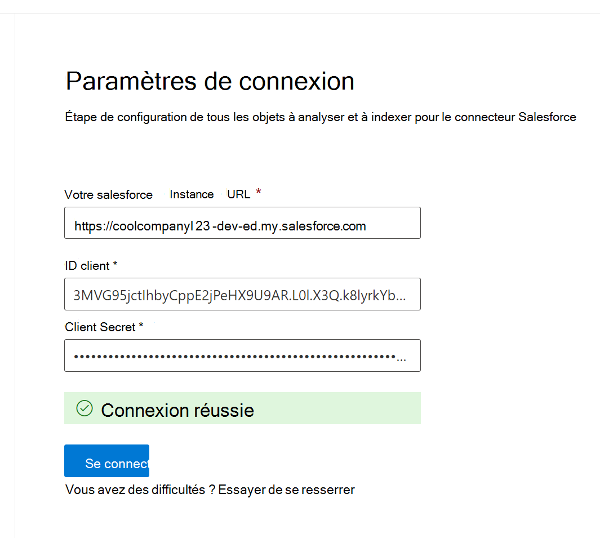

<!---Previous ms.author: rusamai --->

# Connecteur d’Graph Salesforce

Le connecteur Graph Salesforce permet à votre organisation d’indexer les objets Contacts, Opportunités, Prospects, Cas et Comptes dans votre instance Salesforce. Après avoir configuré le connecteur et indexé le contenu à partir de Salesforce, les utilisateurs finaux peuvent rechercher ces éléments à partir de n’importe Recherche Microsoft client.

> [!NOTE]
> Lisez [**l’article**](configure-connector.md) Installation de votre connecteur Graph pour comprendre les instructions générales Graph d’installation des connecteurs.

Cet article est réservé à toute personne qui configure, exécute et surveille un connecteur Graph Salesforce. Il complète le processus d’installation général et affiche des instructions qui s’appliquent uniquement au connecteur Graph Salesforce. Cet article inclut également des informations sur [les limitations.](#limitations)

>[!IMPORTANT]
>Le connecteur Graph Salesforce prend actuellement en charge l’été 19 ou une ultérieure.

## Avant de commencer

Pour vous connecter à votre instance Salesforce, vous avez besoin de votre URL d’instance Salesforce, de l’ID client et de la secret client pour l’authentification OAuth. Les étapes suivantes expliquent comment vous ou votre administrateur Salesforce pouvez obtenir ces informations à partir de votre compte Salesforce :

- Connectez-vous à votre instance Salesforce et allez au programme d’installation

- Accédez à Apps -> App Manager.

- Sélectionnez **Nouvelle application connectée.**

- Remplissez la section API comme suit :

    - Activez la case à cocher **pour activer la Paramètres Oauth.**

    - Spécifiez l’URL de rappel comme : [https://gcs.office.com/v1.0/admin/oauth/callback](https://gcs.office.com/v1.0/admin/oauth/callback)

    - Sélectionnez ces étendues OAuth requises.

        - Accéder et gérer vos données (api)

        - Effectuer des demandes en votre nom à tout moment (refresh_token, offline_access)

    - Cochez la case **Exiger une secret pour le flux de serveur web.**

    - Enregistrez l’application.
    
      > [!div class="mx-imgBorder"]
      > 

- Copiez la clé grand public et la clé secrète consommateur. Ces informations sont utilisées comme ID client et secret client lorsque vous configurez le Paramètres de connexion pour votre connecteur Graph dans le portail d’administration Microsoft 365.

  > [!div class="mx-imgBorder"]
  > 
  
- Avant de fermer votre instance Salesforce, suivez ces étapes pour vous assurer que les jetons d’actualisation n’expirent pas :
    - Go to Apps -> App Manager
    - Recherchez l’application que vous avez créée et sélectionnez la drop-down sur la droite. Sélectionnez **Gérer**
    - Sélectionner des **stratégies de modification**
    - Pour la stratégie de jeton d’actualisation, **sélectionnez Le jeton d’actualisation est valide jusqu’à ce qu’il soit révoqué**

  > [!div class="mx-imgBorder"]
  > 

Vous pouvez désormais utiliser le [centre Administration Microsoft 365 pour](https://admin.microsoft.com/) terminer le reste du processus d’installation de votre connecteur Graph de connexion.

## Étape 1 : Ajouter un connecteur Graph dans le Centre d’administration Microsoft 365

Suivez les [instructions d’installation générales.](./configure-connector.md)
<!---If the above phrase does not apply, delete it and insert specific details for your data source that are different from general setup instructions.-->

## Étape 2 : Nommer la connexion

Suivez les [instructions d’installation générales.](./configure-connector.md)
<!---If the above phrase does not apply, delete it and insert specific details for your data source that are different from general setup instructions.-->

## Étape 3 : Configurer les paramètres de connexion

Pour l’URL d’instance, utilisez https://[domaine].my.salesforce.com où le domaine serait le domaine Salesforce de votre organisation.

Entrez l’ID client et la secret client que vous avez obtenus à partir de votre instance Salesforce, puis sélectionnez Se connectez.

La première fois que vous tentez de vous connecter à l’aide de ces paramètres, une fenêtre vous demande de vous connecter à Salesforce avec votre nom d’utilisateur et votre mot de passe d’administrateur. La capture d’écran ci-dessous montre la fenêtre pop-up. Entrez vos informations d’identification, puis sélectionnez « Se connecter ».

  

  >[!NOTE]
  >Si la fenêtre pop-up n’apparaît pas, elle risque d’être bloquée dans votre navigateur. Vous devez donc autoriser les fenêtres pop-up et les redirections.

Vérifiez que la connexion a réussi en recherchant une bannière verte qui indique « Connexion réussie », comme indiqué dans la capture d’écran ci-dessous.

  > [!div class="mx-imgBorder"]
  > 

## Étape 4 : Sélectionner les propriétés

Sélectionnez les objets Salesforce que vous souhaitez que le connecteur analyse et inclue dans les résultats de recherche. Si le contact est sélectionné, le compte est également automatiquement sélectionné.

>[!NOTE]
>Si un champ a la sécurité au niveau du champ (FLS) définie pour un profil, le connecteur n’ingétre pas ce champ pour les profils dans cette organisation Salesforce. Par conséquent, les utilisateurs ne pourront pas rechercher sur les valeurs de ces champs, ni s’afficher dans les résultats.

## Étape 5 : Gérer les autorisations de recherche

Vous devez choisir les utilisateurs qui voient les résultats de la recherche à partir de cette source de données. Si vous autorisez uniquement certains utilisateurs Azure Active Directory (Azure AD) ou non Azure AD à voir les résultats de la recherche, assurez-vous de ma cartographier les identités.

### Étape 5.a : Sélectionner les autorisations

Vous pouvez choisir d’ingèrer des listes de contrôle d’accès à partir de votre instance Salesforce ou autoriser tous les membres de votre organisation à voir les résultats de la recherche à partir de cette source de données. Les ALA peuvent inclure des identités Azure Active Directory (AAD) (utilisateurs fédérés d’Azure AD à Salesforce), des identités non Azure AD (utilisateurs Salesforce natifs ayant des identités correspondantes dans Azure AD) ou les deux.

>[!NOTE]
>Si vous utilisez un fournisseur d’identité tiers comme Ping ID ou secureAuth, vous devez sélectionner « non-AAD » comme type d’identité.

> [!div class="mx-imgBorder"]
> 

Si vous avez choisi d’ing d’une ACL à partir de votre instance Salesforce et que vous avez sélectionné « non-AAD » pour le type d’identité, voir Mappage de vos [identités non Azure AD](map-non-aad.md) pour obtenir des instructions sur le mappage des identités.

### Étape 5.b : Ma cartographier les identités AAD

Si vous avez choisi d’ing d’une ACL à partir de votre instance Salesforce et que vous avez sélectionné « AAD » pour le type d’identité, voir Mappage de vos [identités Azure AD](map-aad.md) pour obtenir des instructions sur le mappage des identités. Pour savoir comment configurer Azure AD SSO pour Salesforce, consultez ce [didacticiel.](/azure/active-directory/saas-apps/salesforce-tutorial)

### Appliquer le mappage d’utilisateurs pour synchroniser vos identités Salesforce avec les identités Azure AD

Dans cette vidéo, vous pouvez voir le processus d’authentification à votre instance Salesforce, synchroniser vos identités non-Azure Active Directory avec vos identités Azure Active Directory et appliquer les trimmings de sécurité appropriés à vos éléments Salesforce.

> [!VIDEO https://www.youtube-nocookie.com/embed/SZYiFxZMKcM]

## Étape 6 : Attribuer des étiquettes de propriété

Vous pouvez affecter une propriété source à chaque étiquette en choisissant dans un menu d’options. Bien que cette étape ne soit pas obligatoire, le fait d’avoir des étiquettes de propriétés améliorera la pertinence de la recherche et garantira de meilleurs résultats de recherche pour les utilisateurs finaux. Par défaut, certaines étiquettes telles que « Titre », « URL », « CreatedBy » et « LastModifiedBy » se sont déjà vu attribuer des propriétés source.

## Étape 7 : Gérer le schéma

Vous pouvez sélectionner les propriétés source qui doivent être indexées afin qu’elles s’afficheront dans les résultats de la recherche. L’Assistant Connexion sélectionne par défaut un schéma de recherche basé sur un ensemble de propriétés source. Vous pouvez le modifier en élecant les cases à cocher de chaque propriété et attribut de la page de schéma de recherche. Les attributs de schéma de recherche incluent recherche, requête, récupération et affiner.
Affiner vous permet de définir les propriétés qui peuvent être utilisées ultérieurement en tant qu’affinements ou filtres personnalisés dans l’expérience de recherche.  

> [!div class="mx-imgBorder"]
> 

## Étape 8 : Définir la planification d’actualisation

Le connecteur Salesforce prend uniquement en charge les planifications d’actualisation pour les analyse complètes actuellement.

>[!IMPORTANT]
>Une analyse complète recherche les objets et les utilisateurs supprimés qui ont été précédemment synchronisés avec l Recherche Microsoft index.

La planification recommandée est d’une semaine pour une analyse complète.

## Étape 9 : Examiner la connexion

Suivez les [instructions d’installation générales.](./configure-connector.md)

>[!TIP]
>**Type de résultat par défaut**
>* Le connecteur Salesforce enregistre automatiquement un [type de](./customize-search-page.md#step-2-create-the-result-types) résultat une fois le connecteur publié. Le type de résultat utilise  une disposition des résultats générée dynamiquement en fonction des champs sélectionnés à l’étape 3.
>* Vous pouvez gérer le type de résultat en naviguant vers les [**types de**](https://admin.microsoft.com/Adminportal/Home#/MicrosoftSearch/resulttypes) résultats dans [le Centre d’administration Microsoft 365](https://admin.microsoft.com). Le type de résultat par défaut sera nommé « `ConnectionId` Default ». Par exemple, si votre ID de connexion est , votre disposition des résultats sera nommée `Salesforce` : « SalesforceDefault »
>* En outre, vous pouvez choisir de créer votre propre type de résultat si nécessaire.
<!---If the above phrase does not apply, delete it and insert specific details for your data source that are different from general setup instructions.-->

<!---## Troubleshooting-->
<!---Insert troubleshooting recommendations for this data source-->

## Limites

- Le connecteur Graph ne prend actuellement pas en charge le partage basé sur apex basé sur un territoire et le partage à l’aide de groupes personnels de Salesforce.
- Il existe un bogue connu dans l’API Salesforce que le connecteur Graph utilise, où les valeurs par défaut privées à l’échelle de l’organisation pour les prospects ne sont pas honorées actuellement.  
- Si un champ a la sécurité de niveau de champ (FLS) définie pour un profil, le connecteur Graph n’ing aura pas ce champ pour les profils dans cette organisation Salesforce. Par conséquent, les utilisateurs ne pourront pas rechercher sur les valeurs de ces champs, ni s’afficher dans les résultats.  
- Dans l’écran Gérer le schéma, ces noms de propriétés standard communs sont répertoriés une seule fois, les options sont **Requête,** **Rechercher,** Récupérer **et** **Affiner,** et s’appliquent à tout ou aucun.
    - Nom
    - Url
    - Description
    - Fax
    - Téléphone
    - MobilePhone
    - E-mail
    - Type
    - Titre
    - AccountId
    - AccountName
    - AccountUrl
    - AccountOwner
    - AccountOwnerUrl
    - Propriétaire
    - OwnerUrl
    - CreatedBy
    - CreatedByUrl
    - LastModifiedBy
    - LastModifiedByUrl
    - LastModifiedDate
    - ObjectName
