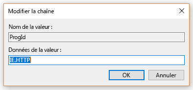
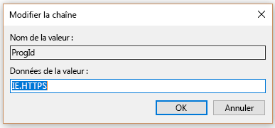

# Définir Microsoft Edge comme navigateur par défautMake Microsoft Edge the default browser
  
Pour garantir à vos utilisateurs une expérience optimale avec Recherche Microsoft, vous pouvez définir Microsoft Edge comme navigateur par défaut.To give your users the best experience with Microsoft Search, you can make Microsoft Edge the default browser. De cette façon, Microsoft Edge ne deviendra le navigateur par défaut que pour les utilisateurs de votre organisation, les utilisateurs individuels pouvant toujours sélectionner un navigateur différent.This will only set Microsoft Edge as the default browser for users in your org, individual users can still select a different browser.
  
  
## Windows 8 (et versions ultérieures)Windows 8 and above

Ces instructions vous montrent comment définir Microsoft Edge ou Internet Explorer comme navigateur par défaut pour les ordinateurs exécutant Windows 8 ou une version ultérieure.These instructions show you how to make Microsoft Edge or Internet Explorer as the default browser for computers running Windows 8 or later. Les utilisateurs pourront modifier le navigateur après avoir défini cette stratégie.Users will be able to change the browser after this policy is set.
  
### ÉTAPE 1 : Créer le fichier d'associations par défautSTEP 1: Create the default associations file
Créez le fichier d’associations par défaut dans le dossier SYSVOL du contrôleur de domaine.These steps try and create the default associations file in the SYSVOL folder of the domain controller.

1. Ouvrez une console d’administration PowerShell.Open an administrative PowerShell console.
1. `New-Item -Path "\\$env:USERDOMAIN\SYSVOL\$env:USERDNSDOMAIN" -Type Directory -Name "Settings"`
1. `$SettingsPath="\\$env:USERDOMAIN\SYSVOL\$env:USERDNSDOMAIN\Settings"`
1. `Start-Process Dism.exe -PassThru "/Online /Export-DefaultAppAssociations:$SettingsPath\AppAssoc.xml"`
    
  
### ÉTAPE 2.Step 2 Ajoutez ou modifiez le fichier d’associations par défautAdd or edit the default associations file

1. `Notepad "$SettingsPath\AppAssoc.xml"`
1. Modifier les entrées suivantes (.htm, .html, http, https) et supprimez les autres entrées si elles ne sont pas utilisées.Edit the following entries (.htm, .html, http, https), and remove other entries if they're not needed.
  - **Microsoft Edge****Microsoft Edge**
    - `<Association Identifier=".htm" ProgId="AppX4hxtad77fbk3jkkeerkrm0ze94wjf3s9" ApplicationName="Microsoft Edge" />`
              
    - `<Association Identifier=".html" ProgId="AppX4hxtad77fbk3jkkeerkrm0ze94wjf3s9" ApplicationName="Microsoft Edge" />`
    - `<Association Identifier="http" ProgId="AppXq0fevzme2pys62n3e0fbqa7peapykr8v" ApplicationName="Microsoft Edge" />`
    
  - **Internet Explorer****Internet Explorer**
    
    - `<Association Identifier=".htm" ProgId="htmlfile" ApplicationName="Internet Explorer" />`        
    - `<Association Identifier=".html" ProgId="htmlfile" ApplicationName="Internet Explorer" />`
    - `<Association Identifier="http" ProgId="IE.HTTP" ApplicationName="Internet Explorer" />`
    - `<Association Identifier="https" ProgId="IE.HTTPS" ApplicationName="Internet Explorer" />`

### Étape 3.Step 3. Modifier la stratégie de groupeEdit the Group Policy

1. Ouvrez la **Console de gestion des stratégies de groupe** (gpmc.msc) et basculez vers modifier toute stratégie existante ou créer une nouvelle.Open Group Policy Management Console (gpmc.msc) and switch to editing any existing policy or creating a new one.
1. Accédez à**Configuration ordinateur\Modèles administratifs\Composants Windows\Explorateur de fichiers**.Navigate to **Computer Configuration\Administrative Templates\Windows Components\File Explorer**
1. Double-cliquez sur **Définir un fichier de configuration d’associations par défaut**, définissez-le sur **Activé**, puis entrez le chemin d’accès à AppAssoc.xml (par exemple %USERDOMAIN%\SYSVOL\%USERDNSDOMAIN%\Settings\ AppAssoc.xml) Appliquez l’objet de la stratégie de groupe GPO résultant en le liant au domaine approprié.Double-click **Set a default associations configuration file**, set it to **Enabled**, and enter the path to AppAssoc.xml (for example %USERDOMAIN%\SYSVOL\%USERDNSDOMAIN%\Settings\AppAssoc.xml) Enforce the resultant GPO by linking it to the appropriate domain.

  
## Windows 7Windows 7

1. Configurez l’ordinateur local destiné à être utilisé pour définir la stratégie de groupe (GPO).Configure the local machine that will be used to set the GPO.
    
1. Ouvrez le**programmes par défaut de contrôle\Programmes\Programmes par défaut\Définir les programmes par défaut** et définir Internet Explorer par défaut.Open **Control Panel\Programs\Default Programs\Set Default Programs** and set Internet Explorer as the default. 
    
2. Ouvrez la Console de gestion des stratégies de groupe (gpmc.msc) et basculez vers modifier toute stratégie existante ou créer un nouveau.Open Group Policy Management Console (gpmc.msc) and switch to editing any existing policy or creating a new one.
    
1. Accédez à \*\* \<Ordinateur/Utilisateur\> Configuration\Stratégies\Préférences\Paramètres Windows\*\*.Navigate to **\<Computer/User\> Configuration\Policies\Preferences\Windows Settings**.
    
2. Avec le bouton droit cliquez sur **Registre\Nouveauté** et sélectionnez **Assistant Registre**.Right-click on **Registry\New** and select **Registry Wizard**.
    
3. Dans la fenêtre du navigateur de Registre, sélectionnez **Ordinateur Local** sur **Suivant**.From the Registry Browser window, select **Local Computer** and click **Next**.
    
4. Accédez à **HKEY_CURRENT_USER\Software\Microsoft\Windows\Shell\Associations\UrlAssociations\https** et sélectionnez la valeur ProgId. Vérifiez que la valeur semblable à celui ci-dessous :Navigate to **HKEY_CURRENT_USER\Software\Microsoft\Windows\Shell\Associations\UrlAssociations\https** and select the ProgId value. Make sure the value looks like the one below: 
    
    
  
5. Accédez à **HKEY_CURRENT_USER\Software\Microsoft\Windows\Shell\Associations\UrlAssociations\https** et sélectionnez la valeur ProgId. Vérifiez que la valeur semblable à celui ci-dessous :Navigate to **HKEY_CURRENT_USER\Software\Microsoft\Windows\Shell\Associations\UrlAssociations\https** and select the ProgId value. Make sure that the value looks like the one below: 
    
    
  
3. Appliquez la stratégie de groupe résultante GPO en les reliant au domaine approprié.Enforce the resultant GPO by linking it to the appropriate domain.
    
