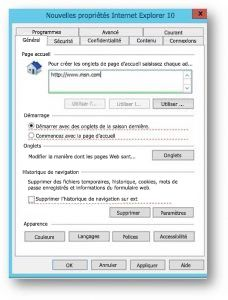

# Page d’accueil par défautSet default homepage

Configurer le navigateur par défaut, le moteur de recherche par défaut et la page d’accueil par défaut vous aidera vos utilisateurs découvrir les fonctionnalités de Microsoft Search, encourager l’utilisation de plus et fournir une meilleure expérience.Configuring the default browser, default search engine, and default homepage will help your users discover Microsoft Search  capabilities, encourage more usage, and provide a smoother experience.
  
Pour définir la page d’accueil par défaut pour votre organisation, procédez comme suit.To set the default homepage for your organization, follow the steps below.
  
## Internet ExplorerInternet Explorer

### Internet Explorer 5.0 ou version ultérieureInternet Explorer 5.0 or later

1. Ouvrez la Console de gestion de stratégie de groupe (gpmc.msc) et passer à la modification d’une stratégie existante ou créer un nouveau.Open the Group Policy Management Console (gpmc.msc) and switch to editing any existing policy or creating a new one.
    
2. Accédez aux **paramètres de Windows\Maintenance Internet utilisateur Configuration\Preferences\Control du Panneau de configuration**.Navigate to **User Configuration\Preferences\Control Panel Settings\Internet Settings**.
    
3. Avec le bouton droit sur les **Paramètres Internet** et sélectionnez **Internet Explorer 10**.Right-click on **Internet Settings** and select **Internet Explorer 10**.
    
    > [!NOTE]
    > Vous devez sélectionner l’option d’Internet Explorer 10 pour appliquer les paramètres d’Internet Explorer 11 les mêmes paramètres s’appliquent à Internet Explorer 11.You need to select the option of Internet Explorer 10 to apply the settings for Internet Explorer 11 as the same settings apply to Internet Explorer 11. 
  
4. Les paramètres qui sont soulignés en rouge ne sont pas configurés au niveau de l’ordinateur cible, tandis que les paramètres soulignés en vert sont configurés au niveau de l’ordinateur cible. Pour modifier le soulignement, utilisez les touches de fonction suivantes :Settings which are underlined in red are not configured at the target machine, while settings underlined in green are configured at the target machine. To change the underlining, use the following function keys:
    
    F5 - activer tous les paramètres sous l’onglet en coursF5 - Enable all settings on the current tab
    
    F6 - activer le paramètre actuellement sélectionnéF6 - Enable the currently selected setting
    
    F7 - désactiver le paramètre actuellement sélectionnéF7 - Disable the currently selected setting
    
    F8 - désactiver tous les paramètres sous l’onglet en coursF8 - Disable all settings on the current tab
    
5. Appuyez sur la touche **F8** pour désactiver tous les paramètres avant de configurer rien. L’écran doit se présenter comme suit :Press **F8** to disable all settings before configuring anything. The screen should look like this: 
    
    
  
6. Appuyez sur **F6** dans la page d’accueil de paramètre et entrez`https://www.bing.com/business?form=BFBSPR`Press **F6** on the Home page setting and enter `https://www.bing.com/business?form=BFBSPR`
    
7. Appliquer la stratégie de groupe qui en découlent à lier au domaine approprié.Enforce the resultant GPO by linking it to the appropriate domain.
    
> [!NOTE]
> Les utilisateurs peuvent toujours modifier la page d’accueil une fois que cette stratégie est définie.Users can still change the homepage after this policy is set. 
  
## Microsoft EdgeMicrosoft Edge

### Windows 10, 1511 ou Version ultérieureWindows 10, Version 1511 or later

1. Ouvrez la Console de gestion de stratégie de groupe (gpmc.msc) et passer à la modification d’une stratégie existante ou créer un nouveau.Open the Group Policy Management Console (gpmc.msc) and switch to editing any existing policy or creating a new one.
    
2. Accédez à **administration administration\Composants Components\Microsoft Edge**Navigate to **Administrative Templates\Windows Components\Microsoft Edge**
    
1. Double-cliquez sur **des pages de configuration de démarrage**, définissez-la sur **activé**, puis entrez`https://www.bing.com/business`Double-click **Configure Start pages**, set it to **Enabled**, and enter `https://www.bing.com/business`
    
3. Appliquer la stratégie de groupe qui en découlent à lier au domaine approprié.Enforce the resultant GPO by linking it to the appropriate domain.
    
> [!CAUTION]
> Les utilisateurs ne pourront pas modifier le fournisseur de recherche une fois que cette stratégie est définie.Users won't be able to change the search provider after this policy is set. 
  
## Google ChromeGoogle Chrome

### Windows XP SP2 ou version ultérieureWindows XP SP2 or later

L’article de la prise en charge de Windows sur la gestion des fichiers ADMX et les fichiers ADMX le plus récent pour les différentes versions de Windows se trouvent [sur le support technique Microsoft](https://support.microsoft.com/en-us/help/3087759/how-to-create-and-manage-the-central-store-for-group-policy-administra).The Windows Support article on managing ADMX files and the latest ADMX files for different versions of Windows can be found [on Microsoft Support](https://support.microsoft.com/en-us/help/3087759/how-to-create-and-manage-the-central-store-for-group-policy-administra).

Vous devez également le fichier de stratégie Google le plus récent, vous pouvez trouver dans [l’Aide de Google Chrome Enterprise](https://support.google.com/chrome/a/answer/187202).You'll also need the latest Google policy file, which you can find on [Google Chrome Enterprise Help](https://support.google.com/chrome/a/answer/187202).
  
Si les paramètres décrits dans cette section est introuvable à l’intérieur de la console GPMC, téléchargez le ADMX approprié et les copier dans le [magasin central](https://docs.microsoft.com/en-us/previous-versions/windows/it-pro/windows-vista/cc748955%28v%3dws.10%29). Magasin central sur le contrôleur est un dossier avec la convention d’affectation de noms suivante :If the settings described in this section can't be found inside of GPMC, download the appropriate ADMX and copy them to the [central store](https://docs.microsoft.com/en-us/previous-versions/windows/it-pro/windows-vista/cc748955%28v%3dws.10%29). Central store on the controller is a folder with the following naming convention:
  
 **%systemroot%\sysvol\\<domain\>\policies\PolicyDefinitions****%systemroot%\sysvol\\<domain\>\policies\PolicyDefinitions**
  
Chaque domaine les poignées de votre contrôleur doivent obtenir un dossier distinct. La commande suivante peut être utilisée pour copier le fichier ADMX à partir de l’invite de commandes :Each domain your controller handles should get a separate folder. The following command can be used to copy the ADMX file from the command prompt:
  
 `Copy <path_to_ADMX.ADMX> %systemroot%\sysvol\<domain>\policies\PolicyDefinitions`
  
1. Ouvrez la Console de gestion de stratégie de groupe (gpmc.msc) et passer à la modification d’une stratégie existante ou créer un nouveau.Open the Group Policy Management Console (gpmc.msc) and switch to editing any existing policy or creating a new one.
    
2. Assurez-vous que les dossiers suivants apparaissent dans la section **Modèles d’administration** de deux *Configuration utilisateur/ordinateur*: Google Chrome et Google Chrome - paramètres par défaut (modifiable).Make sure the following folders appear in the **Administrative Templates** section of both *User/Computer Configuration*: Google Chrome and Google Chrome - Default Settings (users can override).
    
   - Les paramètres de la première section sont fixes et l’administrateur local ne sera pas en mesure de les modifier.The settings of the first section are fixed and the local administrator won't be able to change them.
    
   - Les paramètres de la section de ce dernier de stratégies peuvent être modifiés par les utilisateurs dans leurs paramètres de navigateur. Vous devez décider si les utilisateurs peuvent remplacer le paramètre par défaut. Dans les étapes suivantes, modifier dans le paramètre dans le dossier qui correspond à vos besoins et la stratégie de l’organisation. Les étapes ci-dessous utilisent le Google Chrome - paramètres par défaut, la valeur par défaut.The settings of the latter section of policies can be changed by users in their browser settings. You should decide if users can override your default setting. In the following steps, change in the setting in the folder that corresponds to your organization policy and needs. The steps below use the Google Chrome - Default Settings as the default.
    
3. Accédez à \*\* &lt;Configuration ordinateur/utilisateur&gt;\Administrative Templates\Google Chrome - par défaut Settings\Home Page\*\*.Navigate to **&lt;Computer/User Configuration&gt;\Administrative Templates\Google Chrome - Default Settings\Home Page**.
    
4. Double-cliquez sur la **Page du nouvel onglet utilisation en tant que page d’accueil**et définissez-la sur **activé**.Double-click **Use New Tab Page as homepage**, and set it to **Enabled**.
    
5. Accédez à \*\* &lt;Configuration ordinateur/utilisateur&gt;\Administrative Templates\Google Chrome - Page de l’onglet par défaut Settings\New\*\*.Navigate to **&lt;Computer/User Configuration&gt;\Administrative Templates\Google Chrome - Default Settings\New Tab Page**.
    
6. Double-cliquez sur **configuration de la nouvelle URL de Page d’onglet**, définissez-la sur **activé**, puis entrez`https://www.bing.com/business?form=BFBSPR`Double-click **Configure the New Tab Page URL**, set it to **Enabled**, and enter `https://www.bing.com/business?form=BFBSPR`
    
7. Appliquer la stratégie de groupe qui en découlent à lier au domaine approprié.Enforce the resultant GPO by linking it to the appropriate domain.
    
Les utilisateurs seront en mesure de modifier la page d’accueil une fois que cette stratégie est définie.Users will be able to change the home page after this policy is set.