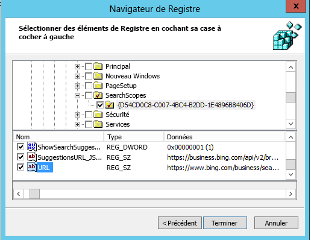

# Définir Bing en tant que moteur de recherche par défautMake Bing the default search engine
  
Cet article vous explique comment configurer Bing en tant que moteur de recherche par défaut pour Microsoft Edge, Google Chrome et Internet Explorer.This article explains how to make Bing the default search engine for Microsoft Edge, Google Chrome, and Internet Explorer. 
  
## Microsoft Edge sur Windows 10, version 1703 ou ultérieureMicrosoft Edge on Windows 10, Version 1703 or later

Bien que vous puissiez définir Bing en tant que moteur de recherche par défaut, Microsoft Edge autorise les utilisateurs à modifier leurs paramètres de manière à utiliser un autre moteur de recherche.Although you'll set Bing as the default search engine, Microsoft Edge allows users to change their settings to use a different search engine.
  
Concernant les fichiers récents d’ADMX relatifs aux différentes versions de Windows, reportez-vous à l’article [Comment créer et gérer le magasin central des modèles d’administration de stratégie de groupe dans Windows](https://support.microsoft.com/help/3087759/how-to-create-and-manage-the-central-store-for-group-policy-administra).For the latest ADMX files for various versions of Windows, see [How to create and manage the Central Store for Group Policy Administrative Templates in Windows](https://support.microsoft.com/help/3087759/how-to-create-and-manage-the-central-store-for-group-policy-administra).
  
Si les paramètres décrits dans cette section sont introuvables dans le GPMC, téléchargez l’ ADMX approprié et copiez-les dans le magasin central. Pour plus d’informations, voir[Modifier les groupes de stratégie GPOs basés sur le domaine à l’aide des fichiers ADMX](https://docs.microsoft.com/previous-versions/windows/it-pro/windows-vista/cc748955%28v%3dws.10%29). Le magasin central relatif au contrôleur est un dossier avec la convention de dénomination suivante:If the setting described in this section cannot be found inside of GPMC, download the appropriate ADMX and copy them to the central store. For more information, see [Editing Domain-Based GPOs Using ADMX Files](https://docs.microsoft.com/previous-versions/windows/it-pro/windows-vista/cc748955%28v%3dws.10%29). Central store on the controller is a folder with the following naming convention:
  
 **%systemroot%\sysvol\\<domain\>\policies\PolicyDefinitions****%systemroot%\sysvol\\<domain\>\policies\PolicyDefinitions**
  
Chaque domaine que votre contrôleur gère doit avoir un dossier séparé. La commande suivante peut être utilisée pour copier le fichier ADMX à partir de la commande rapide:Each domain that your controller handles should get a separate folder. The following command can be used to copy the ADMX file from the command prompt:
  
 `Copy <path_to_ADMX.ADMX> %systemroot%\sysvol\<domain>\policies\PolicyDefinitions`
  
1. Ouvrez la Console de Gestion des Stratégies de Groupe (gpmc.msc) et basculez vers modifier toute stratégie existante ou créer un nouveau.Open the Group Policy Management Console (gpmc.msc) and switch to editing an existing policy or creating a new one.
    
2. Accédez à**&lt;Ordinateur/ Configuration Utilisateur&gt;\ Modèles administratifs\Composants Windows\Microsoft Edge**.Navigate to **&lt;Computer/User Configuration&gt;\Administrative Templates\Windows Components\Microsoft Edge**.
    
1. Double-cliquez sur **Définir le moteur de recherche par défaut**, définir à**Activé**, puis entrer`https://www.bing.com/sa/osd/bfb.xml`Double-click **Set default search engine**, set to **Enabled**, and enter `https://www.bing.com/sa/osd/bfb.xml`
    
3. Appliquez la stratégie de groupe résultante GPO en les reliant au domaine approprié.Enforce the resultant GPO by linking it to the appropriate domain.

## Google Chrome sur Windows XP SP2 ou version ultérieureGoogle Chrome on Windows XP SP2 or later

Une fois cette stratégie définie, les utilisateurs ne pourront plus modifier le moteur de recherche par défaut.Users won't be able to change the search provider after this policy is set.
  
Chrome fournit avec son propre ensemble de paramètres de stratégie de groupe qui peut être téléchargé sous la forme d’un fichier ADMX à partir[Aide Google Chrome Enterprise](https://support.google.com/chrome/a/answer/187202). Si les systèmes d’exploitation Windows Vista/Server 2008 ou version ultérieure servent à gérer l’objet de stratégie de groupe pour le domaine, le fichier ADMX fourni dans ce package assure la gestion des paramètres de Chrome sous Windows XP SP2 ou version ultérieure.Chrome comes with its own set of group policy settings which can be downloaded in the form of an ADMX file from [Google Chrome Enterprise Help](https://support.google.com/chrome/a/answer/187202). If operating systems Windows Vista/Server 2008 or later are used to manage GPO's for the domain, the ADMX file provided in this package takes care of Chrome settings on Windows XP SP2 or later.
  
Copiez le fichier de modèle dans un magasin central de fichiers ADMX sur le contrôleur de domaine. Pour plus d’informations, voir [Modifier les stratégies de groupe GPOs basés sur le domaine à l’aide des fichiers ADMX](https://docs.microsoft.com/previous-versions/windows/it-pro/windows-vista/cc748955%28v%3dws.10%29). Le magasin central sur le contrôleur est un dossier avec la convention de dénomination suivante:Copy the template file to a central store for ADMX files on the domain controller. For more information, see [Editing Domain-Based GPOs Using ADMX Files](https://docs.microsoft.com/previous-versions/windows/it-pro/windows-vista/cc748955%28v%3dws.10%29). Central store on the controller is a folder with the following naming convention:
  
 **%systemroot%\sysvol\\<domain\>\policies\PolicyDefinitions****%systemroot%\sysvol\\<domain\>\policies\PolicyDefinitions**
  
Chaque domaine que votre contrôleur gère doit avoir un dossier séparé. La commande suivante peut être utilisée pour copier le fichier ADMX à partir de la commande rapide:Each domain that your controller handles should get a separate folder. The following command can be used to copy the ADMX file from the command prompt:
  
 `Copy <path_to_Chrome.ADMX> %systemroot%\sysvol\<domain>\policies\PolicyDefinitions`
  
1. Ouvrez la Console de gestion des stratégies de groupe (gpmc.msc) et basculez vers modifier toute stratégie existante ou créer un nouveau.Open the Group Policy Management Console (gpmc.msc) and switch to editing any existing policy or creating a new one.
    
2. Assurez-vous que les dossiers suivants apparaissent dans la section Modèles Administratifs à la fois pour l’Utilisateur/la Configuration Ordinateur: Google Chrome et Google Chrome- Paramètres par défaut.Make sure the following folders appear in the Administrative Templates section of both User/Computer Configuration: Google Chrome and Google Chrome - Default Settings.
    
  - Les paramètres de la première section sont fixes et l’administrateur local ne pourra pas les modifier.The settings of the first section are fixed and local administrators won't be able to change them in the browser.
    
  - Les paramètres de la dernière section de stratégies peuvent être modifiés par les utilisateurs dans les paramètres de navigateur.The settings of the latter section of policies can be changed by users in the browser settings.
    
3. Accédez à**\<Ordinateur/Configuration utilisateur\>\Modèles Administratifs\Google Chrome- Paramétrage fournisseur par défaut**.Navigate to **\<Computer/User\> Configuration\Administrative Templates\Google Chrome\Default search provider**
    
4. Double-cliquez sur **Activer le fournisseur de recherche par défaut**et définissez-le comme programme **Activé**.Double-click **Enable the default search provider**, and set it to **Enabled**.
    
5. Double-cliquez sur **icône fournisseur de recherche par défaut**, définissez-le comme programme **Activé**, puis entrez `https://www.bing.com/sa/simg/bb.ico`Double-click **Default search provider icon**, set it to **Enabled**, and enter `https://www.bing.com/sa/simg/bb.ico`
    
6. Double-cliquez sur **l’URL instantané de fournisseur de recherche par défaut** puis entrez`https://www.bing.com/business/search?q={searchTerms}&amp;form=BFBSPR`Double-click **Default search provider instant URL**, and enter `https://www.bing.com/business/search?q={searchTerms}&amp;form=BFBSPR`
    
7. Double-cliquez sur **nom du fournisseur de recherche par défaut**, définissez-le comme Activé, puis entrez «Microsoft Search (recherche Microsoft) dans Bing»Double-click **Default search provider name**, set it to Enabled, and enter 'Microsoft Search in Bing'
    
8. Double-cliquez sur **l’URL fournisseur de recherche par défaut**, définissez-le comme**Activé**, puis entrez `https://www.bing.com/business/search?q={searchTerms}&amp;form=BFBSPR`Double-click **Default search provider search URL**, set it to **Enabled**, and enter `https://www.bing.com/business/search?q={searchTerms}&amp;form=BFBSPR`
    
9. Double-cliquez sur **l’URL fournisseur de recherche par défaut suggéré**, définissez-le comme**Activé**, puis entrez `https://business.bing.com/api/v2/browser/suggest?q={searchTerms}&amp;form=BFBSPA`Double-click **Default search provider suggest URL**, set it to **Enabled**, and enter `https://business.bing.com/api/v2/browser/suggest?q={searchTerms}&amp;form=BFBSPA`
    
10. Appliquez la stratégie de groupe résultante GPO en les reliant au domaine approprié.Enforce the resultant GPO by linking it to the appropriate domain.
    
Le paramétrage du moteur de recherche par défaut ajoute la fonctionnalité de suggestions de recherche Microsoft Search (recherche Microsoft) dans la barre d’adresses navigateur. Pour l’instant, il prend en charge uniquement des signets. Les utilisateurs verront les deux premières suggestions des signets au-dessus des suggestions web public en temps réel dans la barre d’adresses.Setting the default search engine will add the Microsoft Search search suggestions feature in the browser address bar. Currently, this supports bookmarks only. Users will see the top two bookmark suggestions above public web suggestions as they type in the address bar.

## Internet Explorer 11 ou version ultérieureInternet Explorer 11 or later versions

Une fois cette stratégie définie, les utilisateurs pourront modifier le moteur de recherche.Users will be able to change the search provider after this policy is set.
  
### ÉTAPE 1.Step 1 Configurer l’ordinateur local destiné à être utilisé pour définir la stratégie de groupeConfigure the local machine that will be used to set the GPO.

Collez le texte suivant dans un fichier Bloc-notes(\*.reg).Paste the following text into a reg(\*.reg) file.
  
Windows Registry Editor Version 5.00Windows Registry Editor Version 5.00
  
<pre>[HKEY_CURRENT_USER\Software\Microsoft\Internet Explorer\SearchScopes]
"DefaultScope"="{D54CD0C8-C007-4BC4-B2DD-1E4896B8406D}"
[HKEY_CURRENT_USER\Software\Microsoft\Internet Explorer\SearchScopes\{D54CD0C8-C007-4BC4-B2DD-1E4896B8406D}]
"Codepage"=dword:0000fde9
"DisplayName"="Microsoft Search in Bing"
"OSDFileURL"="https://www.bing.com/sa/osd/bfb.xml"
"FaviconURL"="https://www.bing.com/sa/simg/bb.ico"
"SuggestionsURL_JSON"="https://business.ing.com/api/v2/browser/suggest?q={searchTerms}&amp;form=BFBSPA"
"ShowSearchSuggestions"=dword:00000001
"URL"="https://www.bing.com/business/search?q={searchTerms}&amp;form=BFBSPR"</pre>
  
Double-cliquez sur le fichier créé et suivez les étapes pour importer le fichier. Une importation réussie doit avoir pour résultat la boîte de dialogue suivante :Double-click the file created and follow the steps to import the file. A successful import should result in the following dialog:
  

  
### ÉTAPE 2.Step 2 Ouvrir la Console de gestion des stratégies de groupe (gpmc.msc) et basculer en mode modification d’une stratégie existante ou en créer une nouvelle.Open the Group Policy Management Console (gpmc.msc) and switch to editing an existing policy or creating a new one.

1. Accédez à **Configuration Utilisateur\Stratégies\Préférences\Paramètres Windows**.Navigate to **User Configuration\Policies\Preferences\Windows Settings**.
    
2. Avec le bouton droit sur **Registre\Nouveau** et sélectionnez **Assistant Registre**. Dans la fenêtre du navigateur de Registre, sélectionnez **ordinateur Local** sur **Suivant**.Right-click on **Registry\New** and select **Registry Wizard**. From the Registry Browser window, select **Local Computer** and click **Next**.
    
3. Accédez à **HKEY_CURRENT_USER\SOFTWARE\Microsoft\Internet Explorer\SearchScopes**.Navigate to **HKEY_CURRENT_USER\SOFTWARE\Microsoft\Internet Explorer\SearchScopes**.
    
4. À partir de cette clé, veillez à sélectionner DefaultScope.From this key, make sure to select DefaultScope.
    
    
  
5. Consultez toutes les sous-clés contenant le GUIDE de Microsoft Search (recherche Microsoft) dans Bing et chaque valeur sous la clé à l’exception d’un chemin d’accès aux profils utilisateur. Faites défiler vers le bas pour sélectionner d’autres éléments.Check all sub keys containing the GUID for Microsoft Search in Bing and every value under the key except any path to user profiles. Scroll down to select other items.
    
    
  
6. Cliquez sur Terminer afin de compléter cette configuration.Click Finish to complete this configuration.
    
### ÉTAPE 3.Step 3. Configurer les préférences d’utilisateur pour éliminer un avertissement que l’utilisateur peut recevoir quand la recherche DefaultScope est appliquée3. Set up User Preferences to help eliminate a warning the user may get when DefaultScope search is enforced

Ce message d’avertissement est normal et les utilisateurs d’un programme tente de modifier leurs paramètres d’alertes.This warning is by design and alerts users of a program trying to modify their settings.
  
1. Dans le même GPO, cliquez sur le bouton droit**Registre\Nouveauté** et sélectionnez**Assistant Registre**.Within the same GPO, right click on **Registry\New** and select **Registry Wizard**.
    
2. Accédez à **HKEY_CURRENT_USER\SOFTWARE\Microsoft\Internet Explorer\Préférences Utilisateur**.Navigate to **HKEY_CURRENT_USER\SOFTWARE\Microsoft\Internet Explorer\User Preferences**.
    
3. Sélectionnez la clé**Préférence Utilisateur**.Select the **User Preference** key.
    
4. Cliquez sur**Terminer**.Click **Finish**.
    
5. Cliquez sur l’objet nouvellement créé. Dans le volet de droite, double-cliquez sur l’objet de Préférences d’utilisateur, modifiez le **Action** à **Supprimer et Enregistrer**.Click on the newly created object. On the right-side pane double click on the User Preferences object, change the **Action** to **Delete and Save**.
1. Appliquez la stratégie de groupe résultante GPO en la reliant au domaine approprié.Enforce the resultant GPO by linking it to the appropriate domain.