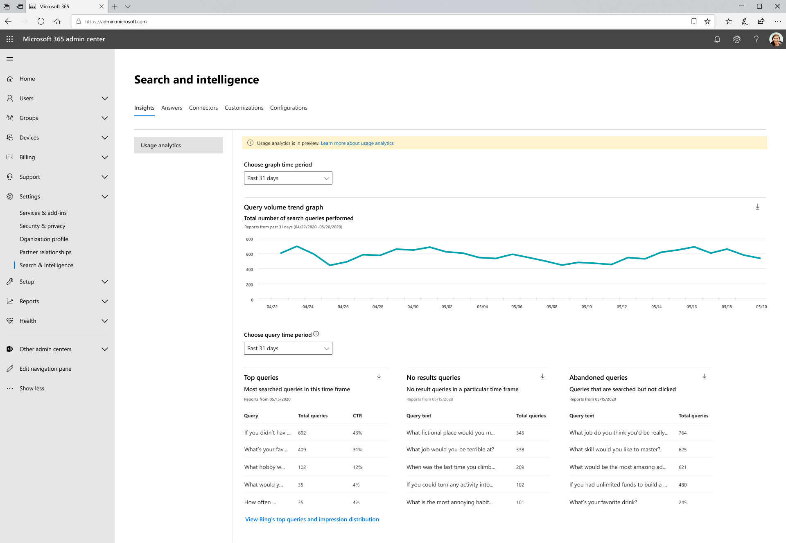

# Rapports d’utilisation de Microsoft Search

Les rapports d’utilisation de la recherche vous permettent de mieux comprendre le fonctionnement de la recherche dans votre organisation. Les informations générées à partir de ces rapports vous permettront de faire en sorte que le [contenu soit facile à trouver et à](https://docs.microsoft.com/microsoftsearch/make-content-easy-to-find) prendre des mesures qui faciliteront la recherche d’une expérience plus utile et délicieuse pour vos utilisateurs.

> [!IMPORTANT]
> Les rapports d’utilisation de la recherche Microsoft sont actuellement en phase d’évaluation et de déploiement auprès des administrateurs dans la version ciblée. Assurez-vous que votre compte d’administrateur se trouve dans l’anneau de publication ciblée pour afficher ces rapports.

Les [rapports d’utilisation de la recherche Microsoft](https://admin.microsoft.com/Adminportal/Home?#/MicrosoftSearch/insights) incluent des graphiques et des tableaux générés à partir de recherches exécutées à partir de zones de recherche SharePoint famille et Office.com. Vous pouvez afficher les données des 31 derniers jours, par jour ou tous les mois de l’année précédente. Ces rapports sont simplement déployés afin de prendre le temps d’accumuler les données historiques.

Une version précédente de cette page comprenait des données de recherches exécutées pour Microsoft Search dans Bing sur Bing.com. Ces données seront bientôt intégrées dans ces rapports, mais pour le moment, vous pouvez toujours voir ces rapports en cliquant sur le lien situé en bas de la page pour **afficher les requêtes et la distribution d’impression de Bing**.

> [!div class="mx-imgBorder"]
> 

## Vue d’ensemble des rapports de recherche

| Rapport | Description |
|:-----|:-----|
|Volume de requête|Ce rapport indique le nombre de requêtes de recherche effectuées. Utilisez ce rapport pour identifier les tendances des volumes de requêtes de recherche et déterminer les périodes d’activité de recherche élevée et faible.|
|Requêtes les plus courantes|Ce rapport indique les requêtes de recherche les plus populaires. Utilisez ce rapport pour comprendre les types d’informations recherchés par vos utilisateurs.|
|Requêtes abandonnées|Ce rapport affiche les requêtes de recherche populaires qui reçoivent un « clic » faible. Il permet d'identifier les requêtes de recherche pouvant provoquer l'insatisfaction des utilisateurs et d'améliorer la détectabilité du contenu. Vous pouvez ensuite déterminer si la création d’une réponse, comme un signet, ou l’ingestion de nouveaux contenus via un connecteur Graph est la bonne action.|
|Requêtes sans résultats|Ce rapport indique les requêtes de recherche populaires qui n'ont retourné aucun résultat. Il permet d'identifier les requêtes de recherche pouvant provoquer l'insatisfaction des utilisateurs et d'améliorer la détectabilité du contenu. Vous pouvez ensuite déterminer si la création d’une réponse, comme un signet, ou l’ingestion de nouveaux contenus via un connecteur Graph est la bonne action.|

## Affichage des rapports

Lorsque vous accédez à la page rapports d’utilisation, tous les rapports peuvent être consultés. Vous pouvez utiliser le filtre date pour choisir un jour ou un mois spécifique à afficher.

Le téléchargement d’un rapport vous permet d’afficher des rapports d’une plage de temps plus large. Cliquez sur la flèche télécharger et sélectionnez les **31 derniers jours** ou les **12 derniers mois**. Le rapport est téléchargé sous forme de feuille de calcul Excel. Si vous avez sélectionné les 31 derniers jours, la feuille de calcul aura un onglet individuel pour chaque jour. Le téléchargement de 12 mois aura un onglet pour chaque mois.

Pour afficher les rapports sur les requêtes et les impressions principales de Bing, cliquez sur le lien sur la page.

## Foire aux questions

**Lorsque je sélectionne les 31 derniers jours ou les 12 derniers mois, pourquoi dois-je choisir un jour spécifique ou un mois spécifique.**

L’affichage Calendrier, aujourd’hui, dans les rapports d’utilisation de Microsoft Search est un processus en deux étapes. Sélectionnez d’abord la plage de dates dans la liste déroulante (les 31 derniers mois ou les 12 derniers mois), puis sélectionnez le jour de début ou le mois.

Les tables de requête supérieure, abandonnée et ayant échoué affichent des résultats à partir du jour ou du mois que vous choisissez.

**Quand afficher les données agrégées pendant les 7 derniers jours, 30 jours précédents, etc... comme les rapports des premières requêtes de Bing ?**

Nous envisageons ce type d’agrégation et simplifions le filtrage de plage de données pour les versions futures de ces rapports.

**Pourquoi ne puis-je pas voir la répartition des rapports d’utilisation par différentes applications (sources) ?**

Actuellement, le filtrage par source n’est pas disponible. Les rapports combinent les recherches à partir de SharePoint famille et Office.com. Notre prochaine version inclut le filtrage source afin que vous puissiez voir les mesures propres à chaque application.

**Quels sont les autres filtres de filtrage des rapports d’utilisation ?**

Nous travaillons sur des filtres supplémentaires qui faciliteront l’utilisation de la recherche à un niveau plus granulaire de votre organisation. Par exemple, vous pouvez voir le volume de requête pour une géographie ou un service spécifique.

**Pourquoi la recherche Microsoft dans les rapports Bing se trouve-t-elle sur une page distincte ?**

La modernisation de la recherche dans les applications Office 365 vers Microsoft Search nous a demandé de rejoindre des systèmes disparates précédemment, notamment la génération de rapports. Cela prend du temps et nous avons pensé qu’il était plus important d’obtenir ces rapports dès maintenant et de patienter jusqu’à ce que nous puissions terminer l’intégration des données Bing. Une fois l’intégration terminée, les données de tous les points de terminaison de recherche sont incluses dans les mêmes rapports.
